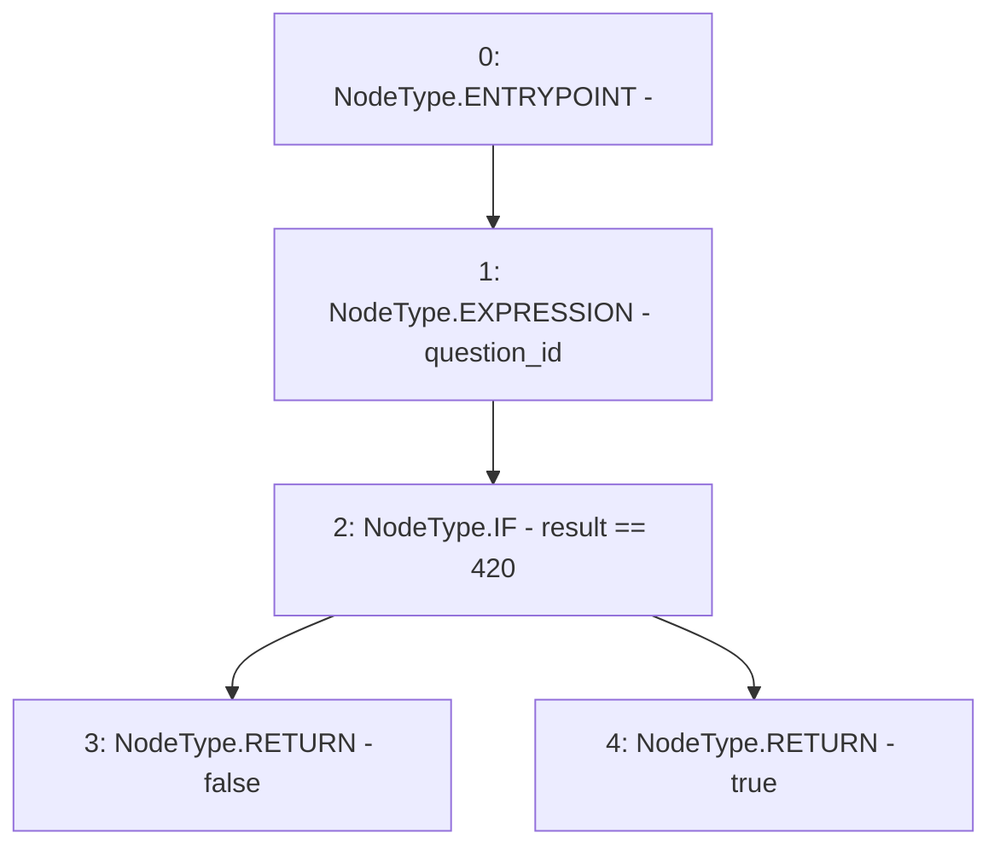

# Context: RealitioMockup.isFinalized

**Contract:** `RealitioMockup` (Inherits: None)
**Signature:** `isFinalized(bytes32) returns (bool)`
**Method Selector ID:** `0x7f8d429e`
**Visibility:** `external`
**Environment-Free:** `Yes`
**Modifiers:** None

### State Variables Interaction
- **Reads:** result
- **Writes:** None

### Environment & Verification Flags
- **Uses Foundry Cheatcodes:** No
- **Has Echidna Properties:** No

### Internal Calls Tree
- None

### External Calls / Value Transfers
- None

### Control Flow Graph (CFG)


### Source Mapping
Declared in: `contracts/mockups/RealitioMockup.sol` on lines **55** to **63**

```solidity
    function isFinalized(bytes32 question_id) external view returns (bool) {
        // require(question_id == actualQuestionId, "questionId incorrect");
        question_id;
        if (result == 420) {
            return false;
        } else {
            return true;
        }
    }

```
