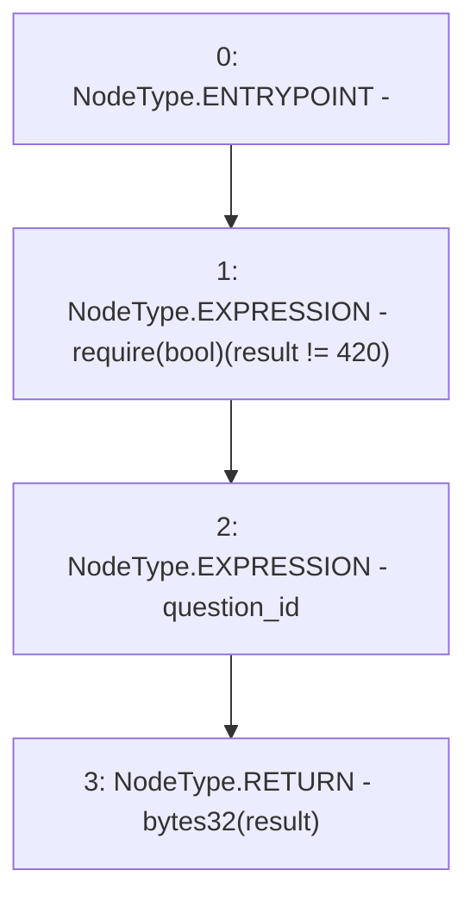

# Context: RealitioMockup.resultFor

**Contract:** `RealitioMockup` (Inherits: None)
**Signature:** `resultFor(bytes32) returns (bytes32)`
**Method Selector ID:** `0xd09cc57e`
**Visibility:** `external`
**Environment-Free:** `Yes`
**Modifiers:** None

### State Variables Interaction
- **Reads:** result
- **Writes:** None

### Assertion Checks & Business Requirements
- require/assert: `require(bool)(result != 420)`

### Environment & Verification Flags
- **Uses Foundry Cheatcodes:** No
- **Has Echidna Properties:** No

### Internal Calls Tree
- None

### External Calls / Value Transfers
- None

### Control Flow Graph (CFG)


### Source Mapping
Declared in: `contracts/mockups/RealitioMockup.sol` on lines **48** to **53**

```solidity
    function resultFor(bytes32 question_id) external view returns (bytes32) {
        require(result != 420);
        question_id;
        // require(question_id == actualQuestionId);
        return bytes32(result);
    }

```
