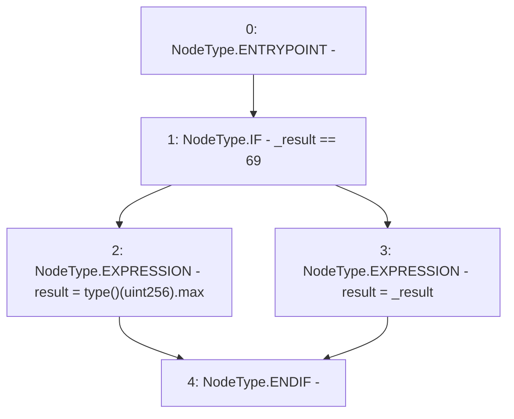

# Context: RealitioMockup.setResult

**Contract:** `RealitioMockup` (Inherits: None)
**Signature:** `setResult(uint256)`
**Method Selector ID:** `0x812448a5`
**Visibility:** `public`
**Environment-Free:** `Yes`
**Modifiers:** None

### State Variables Interaction
- **Reads:** None
- **Writes:** result

### Environment & Verification Flags
- **Uses Foundry Cheatcodes:** No
- **Has Echidna Properties:** No

### Internal Calls Tree
- None

### External Calls / Value Transfers
- None

### Control Flow Graph (CFG)


### Source Mapping
Declared in: `contracts/mockups/RealitioMockup.sol` on lines **13** to **19**

```solidity
    function setResult(uint256 _result) public {
        if (_result == 69) {
            result = type(uint256).max;
        } else {
            result = _result;
        }
    }

```
