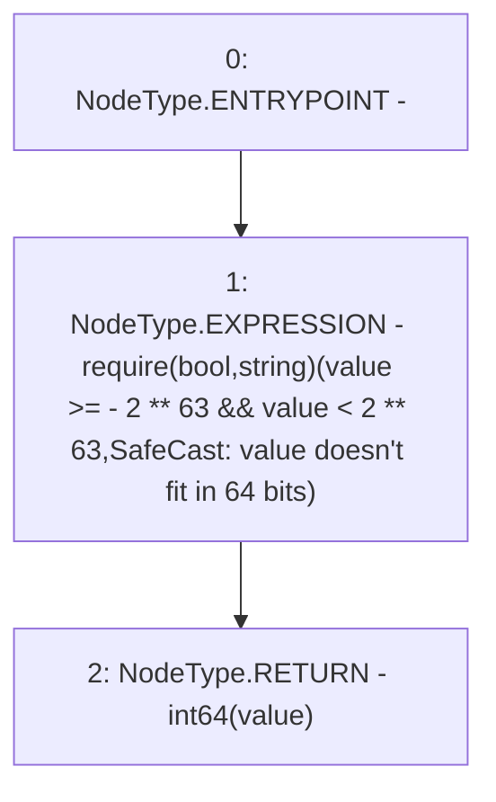

# Context: SafeCast.toInt64

**Contract:** `SafeCast` (Inherits: None)
**Signature:** `toInt64(int256) returns (int64)`
**Method Selector ID:** `Internal (No Method ID)`
**Visibility:** `internal`
**Environment-Free:** `Yes`
**Modifiers:** None

### State Variables Interaction
- **Reads:** None
- **Writes:** None

### Assertion Checks & Business Requirements
- require/assert: `require(bool,string)(value >= - 2 ** 63 && value < 2 ** 63,SafeCast: value doesn't fit in 64 bits)`

### Environment & Verification Flags
- **Uses Foundry Cheatcodes:** No
- **Has Echidna Properties:** No

### Internal Calls Tree
- None

### External Calls / Value Transfers
- None

### Control Flow Graph (CFG)


### Source Mapping
Declared in: `node_modules/@openzeppelin/contracts/utils/math/SafeCast.sol` on lines **139** to **142**

```solidity
    function toInt64(int256 value) internal pure returns (int64) {
        require(value >= -2**63 && value < 2**63, "SafeCast: value doesn\'t fit in 64 bits");
        return int64(value);
    }

```
