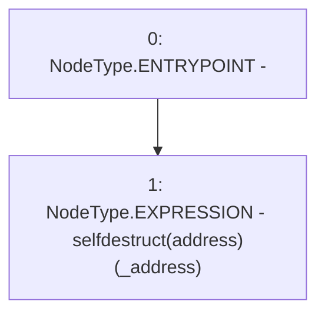

# Context: SelfDestructMockup.killme

**Contract:** `SelfDestructMockup` (Inherits: None)
**Signature:** `killme(address)`
**Method Selector ID:** `0x212743c9`
**Visibility:** `public`
**Environment-Free:** `Yes`
**Modifiers:** None

### State Variables Interaction
- **Reads:** None
- **Writes:** None

### Environment & Verification Flags
- **Uses Foundry Cheatcodes:** No
- **Has Echidna Properties:** No

### Internal Calls Tree
- None

### External Calls / Value Transfers
- None

### Control Flow Graph (CFG)


### Source Mapping
Declared in: `contracts/mockups/SelfDestructMockup.sol` on lines **9** to **11**

```solidity
    function killme(address payable _address) public {
        selfdestruct(_address);
    }

```
