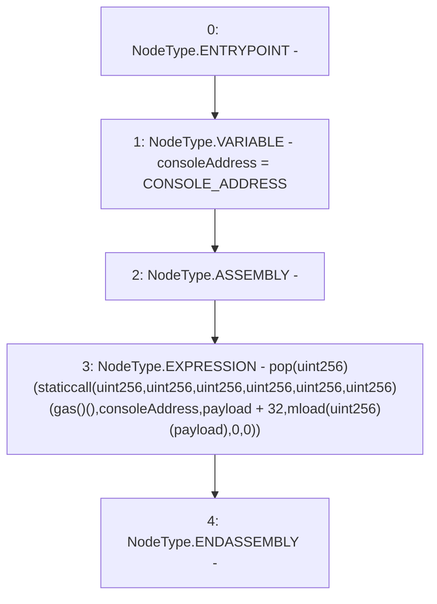

# Context: console._sendLogPayloadImplementation

**Contract:** `console` (Inherits: None)
**Signature:** `_sendLogPayloadImplementation(bytes)`
**Method Selector ID:** `Internal (No Method ID)`
**Visibility:** `internal`
**Environment-Free:** `Yes`
**Modifiers:** None

### State Variables Interaction
- **Reads:** CONSOLE_ADDRESS
- **Writes:** None

### Environment & Verification Flags
- **Uses Foundry Cheatcodes:** No
- **Has Echidna Properties:** No

### Internal Calls Tree
- None

### External Calls / Value Transfers
- None

### Control Flow Graph (CFG)


### Source Mapping
Declared in: `node_modules/hardhat/console.sol` on lines **8** to **23**

```solidity
    function _sendLogPayloadImplementation(bytes memory payload) internal view {
        address consoleAddress = CONSOLE_ADDRESS;
        /// @solidity memory-safe-assembly
        assembly {
            pop(
                staticcall(
                    gas(),
                    consoleAddress,
                    add(payload, 32),
                    mload(payload),
                    0,
                    0
                )
            )
        }
    }

```
