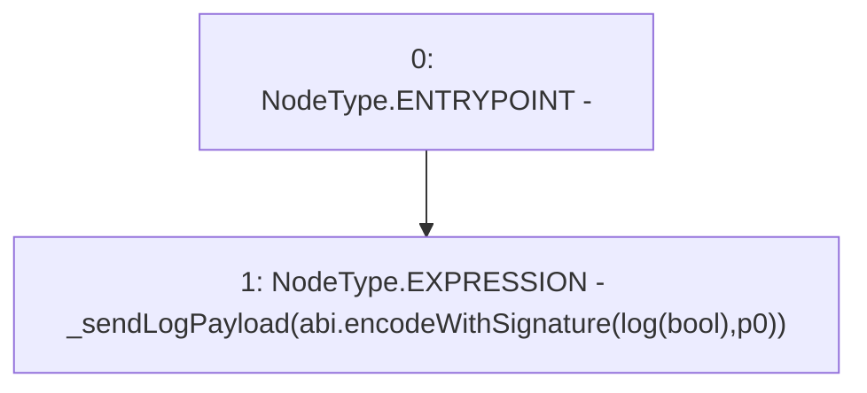

# Context: console.logBool

**Contract:** `console` (Inherits: None)
**Signature:** `logBool(bool)`
**Method Selector ID:** `Internal (No Method ID)`
**Visibility:** `internal`
**Environment-Free:** `Yes`
**Modifiers:** None

### State Variables Interaction
- **Reads:** None
- **Writes:** None

### Environment & Verification Flags
- **Uses Foundry Cheatcodes:** No
- **Has Echidna Properties:** No

### Internal Calls Tree
- None

### External Calls / Value Transfers
- None

### Control Flow Graph (CFG)


### Source Mapping
Declared in: `node_modules/hardhat/console.sol` on lines **53** to **55**

```solidity
    function logBool(bool p0) internal pure {
        _sendLogPayload(abi.encodeWithSignature("log(bool)", p0));
    }

```
