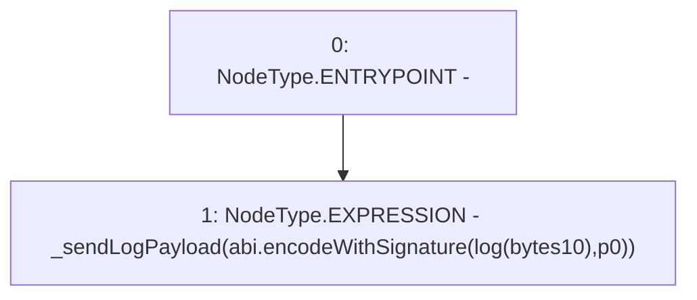

# Context: console.logBytes10

**Contract:** `console` (Inherits: None)
**Signature:** `logBytes10(bytes10)`
**Method Selector ID:** `Internal (No Method ID)`
**Visibility:** `internal`
**Environment-Free:** `Yes`
**Modifiers:** None

### State Variables Interaction
- **Reads:** None
- **Writes:** None

### Environment & Verification Flags
- **Uses Foundry Cheatcodes:** No
- **Has Echidna Properties:** No

### Internal Calls Tree
- None

### External Calls / Value Transfers
- None

### Control Flow Graph (CFG)


### Source Mapping
Declared in: `node_modules/hardhat/console.sol` on lines **101** to **103**

```solidity
    function logBytes10(bytes10 p0) internal pure {
        _sendLogPayload(abi.encodeWithSignature("log(bytes10)", p0));
    }

```
