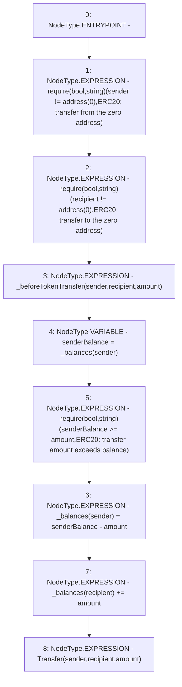

# Context: tokenMockup._transfer

**Contract:** `tokenMockup` (Inherits: ERC20PresetFixedSupply, ERC20Burnable, ERC20, IERC20Metadata, IERC20, Context)
**Signature:** `_transfer(address,address,uint256)`
**Method Selector ID:** `Internal (No Method ID)`
**Visibility:** `internal`
**Environment-Free:** `Yes`
**Modifiers:** None

### State Variables Interaction
- **Reads:** _balances
- **Writes:** _balances

### Assertion Checks & Business Requirements
- require/assert: `require(bool,string)(sender != address(0),ERC20: transfer from the zero address)`
- require/assert: `require(bool,string)(recipient != address(0),ERC20: transfer to the zero address)`
- require/assert: `require(bool,string)(senderBalance >= amount,ERC20: transfer amount exceeds balance)`

### Environment & Verification Flags
- **Uses Foundry Cheatcodes:** No
- **Has Echidna Properties:** No

### Internal Calls Tree
- None

### External Calls / Value Transfers
- `TMP_1825(None) = SOLIDITY_CALL require(bool,string)(TMP_1824,ERC20: transfer from the zero address)`
- `TMP_1828(None) = SOLIDITY_CALL require(bool,string)(TMP_1827,ERC20: transfer to the zero address)`
- `TMP_1831(None) = SOLIDITY_CALL require(bool,string)(TMP_1830,ERC20: transfer amount exceeds balance)`

### Control Flow Graph (CFG)


### Source Mapping
Declared in: `node_modules/@openzeppelin/contracts/token/ERC20/ERC20.sol` on lines **211** to **223**

```solidity
    function _transfer(address sender, address recipient, uint256 amount) internal virtual {
        require(sender != address(0), "ERC20: transfer from the zero address");
        require(recipient != address(0), "ERC20: transfer to the zero address");

        _beforeTokenTransfer(sender, recipient, amount);

        uint256 senderBalance = _balances[sender];
        require(senderBalance >= amount, "ERC20: transfer amount exceeds balance");
        _balances[sender] = senderBalance - amount;
        _balances[recipient] += amount;

        emit Transfer(sender, recipient, amount);
    }

```
