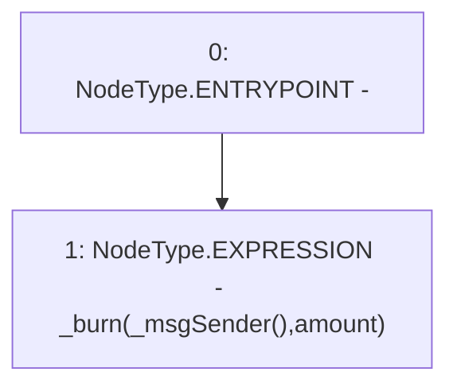

# Context: tokenMockup.burn

**Contract:** `tokenMockup` (Inherits: ERC20PresetFixedSupply, ERC20Burnable, ERC20, IERC20Metadata, IERC20, Context)
**Signature:** `burn(uint256)`
**Method Selector ID:** `0x42966c68`
**Visibility:** `public`
**Environment-Free:** `No (reads EVM state context)`
**Modifiers:** None

### State Variables Interaction
- **Reads:** None
- **Writes:** None

### Environment & Verification Flags
- **Uses Foundry Cheatcodes:** No
- **Has Echidna Properties:** No

### Internal Calls Tree
- None

### External Calls / Value Transfers
- None

### Control Flow Graph (CFG)


### Source Mapping
Declared in: `node_modules/@openzeppelin/contracts/token/ERC20/extensions/ERC20Burnable.sol` on lines **19** to **21**

```solidity
    function burn(uint256 amount) public virtual {
        _burn(_msgSender(), amount);
    }

```
