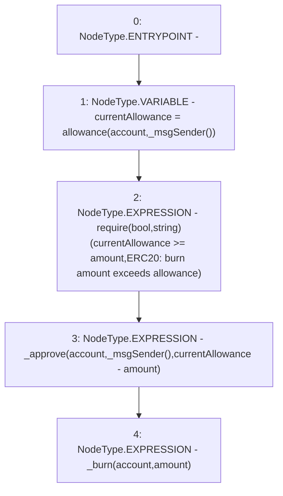

# Context: tokenMockup.burnFrom

**Contract:** `tokenMockup` (Inherits: ERC20PresetFixedSupply, ERC20Burnable, ERC20, IERC20Metadata, IERC20, Context)
**Signature:** `burnFrom(address,uint256)`
**Method Selector ID:** `0x79cc6790`
**Visibility:** `public`
**Environment-Free:** `No (reads EVM state context)`
**Modifiers:** None

### State Variables Interaction
- **Reads:** None
- **Writes:** None

### Assertion Checks & Business Requirements
- require/assert: `require(bool,string)(currentAllowance >= amount,ERC20: burn amount exceeds allowance)`

### Environment & Verification Flags
- **Uses Foundry Cheatcodes:** No
- **Has Echidna Properties:** No

### Internal Calls Tree
- None

### External Calls / Value Transfers
- None

### Control Flow Graph (CFG)


### Source Mapping
Declared in: `node_modules/@openzeppelin/contracts/token/ERC20/extensions/ERC20Burnable.sol` on lines **34** to **39**

```solidity
    function burnFrom(address account, uint256 amount) public virtual {
        uint256 currentAllowance = allowance(account, _msgSender());
        require(currentAllowance >= amount, "ERC20: burn amount exceeds allowance");
        _approve(account, _msgSender(), currentAllowance - amount);
        _burn(account, amount);
    }

```
