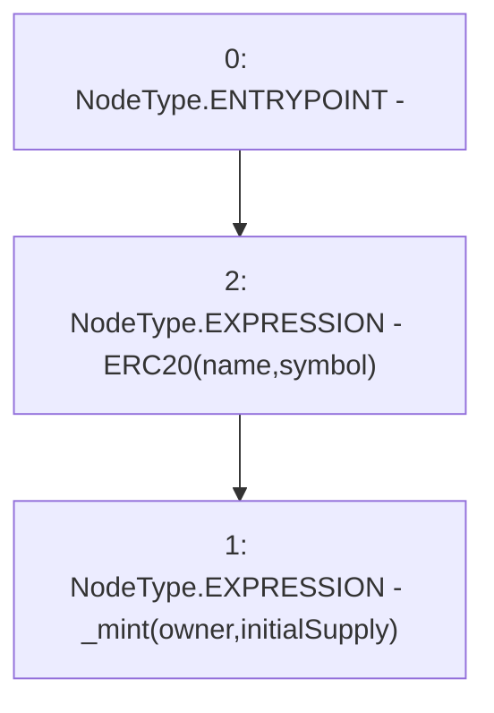

# Context: tokenMockup.constructor

**Contract:** `tokenMockup` (Inherits: ERC20PresetFixedSupply, ERC20Burnable, ERC20, IERC20Metadata, IERC20, Context)
**Signature:** `constructor(string,string,uint256,address)`
**Method Selector ID:** `0x44d8bfd0`
**Visibility:** `public`
**Environment-Free:** `Yes`
**Modifiers:** None

### State Variables Interaction
- **Reads:** None
- **Writes:** None

### Environment & Verification Flags
- **Uses Foundry Cheatcodes:** No
- **Has Echidna Properties:** No

### Internal Calls Tree
- None

### External Calls / Value Transfers
- None

### Control Flow Graph (CFG)


### Source Mapping
Declared in: `node_modules/@openzeppelin/contracts/token/ERC20/presets/ERC20PresetFixedSupply.sol` on lines **24** to **31**

```solidity
    constructor(
        string memory name,
        string memory symbol,
        uint256 initialSupply,
        address owner
    ) ERC20(name, symbol) {
        _mint(owner, initialSupply);
    }

```
