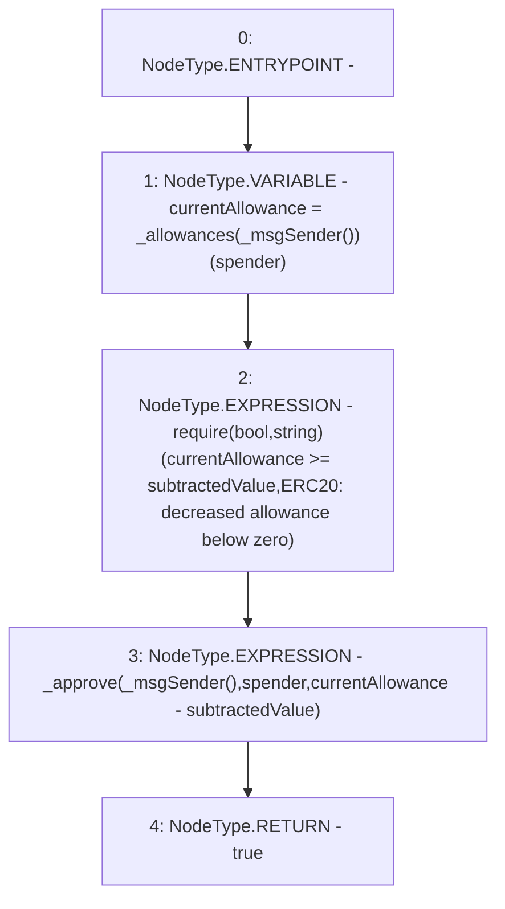

# Context: tokenMockup.decreaseAllowance

**Contract:** `tokenMockup` (Inherits: ERC20PresetFixedSupply, ERC20Burnable, ERC20, IERC20Metadata, IERC20, Context)
**Signature:** `decreaseAllowance(address,uint256) returns (bool)`
**Method Selector ID:** `0xa457c2d7`
**Visibility:** `public`
**Environment-Free:** `No (reads EVM state context)`
**Modifiers:** None

### State Variables Interaction
- **Reads:** _allowances
- **Writes:** None

### Assertion Checks & Business Requirements
- require/assert: `require(bool,string)(currentAllowance >= subtractedValue,ERC20: decreased allowance below zero)`

### Environment & Verification Flags
- **Uses Foundry Cheatcodes:** No
- **Has Echidna Properties:** No

### Internal Calls Tree
- None

### External Calls / Value Transfers
- None

### Control Flow Graph (CFG)


### Source Mapping
Declared in: `node_modules/@openzeppelin/contracts/token/ERC20/ERC20.sol` on lines **189** to **195**

```solidity
    function decreaseAllowance(address spender, uint256 subtractedValue) public virtual returns (bool) {
        uint256 currentAllowance = _allowances[_msgSender()][spender];
        require(currentAllowance >= subtractedValue, "ERC20: decreased allowance below zero");
        _approve(_msgSender(), spender, currentAllowance - subtractedValue);

        return true;
    }

```
