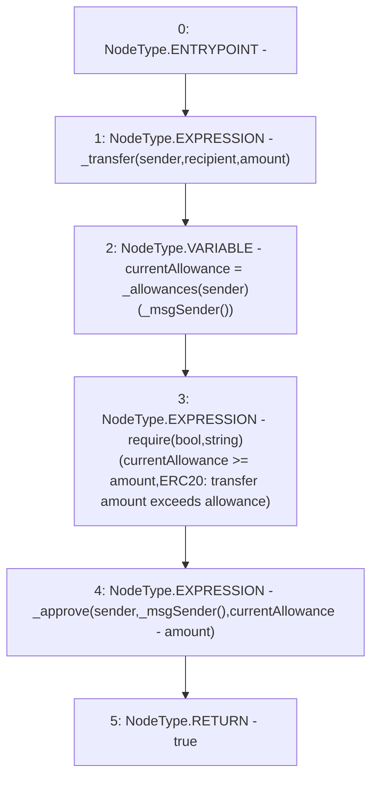

# Context: tokenMockup.transferFrom

**Contract:** `tokenMockup` (Inherits: ERC20PresetFixedSupply, ERC20Burnable, ERC20, IERC20Metadata, IERC20, Context)
**Signature:** `transferFrom(address,address,uint256) returns (bool)`
**Method Selector ID:** `0x23b872dd`
**Visibility:** `public`
**Environment-Free:** `No (reads EVM state context)`
**Modifiers:** None

### State Variables Interaction
- **Reads:** _allowances
- **Writes:** None

### Assertion Checks & Business Requirements
- require/assert: `require(bool,string)(currentAllowance >= amount,ERC20: transfer amount exceeds allowance)`

### Environment & Verification Flags
- **Uses Foundry Cheatcodes:** No
- **Has Echidna Properties:** No

### Internal Calls Tree
- None

### External Calls / Value Transfers
- `TMP_1809(None) = SOLIDITY_CALL require(bool,string)(TMP_1808,ERC20: transfer amount exceeds allowance)`

### Control Flow Graph (CFG)


### Source Mapping
Declared in: `node_modules/@openzeppelin/contracts/token/ERC20/ERC20.sol` on lines **148** to **156**

```solidity
    function transferFrom(address sender, address recipient, uint256 amount) public virtual override returns (bool) {
        _transfer(sender, recipient, amount);

        uint256 currentAllowance = _allowances[sender][_msgSender()];
        require(currentAllowance >= amount, "ERC20: transfer amount exceeds allowance");
        _approve(sender, _msgSender(), currentAllowance - amount);

        return true;
    }

```
