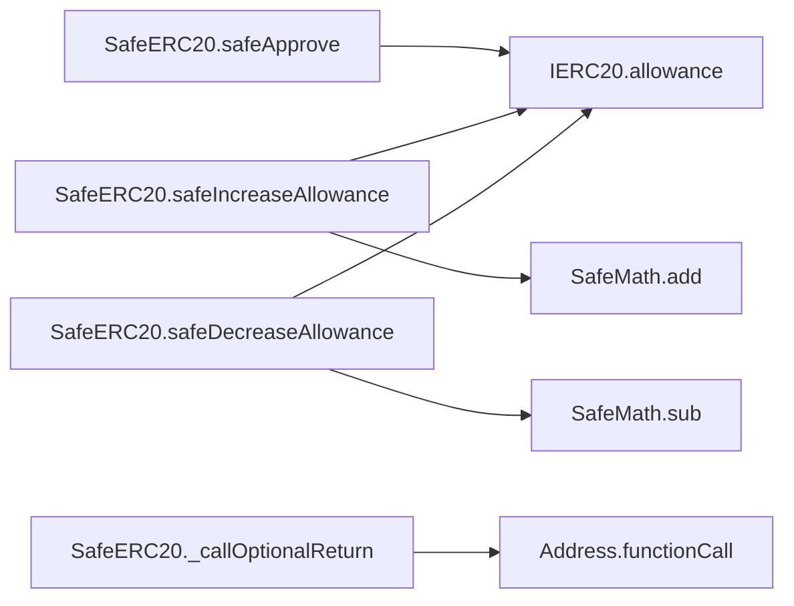
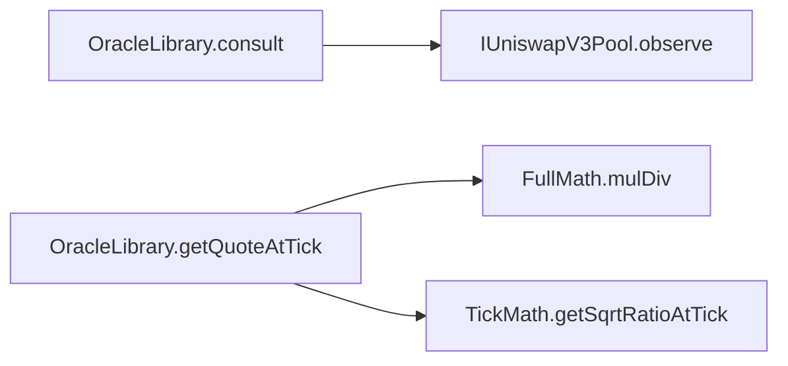
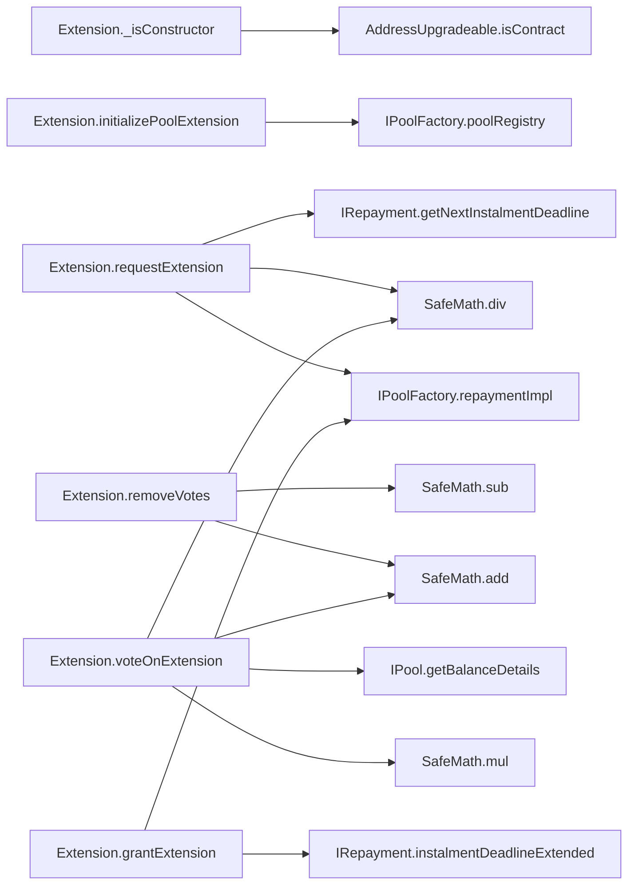

```mermaid
flowchart LR
    CreditLine._isConstructor --> AddressUpgradeable.isContract
    CreditLine.calculateInterest --> SafeMath.mul
    CreditLine.calculateInterest --> SafeMath.div
    CreditLine.calculateInterestAccrued --> SafeMath.sub
    CreditLine.calculateCurrentDebt --> SafeMath.add
    CreditLine.calculateCurrentDebt --> SafeMath.sub
    CreditLine.calculateBorrowableAmount --> SafeMath.sub
    CreditLine.calculateBorrowableAmount --> SafeMath.div
    CreditLine.calculateBorrowableAmount --> IPriceOracle.getLatestPrice
    CreditLine.calculateBorrowableAmount --> SafeMath.mul
    CreditLine.updateinterestAccruedTillLastPrincipalUpdate --> SafeMath.add
    CreditLine._depositCollateralFromSavingsAccount --> SafeMath.add
    CreditLine._depositCollateralFromSavingsAccount --> ISavingsAccount.transferFrom
    CreditLine._depositCollateralFromSavingsAccount --> SafeMath.sub
    CreditLine._depositCollateralFromSavingsAccount --> SafeMath.mul
    CreditLine._depositCollateralFromSavingsAccount --> ISavingsAccount.balanceInShares
    CreditLine._depositCollateralFromSavingsAccount --> IStrategyRegistry.getStrategies
    CreditLine._depositCollateralFromSavingsAccount --> SafeMath.div
    CreditLine._depositCollateralFromSavingsAccount --> IYield.getTokensForShares
    CreditLine.request --> IPriceOracle.doesFeedExist
    CreditLine._depositCollateral --> SafeMath.add
    CreditLine._depositCollateral --> ISavingsAccount.deposit
    CreditLine._depositCollateral --> SafeERC20.safeTransferFrom
    CreditLine._depositCollateral --> IERC20.approve
    CreditLine._withdrawBorrowAmount --> ISavingsAccount.withdrawFrom
    CreditLine._withdrawBorrowAmount --> IStrategyRegistry.getStrategies
    CreditLine._withdrawBorrowAmount --> SafeMath.add
    CreditLine._withdrawBorrowAmount --> IYield.getTokensForShares
    CreditLine._withdrawBorrowAmount --> SafeMath.sub
    CreditLine._withdrawBorrowAmount --> ISavingsAccount.balanceInShares
    CreditLine.borrow --> SafeMath.mul
    CreditLine.borrow --> SafeMath.sub
    CreditLine.borrow --> SafeMath.div
    CreditLine.borrow --> SafeMath.add
    CreditLine.borrow --> SafeERC20.safeTransfer
    CreditLine.borrow --> IERC20.balanceOf
    CreditLine._repayFromSavingsAccount --> IYield.getTokensForShares
    CreditLine._repayFromSavingsAccount --> SafeMath.sub
    CreditLine._repayFromSavingsAccount --> ISavingsAccount.balanceInShares
    CreditLine._repayFromSavingsAccount --> SafeMath.add
    CreditLine._repayFromSavingsAccount --> ISavingsAccount.transferFrom
    CreditLine._repayFromSavingsAccount --> IStrategyRegistry.getStrategies
    CreditLine._repay --> ISavingsAccount.deposit
    CreditLine._repay --> IERC20.approve
    CreditLine._repay --> SafeERC20.safeTransferFrom
    CreditLine._repay --> ISavingsAccount.increaseAllowanceToCreditLine
    CreditLine.repay --> SafeMath.add
    CreditLine.repay --> SafeMath.sub
    CreditLine.calculateCurrentCollateralRatio --> SafeMath.mul
    CreditLine.calculateCurrentCollateralRatio --> SafeMath.div
    CreditLine.calculateCurrentCollateralRatio --> IPriceOracle.getLatestPrice
    CreditLine.calculateTotalCollateralTokens --> IYield.getTokensForShares
    CreditLine.calculateTotalCollateralTokens --> IStrategyRegistry.getStrategies
    CreditLine.calculateTotalCollateralTokens --> SafeMath.add
    CreditLine.withdrawableCollateral --> IPriceOracle.getLatestPrice
    CreditLine.withdrawableCollateral --> SafeMath.mul
    CreditLine.withdrawableCollateral --> SafeMath.div
    CreditLine.withdrawableCollateral --> SafeMath.sub
    CreditLine._transferCollateral --> IStrategyRegistry.getStrategies
    CreditLine._transferCollateral --> ISavingsAccount.transfer
    CreditLine._transferCollateral --> SafeMath.mul
    CreditLine._transferCollateral --> ISavingsAccount.withdraw
    CreditLine._transferCollateral --> SafeMath.add
    CreditLine._transferCollateral --> SafeMath.div
    CreditLine._transferCollateral --> SafeMath.sub
    CreditLine._transferCollateral --> IYield.getTokensForShares
    CreditLine.liquidate --> SafeMath.sub
    CreditLine.liquidate --> SafeERC20.safeTransferFrom
    CreditLine._borrowTokensToLiquidate --> SafeMath.mul
    CreditLine._borrowTokensToLiquidate --> SafeMath.div
    CreditLine._borrowTokensToLiquidate --> IPriceOracle.getLatestPrice
    CreditLine._borrowTokensToLiquidate --> SafeMath.sub
```

```mermaid
flowchart LR
    Pool._isConstructor --> AddressUpgradeable.isContract
    Pool.transferFrom --> SafeMathUpgradeable.sub
    Pool.increaseAllowance --> SafeMathUpgradeable.add
    Pool.decreaseAllowance --> SafeMathUpgradeable.sub
    Pool._transfer --> SafeMathUpgradeable.sub
    Pool._transfer --> SafeMathUpgradeable.add
    Pool._mint --> SafeMathUpgradeable.add
    Pool._burn --> SafeMathUpgradeable.sub
    Pool.initialize --> ERC20Upgradeable.decimals
    Pool.initialize --> SafeMathUpgradeable.add
    Pool._initialDeposit --> SafeMathUpgradeable.div
    Pool._initialDeposit --> SafeMathUpgradeable.mul
    Pool._depositCollateral --> SafeMathUpgradeable.add
    Pool._deposit --> IPoolFactory.savingsAccount
    Pool._deposit --> SavingsAccountUtil.depositFromSavingsAccount
    Pool._deposit --> SavingsAccountUtil.directDeposit
    Pool.addCollateralInMarginCall --> SafeMathUpgradeable.add
    Pool.withdrawBorrowedAmount --> SafeMathUpgradeable.div
    Pool.withdrawBorrowedAmount --> IPoolFactory.repaymentImpl
    Pool.withdrawBorrowedAmount --> IRepayment.initializeRepayment
    Pool.withdrawBorrowedAmount --> SafeMathUpgradeable.mul
    Pool.withdrawBorrowedAmount --> IPoolFactory.getProtocolFeeData
    Pool.withdrawBorrowedAmount --> IPoolFactory.minBorrowFraction
    Pool.withdrawBorrowedAmount --> SavingsAccountUtil.transferTokens
    Pool.withdrawBorrowedAmount --> IExtension.initializePoolExtension
    Pool.withdrawBorrowedAmount --> SafeMathUpgradeable.sub
    Pool.withdrawBorrowedAmount --> IPoolFactory.extension
    Pool._withdrawAllCollateral --> SavingsAccountUtil.savingsAccountTransfer
    Pool._withdrawAllCollateral --> SafeMathUpgradeable.add
    Pool._withdrawAllCollateral --> IPoolFactory.savingsAccount
    Pool._withdrawAllCollateral --> IYield.getTokensForShares
    Pool._withdrawAllCollateral --> SafeMathUpgradeable.sub
    Pool.lend --> IVerification.isUser
    Pool.lend --> IPoolFactory.userRegistry
    Pool.lend --> SafeMathUpgradeable.add
    Pool.lend --> SafeMathUpgradeable.sub
    Pool._beforeTokenTransfer --> SafeMathUpgradeable.sub
    Pool._beforeTokenTransfer --> IPoolFactory.userRegistry
    Pool._beforeTokenTransfer --> SafeMathUpgradeable.div
    Pool._beforeTokenTransfer --> SafeMathUpgradeable.mul
    Pool._beforeTokenTransfer --> IExtension.removeVotes
    Pool._beforeTokenTransfer --> IVerification.isUser
    Pool._beforeTokenTransfer --> IRepayment.getTotalRepaidAmount
    Pool._beforeTokenTransfer --> SafeMathUpgradeable.add
    Pool._beforeTokenTransfer --> IPoolFactory.repaymentImpl
    Pool._beforeTokenTransfer --> IPoolFactory.extension
    Pool._calculatePenaltyTime --> SafeMathUpgradeable.sub
    Pool._calculatePenaltyTime --> SafeMathUpgradeable.add
    Pool.cancelPool --> IPoolFactory.poolCancelPenaltyMultiple
    Pool.cancelPool --> IPoolFactory.minBorrowFraction
    Pool.cancelPool --> SafeMathUpgradeable.div
    Pool.cancelPool --> SafeMathUpgradeable.mul
    Pool.liquidateCancelPenalty --> IPoolFactory.priceOracle
    Pool.liquidateCancelPenalty --> IPoolFactory.liquidatorRewardFraction
    Pool.liquidateCancelPenalty --> SavingsAccountUtil.transferTokens
    Pool.liquidateCancelPenalty --> IYield.getTokensForShares
    Pool.terminatePool --> IExtension.closePoolExtension
    Pool.terminatePool --> IPoolFactory.extension
    Pool.closeLoan --> IPoolFactory.extension
    Pool.closeLoan --> IExtension.closePoolExtension
    Pool.withdrawLiquidity --> SafeMathUpgradeable.mul
    Pool.withdrawLiquidity --> SafeMathUpgradeable.div
    Pool.withdrawLiquidity --> IERC20.balanceOf
    Pool.withdrawLiquidity --> SafeMathUpgradeable.add
    Pool.withdrawLiquidity --> SavingsAccountUtil.transferTokens
    Pool.requestMarginCall --> SafeMathUpgradeable.add
    Pool.requestMarginCall --> IPoolFactory.marginCallDuration
    Pool.interestToPay --> SafeMathUpgradeable.mul
    Pool.interestToPay --> IRepayment.getInterestCalculationVars
    Pool.interestToPay --> SafeMathUpgradeable.sub
    Pool.interestToPay --> SafeMathUpgradeable.div
    Pool.interestToPay --> IPoolFactory.repaymentImpl
    Pool.calculateCollateralRatio --> SafeMathUpgradeable.div
    Pool.calculateCollateralRatio --> IYield.getTokensForShares
    Pool.calculateCollateralRatio --> SafeMathUpgradeable.mul
    Pool.calculateCollateralRatio --> SafeMathUpgradeable.add
    Pool.getCurrentCollateralRatio --> SafeMathUpgradeable.add
    Pool.getCurrentCollateralRatio --> SafeMathUpgradeable.mul
    Pool.getCurrentCollateralRatio --> SafeMathUpgradeable.div
    Pool.liquidatePool --> IPoolFactory.repaymentImpl
    Pool.liquidatePool --> IPoolFactory.noStrategyAddress
    Pool.liquidatePool --> SafeMathUpgradeable.add
    Pool.liquidatePool --> IPoolFactory.priceOracle
    Pool.liquidatePool --> IRepayment.didBorrowerDefault
    Pool.liquidatePool --> IYield.getTokensForShares
    Pool.liquidatePool --> IPoolFactory.liquidatorRewardFraction
    Pool._withdraw --> IPoolFactory.savingsAccount
    Pool._withdraw --> SavingsAccountUtil.depositFromSavingsAccount
    Pool._updateLenderSharesDuringLiquidation --> SafeMathUpgradeable.sub
    Pool._updateLenderSharesDuringLiquidation --> SafeMathUpgradeable.add
    Pool._updateLenderSharesDuringLiquidation --> SafeMathUpgradeable.mul
    Pool._updateLenderSharesDuringLiquidation --> SafeMathUpgradeable.div
    Pool._liquidateForLender --> IPoolFactory.priceOracle
    Pool._liquidateForLender --> IPoolFactory.liquidatorRewardFraction
    Pool.liquidateForLender --> IYield.getTokensForShares
    Pool.correspondingBorrowTokens --> SafeMathUpgradeable.sub
    Pool.correspondingBorrowTokens --> SafeMathUpgradeable.mul
    Pool.correspondingBorrowTokens --> SafeMathUpgradeable.div
    Pool.correspondingBorrowTokens --> IPriceOracle.getLatestPrice
    Pool.interestPerSecond --> SafeMathUpgradeable.mul
    Pool.interestPerSecond --> SafeMathUpgradeable.div
    Pool.interestPerPeriod --> SafeMathUpgradeable.mul
    Pool.calculateCurrentPeriod --> SafeMathUpgradeable.sub
    Pool.calculateCurrentPeriod --> SafeMathUpgradeable.div
    Pool.calculateRepaymentWithdrawable --> IPoolFactory.repaymentImpl
    Pool.calculateRepaymentWithdrawable --> SafeMathUpgradeable.sub
    Pool.calculateRepaymentWithdrawable --> SafeMathUpgradeable.mul
    Pool.calculateRepaymentWithdrawable --> SafeMathUpgradeable.div
    Pool.calculateRepaymentWithdrawable --> IRepayment.getTotalRepaidAmount
    Pool._withdrawRepayment --> SavingsAccountUtil.transferTokens
    Pool._withdrawRepayment --> SafeMathUpgradeable.add
    Pool.getMarginCallEndTime --> SafeMathUpgradeable.add
    Pool.getMarginCallEndTime --> IPoolFactory.marginCallDuration
    Pool.getMarginCallEndTime --> SafeMathUpgradeable.mul
    Pool.getEquivalentTokens --> SafeMathUpgradeable.mul
    Pool.getEquivalentTokens --> IPoolFactory.priceOracle
    Pool.getEquivalentTokens --> IPriceOracle.getLatestPrice
    Pool.getEquivalentTokens --> SafeMathUpgradeable.div
```

# 🧬 Flow Graphs, Constructor Sequences & SSA Representations

## Contract: IUniswapV3Factory
### Linearised Constructor Execution sequence
- No constructors configured in hierarchy.

### Inter-Contract & Function Call Graph (Mermaid)
```mermaid
flowchart LR
```

### Functions Intermediate Code Operations (SlithIR & SSA)
#### Function: `owner`
<details><summary>View SlithIR Operations</summary>

```
No SlithIR operations.
```
</details>
<details><summary>View SSA Operations</summary>

```
No SSA operations.
```
</details>

#### Function: `feeAmountTickSpacing`
<details><summary>View SlithIR Operations</summary>

```
No SlithIR operations.
```
</details>
<details><summary>View SSA Operations</summary>

```
No SSA operations.
```
</details>

#### Function: `getPool`
<details><summary>View SlithIR Operations</summary>

```
No SlithIR operations.
```
</details>
<details><summary>View SSA Operations</summary>

```
No SSA operations.
```
</details>

#### Function: `createPool`
<details><summary>View SlithIR Operations</summary>

```
No SlithIR operations.
```
</details>
<details><summary>View SSA Operations</summary>

```
No SSA operations.
```
</details>

#### Function: `setOwner`
<details><summary>View SlithIR Operations</summary>

```
No SlithIR operations.
```
</details>
<details><summary>View SSA Operations</summary>

```
No SSA operations.
```
</details>

#### Function: `enableFeeAmount`
<details><summary>View SlithIR Operations</summary>

```
No SlithIR operations.
```
</details>
<details><summary>View SSA Operations</summary>

```
No SSA operations.
```
</details>


---

## Contract: Migrations
### Linearised Constructor Execution sequence
- No constructors configured in hierarchy.

### Inter-Contract & Function Call Graph (Mermaid)
```mermaid
flowchart LR
```

### Functions Intermediate Code Operations (SlithIR & SSA)
#### Function: `setCompleted`
<details><summary>View SlithIR Operations</summary>

```
last_completed_migration(uint256) := completed(uint256)
MODIFIER_CALL, Migrations.restricted()()
```
</details>
<details><summary>View SSA Operations</summary>

```
No SSA operations.
```
</details>


---

## Contract: FluxAggregator
### Linearised Constructor Execution sequence
- No constructors configured in hierarchy.

### Inter-Contract & Function Call Graph (Mermaid)
```mermaid
flowchart LR
```

### Functions Intermediate Code Operations (SlithIR & SSA)
#### Function: `setValue`
<details><summary>View SlithIR Operations</summary>

```
value(int256) := newVal(int256)
```
</details>
<details><summary>View SSA Operations</summary>

```
No SSA operations.
```
</details>

#### Function: `getRoundData`
<details><summary>View SlithIR Operations</summary>

```
RETURN 0,value,0,0,0
```
</details>
<details><summary>View SSA Operations</summary>

```
No SSA operations.
```
</details>

#### Function: `latestRoundData`
<details><summary>View SlithIR Operations</summary>

```
RETURN 0,value,0,0,0
RETURN roundId,answer,startedAt,updatedAt,answeredInRound
```
</details>
<details><summary>View SSA Operations</summary>

```
No SSA operations.
```
</details>


---

## Contract: GovernanceTester
### Linearised Constructor Execution sequence
- No constructors configured in hierarchy.

### Inter-Contract & Function Call Graph (Mermaid)
```mermaid
flowchart LR
```

### Functions Intermediate Code Operations (SlithIR & SSA)
#### Function: `update`
<details><summary>View SlithIR Operations</summary>

```
value(uint256) := _value(uint256)
Emit valueUpdated(gov,msg.sender,_value)
MODIFIER_CALL, GovernanceTester.onlyGov()()
```
</details>
<details><summary>View SSA Operations</summary>

```
No SSA operations.
```
</details>


---

## Contract: AggregatorV3Interface
### Linearised Constructor Execution sequence
- No constructors configured in hierarchy.

### Inter-Contract & Function Call Graph (Mermaid)
```mermaid
flowchart LR
```

### Functions Intermediate Code Operations (SlithIR & SSA)
#### Function: `decimals`
<details><summary>View SlithIR Operations</summary>

```
No SlithIR operations.
```
</details>
<details><summary>View SSA Operations</summary>

```
No SSA operations.
```
</details>

#### Function: `description`
<details><summary>View SlithIR Operations</summary>

```
No SlithIR operations.
```
</details>
<details><summary>View SSA Operations</summary>

```
No SSA operations.
```
</details>

#### Function: `version`
<details><summary>View SlithIR Operations</summary>

```
No SlithIR operations.
```
</details>
<details><summary>View SSA Operations</summary>

```
No SSA operations.
```
</details>

#### Function: `getRoundData`
<details><summary>View SlithIR Operations</summary>

```
No SlithIR operations.
```
</details>
<details><summary>View SSA Operations</summary>

```
No SSA operations.
```
</details>

#### Function: `latestRoundData`
<details><summary>View SlithIR Operations</summary>

```
No SlithIR operations.
```
</details>
<details><summary>View SSA Operations</summary>

```
No SSA operations.
```
</details>


---

## Contract: SafeMathUpgradeable
### Linearised Constructor Execution sequence
- No constructors configured in hierarchy.

### Inter-Contract & Function Call Graph (Mermaid)
```mermaid
flowchart LR
```

### Functions Intermediate Code Operations (SlithIR & SSA)

---

## Contract: AddressUpgradeable
### Linearised Constructor Execution sequence
- No constructors configured in hierarchy.

### Inter-Contract & Function Call Graph (Mermaid)
```mermaid
flowchart LR
```

### Functions Intermediate Code Operations (SlithIR & SSA)

---

## Contract: ECDSA
### Linearised Constructor Execution sequence
- No constructors configured in hierarchy.

### Inter-Contract & Function Call Graph (Mermaid)
```mermaid
flowchart LR
```

### Functions Intermediate Code Operations (SlithIR & SSA)

---

## Contract: SafeMath
### Linearised Constructor Execution sequence
- No constructors configured in hierarchy.

### Inter-Contract & Function Call Graph (Mermaid)
```mermaid
flowchart LR
```

### Functions Intermediate Code Operations (SlithIR & SSA)

---

## Contract: SafeERC20
### Linearised Constructor Execution sequence
- No constructors configured in hierarchy.

### Inter-Contract & Function Call Graph (Mermaid)


### Functions Intermediate Code Operations (SlithIR & SSA)

---

## Contract: Address
### Linearised Constructor Execution sequence
- No constructors configured in hierarchy.

### Inter-Contract & Function Call Graph (Mermaid)
```mermaid
flowchart LR
```

### Functions Intermediate Code Operations (SlithIR & SSA)

---

## Contract: IUniswapV3Pool
### Linearised Constructor Execution sequence
- No constructors configured in hierarchy.

### Inter-Contract & Function Call Graph (Mermaid)
```mermaid
flowchart LR
```

### Functions Intermediate Code Operations (SlithIR & SSA)
#### Function: `setFeeProtocol`
<details><summary>View SlithIR Operations</summary>

```
No SlithIR operations.
```
</details>
<details><summary>View SSA Operations</summary>

```
No SSA operations.
```
</details>

#### Function: `collectProtocol`
<details><summary>View SlithIR Operations</summary>

```
No SlithIR operations.
```
</details>
<details><summary>View SSA Operations</summary>

```
No SSA operations.
```
</details>

#### Function: `initialize`
<details><summary>View SlithIR Operations</summary>

```
No SlithIR operations.
```
</details>
<details><summary>View SSA Operations</summary>

```
No SSA operations.
```
</details>

#### Function: `mint`
<details><summary>View SlithIR Operations</summary>

```
No SlithIR operations.
```
</details>
<details><summary>View SSA Operations</summary>

```
No SSA operations.
```
</details>

#### Function: `collect`
<details><summary>View SlithIR Operations</summary>

```
No SlithIR operations.
```
</details>
<details><summary>View SSA Operations</summary>

```
No SSA operations.
```
</details>

#### Function: `burn`
<details><summary>View SlithIR Operations</summary>

```
No SlithIR operations.
```
</details>
<details><summary>View SSA Operations</summary>

```
No SSA operations.
```
</details>

#### Function: `swap`
<details><summary>View SlithIR Operations</summary>

```
No SlithIR operations.
```
</details>
<details><summary>View SSA Operations</summary>

```
No SSA operations.
```
</details>

#### Function: `flash`
<details><summary>View SlithIR Operations</summary>

```
No SlithIR operations.
```
</details>
<details><summary>View SSA Operations</summary>

```
No SSA operations.
```
</details>

#### Function: `increaseObservationCardinalityNext`
<details><summary>View SlithIR Operations</summary>

```
No SlithIR operations.
```
</details>
<details><summary>View SSA Operations</summary>

```
No SSA operations.
```
</details>

#### Function: `observe`
<details><summary>View SlithIR Operations</summary>

```
No SlithIR operations.
```
</details>
<details><summary>View SSA Operations</summary>

```
No SSA operations.
```
</details>

#### Function: `snapshotCumulativesInside`
<details><summary>View SlithIR Operations</summary>

```
No SlithIR operations.
```
</details>
<details><summary>View SSA Operations</summary>

```
No SSA operations.
```
</details>

#### Function: `slot0`
<details><summary>View SlithIR Operations</summary>

```
No SlithIR operations.
```
</details>
<details><summary>View SSA Operations</summary>

```
No SSA operations.
```
</details>

#### Function: `feeGrowthGlobal0X128`
<details><summary>View SlithIR Operations</summary>

```
No SlithIR operations.
```
</details>
<details><summary>View SSA Operations</summary>

```
No SSA operations.
```
</details>

#### Function: `feeGrowthGlobal1X128`
<details><summary>View SlithIR Operations</summary>

```
No SlithIR operations.
```
</details>
<details><summary>View SSA Operations</summary>

```
No SSA operations.
```
</details>

#### Function: `protocolFees`
<details><summary>View SlithIR Operations</summary>

```
No SlithIR operations.
```
</details>
<details><summary>View SSA Operations</summary>

```
No SSA operations.
```
</details>

#### Function: `liquidity`
<details><summary>View SlithIR Operations</summary>

```
No SlithIR operations.
```
</details>
<details><summary>View SSA Operations</summary>

```
No SSA operations.
```
</details>

#### Function: `ticks`
<details><summary>View SlithIR Operations</summary>

```
No SlithIR operations.
```
</details>
<details><summary>View SSA Operations</summary>

```
No SSA operations.
```
</details>

#### Function: `tickBitmap`
<details><summary>View SlithIR Operations</summary>

```
No SlithIR operations.
```
</details>
<details><summary>View SSA Operations</summary>

```
No SSA operations.
```
</details>

#### Function: `positions`
<details><summary>View SlithIR Operations</summary>

```
No SlithIR operations.
```
</details>
<details><summary>View SSA Operations</summary>

```
No SSA operations.
```
</details>

#### Function: `observations`
<details><summary>View SlithIR Operations</summary>

```
No SlithIR operations.
```
</details>
<details><summary>View SSA Operations</summary>

```
No SSA operations.
```
</details>

#### Function: `factory`
<details><summary>View SlithIR Operations</summary>

```
No SlithIR operations.
```
</details>
<details><summary>View SSA Operations</summary>

```
No SSA operations.
```
</details>

#### Function: `token0`
<details><summary>View SlithIR Operations</summary>

```
No SlithIR operations.
```
</details>
<details><summary>View SSA Operations</summary>

```
No SSA operations.
```
</details>

#### Function: `token1`
<details><summary>View SlithIR Operations</summary>

```
No SlithIR operations.
```
</details>
<details><summary>View SSA Operations</summary>

```
No SSA operations.
```
</details>

#### Function: `fee`
<details><summary>View SlithIR Operations</summary>

```
No SlithIR operations.
```
</details>
<details><summary>View SSA Operations</summary>

```
No SSA operations.
```
</details>

#### Function: `tickSpacing`
<details><summary>View SlithIR Operations</summary>

```
No SlithIR operations.
```
</details>
<details><summary>View SSA Operations</summary>

```
No SSA operations.
```
</details>

#### Function: `maxLiquidityPerTick`
<details><summary>View SlithIR Operations</summary>

```
No SlithIR operations.
```
</details>
<details><summary>View SSA Operations</summary>

```
No SSA operations.
```
</details>


---

## Contract: FullMath
### Linearised Constructor Execution sequence
- No constructors configured in hierarchy.

### Inter-Contract & Function Call Graph (Mermaid)
```mermaid
flowchart LR
```

### Functions Intermediate Code Operations (SlithIR & SSA)

---

## Contract: LowGasSafeMath
### Linearised Constructor Execution sequence
- No constructors configured in hierarchy.

### Inter-Contract & Function Call Graph (Mermaid)
```mermaid
flowchart LR
```

### Functions Intermediate Code Operations (SlithIR & SSA)

---

## Contract: TickMath
### Linearised Constructor Execution sequence
- No constructors configured in hierarchy.

### Inter-Contract & Function Call Graph (Mermaid)
```mermaid
flowchart LR
```

### Functions Intermediate Code Operations (SlithIR & SSA)

---

## Contract: OracleLibrary
### Linearised Constructor Execution sequence
- No constructors configured in hierarchy.

### Inter-Contract & Function Call Graph (Mermaid)


### Functions Intermediate Code Operations (SlithIR & SSA)

---

## Contract: PoolAddress
### Linearised Constructor Execution sequence
- No constructors configured in hierarchy.

### Inter-Contract & Function Call Graph (Mermaid)
```mermaid
flowchart LR
```

### Functions Intermediate Code Operations (SlithIR & SSA)

---

## Contract: CreditLine
### Linearised Constructor Execution sequence
1. `ReentrancyGuard.constructor()`

### Inter-Contract & Function Call Graph (Mermaid)


### Functions Intermediate Code Operations (SlithIR & SSA)
#### Function: `owner`
<details><summary>View SlithIR Operations</summary>

```
RETURN _owner
```
</details>
<details><summary>View SSA Operations</summary>

```
No SSA operations.
```
</details>

#### Function: `renounceOwnership`
<details><summary>View SlithIR Operations</summary>

```
TMP_960 = CONVERT 0 to address
Emit OwnershipTransferred(_owner,TMP_960)
TMP_962 = CONVERT 0 to address
_owner(address) := TMP_962(address)
MODIFIER_CALL, OwnableUpgradeable.onlyOwner()()
```
</details>
<details><summary>View SSA Operations</summary>

```
No SSA operations.
```
</details>

#### Function: `transferOwnership`
<details><summary>View SlithIR Operations</summary>

```
TMP_964 = CONVERT 0 to address
TMP_965(bool) = newOwner != TMP_964
TMP_966(None) = SOLIDITY_CALL require(bool,string)(TMP_965,Ownable: new owner is the zero address)
Emit OwnershipTransferred(_owner,newOwner)
_owner(address) := newOwner(address)
MODIFIER_CALL, OwnableUpgradeable.onlyOwner()()
```
</details>
<details><summary>View SSA Operations</summary>

```
No SSA operations.
```
</details>

#### Function: `initialize`
<details><summary>View SlithIR Operations</summary>

```
INTERNAL_CALL, OwnableUpgradeable.__Ownable_init()()
INTERNAL_CALL, OwnableUpgradeable.transferOwnership(address)(_owner)
INTERNAL_CALL, CreditLine._updateDefaultStrategy(address)(_defaultStrategy)
INTERNAL_CALL, CreditLine._updatePriceOracle(address)(_priceOracle)
INTERNAL_CALL, CreditLine._updateSavingsAccount(address)(_savingsAccount)
INTERNAL_CALL, CreditLine._updateStrategyRegistry(address)(_strategyRegistry)
INTERNAL_CALL, CreditLine._updateProtocolFeeFraction(uint256)(_protocolFeeFraction)
INTERNAL_CALL, CreditLine._updateProtocolFeeCollector(address)(_protocolFeeCollector)
INTERNAL_CALL, CreditLine._updateLiquidatorRewardFraction(uint256)(_liquidatorRewardFraction)
MODIFIER_CALL, Initializable.initializer()()
```
</details>
<details><summary>View SSA Operations</summary>

```
No SSA operations.
```
</details>

#### Function: `updateDefaultStrategy`
<details><summary>View SlithIR Operations</summary>

```
INTERNAL_CALL, CreditLine._updateDefaultStrategy(address)(_defaultStrategy)
MODIFIER_CALL, OwnableUpgradeable.onlyOwner()()
```
</details>
<details><summary>View SSA Operations</summary>

```
No SSA operations.
```
</details>

#### Function: `updatePriceOracle`
<details><summary>View SlithIR Operations</summary>

```
INTERNAL_CALL, CreditLine._updatePriceOracle(address)(_priceOracle)
MODIFIER_CALL, OwnableUpgradeable.onlyOwner()()
```
</details>
<details><summary>View SSA Operations</summary>

```
No SSA operations.
```
</details>

#### Function: `updateSavingsAccount`
<details><summary>View SlithIR Operations</summary>

```
INTERNAL_CALL, CreditLine._updateSavingsAccount(address)(_savingsAccount)
MODIFIER_CALL, OwnableUpgradeable.onlyOwner()()
```
</details>
<details><summary>View SSA Operations</summary>

```
No SSA operations.
```
</details>

#### Function: `updateProtocolFeeFraction`
<details><summary>View SlithIR Operations</summary>

```
INTERNAL_CALL, CreditLine._updateProtocolFeeFraction(uint256)(_protocolFee)
MODIFIER_CALL, OwnableUpgradeable.onlyOwner()()
```
</details>
<details><summary>View SSA Operations</summary>

```
No SSA operations.
```
</details>

#### Function: `updateProtocolFeeCollector`
<details><summary>View SlithIR Operations</summary>

```
INTERNAL_CALL, CreditLine._updateProtocolFeeCollector(address)(_protocolFeeCollector)
MODIFIER_CALL, OwnableUpgradeable.onlyOwner()()
```
</details>
<details><summary>View SSA Operations</summary>

```
No SSA operations.
```
</details>

#### Function: `updateStrategyRegistry`
<details><summary>View SlithIR Operations</summary>

```
INTERNAL_CALL, CreditLine._updateStrategyRegistry(address)(_strategyRegistry)
MODIFIER_CALL, OwnableUpgradeable.onlyOwner()()
```
</details>
<details><summary>View SSA Operations</summary>

```
No SSA operations.
```
</details>

#### Function: `updateLiquidatorRewardFraction`
<details><summary>View SlithIR Operations</summary>

```
INTERNAL_CALL, CreditLine._updateLiquidatorRewardFraction(uint256)(_rewardFraction)
MODIFIER_CALL, OwnableUpgradeable.onlyOwner()()
```
</details>
<details><summary>View SSA Operations</summary>

```
No SSA operations.
```
</details>

#### Function: `calculateInterest`
<details><summary>View SlithIR Operations</summary>

```
TMP_1015(uint256) = LIBRARY_CALL, dest:SafeMath, function:SafeMath.mul(uint256,uint256), arguments:['_principal', '_borrowRate'] 
TMP_1016(uint256) = LIBRARY_CALL, dest:SafeMath, function:SafeMath.mul(uint256,uint256), arguments:['TMP_1015', '_timeElapsed'] 
TMP_1017(uint256) = 10 ** 30
TMP_1018(uint256) = LIBRARY_CALL, dest:SafeMath, function:SafeMath.div(uint256,uint256), arguments:['TMP_1016', 'TMP_1017'] 
TMP_1019(uint256) = LIBRARY_CALL, dest:SafeMath, function:SafeMath.div(uint256,uint256), arguments:['TMP_1018', 'YEAR_IN_SECONDS'] 
_interest(uint256) := TMP_1019(uint256)
RETURN _interest
```
</details>
<details><summary>View SSA Operations</summary>

```
No SSA operations.
```
</details>

#### Function: `calculateInterestAccrued`
<details><summary>View SlithIR Operations</summary>

```
REF_158(CreditLine.CreditLineVariables) -> creditLineVariables[_id]
REF_159(uint256) -> REF_158.lastPrincipalUpdateTime
_lastPrincipalUpdateTime(uint256) := REF_159(uint256)
TMP_1020(bool) = _lastPrincipalUpdateTime == 0
CONDITION TMP_1020
RETURN 0
TMP_1021(uint256) = LIBRARY_CALL, dest:SafeMath, function:SafeMath.sub(uint256,uint256), arguments:['block.timestamp', '_lastPrincipalUpdateTime'] 
_timeElapsed(uint256) := TMP_1021(uint256)
REF_161(CreditLine.CreditLineVariables) -> creditLineVariables[_id]
REF_162(uint256) -> REF_161.principal
REF_163(CreditLine.CreditLineConstants) -> creditLineConstants[_id]
REF_164(uint256) -> REF_163.borrowRate
TMP_1022(uint256) = INTERNAL_CALL, CreditLine.calculateInterest(uint256,uint256,uint256)(REF_162,REF_164,_timeElapsed)
_interestAccrued(uint256) := TMP_1022(uint256)
RETURN _interestAccrued
```
</details>
<details><summary>View SSA Operations</summary>

```
No SSA operations.
```
</details>

#### Function: `calculateCurrentDebt`
<details><summary>View SlithIR Operations</summary>

```
TMP_1023(uint256) = INTERNAL_CALL, CreditLine.calculateInterestAccrued(uint256)(_id)
_interestAccrued(uint256) := TMP_1023(uint256)
REF_165(CreditLine.CreditLineVariables) -> creditLineVariables[_id]
REF_166(uint256) -> REF_165.principal
REF_168(CreditLine.CreditLineVariables) -> creditLineVariables[_id]
REF_169(uint256) -> REF_168.interestAccruedTillLastPrincipalUpdate
TMP_1024(uint256) = LIBRARY_CALL, dest:SafeMath, function:SafeMath.add(uint256,uint256), arguments:['REF_166', 'REF_169'] 
TMP_1025(uint256) = LIBRARY_CALL, dest:SafeMath, function:SafeMath.add(uint256,uint256), arguments:['TMP_1024', '_interestAccrued'] 
REF_172(CreditLine.CreditLineVariables) -> creditLineVariables[_id]
REF_173(uint256) -> REF_172.totalInterestRepaid
TMP_1026(uint256) = LIBRARY_CALL, dest:SafeMath, function:SafeMath.sub(uint256,uint256), arguments:['TMP_1025', 'REF_173'] 
_currentDebt(uint256) := TMP_1026(uint256)
RETURN _currentDebt
```
</details>
<details><summary>View SSA Operations</summary>

```
No SSA operations.
```
</details>

#### Function: `calculateBorrowableAmount`
<details><summary>View SlithIR Operations</summary>

```
REF_174(CreditLine.CreditLineVariables) -> creditLineVariables[_id]
REF_175(CreditLine.CreditLineStatus) -> REF_174.status
_status(CreditLine.CreditLineStatus) := REF_175(CreditLine.CreditLineStatus)
REF_176(CreditLine.CreditLineStatus) -> CreditLineStatus.ACTIVE
TMP_1027(bool) = _status == REF_176
REF_177(CreditLine.CreditLineStatus) -> CreditLineStatus.REQUESTED
TMP_1028(bool) = _status == REF_177
TMP_1029(bool) = TMP_1027 || TMP_1028
TMP_1030(None) = SOLIDITY_CALL require(bool,string)(TMP_1029,CreditLine: Cannot only if credit line ACTIVE or REQUESTED)
TMP_1031 = CONVERT priceOracle to IPriceOracle
REF_179(CreditLine.CreditLineConstants) -> creditLineConstants[_id]
REF_180(address) -> REF_179.collateralAsset
REF_181(CreditLine.CreditLineConstants) -> creditLineConstants[_id]
REF_182(address) -> REF_181.borrowAsset
TUPLE_8(uint256,uint256) = HIGH_LEVEL_CALL, dest:TMP_1031(IPriceOracle), function:getLatestPrice, arguments:['REF_180', 'REF_182']  
_ratioOfPrices(uint256)= UNPACK TUPLE_8 index: 0 
_decimals(uint256)= UNPACK TUPLE_8 index: 1 
TMP_1032(uint256) = INTERNAL_CALL, CreditLine.calculateTotalCollateralTokens(uint256)(_id)
_totalCollateralToken(uint256) := TMP_1032(uint256)
TMP_1033(uint256) = INTERNAL_CALL, CreditLine.calculateCurrentDebt(uint256)(_id)
_currentDebt(uint256) := TMP_1033(uint256)
TMP_1034(uint256) = LIBRARY_CALL, dest:SafeMath, function:SafeMath.mul(uint256,uint256), arguments:['_totalCollateralToken', '_ratioOfPrices'] 
REF_185(CreditLine.CreditLineConstants) -> creditLineConstants[_id]
REF_186(uint256) -> REF_185.idealCollateralRatio
TMP_1035(uint256) = LIBRARY_CALL, dest:SafeMath, function:SafeMath.div(uint256,uint256), arguments:['TMP_1034', 'REF_186'] 
TMP_1036(uint256) = 10 ** 30
TMP_1037(uint256) = LIBRARY_CALL, dest:SafeMath, function:SafeMath.mul(uint256,uint256), arguments:['TMP_1035', 'TMP_1036'] 
TMP_1038(uint256) = 10 ** _decimals
TMP_1039(uint256) = LIBRARY_CALL, dest:SafeMath, function:SafeMath.div(uint256,uint256), arguments:['TMP_1037', 'TMP_1038'] 
_maxPossible(uint256) := TMP_1039(uint256)
REF_189(CreditLine.CreditLineConstants) -> creditLineConstants[_id]
REF_190(uint256) -> REF_189.borrowLimit
_borrowLimit(uint256) := REF_190(uint256)
TMP_1040(bool) = _maxPossible > _borrowLimit
CONDITION TMP_1040
_maxPossible(uint256) := _borrowLimit(uint256)
TMP_1041(bool) = _maxPossible > _currentDebt
CONDITION TMP_1041
TMP_1042(uint256) = LIBRARY_CALL, dest:SafeMath, function:SafeMath.sub(uint256,uint256), arguments:['_maxPossible', '_currentDebt'] 
RETURN TMP_1042
RETURN 0
```
</details>
<details><summary>View SSA Operations</summary>

```
No SSA operations.
```
</details>

#### Function: `request`
<details><summary>View SlithIR Operations</summary>

```
TMP_1070(bool) = _borrowAsset != _collateralAsset
TMP_1071(None) = SOLIDITY_CALL require(bool,string)(TMP_1070,R: cant borrow lent token)
TMP_1072 = CONVERT priceOracle to IPriceOracle
TMP_1073(bool) = HIGH_LEVEL_CALL, dest:TMP_1072(IPriceOracle), function:doesFeedExist, arguments:['_borrowAsset', '_collateralAsset']  
TMP_1074(None) = SOLIDITY_CALL require(bool,string)(TMP_1073,R: No price feed)
_lender(address) := _requestTo(address)
_borrower(address) := msg.sender(address)
CONDITION _requestAsLender
_lender(address) := msg.sender(address)
_borrower(address) := _requestTo(address)
TMP_1075(uint256) = INTERNAL_CALL, CreditLine._createRequest(address,address,uint256,uint256,bool,uint256,address,address,bool)(_lender,_borrower,_borrowLimit,_borrowRate,_autoLiquidation,_collateralRatio,_borrowAsset,_collateralAsset,_requestAsLender)
_id(uint256) := TMP_1075(uint256)
Emit CreditLineRequested(_id,_lender,_borrower)
RETURN _id
```
</details>
<details><summary>View SSA Operations</summary>

```
No SSA operations.
```
</details>

#### Function: `accept`
<details><summary>View SlithIR Operations</summary>

```
REF_241(CreditLine.CreditLineVariables) -> creditLineVariables[_id]
REF_242(CreditLine.CreditLineStatus) -> REF_241.status
REF_243(CreditLine.CreditLineStatus) -> CreditLineStatus.REQUESTED
TMP_1080(bool) = REF_242 == REF_243
TMP_1081(None) = SOLIDITY_CALL require(bool,string)(TMP_1080,CreditLine::acceptCreditLineLender - CreditLine is already accepted)
REF_244(CreditLine.CreditLineConstants) -> creditLineConstants[_id]
REF_245(bool) -> REF_244.requestByLender
_requestByLender(bool) := REF_245(bool)
REF_246(CreditLine.CreditLineConstants) -> creditLineConstants[_id]
REF_247(address) -> REF_246.borrower
TMP_1082(bool) = msg.sender == REF_247
TMP_1083(bool) = TMP_1082 && _requestByLender
REF_248(CreditLine.CreditLineConstants) -> creditLineConstants[_id]
REF_249(address) -> REF_248.lender
TMP_1084(bool) = msg.sender == REF_249
TMP_1085 = UnaryType.BANG _requestByLender 
TMP_1086(bool) = TMP_1084 && TMP_1085
TMP_1087(bool) = TMP_1083 || TMP_1086
TMP_1088(None) = SOLIDITY_CALL require(bool,string)(TMP_1087,Only Borrower or Lender who hasn't requested can accept)
REF_250(CreditLine.CreditLineVariables) -> creditLineVariables[_id]
REF_251(CreditLine.CreditLineStatus) -> REF_250.status
REF_252(CreditLine.CreditLineStatus) -> CreditLineStatus.ACTIVE
REF_251(CreditLine.CreditLineStatus) (->creditLineVariables) := REF_252(CreditLine.CreditLineStatus)
Emit CreditLineAccepted(_id)
```
</details>
<details><summary>View SSA Operations</summary>

```
No SSA operations.
```
</details>

#### Function: `depositCollateral`
<details><summary>View SlithIR Operations</summary>

```
REF_253(CreditLine.CreditLineVariables) -> creditLineVariables[_id]
REF_254(CreditLine.CreditLineStatus) -> REF_253.status
REF_255(CreditLine.CreditLineStatus) -> CreditLineStatus.ACTIVE
TMP_1090(bool) = REF_254 == REF_255
TMP_1091(None) = SOLIDITY_CALL require(bool,string)(TMP_1090,CreditLine not active)
INTERNAL_CALL, CreditLine._depositCollateral(uint256,uint256,address,bool)(_id,_amount,_strategy,_fromSavingsAccount)
Emit CollateralDeposited(_id,_amount,_strategy)
MODIFIER_CALL, ReentrancyGuard.nonReentrant()()
MODIFIER_CALL, CreditLine.ifCreditLineExists(uint256)(_id)
```
</details>
<details><summary>View SSA Operations</summary>

```
No SSA operations.
```
</details>

#### Function: `borrow`
<details><summary>View SlithIR Operations</summary>

```
REF_280(CreditLine.CreditLineVariables) -> creditLineVariables[_id]
REF_281(CreditLine.CreditLineStatus) -> REF_280.status
REF_282(CreditLine.CreditLineStatus) -> CreditLineStatus.ACTIVE
TMP_1132(bool) = REF_281 == REF_282
TMP_1133(None) = SOLIDITY_CALL require(bool,string)(TMP_1132,CreditLine: The credit line is not yet active.)
TMP_1134(uint256) = INTERNAL_CALL, CreditLine.calculateBorrowableAmount(uint256)(_id)
_borrowableAmount(uint256) := TMP_1134(uint256)
TMP_1135(bool) = _amount <= _borrowableAmount
TMP_1136(None) = SOLIDITY_CALL require(bool,string)(TMP_1135,CreditLine::borrow - The current collateral ratio doesn't allow to withdraw the amount)
REF_283(CreditLine.CreditLineConstants) -> creditLineConstants[_id]
REF_284(address) -> REF_283.borrowAsset
_borrowAsset(address) := REF_284(address)
REF_285(CreditLine.CreditLineConstants) -> creditLineConstants[_id]
REF_286(address) -> REF_285.lender
_lender(address) := REF_286(address)
INTERNAL_CALL, CreditLine.updateinterestAccruedTillLastPrincipalUpdate(uint256)(_id)
REF_287(CreditLine.CreditLineVariables) -> creditLineVariables[_id]
REF_288(uint256) -> REF_287.principal
REF_289(CreditLine.CreditLineVariables) -> creditLineVariables[_id]
REF_290(uint256) -> REF_289.principal
TMP_1138(uint256) = LIBRARY_CALL, dest:SafeMath, function:SafeMath.add(uint256,uint256), arguments:['REF_290', '_amount'] 
REF_288(uint256) (->creditLineVariables) := TMP_1138(uint256)
REF_292(CreditLine.CreditLineVariables) -> creditLineVariables[_id]
REF_293(uint256) -> REF_292.lastPrincipalUpdateTime
REF_293(uint256) (->creditLineVariables) := block.timestamp(uint256)
TMP_1139 = CONVERT 0 to address
TMP_1140(bool) = _borrowAsset != TMP_1139
CONDITION TMP_1140
TMP_1141 = CONVERT _borrowAsset to IERC20
TMP_1142 = CONVERT this to address
TMP_1143(uint256) = HIGH_LEVEL_CALL, dest:TMP_1141(IERC20), function:balanceOf, arguments:['TMP_1142']  
_balanceBefore(uint256) := TMP_1143(uint256)
INTERNAL_CALL, CreditLine._withdrawBorrowAmount(address,uint256,address)(_borrowAsset,_amount,_lender)
TMP_1145 = CONVERT _borrowAsset to IERC20
TMP_1146 = CONVERT this to address
TMP_1147(uint256) = HIGH_LEVEL_CALL, dest:TMP_1145(IERC20), function:balanceOf, arguments:['TMP_1146']  
_balanceAfter(uint256) := TMP_1147(uint256)
TMP_1148(uint256) = LIBRARY_CALL, dest:SafeMath, function:SafeMath.sub(uint256,uint256), arguments:['_balanceAfter', '_balanceBefore'] 
_tokenDiffBalance(uint256) := TMP_1148(uint256)
TMP_1149 = CONVERT this to address
TMP_1150(uint256) = SOLIDITY_CALL balance(address)(TMP_1149)
_balanceBefore_scope_0(uint256) := TMP_1150(uint256)
INTERNAL_CALL, CreditLine._withdrawBorrowAmount(address,uint256,address)(_borrowAsset,_amount,_lender)
TMP_1152 = CONVERT this to address
TMP_1153(uint256) = SOLIDITY_CALL balance(address)(TMP_1152)
_balanceAfter_scope_1(uint256) := TMP_1153(uint256)
TMP_1154(uint256) = LIBRARY_CALL, dest:SafeMath, function:SafeMath.sub(uint256,uint256), arguments:['_balanceAfter_scope_1', '_balanceBefore_scope_0'] 
_tokenDiffBalance(uint256) := TMP_1154(uint256)
TMP_1155(uint256) = LIBRARY_CALL, dest:SafeMath, function:SafeMath.mul(uint256,uint256), arguments:['_tokenDiffBalance', 'protocolFeeFraction'] 
TMP_1156(uint256) = 10 ** 30
TMP_1157(uint256) = LIBRARY_CALL, dest:SafeMath, function:SafeMath.div(uint256,uint256), arguments:['TMP_1155', 'TMP_1156'] 
_protocolFee(uint256) := TMP_1157(uint256)
TMP_1158(uint256) = LIBRARY_CALL, dest:SafeMath, function:SafeMath.sub(uint256,uint256), arguments:['_tokenDiffBalance', '_protocolFee'] 
_tokenDiffBalance(uint256) := TMP_1158(uint256)
TMP_1159 = CONVERT 0 to address
TMP_1160(bool) = _borrowAsset == TMP_1159
CONDITION TMP_1160
TUPLE_9(bool,bytes) = LOW_LEVEL_CALL, dest:protocolFeeCollector, function:call, arguments:[''] value:_protocolFee 
feeSuccess(bool)= UNPACK TUPLE_9 index: 0 
TMP_1161(None) = SOLIDITY_CALL require(bool,string)(feeSuccess,Transfer fail)
TUPLE_10(bool,bytes) = LOW_LEVEL_CALL, dest:msg.sender, function:call, arguments:[''] value:_tokenDiffBalance 
success(bool)= UNPACK TUPLE_10 index: 0 
TMP_1162(None) = SOLIDITY_CALL require(bool,string)(success,Transfer fail)
TMP_1163 = CONVERT _borrowAsset to IERC20
LIBRARY_CALL, dest:SafeERC20, function:SafeERC20.safeTransfer(IERC20,address,uint256), arguments:['TMP_1163', 'protocolFeeCollector', '_protocolFee'] 
TMP_1165 = CONVERT _borrowAsset to IERC20
LIBRARY_CALL, dest:SafeERC20, function:SafeERC20.safeTransfer(IERC20,address,uint256), arguments:['TMP_1165', 'msg.sender', '_tokenDiffBalance'] 
Emit BorrowedFromCreditLine(_id,_tokenDiffBalance)
MODIFIER_CALL, ReentrancyGuard.nonReentrant()()
MODIFIER_CALL, CreditLine.onlyCreditLineBorrower(uint256)(_id)
```
</details>
<details><summary>View SSA Operations</summary>

```
No SSA operations.
```
</details>

#### Function: `repay`
<details><summary>View SlithIR Operations</summary>

```
REF_326(CreditLine.CreditLineVariables) -> creditLineVariables[_id]
REF_327(CreditLine.CreditLineStatus) -> REF_326.status
REF_328(CreditLine.CreditLineStatus) -> CreditLineStatus.ACTIVE
TMP_1204(bool) = REF_327 == REF_328
TMP_1205(None) = SOLIDITY_CALL require(bool,string)(TMP_1204,CreditLine: The credit line is not yet active.)
REF_329(CreditLine.CreditLineConstants) -> creditLineConstants[_id]
REF_330(address) -> REF_329.lender
TMP_1206(bool) = REF_330 != msg.sender
TMP_1207(None) = SOLIDITY_CALL require(bool,string)(TMP_1206,Lender cant repay)
TMP_1208(uint256) = INTERNAL_CALL, CreditLine.calculateInterestAccrued(uint256)(_id)
_interestSincePrincipalUpdate(uint256) := TMP_1208(uint256)
REF_331(CreditLine.CreditLineVariables) -> creditLineVariables[_id]
REF_332(uint256) -> REF_331.interestAccruedTillLastPrincipalUpdate
TMP_1209(uint256) = LIBRARY_CALL, dest:SafeMath, function:SafeMath.add(uint256,uint256), arguments:['REF_332', '_interestSincePrincipalUpdate'] 
_totalInterestAccrued(uint256) := TMP_1209(uint256)
REF_335(CreditLine.CreditLineVariables) -> creditLineVariables[_id]
REF_336(uint256) -> REF_335.totalInterestRepaid
TMP_1210(uint256) = LIBRARY_CALL, dest:SafeMath, function:SafeMath.sub(uint256,uint256), arguments:['_totalInterestAccrued', 'REF_336'] 
_interestToPay(uint256) := TMP_1210(uint256)
REF_338(CreditLine.CreditLineVariables) -> creditLineVariables[_id]
REF_339(uint256) -> REF_338.principal
TMP_1211(uint256) = LIBRARY_CALL, dest:SafeMath, function:SafeMath.add(uint256,uint256), arguments:['_interestToPay', 'REF_339'] 
_totalCurrentDebt(uint256) := TMP_1211(uint256)
_principalPaid(uint256) := 0(uint256)
TMP_1212(bool) = _amount >= _totalCurrentDebt
CONDITION TMP_1212
_amount(uint256) := _totalCurrentDebt(uint256)
Emit CompleteCreditLineRepaid(_id,_amount)
Emit PartialCreditLineRepaid(_id,_amount)
TMP_1215(bool) = _amount > _interestToPay
CONDITION TMP_1215
REF_340(CreditLine.CreditLineVariables) -> creditLineVariables[_id]
REF_341(uint256) -> REF_340.principal
TMP_1216(uint256) = LIBRARY_CALL, dest:SafeMath, function:SafeMath.sub(uint256,uint256), arguments:['_totalCurrentDebt', '_amount'] 
REF_341(uint256) (->creditLineVariables) := TMP_1216(uint256)
REF_343(CreditLine.CreditLineVariables) -> creditLineVariables[_id]
REF_344(uint256) -> REF_343.interestAccruedTillLastPrincipalUpdate
REF_344(uint256) (->creditLineVariables) := _totalInterestAccrued(uint256)
REF_345(CreditLine.CreditLineVariables) -> creditLineVariables[_id]
REF_346(uint256) -> REF_345.lastPrincipalUpdateTime
REF_346(uint256) (->creditLineVariables) := block.timestamp(uint256)
REF_347(CreditLine.CreditLineVariables) -> creditLineVariables[_id]
REF_348(uint256) -> REF_347.totalInterestRepaid
REF_348(uint256) (->creditLineVariables) := _totalInterestAccrued(uint256)
TMP_1217(uint256) = LIBRARY_CALL, dest:SafeMath, function:SafeMath.sub(uint256,uint256), arguments:['_amount', '_interestToPay'] 
_principalPaid(uint256) := TMP_1217(uint256)
REF_350(CreditLine.CreditLineVariables) -> creditLineVariables[_id]
REF_351(uint256) -> REF_350.totalInterestRepaid
REF_352(CreditLine.CreditLineVariables) -> creditLineVariables[_id]
REF_353(uint256) -> REF_352.totalInterestRepaid
TMP_1218(uint256) = LIBRARY_CALL, dest:SafeMath, function:SafeMath.add(uint256,uint256), arguments:['REF_353', '_amount'] 
REF_351(uint256) (->creditLineVariables) := TMP_1218(uint256)
INTERNAL_CALL, CreditLine._repay(uint256,uint256,bool,uint256)(_id,_amount,_fromSavingsAccount,_principalPaid)
REF_355(CreditLine.CreditLineVariables) -> creditLineVariables[_id]
REF_356(uint256) -> REF_355.principal
TMP_1220(bool) = REF_356 == 0
CONDITION TMP_1220
INTERNAL_CALL, CreditLine._resetCreditLine(uint256)(_id)
MODIFIER_CALL, ReentrancyGuard.nonReentrant()()
```
</details>
<details><summary>View SSA Operations</summary>

```
No SSA operations.
```
</details>

#### Function: `close`
<details><summary>View SlithIR Operations</summary>

```
REF_363(CreditLine.CreditLineConstants) -> creditLineConstants[_id]
REF_364(address) -> REF_363.borrower
TMP_1224(bool) = msg.sender == REF_364
REF_365(CreditLine.CreditLineConstants) -> creditLineConstants[_id]
REF_366(address) -> REF_365.lender
TMP_1225(bool) = msg.sender == REF_366
TMP_1226(bool) = TMP_1224 || TMP_1225
TMP_1227(None) = SOLIDITY_CALL require(bool,string)(TMP_1226,CreditLine: Permission denied while closing Line of credit)
REF_367(CreditLine.CreditLineVariables) -> creditLineVariables[_id]
REF_368(CreditLine.CreditLineStatus) -> REF_367.status
REF_369(CreditLine.CreditLineStatus) -> CreditLineStatus.ACTIVE
TMP_1228(bool) = REF_368 == REF_369
TMP_1229(None) = SOLIDITY_CALL require(bool,string)(TMP_1228,CreditLine: Credit line should be active.)
REF_370(CreditLine.CreditLineVariables) -> creditLineVariables[_id]
REF_371(uint256) -> REF_370.principal
TMP_1230(bool) = REF_371 == 0
TMP_1231(None) = SOLIDITY_CALL require(bool,string)(TMP_1230,CreditLine: Cannot be closed since not repaid.)
REF_372(CreditLine.CreditLineVariables) -> creditLineVariables[_id]
REF_373(uint256) -> REF_372.interestAccruedTillLastPrincipalUpdate
TMP_1232(bool) = REF_373 == 0
TMP_1233(None) = SOLIDITY_CALL require(bool,string)(TMP_1232,CreditLine: Cannot be closed since not repaid.)
REF_374(CreditLine.CreditLineVariables) -> creditLineVariables[_id]
REF_375(CreditLine.CreditLineStatus) -> REF_374.status
REF_376(CreditLine.CreditLineStatus) -> CreditLineStatus.CLOSED
REF_375(CreditLine.CreditLineStatus) (->creditLineVariables) := REF_376(CreditLine.CreditLineStatus)
Emit CreditLineClosed(_id)
MODIFIER_CALL, CreditLine.ifCreditLineExists(uint256)(_id)
```
</details>
<details><summary>View SSA Operations</summary>

```
No SSA operations.
```
</details>

#### Function: `calculateCurrentCollateralRatio`
<details><summary>View SlithIR Operations</summary>

```
TMP_1236 = CONVERT priceOracle to IPriceOracle
REF_378(CreditLine.CreditLineConstants) -> creditLineConstants[_id]
REF_379(address) -> REF_378.collateralAsset
REF_380(CreditLine.CreditLineConstants) -> creditLineConstants[_id]
REF_381(address) -> REF_380.borrowAsset
TUPLE_11(uint256,uint256) = HIGH_LEVEL_CALL, dest:TMP_1236(IPriceOracle), function:getLatestPrice, arguments:['REF_379', 'REF_381']  
_ratioOfPrices(uint256)= UNPACK TUPLE_11 index: 0 
_decimals(uint256)= UNPACK TUPLE_11 index: 1 
TMP_1237(uint256) = INTERNAL_CALL, CreditLine.calculateCurrentDebt(uint256)(_id)
currentDebt(uint256) := TMP_1237(uint256)
TMP_1238(uint256) = INTERNAL_CALL, CreditLine.calculateTotalCollateralTokens(uint256)(_id)
TMP_1239(uint256) = LIBRARY_CALL, dest:SafeMath, function:SafeMath.mul(uint256,uint256), arguments:['TMP_1238', '_ratioOfPrices'] 
TMP_1240(uint256) = LIBRARY_CALL, dest:SafeMath, function:SafeMath.div(uint256,uint256), arguments:['TMP_1239', 'currentDebt'] 
TMP_1241(uint256) = 10 ** 30
TMP_1242(uint256) = LIBRARY_CALL, dest:SafeMath, function:SafeMath.mul(uint256,uint256), arguments:['TMP_1240', 'TMP_1241'] 
TMP_1243(uint256) = 10 ** _decimals
TMP_1244(uint256) = LIBRARY_CALL, dest:SafeMath, function:SafeMath.div(uint256,uint256), arguments:['TMP_1242', 'TMP_1243'] 
currentCollateralRatio(uint256) := TMP_1244(uint256)
RETURN currentCollateralRatio
MODIFIER_CALL, CreditLine.ifCreditLineExists(uint256)(_id)
```
</details>
<details><summary>View SSA Operations</summary>

```
No SSA operations.
```
</details>

#### Function: `calculateTotalCollateralTokens`
<details><summary>View SlithIR Operations</summary>

```
REF_386(CreditLine.CreditLineConstants) -> creditLineConstants[_id]
REF_387(address) -> REF_386.collateralAsset
_collateralAsset(address) := REF_387(address)
TMP_1246 = CONVERT strategyRegistry to IStrategyRegistry
TMP_1247(address[]) = HIGH_LEVEL_CALL, dest:TMP_1246(IStrategyRegistry), function:getStrategies, arguments:[]  
_strategyList(address[]) = ['TMP_1247(address[])']
index(uint256) := 0(uint256)
REF_389 -> LENGTH _strategyList
TMP_1248(bool) = index < REF_389
CONDITION TMP_1248
REF_390(address) -> _strategyList[index]
TMP_1249 = CONVERT 0 to address
TMP_1250(bool) = REF_390 == TMP_1249
CONDITION TMP_1250
REF_391(mapping(address => uint256)) -> collateralShareInStrategy[_id]
REF_392(address) -> _strategyList[index]
REF_393(uint256) -> REF_391[REF_392]
_liquidityShares(uint256) := REF_393(uint256)
_tokenInStrategy(uint256) := _liquidityShares(uint256)
REF_394(address) -> _strategyList[index]
TMP_1251 = CONVERT REF_394 to IYield
TMP_1252(uint256) = HIGH_LEVEL_CALL, dest:TMP_1251(IYield), function:getTokensForShares, arguments:['_liquidityShares', '_collateralAsset']  
_tokenInStrategy(uint256) := TMP_1252(uint256)
TMP_1253(uint256) = LIBRARY_CALL, dest:SafeMath, function:SafeMath.add(uint256,uint256), arguments:['_amount', '_tokenInStrategy'] 
_amount(uint256) := TMP_1253(uint256)
TMP_1254(uint256) := index(uint256)
index(uint256) = index + 1
RETURN _amount
```
</details>
<details><summary>View SSA Operations</summary>

```
No SSA operations.
```
</details>

#### Function: `withdrawCollateral`
<details><summary>View SlithIR Operations</summary>

```
TMP_1255(uint256) = INTERNAL_CALL, CreditLine.withdrawableCollateral(uint256)(_id)
_withdrawableCollateral(uint256) := TMP_1255(uint256)
TMP_1256(bool) = _amount <= _withdrawableCollateral
TMP_1257(None) = SOLIDITY_CALL require(bool,string)(TMP_1256,Collateral ratio cant go below ideal)
REF_397(CreditLine.CreditLineConstants) -> creditLineConstants[_id]
REF_398(address) -> REF_397.collateralAsset
_collateralAsset(address) := REF_398(address)
INTERNAL_CALL, CreditLine._transferCollateral(uint256,address,uint256,bool)(_id,_collateralAsset,_amount,_toSavingsAccount)
Emit CollateralWithdrawn(_id,_amount)
MODIFIER_CALL, ReentrancyGuard.nonReentrant()()
MODIFIER_CALL, CreditLine.onlyCreditLineBorrower(uint256)(_id)
```
</details>
<details><summary>View SSA Operations</summary>

```
No SSA operations.
```
</details>

#### Function: `withdrawableCollateral`
<details><summary>View SlithIR Operations</summary>

```
TMP_1262 = CONVERT priceOracle to IPriceOracle
REF_400(CreditLine.CreditLineConstants) -> creditLineConstants[_id]
REF_401(address) -> REF_400.collateralAsset
REF_402(CreditLine.CreditLineConstants) -> creditLineConstants[_id]
REF_403(address) -> REF_402.borrowAsset
TUPLE_12(uint256,uint256) = HIGH_LEVEL_CALL, dest:TMP_1262(IPriceOracle), function:getLatestPrice, arguments:['REF_401', 'REF_403']  
_ratioOfPrices(uint256)= UNPACK TUPLE_12 index: 0 
_decimals(uint256)= UNPACK TUPLE_12 index: 1 
TMP_1263(uint256) = INTERNAL_CALL, CreditLine.calculateTotalCollateralTokens(uint256)(_id)
_totalCollateralTokens(uint256) := TMP_1263(uint256)
TMP_1264(uint256) = INTERNAL_CALL, CreditLine.calculateCurrentDebt(uint256)(_id)
_currentDebt(uint256) := TMP_1264(uint256)
REF_405(CreditLine.CreditLineConstants) -> creditLineConstants[_id]
REF_406(uint256) -> REF_405.idealCollateralRatio
TMP_1265(uint256) = LIBRARY_CALL, dest:SafeMath, function:SafeMath.mul(uint256,uint256), arguments:['_currentDebt', 'REF_406'] 
TMP_1266(uint256) = LIBRARY_CALL, dest:SafeMath, function:SafeMath.div(uint256,uint256), arguments:['TMP_1265', '_ratioOfPrices'] 
TMP_1267(uint256) = 10 ** _decimals
TMP_1268(uint256) = LIBRARY_CALL, dest:SafeMath, function:SafeMath.mul(uint256,uint256), arguments:['TMP_1266', 'TMP_1267'] 
TMP_1269(uint256) = 10 ** 30
TMP_1270(uint256) = LIBRARY_CALL, dest:SafeMath, function:SafeMath.div(uint256,uint256), arguments:['TMP_1268', 'TMP_1269'] 
_collateralNeeded(uint256) := TMP_1270(uint256)
TMP_1271(bool) = _collateralNeeded >= _totalCollateralTokens
CONDITION TMP_1271
RETURN 0
TMP_1272(uint256) = LIBRARY_CALL, dest:SafeMath, function:SafeMath.sub(uint256,uint256), arguments:['_totalCollateralTokens', '_collateralNeeded'] 
RETURN TMP_1272
```
</details>
<details><summary>View SSA Operations</summary>

```
No SSA operations.
```
</details>

#### Function: `liquidate`
<details><summary>View SlithIR Operations</summary>

```
REF_435(CreditLine.CreditLineVariables) -> creditLineVariables[_id]
REF_436(CreditLine.CreditLineStatus) -> REF_435.status
REF_437(CreditLine.CreditLineStatus) -> CreditLineStatus.ACTIVE
TMP_1296(bool) = REF_436 == REF_437
TMP_1297(None) = SOLIDITY_CALL require(bool,string)(TMP_1296,CreditLine: Credit line should be active.)
REF_438(CreditLine.CreditLineVariables) -> creditLineVariables[_id]
REF_439(uint256) -> REF_438.principal
TMP_1298(bool) = REF_439 != 0
TMP_1299(None) = SOLIDITY_CALL require(bool,string)(TMP_1298,CreditLine: cannot liquidate if principal is 0)
TMP_1300(uint256) = INTERNAL_CALL, CreditLine.calculateCurrentCollateralRatio(uint256)(_id)
currentCollateralRatio(uint256) := TMP_1300(uint256)
REF_440(CreditLine.CreditLineConstants) -> creditLineConstants[_id]
REF_441(uint256) -> REF_440.idealCollateralRatio
TMP_1301(bool) = currentCollateralRatio < REF_441
TMP_1302(None) = SOLIDITY_CALL require(bool,string)(TMP_1301,CreditLine: Collateral ratio is higher than ideal value)
REF_442(CreditLine.CreditLineConstants) -> creditLineConstants[_id]
REF_443(address) -> REF_442.collateralAsset
_collateralAsset(address) := REF_443(address)
REF_444(CreditLine.CreditLineConstants) -> creditLineConstants[_id]
REF_445(address) -> REF_444.lender
_lender(address) := REF_445(address)
TMP_1303(uint256) = INTERNAL_CALL, CreditLine.calculateTotalCollateralTokens(uint256)(_id)
_totalCollateralTokens(uint256) := TMP_1303(uint256)
REF_446(CreditLine.CreditLineConstants) -> creditLineConstants[_id]
REF_447(address) -> REF_446.borrowAsset
_borrowAsset(address) := REF_447(address)
REF_448(CreditLine.CreditLineVariables) -> creditLineVariables[_id]
REF_449(CreditLine.CreditLineStatus) -> REF_448.status
REF_450(CreditLine.CreditLineStatus) -> CreditLineStatus.LIQUIDATED
REF_449(CreditLine.CreditLineStatus) (->creditLineVariables) := REF_450(CreditLine.CreditLineStatus)
REF_451(CreditLine.CreditLineConstants) -> creditLineConstants[_id]
REF_452(bool) -> REF_451.autoLiquidation
TMP_1304(bool) = _lender != msg.sender
TMP_1305(bool) = REF_452 && TMP_1304
CONDITION TMP_1305
TMP_1306(uint256) = INTERNAL_CALL, CreditLine._borrowTokensToLiquidate(address,address,uint256)(_borrowAsset,_collateralAsset,_totalCollateralTokens)
_borrowTokens(uint256) := TMP_1306(uint256)
TMP_1307 = CONVERT 0 to address
TMP_1308(bool) = _borrowAsset == TMP_1307
CONDITION TMP_1308
TMP_1309(uint256) = LIBRARY_CALL, dest:SafeMath, function:SafeMath.sub(uint256,uint256,string), arguments:['msg.value', '_borrowTokens', 'Insufficient ETH to liquidate'] 
_returnETH(uint256) := TMP_1309(uint256)
TMP_1310(bool) = _returnETH != 0
CONDITION TMP_1310
TUPLE_13(bool,bytes) = LOW_LEVEL_CALL, dest:msg.sender, function:call, arguments:[''] value:_returnETH 
success(bool)= UNPACK TUPLE_13 index: 0 
TMP_1311(None) = SOLIDITY_CALL require(bool,string)(success,Transfer fail)
TMP_1312 = CONVERT _borrowAsset to IERC20
LIBRARY_CALL, dest:SafeERC20, function:SafeERC20.safeTransferFrom(IERC20,address,address,uint256), arguments:['TMP_1312', 'msg.sender', '_lender', '_borrowTokens'] 
INTERNAL_CALL, CreditLine._transferCollateral(uint256,address,uint256,bool)(_id,_collateralAsset,_totalCollateralTokens,_toSavingsAccount)
Emit CreditLineLiquidated(_id,msg.sender)
MODIFIER_CALL, ReentrancyGuard.nonReentrant()()
```
</details>
<details><summary>View SSA Operations</summary>

```
No SSA operations.
```
</details>

#### Function: `borrowTokensToLiquidate`
<details><summary>View SlithIR Operations</summary>

```
REF_456(CreditLine.CreditLineConstants) -> creditLineConstants[_id]
REF_457(address) -> REF_456.collateralAsset
_collateralAsset(address) := REF_457(address)
TMP_1317(uint256) = INTERNAL_CALL, CreditLine.calculateTotalCollateralTokens(uint256)(_id)
_totalCollateralTokens(uint256) := TMP_1317(uint256)
REF_458(CreditLine.CreditLineConstants) -> creditLineConstants[_id]
REF_459(address) -> REF_458.borrowAsset
_borrowAsset(address) := REF_459(address)
TMP_1318(uint256) = INTERNAL_CALL, CreditLine._borrowTokensToLiquidate(address,address,uint256)(_borrowAsset,_collateralAsset,_totalCollateralTokens)
RETURN TMP_1318
```
</details>
<details><summary>View SSA Operations</summary>

```
No SSA operations.
```
</details>

#### Function: `receive`
<details><summary>View SlithIR Operations</summary>

```
TMP_1329(bool) = msg.sender == savingsAccount
TMP_1330(None) = SOLIDITY_CALL require(bool,string)(TMP_1329,CreditLine::receive invalid transaction)
```
</details>
<details><summary>View SSA Operations</summary>

```
No SSA operations.
```
</details>


---

## Contract: Extension
### Linearised Constructor Execution sequence
- No constructors configured in hierarchy.

### Inter-Contract & Function Call Graph (Mermaid)


### Functions Intermediate Code Operations (SlithIR & SSA)
#### Function: `initializePoolExtension`
<details><summary>View SlithIR Operations</summary>

```
No SlithIR operations.
```
</details>
<details><summary>View SSA Operations</summary>

```
No SSA operations.
```
</details>

#### Function: `closePoolExtension`
<details><summary>View SlithIR Operations</summary>

```
No SlithIR operations.
```
</details>
<details><summary>View SSA Operations</summary>

```
No SSA operations.
```
</details>

#### Function: `removeVotes`
<details><summary>View SlithIR Operations</summary>

```
No SlithIR operations.
```
</details>
<details><summary>View SSA Operations</summary>

```
No SSA operations.
```
</details>

#### Function: `initialize`
<details><summary>View SlithIR Operations</summary>

```
INTERNAL_CALL, Extension._updatePoolFactory(address)(_poolFactory)
INTERNAL_CALL, Extension._updateVotingPassRatio(uint256)(_votingPassRatio)
MODIFIER_CALL, Initializable.initializer()()
```
</details>
<details><summary>View SSA Operations</summary>

```
No SSA operations.
```
</details>

#### Function: `initializePoolExtension`
<details><summary>View SlithIR Operations</summary>

```
_poolFactory(IPoolFactory) := poolFactory(IPoolFactory)
REF_474(Extension.ExtensionVariables) -> extensions[msg.sender]
REF_475(uint256) -> REF_474.repaymentInterval
TMP_1355(bool) = REF_475 == 0
TMP_1356(None) = SOLIDITY_CALL require(bool,string)(TMP_1355,Extension::initializePoolExtension - already initialized)
TMP_1357(bool) = HIGH_LEVEL_CALL, dest:_poolFactory(IPoolFactory), function:poolRegistry, arguments:['msg.sender']  
TMP_1358(None) = SOLIDITY_CALL require(bool,string)(TMP_1357,Repayments::onlyValidPool - Invalid Pool)
REF_477(Extension.ExtensionVariables) -> extensions[msg.sender]
REF_478(uint256) -> REF_477.repaymentInterval
REF_478(uint256) (->extensions) := _repaymentInterval(uint256)
```
</details>
<details><summary>View SSA Operations</summary>

```
No SSA operations.
```
</details>

#### Function: `requestExtension`
<details><summary>View SlithIR Operations</summary>

```
REF_479(Extension.ExtensionVariables) -> extensions[_pool]
REF_480(uint256) -> REF_479.repaymentInterval
_repaymentInterval(uint256) := REF_480(uint256)
TMP_1359(bool) = _repaymentInterval != 0
TMP_1360(None) = SOLIDITY_CALL require(bool,string)(TMP_1359,Extension::requestExtension - Uninitialized pool)
REF_481(Extension.ExtensionVariables) -> extensions[_pool]
REF_482(uint256) -> REF_481.extensionVoteEndTime
_extensionVoteEndTime(uint256) := REF_482(uint256)
TMP_1361(bool) = block.timestamp > _extensionVoteEndTime
TMP_1362(None) = SOLIDITY_CALL require(bool,string)(TMP_1361,Extension::requestExtension - Extension requested already)
REF_483(Extension.ExtensionVariables) -> extensions[_pool]
REF_484(bool) -> REF_483.hasExtensionPassed
TMP_1363 = UnaryType.BANG REF_484 
TMP_1364(None) = SOLIDITY_CALL require(bool,string)(TMP_1363,Extension::requestExtension: Extension already availed)
REF_485(Extension.ExtensionVariables) -> extensions[_pool]
REF_486(uint256) -> REF_485.totalExtensionSupport
REF_486(uint256) (->extensions) := 0(uint256)
TMP_1365(address) = HIGH_LEVEL_CALL, dest:poolFactory(IPoolFactory), function:repaymentImpl, arguments:[]  
TMP_1366 = CONVERT TMP_1365 to IRepayment
_repayment(IRepayment) := TMP_1366(IRepayment)
TMP_1367(uint256) = HIGH_LEVEL_CALL, dest:_repayment(IRepayment), function:getNextInstalmentDeadline, arguments:['_pool']  
_nextDueTime(uint256) := TMP_1367(uint256)
TMP_1368(uint256) = 10 ** 30
TMP_1369(uint256) = LIBRARY_CALL, dest:SafeMath, function:SafeMath.div(uint256,uint256), arguments:['_nextDueTime', 'TMP_1368'] 
_extensionVoteEndTime(uint256) := TMP_1369(uint256)
REF_490(Extension.ExtensionVariables) -> extensions[_pool]
REF_491(uint256) -> REF_490.extensionVoteEndTime
REF_491(uint256) (->extensions) := _extensionVoteEndTime(uint256)
Emit ExtensionRequested(_extensionVoteEndTime)
MODIFIER_CALL, Extension.onlyBorrower(address)(_pool)
```
</details>
<details><summary>View SSA Operations</summary>

```
No SSA operations.
```
</details>

#### Function: `removeVotes`
<details><summary>View SlithIR Operations</summary>

```
_pool(address) := msg.sender(address)
REF_492(Extension.ExtensionVariables) -> extensions[_pool]
REF_493(bool) -> REF_492.hasExtensionPassed
CONDITION REF_493
REF_494(Extension.ExtensionVariables) -> extensions[_pool]
REF_495(uint256) -> REF_494.extensionVoteEndTime
_extensionVoteEndTime(uint256) := REF_495(uint256)
TMP_1372(bool) = _extensionVoteEndTime != 0
TMP_1373(bool) = _extensionVoteEndTime <= block.timestamp
TMP_1374(bool) = TMP_1372 && TMP_1373
CONDITION TMP_1374
REF_496(Extension.ExtensionVariables) -> extensions[_pool]
REF_497(mapping(address => uint256)) -> REF_496.lastVotedExtension
REF_498(uint256) -> REF_497[_from]
TMP_1375(bool) = REF_498 == _extensionVoteEndTime
CONDITION TMP_1375
REF_499(Extension.ExtensionVariables) -> extensions[_pool]
REF_500(uint256) -> REF_499.totalExtensionSupport
REF_501(Extension.ExtensionVariables) -> extensions[_pool]
REF_502(uint256) -> REF_501.totalExtensionSupport
TMP_1376(uint256) = LIBRARY_CALL, dest:SafeMath, function:SafeMath.sub(uint256,uint256), arguments:['REF_502', '_amount'] 
REF_500(uint256) (->extensions) := TMP_1376(uint256)
REF_504(Extension.ExtensionVariables) -> extensions[_pool]
REF_505(mapping(address => uint256)) -> REF_504.lastVotedExtension
REF_506(uint256) -> REF_505[_to]
TMP_1377(bool) = REF_506 == _extensionVoteEndTime
CONDITION TMP_1377
REF_507(Extension.ExtensionVariables) -> extensions[_pool]
REF_508(uint256) -> REF_507.totalExtensionSupport
REF_509(Extension.ExtensionVariables) -> extensions[_pool]
REF_510(uint256) -> REF_509.totalExtensionSupport
TMP_1378(uint256) = LIBRARY_CALL, dest:SafeMath, function:SafeMath.add(uint256,uint256), arguments:['REF_510', '_amount'] 
REF_508(uint256) (->extensions) := TMP_1378(uint256)
```
</details>
<details><summary>View SSA Operations</summary>

```
No SSA operations.
```
</details>

#### Function: `voteOnExtension`
<details><summary>View SlithIR Operations</summary>

```
REF_512(Extension.ExtensionVariables) -> extensions[_pool]
REF_513(uint256) -> REF_512.extensionVoteEndTime
_extensionVoteEndTime(uint256) := REF_513(uint256)
TMP_1379(bool) = block.timestamp < _extensionVoteEndTime
TMP_1380(None) = SOLIDITY_CALL require(bool,string)(TMP_1379,Pool::voteOnExtension - Voting is over)
TMP_1381 = CONVERT _pool to IPool
TUPLE_15(uint256,uint256) = HIGH_LEVEL_CALL, dest:TMP_1381(IPool), function:getBalanceDetails, arguments:['msg.sender']  
_balance(uint256)= UNPACK TUPLE_15 index: 0 
_totalSupply(uint256)= UNPACK TUPLE_15 index: 1 
TMP_1382(bool) = _balance != 0
TMP_1383(None) = SOLIDITY_CALL require(bool,string)(TMP_1382,Pool::voteOnExtension - Not a valid lender for pool)
_votingPassRatio(uint256) := votingPassRatio(uint256)
REF_515(Extension.ExtensionVariables) -> extensions[_pool]
REF_516(mapping(address => uint256)) -> REF_515.lastVotedExtension
REF_517(uint256) -> REF_516[msg.sender]
_lastVotedExtension(uint256) := REF_517(uint256)
TMP_1384(bool) = _lastVotedExtension != _extensionVoteEndTime
TMP_1385(None) = SOLIDITY_CALL require(bool,string)(TMP_1384,Pool::voteOnExtension - you have already voted)
REF_518(Extension.ExtensionVariables) -> extensions[_pool]
REF_519(uint256) -> REF_518.totalExtensionSupport
_extensionSupport(uint256) := REF_519(uint256)
_lastVotedExtension(uint256) := _extensionVoteEndTime(uint256)
TMP_1386(uint256) = LIBRARY_CALL, dest:SafeMath, function:SafeMath.add(uint256,uint256), arguments:['_extensionSupport', '_balance'] 
_extensionSupport(uint256) := TMP_1386(uint256)
REF_521(Extension.ExtensionVariables) -> extensions[_pool]
REF_522(mapping(address => uint256)) -> REF_521.lastVotedExtension
REF_523(uint256) -> REF_522[msg.sender]
REF_523(uint256) (->extensions) := _lastVotedExtension(uint256)
Emit LenderVoted(msg.sender,_extensionSupport,_lastVotedExtension)
REF_524(Extension.ExtensionVariables) -> extensions[_pool]
REF_525(uint256) -> REF_524.totalExtensionSupport
REF_525(uint256) (->extensions) := _extensionSupport(uint256)
TMP_1388(uint256) = LIBRARY_CALL, dest:SafeMath, function:SafeMath.mul(uint256,uint256), arguments:['_totalSupply', '_votingPassRatio'] 
TMP_1389(uint256) = 10 ** 30
TMP_1390(uint256) = LIBRARY_CALL, dest:SafeMath, function:SafeMath.div(uint256,uint256), arguments:['TMP_1388', 'TMP_1389'] 
TMP_1391(bool) = _extensionSupport >= TMP_1390
CONDITION TMP_1391
INTERNAL_CALL, Extension.grantExtension(address)(_pool)
```
</details>
<details><summary>View SSA Operations</summary>

```
No SSA operations.
```
</details>

#### Function: `closePoolExtension`
<details><summary>View SlithIR Operations</summary>

```
REF_534(Extension.ExtensionVariables) -> extensions[msg.sender]
extensions = delete REF_534 
```
</details>
<details><summary>View SSA Operations</summary>

```
No SSA operations.
```
</details>

#### Function: `updateVotingPassRatio`
<details><summary>View SlithIR Operations</summary>

```
INTERNAL_CALL, Extension._updateVotingPassRatio(uint256)(_votingPassRatio)
MODIFIER_CALL, Extension.onlyOwner()()
```
</details>
<details><summary>View SSA Operations</summary>

```
No SSA operations.
```
</details>

#### Function: `updatePoolFactory`
<details><summary>View SlithIR Operations</summary>

```
INTERNAL_CALL, Extension._updatePoolFactory(address)(_poolFactory)
MODIFIER_CALL, Extension.onlyOwner()()
```
</details>
<details><summary>View SSA Operations</summary>

```
No SSA operations.
```
</details>


---

## Contract: Pool
### Linearised Constructor Execution sequence
1. `ReentrancyGuard.constructor()`

### Inter-Contract & Function Call Graph (Mermaid)


### Functions Intermediate Code Operations (SlithIR & SSA)
#### Function: `getLoanStatus`
<details><summary>View SlithIR Operations</summary>

```
No SlithIR operations.
```
</details>
<details><summary>View SSA Operations</summary>

```
No SSA operations.
```
</details>

#### Function: `depositCollateral`
<details><summary>View SlithIR Operations</summary>

```
No SlithIR operations.
```
</details>
<details><summary>View SSA Operations</summary>

```
No SSA operations.
```
</details>

#### Function: `addCollateralInMarginCall`
<details><summary>View SlithIR Operations</summary>

```
No SlithIR operations.
```
</details>
<details><summary>View SSA Operations</summary>

```
No SSA operations.
```
</details>

#### Function: `withdrawBorrowedAmount`
<details><summary>View SlithIR Operations</summary>

```
No SlithIR operations.
```
</details>
<details><summary>View SSA Operations</summary>

```
No SSA operations.
```
</details>

#### Function: `borrower`
<details><summary>View SlithIR Operations</summary>

```
No SlithIR operations.
```
</details>
<details><summary>View SSA Operations</summary>

```
No SSA operations.
```
</details>

#### Function: `getMarginCallEndTime`
<details><summary>View SlithIR Operations</summary>

```
No SlithIR operations.
```
</details>
<details><summary>View SSA Operations</summary>

```
No SSA operations.
```
</details>

#### Function: `getBalanceDetails`
<details><summary>View SlithIR Operations</summary>

```
No SlithIR operations.
```
</details>
<details><summary>View SSA Operations</summary>

```
No SSA operations.
```
</details>

#### Function: `totalSupply`
<details><summary>View SlithIR Operations</summary>

```
No SlithIR operations.
```
</details>
<details><summary>View SSA Operations</summary>

```
No SSA operations.
```
</details>

#### Function: `closeLoan`
<details><summary>View SlithIR Operations</summary>

```
No SlithIR operations.
```
</details>
<details><summary>View SSA Operations</summary>

```
No SSA operations.
```
</details>

#### Function: `paused`
<details><summary>View SlithIR Operations</summary>

```
RETURN _paused
```
</details>
<details><summary>View SSA Operations</summary>

```
No SSA operations.
```
</details>

#### Function: `name`
<details><summary>View SlithIR Operations</summary>

```
RETURN _name
```
</details>
<details><summary>View SSA Operations</summary>

```
No SSA operations.
```
</details>

#### Function: `symbol`
<details><summary>View SlithIR Operations</summary>

```
RETURN _symbol
```
</details>
<details><summary>View SSA Operations</summary>

```
No SSA operations.
```
</details>

#### Function: `decimals`
<details><summary>View SlithIR Operations</summary>

```
RETURN _decimals
```
</details>
<details><summary>View SSA Operations</summary>

```
No SSA operations.
```
</details>

#### Function: `totalSupply`
<details><summary>View SlithIR Operations</summary>

```
RETURN _totalSupply
```
</details>
<details><summary>View SSA Operations</summary>

```
No SSA operations.
```
</details>

#### Function: `balanceOf`
<details><summary>View SlithIR Operations</summary>

```
REF_538(uint256) -> _balances[account]
RETURN REF_538
```
</details>
<details><summary>View SSA Operations</summary>

```
No SSA operations.
```
</details>

#### Function: `transfer`
<details><summary>View SlithIR Operations</summary>

```
TMP_1449(address) = INTERNAL_CALL, ContextUpgradeable._msgSender()()
INTERNAL_CALL, ERC20Upgradeable._transfer(address,address,uint256)(TMP_1449,recipient,amount)
RETURN True
```
</details>
<details><summary>View SSA Operations</summary>

```
No SSA operations.
```
</details>

#### Function: `allowance`
<details><summary>View SlithIR Operations</summary>

```
REF_539(mapping(address => uint256)) -> _allowances[owner]
REF_540(uint256) -> REF_539[spender]
RETURN REF_540
```
</details>
<details><summary>View SSA Operations</summary>

```
No SSA operations.
```
</details>

#### Function: `approve`
<details><summary>View SlithIR Operations</summary>

```
TMP_1451(address) = INTERNAL_CALL, ContextUpgradeable._msgSender()()
INTERNAL_CALL, ERC20Upgradeable._approve(address,address,uint256)(TMP_1451,spender,amount)
RETURN True
```
</details>
<details><summary>View SSA Operations</summary>

```
No SSA operations.
```
</details>

#### Function: `transferFrom`
<details><summary>View SlithIR Operations</summary>

```
INTERNAL_CALL, ERC20Upgradeable._transfer(address,address,uint256)(sender,recipient,amount)
TMP_1454(address) = INTERNAL_CALL, ContextUpgradeable._msgSender()()
REF_541(mapping(address => uint256)) -> _allowances[sender]
TMP_1455(address) = INTERNAL_CALL, ContextUpgradeable._msgSender()()
REF_542(uint256) -> REF_541[TMP_1455]
TMP_1456(uint256) = LIBRARY_CALL, dest:SafeMathUpgradeable, function:SafeMathUpgradeable.sub(uint256,uint256,string), arguments:['REF_542', 'amount', 'ERC20: transfer amount exceeds allowance'] 
INTERNAL_CALL, ERC20Upgradeable._approve(address,address,uint256)(sender,TMP_1454,TMP_1456)
RETURN True
```
</details>
<details><summary>View SSA Operations</summary>

```
No SSA operations.
```
</details>

#### Function: `increaseAllowance`
<details><summary>View SlithIR Operations</summary>

```
TMP_1458(address) = INTERNAL_CALL, ContextUpgradeable._msgSender()()
TMP_1459(address) = INTERNAL_CALL, ContextUpgradeable._msgSender()()
REF_544(mapping(address => uint256)) -> _allowances[TMP_1459]
REF_545(uint256) -> REF_544[spender]
TMP_1460(uint256) = LIBRARY_CALL, dest:SafeMathUpgradeable, function:SafeMathUpgradeable.add(uint256,uint256), arguments:['REF_545', 'addedValue'] 
INTERNAL_CALL, ERC20Upgradeable._approve(address,address,uint256)(TMP_1458,spender,TMP_1460)
RETURN True
```
</details>
<details><summary>View SSA Operations</summary>

```
No SSA operations.
```
</details>

#### Function: `decreaseAllowance`
<details><summary>View SlithIR Operations</summary>

```
TMP_1462(address) = INTERNAL_CALL, ContextUpgradeable._msgSender()()
TMP_1463(address) = INTERNAL_CALL, ContextUpgradeable._msgSender()()
REF_547(mapping(address => uint256)) -> _allowances[TMP_1463]
REF_548(uint256) -> REF_547[spender]
TMP_1464(uint256) = LIBRARY_CALL, dest:SafeMathUpgradeable, function:SafeMathUpgradeable.sub(uint256,uint256,string), arguments:['REF_548', 'subtractedValue', 'ERC20: decreased allowance below zero'] 
INTERNAL_CALL, ERC20Upgradeable._approve(address,address,uint256)(TMP_1462,spender,TMP_1464)
RETURN True
```
</details>
<details><summary>View SSA Operations</summary>

```
No SSA operations.
```
</details>

#### Function: `totalSupply`
<details><summary>View SlithIR Operations</summary>

```
No SlithIR operations.
```
</details>
<details><summary>View SSA Operations</summary>

```
No SSA operations.
```
</details>

#### Function: `balanceOf`
<details><summary>View SlithIR Operations</summary>

```
No SlithIR operations.
```
</details>
<details><summary>View SSA Operations</summary>

```
No SSA operations.
```
</details>

#### Function: `transfer`
<details><summary>View SlithIR Operations</summary>

```
No SlithIR operations.
```
</details>
<details><summary>View SSA Operations</summary>

```
No SSA operations.
```
</details>

#### Function: `allowance`
<details><summary>View SlithIR Operations</summary>

```
No SlithIR operations.
```
</details>
<details><summary>View SSA Operations</summary>

```
No SSA operations.
```
</details>

#### Function: `approve`
<details><summary>View SlithIR Operations</summary>

```
No SlithIR operations.
```
</details>
<details><summary>View SSA Operations</summary>

```
No SSA operations.
```
</details>

#### Function: `transferFrom`
<details><summary>View SlithIR Operations</summary>

```
No SlithIR operations.
```
</details>
<details><summary>View SSA Operations</summary>

```
No SSA operations.
```
</details>

#### Function: `initialize`
<details><summary>View SlithIR Operations</summary>

```
poolFactory(address) := msg.sender(address)
REF_566(address) -> poolConstants.borrowAsset
REF_566(address) (->poolConstants) := _borrowAsset(address)
REF_567(uint256) -> poolConstants.idealCollateralRatio
REF_567(uint256) (->poolConstants) := _idealCollateralRatio(uint256)
REF_568(address) -> poolConstants.collateralAsset
REF_568(address) (->poolConstants) := _collateralAsset(address)
REF_569(address) -> poolConstants.poolSavingsStrategy
REF_569(address) (->poolConstants) := _poolSavingsStrategy(address)
REF_570(uint256) -> poolConstants.borrowAmountRequested
REF_570(uint256) (->poolConstants) := _borrowAmountRequested(uint256)
INTERNAL_CALL, Pool._initialDeposit(address,uint256,bool)(_borrower,_collateralAmount,_transferFromSavingsAccount)
REF_571(address) -> poolConstants.borrower
REF_571(address) (->poolConstants) := _borrower(address)
REF_572(uint256) -> poolConstants.borrowRate
REF_572(uint256) (->poolConstants) := _borrowRate(uint256)
REF_573(uint256) -> poolConstants.noOfRepaymentIntervals
REF_573(uint256) (->poolConstants) := _noOfRepaymentIntervals(uint256)
REF_574(uint256) -> poolConstants.repaymentInterval
REF_574(uint256) (->poolConstants) := _repaymentInterval(uint256)
REF_575(address) -> poolConstants.lenderVerifier
REF_575(address) (->poolConstants) := _lenderVerifier(address)
REF_576(uint256) -> poolConstants.loanStartTime
TMP_1502(uint256) = LIBRARY_CALL, dest:SafeMathUpgradeable, function:SafeMathUpgradeable.add(uint256,uint256), arguments:['block.timestamp', '_collectionPeriod'] 
REF_576(uint256) (->poolConstants) := TMP_1502(uint256)
REF_578(uint256) -> poolConstants.loanWithdrawalDeadline
TMP_1503(uint256) = LIBRARY_CALL, dest:SafeMathUpgradeable, function:SafeMathUpgradeable.add(uint256,uint256), arguments:['block.timestamp', '_collectionPeriod'] 
TMP_1504(uint256) = LIBRARY_CALL, dest:SafeMathUpgradeable, function:SafeMathUpgradeable.add(uint256,uint256), arguments:['TMP_1503', '_loanWithdrawalDuration'] 
REF_578(uint256) (->poolConstants) := TMP_1504(uint256)
INTERNAL_CALL, ERC20Upgradeable.__ERC20_init(string,string)(Pool Tokens,PT)
TMP_1506 = CONVERT _borrowAsset to ERC20Upgradeable
TMP_1507(uint8) = HIGH_LEVEL_CALL, dest:TMP_1506(ERC20Upgradeable), function:decimals, arguments:[]  
_decimals(uint8) := TMP_1507(uint8)
INTERNAL_CALL, ERC20Upgradeable._setupDecimals(uint8)(_decimals)
MODIFIER_CALL, Initializable.initializer()()
```
</details>
<details><summary>View SSA Operations</summary>

```
No SSA operations.
```
</details>

#### Function: `depositCollateral`
<details><summary>View SlithIR Operations</summary>

```
TMP_1510(bool) = _amount != 0
TMP_1511(None) = SOLIDITY_CALL require(bool,string)(TMP_1510,DC1)
TMP_1512(uint256) = INTERNAL_CALL, ERC20Upgradeable.balanceOf(address)(msg.sender)
TMP_1513(bool) = TMP_1512 == 0
TMP_1514(None) = SOLIDITY_CALL require(bool,string)(TMP_1513,DC2)
INTERNAL_CALL, Pool._depositCollateral(address,uint256,bool)(msg.sender,_amount,_transferFromSavingsAccount)
```
</details>
<details><summary>View SSA Operations</summary>

```
No SSA operations.
```
</details>

#### Function: `addCollateralInMarginCall`
<details><summary>View SlithIR Operations</summary>

```
REF_597(Pool.LoanStatus) -> poolVariables.loanStatus
REF_598(Pool.LoanStatus) -> LoanStatus.ACTIVE
TMP_1535(bool) = REF_597 == REF_598
TMP_1536(None) = SOLIDITY_CALL require(bool,string)(TMP_1535,ACMC1)
TMP_1537(uint256) = INTERNAL_CALL, ERC20Upgradeable.balanceOf(address)(msg.sender)
TMP_1538(bool) = TMP_1537 == 0
TMP_1539(None) = SOLIDITY_CALL require(bool,string)(TMP_1538,ACMC2)
TMP_1540(uint256) = INTERNAL_CALL, Pool.getMarginCallEndTime(address)(_lender)
TMP_1541(bool) = TMP_1540 >= block.timestamp
TMP_1542(None) = SOLIDITY_CALL require(bool,string)(TMP_1541,ACMC3)
TMP_1543(bool) = _amount != 0
TMP_1544(None) = SOLIDITY_CALL require(bool,string)(TMP_1543,ACMC4)
REF_599(address) -> poolConstants.collateralAsset
REF_600(address) -> poolConstants.poolSavingsStrategy
TMP_1545 = CONVERT this to address
TMP_1546(uint256) = INTERNAL_CALL, Pool._deposit(bool,bool,address,uint256,address,address,address)(_transferFromSavingsAccount,True,REF_599,_amount,REF_600,msg.sender,TMP_1545)
_sharesReceived(uint256) := TMP_1546(uint256)
REF_601(uint256) -> poolVariables.extraLiquidityShares
REF_602(uint256) -> poolVariables.extraLiquidityShares
TMP_1547(uint256) = LIBRARY_CALL, dest:SafeMathUpgradeable, function:SafeMathUpgradeable.add(uint256,uint256), arguments:['REF_602', '_sharesReceived'] 
REF_601(uint256) (->poolVariables) := TMP_1547(uint256)
REF_604(Pool.LendingDetails) -> lenders[_lender]
REF_605(uint256) -> REF_604.extraLiquidityShares
REF_606(Pool.LendingDetails) -> lenders[_lender]
REF_607(uint256) -> REF_606.extraLiquidityShares
TMP_1548(uint256) = LIBRARY_CALL, dest:SafeMathUpgradeable, function:SafeMathUpgradeable.add(uint256,uint256), arguments:['REF_607', '_sharesReceived'] 
REF_605(uint256) (->lenders) := TMP_1548(uint256)
TMP_1549(uint256) = INTERNAL_CALL, Pool.getCurrentCollateralRatio(address)(_lender)
REF_609(uint256) -> poolConstants.idealCollateralRatio
TMP_1550(bool) = TMP_1549 >= REF_609
CONDITION TMP_1550
REF_610(Pool.LendingDetails) -> lenders[_lender]
REF_611(uint256) -> REF_610.marginCallEndTime
REF_610 = delete REF_611 
Emit MarginCallCollateralAdded(msg.sender,_lender,_amount,_sharesReceived)
MODIFIER_CALL, ReentrancyGuard.nonReentrant()()
```
</details>
<details><summary>View SSA Operations</summary>

```
No SSA operations.
```
</details>

#### Function: `withdrawBorrowedAmount`
<details><summary>View SlithIR Operations</summary>

```
REF_612(Pool.LoanStatus) -> poolVariables.loanStatus
_poolStatus(Pool.LoanStatus) := REF_612(Pool.LoanStatus)
TMP_1553(uint256) = INTERNAL_CALL, Pool.totalSupply()()
_tokensLent(uint256) := TMP_1553(uint256)
REF_613(Pool.LoanStatus) -> LoanStatus.COLLECTION
TMP_1554(bool) = _poolStatus == REF_613
REF_614(uint256) -> poolConstants.loanStartTime
TMP_1555(bool) = REF_614 < block.timestamp
TMP_1556(bool) = TMP_1554 && TMP_1555
REF_615(uint256) -> poolConstants.loanWithdrawalDeadline
TMP_1557(bool) = block.timestamp < REF_615
TMP_1558(bool) = TMP_1556 && TMP_1557
TMP_1559(None) = SOLIDITY_CALL require(bool,string)(TMP_1558,WBA1)
TMP_1560 = CONVERT poolFactory to IPoolFactory
_poolFactory(IPoolFactory) := TMP_1560(IPoolFactory)
TMP_1561(uint256) = HIGH_LEVEL_CALL, dest:_poolFactory(IPoolFactory), function:minBorrowFraction, arguments:[]  
REF_618(uint256) -> poolConstants.borrowAmountRequested
TMP_1562(uint256) = LIBRARY_CALL, dest:SafeMathUpgradeable, function:SafeMathUpgradeable.mul(uint256,uint256), arguments:['TMP_1561', 'REF_618'] 
TMP_1563(uint256) = 10 ** 30
TMP_1564(uint256) = LIBRARY_CALL, dest:SafeMathUpgradeable, function:SafeMathUpgradeable.div(uint256,uint256), arguments:['TMP_1562', 'TMP_1563'] 
TMP_1565(bool) = _tokensLent >= TMP_1564
TMP_1566(None) = SOLIDITY_CALL require(bool,string)(TMP_1565,WBA2)
REF_620(Pool.LoanStatus) -> poolVariables.loanStatus
REF_621(Pool.LoanStatus) -> LoanStatus.ACTIVE
REF_620(Pool.LoanStatus) (->poolVariables) := REF_621(Pool.LoanStatus)
TMP_1567(uint256) = INTERNAL_CALL, Pool.getCurrentCollateralRatio()()
_currentCollateralRatio(uint256) := TMP_1567(uint256)
REF_622(uint256) -> poolConstants.idealCollateralRatio
TMP_1568(bool) = _currentCollateralRatio >= REF_622
TMP_1569(None) = SOLIDITY_CALL require(bool,string)(TMP_1568,WBA3)
REF_623(uint256) -> poolConstants.noOfRepaymentIntervals
_noOfRepaymentIntervals(uint256) := REF_623(uint256)
REF_624(uint256) -> poolConstants.repaymentInterval
_repaymentInterval(uint256) := REF_624(uint256)
TMP_1570(address) = HIGH_LEVEL_CALL, dest:_poolFactory(IPoolFactory), function:repaymentImpl, arguments:[]  
TMP_1571 = CONVERT TMP_1570 to IRepayment
REF_627(uint256) -> poolConstants.borrowRate
REF_628(uint256) -> poolConstants.loanStartTime
REF_629(address) -> poolConstants.borrowAsset
HIGH_LEVEL_CALL, dest:TMP_1571(IRepayment), function:initializeRepayment, arguments:['_noOfRepaymentIntervals', '_repaymentInterval', 'REF_627', 'REF_628', 'REF_629']  
TMP_1573(address) = HIGH_LEVEL_CALL, dest:_poolFactory(IPoolFactory), function:extension, arguments:[]  
TMP_1574 = CONVERT TMP_1573 to IExtension
HIGH_LEVEL_CALL, dest:TMP_1574(IExtension), function:initializePoolExtension, arguments:['_repaymentInterval']  
REF_632(address) -> poolConstants.borrowAsset
_borrowAsset(address) := REF_632(address)
TUPLE_16(uint256,address) = HIGH_LEVEL_CALL, dest:_poolFactory(IPoolFactory), function:getProtocolFeeData, arguments:[]  
_protocolFeeFraction(uint256)= UNPACK TUPLE_16 index: 0 
_collector(address)= UNPACK TUPLE_16 index: 1 
TMP_1576(uint256) = LIBRARY_CALL, dest:SafeMathUpgradeable, function:SafeMathUpgradeable.mul(uint256,uint256), arguments:['_tokensLent', '_protocolFeeFraction'] 
TMP_1577(uint256) = 10 ** 30
TMP_1578(uint256) = LIBRARY_CALL, dest:SafeMathUpgradeable, function:SafeMathUpgradeable.div(uint256,uint256), arguments:['TMP_1576', 'TMP_1577'] 
_protocolFee(uint256) := TMP_1578(uint256)
REF_636(uint256) -> poolConstants.loanWithdrawalDeadline
poolConstants = delete REF_636 
TMP_1579(uint256) = LIBRARY_CALL, dest:SafeMathUpgradeable, function:SafeMathUpgradeable.sub(uint256,uint256), arguments:['_tokensLent', '_protocolFee'] 
_feeAdjustedWithdrawalAmount(uint256) := TMP_1579(uint256)
TMP_1580 = CONVERT this to address
TMP_1581(uint256) = LIBRARY_CALL, dest:SavingsAccountUtil, function:SavingsAccountUtil.transferTokens(address,uint256,address,address), arguments:['_borrowAsset', '_protocolFee', 'TMP_1580', '_collector'] 
TMP_1582 = CONVERT this to address
TMP_1583(uint256) = LIBRARY_CALL, dest:SavingsAccountUtil, function:SavingsAccountUtil.transferTokens(address,uint256,address,address), arguments:['_borrowAsset', '_feeAdjustedWithdrawalAmount', 'TMP_1582', 'msg.sender'] 
Emit AmountBorrowed(_feeAdjustedWithdrawalAmount,_protocolFee)
MODIFIER_CALL, Pool.onlyBorrower(address)(msg.sender)
MODIFIER_CALL, ReentrancyGuard.nonReentrant()()
```
</details>
<details><summary>View SSA Operations</summary>

```
No SSA operations.
```
</details>

#### Function: `lend`
<details><summary>View SlithIR Operations</summary>

```
REF_654(address) -> poolConstants.lenderVerifier
_lenderVerifier(address) := REF_654(address)
REF_655(address) -> poolConstants.borrower
_borrower(address) := REF_655(address)
TMP_1600(bool) = _lender != _borrower
TMP_1601(bool) = _borrower != msg.sender
TMP_1602(bool) = TMP_1600 && TMP_1601
TMP_1603(None) = SOLIDITY_CALL require(bool,string)(TMP_1602,L1)
TMP_1604 = CONVERT 0 to address
TMP_1605(bool) = _lenderVerifier != TMP_1604
CONDITION TMP_1605
TMP_1606 = CONVERT poolFactory to IPoolFactory
TMP_1607(address) = HIGH_LEVEL_CALL, dest:TMP_1606(IPoolFactory), function:userRegistry, arguments:[]  
TMP_1608 = CONVERT TMP_1607 to IVerification
TMP_1609(bool) = HIGH_LEVEL_CALL, dest:TMP_1608(IVerification), function:isUser, arguments:['_lender', '_lenderVerifier']  
TMP_1610(None) = SOLIDITY_CALL require(bool,string)(TMP_1609,L2)
REF_658(Pool.LoanStatus) -> poolVariables.loanStatus
REF_659(Pool.LoanStatus) -> LoanStatus.COLLECTION
TMP_1611(bool) = REF_658 == REF_659
REF_660(uint256) -> poolConstants.loanStartTime
TMP_1612(bool) = block.timestamp < REF_660
TMP_1613(bool) = TMP_1611 && TMP_1612
TMP_1614(None) = SOLIDITY_CALL require(bool,string)(TMP_1613,L3)
REF_661(uint256) -> poolConstants.borrowAmountRequested
_borrowAmountNeeded(uint256) := REF_661(uint256)
TMP_1615(uint256) = INTERNAL_CALL, Pool.totalSupply()()
_lentAmount(uint256) := TMP_1615(uint256)
TMP_1616(uint256) = LIBRARY_CALL, dest:SafeMathUpgradeable, function:SafeMathUpgradeable.add(uint256,uint256), arguments:['_amount', '_lentAmount'] 
TMP_1617(bool) = TMP_1616 > _borrowAmountNeeded
CONDITION TMP_1617
TMP_1618(uint256) = LIBRARY_CALL, dest:SafeMathUpgradeable, function:SafeMathUpgradeable.sub(uint256,uint256), arguments:['_borrowAmountNeeded', '_lentAmount'] 
_amount(uint256) := TMP_1618(uint256)
REF_664(address) -> poolConstants.borrowAsset
_borrowToken(address) := REF_664(address)
TMP_1619 = CONVERT 0 to address
TMP_1620(bool) = _strategy != TMP_1619
CONDITION TMP_1620
_fromSavingsAccount(bool) := True(bool)
TMP_1621 = CONVERT this to address
TMP_1622(uint256) = INTERNAL_CALL, Pool._deposit(bool,bool,address,uint256,address,address,address)(_fromSavingsAccount,False,_borrowToken,_amount,_strategy,msg.sender,TMP_1621)
INTERNAL_CALL, ERC20Upgradeable._mint(address,uint256)(_lender,_amount)
Emit LiquiditySupplied(_amount,_lender)
MODIFIER_CALL, ReentrancyGuard.nonReentrant()()
```
</details>
<details><summary>View SSA Operations</summary>

```
No SSA operations.
```
</details>

#### Function: `cancelPool`
<details><summary>View SlithIR Operations</summary>

```
REF_700(Pool.LoanStatus) -> poolVariables.loanStatus
_poolStatus(Pool.LoanStatus) := REF_700(Pool.LoanStatus)
REF_701(Pool.LoanStatus) -> LoanStatus.COLLECTION
TMP_1680(bool) = _poolStatus == REF_701
TMP_1681(None) = SOLIDITY_CALL require(bool,string)(TMP_1680,CP1)
REF_702(uint256) -> poolConstants.loanStartTime
_loanStartTime(uint256) := REF_702(uint256)
TMP_1682 = CONVERT poolFactory to IPoolFactory
_poolFactory(IPoolFactory) := TMP_1682(IPoolFactory)
TMP_1683(bool) = _loanStartTime < block.timestamp
TMP_1684(uint256) = INTERNAL_CALL, Pool.totalSupply()()
TMP_1685(uint256) = HIGH_LEVEL_CALL, dest:_poolFactory(IPoolFactory), function:minBorrowFraction, arguments:[]  
REF_705(uint256) -> poolConstants.borrowAmountRequested
TMP_1686(uint256) = LIBRARY_CALL, dest:SafeMathUpgradeable, function:SafeMathUpgradeable.mul(uint256,uint256), arguments:['TMP_1685', 'REF_705'] 
TMP_1687(uint256) = 10 ** 30
TMP_1688(uint256) = LIBRARY_CALL, dest:SafeMathUpgradeable, function:SafeMathUpgradeable.div(uint256,uint256), arguments:['TMP_1686', 'TMP_1687'] 
TMP_1689(bool) = TMP_1684 < TMP_1688
TMP_1690(bool) = TMP_1683 && TMP_1689
CONDITION TMP_1690
INTERNAL_CALL, Pool._cancelPool(uint256)(0)
RETURN TMP_1691
REF_707(uint256) -> poolConstants.loanWithdrawalDeadline
_loanWithdrawalDeadline(uint256) := REF_707(uint256)
TMP_1692(bool) = _loanWithdrawalDeadline > block.timestamp
CONDITION TMP_1692
REF_708(address) -> poolConstants.borrower
TMP_1693(bool) = msg.sender == REF_708
TMP_1694(None) = SOLIDITY_CALL require(bool,string)(TMP_1693,CP2)
REF_709(uint256) -> poolVariables.baseLiquidityShares
_collateralLiquidityShare(uint256) := REF_709(uint256)
TMP_1695(uint256) = INTERNAL_CALL, Pool._calculatePenaltyTime(uint256,uint256)(_loanStartTime,_loanWithdrawalDeadline)
_penaltyTime(uint256) := TMP_1695(uint256)
TMP_1696(uint256) = HIGH_LEVEL_CALL, dest:_poolFactory(IPoolFactory), function:poolCancelPenaltyMultiple, arguments:[]  
_cancelPenaltyMultiple(uint256) := TMP_1696(uint256)
REF_712(uint256) -> poolConstants.borrowRate
TMP_1697(uint256) = LIBRARY_CALL, dest:SafeMathUpgradeable, function:SafeMathUpgradeable.mul(uint256,uint256), arguments:['_cancelPenaltyMultiple', 'REF_712'] 
TMP_1698(uint256) = 10 ** 30
TMP_1699(uint256) = LIBRARY_CALL, dest:SafeMathUpgradeable, function:SafeMathUpgradeable.div(uint256,uint256), arguments:['TMP_1697', 'TMP_1698'] 
TMP_1700(uint256) = LIBRARY_CALL, dest:SafeMathUpgradeable, function:SafeMathUpgradeable.mul(uint256,uint256), arguments:['TMP_1699', '_collateralLiquidityShare'] 
TMP_1701(uint256) = 10 ** 30
TMP_1702(uint256) = LIBRARY_CALL, dest:SafeMathUpgradeable, function:SafeMathUpgradeable.div(uint256,uint256), arguments:['TMP_1700', 'TMP_1701'] 
TMP_1703(uint256) = LIBRARY_CALL, dest:SafeMathUpgradeable, function:SafeMathUpgradeable.mul(uint256,uint256), arguments:['TMP_1702', '_penaltyTime'] 
TMP_1704(uint256) = LIBRARY_CALL, dest:SafeMathUpgradeable, function:SafeMathUpgradeable.div(uint256,uint256), arguments:['TMP_1703', '31536000'] 
penalty(uint256) := TMP_1704(uint256)
INTERNAL_CALL, Pool._cancelPool(uint256)(penalty)
```
</details>
<details><summary>View SSA Operations</summary>

```
No SSA operations.
```
</details>

#### Function: `liquidateCancelPenalty`
<details><summary>View SlithIR Operations</summary>

```
REF_721(Pool.LoanStatus) -> poolVariables.loanStatus
REF_722(Pool.LoanStatus) -> LoanStatus.CANCELLED
TMP_1709(bool) = REF_721 == REF_722
TMP_1710(None) = SOLIDITY_CALL require(bool,string)(TMP_1709,LCP1)
REF_723(uint256) -> poolVariables.penaltyLiquidityAmount
TMP_1711(bool) = REF_723 == 0
TMP_1712(None) = SOLIDITY_CALL require(bool,string)(TMP_1711,LCP2)
TMP_1713 = CONVERT poolFactory to IPoolFactory
_poolFactory(IPoolFactory) := TMP_1713(IPoolFactory)
REF_724(address) -> poolConstants.poolSavingsStrategy
_poolSavingsStrategy(address) := REF_724(address)
REF_725(address) -> poolConstants.collateralAsset
_collateralAsset(address) := REF_725(address)
REF_726(uint256) -> poolVariables.baseLiquidityShares
_collateralTokens(uint256) := REF_726(uint256)
TMP_1714 = CONVERT _poolSavingsStrategy to IYield
TMP_1715(uint256) = HIGH_LEVEL_CALL, dest:TMP_1714(IYield), function:getTokensForShares, arguments:['_collateralTokens', '_collateralAsset']  
_collateralTokens(uint256) := TMP_1715(uint256)
TMP_1716(address) = HIGH_LEVEL_CALL, dest:_poolFactory(IPoolFactory), function:priceOracle, arguments:[]  
TMP_1717(uint256) = HIGH_LEVEL_CALL, dest:_poolFactory(IPoolFactory), function:liquidatorRewardFraction, arguments:[]  
TMP_1718(uint256) = INTERNAL_CALL, Pool.correspondingBorrowTokens(uint256,address,uint256)(_collateralTokens,TMP_1716,TMP_1717)
_liquidationTokens(uint256) := TMP_1718(uint256)
REF_730(uint256) -> poolVariables.penaltyLiquidityAmount
REF_730(uint256) (->poolVariables) := _liquidationTokens(uint256)
REF_732(address) -> poolConstants.borrowAsset
TMP_1719 = CONVERT this to address
TMP_1720(uint256) = LIBRARY_CALL, dest:SavingsAccountUtil, function:SavingsAccountUtil.transferTokens(address,uint256,address,address), arguments:['REF_732', '_liquidationTokens', 'msg.sender', 'TMP_1719'] 
REF_733(address) -> poolConstants.collateralAsset
REF_734(address) -> poolConstants.poolSavingsStrategy
TMP_1721(uint256) = INTERNAL_CALL, Pool._withdraw(bool,bool,address,address,uint256)(_toSavingsAccount,_receiveLiquidityShare,REF_733,REF_734,_collateralTokens)
MODIFIER_CALL, ReentrancyGuard.nonReentrant()()
```
</details>
<details><summary>View SSA Operations</summary>

```
No SSA operations.
```
</details>

#### Function: `terminatePool`
<details><summary>View SlithIR Operations</summary>

```
INTERNAL_CALL, Pool._withdrawAllCollateral(address,uint256)(msg.sender,0)
INTERNAL_CALL, PausableUpgradeable._pause()()
REF_735(Pool.LoanStatus) -> poolVariables.loanStatus
REF_736(Pool.LoanStatus) -> LoanStatus.TERMINATED
REF_735(Pool.LoanStatus) (->poolVariables) := REF_736(Pool.LoanStatus)
TMP_1725 = CONVERT poolFactory to IPoolFactory
TMP_1726(address) = HIGH_LEVEL_CALL, dest:TMP_1725(IPoolFactory), function:extension, arguments:[]  
TMP_1727 = CONVERT TMP_1726 to IExtension
HIGH_LEVEL_CALL, dest:TMP_1727(IExtension), function:closePoolExtension, arguments:[]  
Emit PoolTerminated()
MODIFIER_CALL, Pool.onlyOwner()()
```
</details>
<details><summary>View SSA Operations</summary>

```
No SSA operations.
```
</details>

#### Function: `closeLoan`
<details><summary>View SlithIR Operations</summary>

```
REF_739(Pool.LoanStatus) -> poolVariables.loanStatus
REF_740(Pool.LoanStatus) -> LoanStatus.ACTIVE
TMP_1731(bool) = REF_739 == REF_740
TMP_1732(None) = SOLIDITY_CALL require(bool,string)(TMP_1731,CL1)
REF_741(Pool.LoanStatus) -> poolVariables.loanStatus
REF_742(Pool.LoanStatus) -> LoanStatus.CLOSED
REF_741(Pool.LoanStatus) (->poolVariables) := REF_742(Pool.LoanStatus)
TMP_1733 = CONVERT poolFactory to IPoolFactory
TMP_1734(address) = HIGH_LEVEL_CALL, dest:TMP_1733(IPoolFactory), function:extension, arguments:[]  
TMP_1735 = CONVERT TMP_1734 to IExtension
HIGH_LEVEL_CALL, dest:TMP_1735(IExtension), function:closePoolExtension, arguments:[]  
REF_745(address) -> poolConstants.borrower
INTERNAL_CALL, Pool._withdrawAllCollateral(address,uint256)(REF_745,0)
INTERNAL_CALL, PausableUpgradeable._pause()()
Emit PoolClosed()
MODIFIER_CALL, ReentrancyGuard.nonReentrant()()
MODIFIER_CALL, Pool.onlyRepaymentImpl()()
```
</details>
<details><summary>View SSA Operations</summary>

```
No SSA operations.
```
</details>

#### Function: `withdrawLiquidity`
<details><summary>View SlithIR Operations</summary>

```
REF_746(Pool.LoanStatus) -> poolVariables.loanStatus
_loanStatus(Pool.LoanStatus) := REF_746(Pool.LoanStatus)
REF_747(Pool.LoanStatus) -> LoanStatus.CLOSED
TMP_1742(bool) = _loanStatus == REF_747
REF_748(Pool.LoanStatus) -> LoanStatus.CANCELLED
TMP_1743(bool) = _loanStatus == REF_748
TMP_1744(bool) = TMP_1742 || TMP_1743
REF_749(Pool.LoanStatus) -> LoanStatus.DEFAULTED
TMP_1745(bool) = _loanStatus == REF_749
TMP_1746(bool) = TMP_1744 || TMP_1745
REF_750(Pool.LoanStatus) -> LoanStatus.TERMINATED
TMP_1747(bool) = _loanStatus == REF_750
TMP_1748(bool) = TMP_1746 || TMP_1747
TMP_1749(None) = SOLIDITY_CALL require(bool,string)(TMP_1748,WL1)
TMP_1750(uint256) = INTERNAL_CALL, ERC20Upgradeable.balanceOf(address)(msg.sender)
_actualBalance(uint256) := TMP_1750(uint256)
_toTransfer(uint256) := _actualBalance(uint256)
REF_751(Pool.LoanStatus) -> LoanStatus.DEFAULTED
TMP_1751(bool) = _loanStatus == REF_751
REF_752(Pool.LoanStatus) -> LoanStatus.TERMINATED
TMP_1752(bool) = _loanStatus == REF_752
TMP_1753(bool) = TMP_1751 || TMP_1752
CONDITION TMP_1753
REF_753(address) -> poolConstants.borrowAsset
TMP_1754 = CONVERT 0 to address
TMP_1755(bool) = REF_753 != TMP_1754
CONDITION TMP_1755
REF_754(address) -> poolConstants.borrowAsset
TMP_1756 = CONVERT REF_754 to IERC20
TMP_1757 = CONVERT this to address
TMP_1758(uint256) = HIGH_LEVEL_CALL, dest:TMP_1756(IERC20), function:balanceOf, arguments:['TMP_1757']  
_totalAsset(uint256) := TMP_1758(uint256)
TMP_1759 = CONVERT this to address
TMP_1760(uint256) = SOLIDITY_CALL balance(address)(TMP_1759)
_totalAsset(uint256) := TMP_1760(uint256)
TMP_1761(uint256) = LIBRARY_CALL, dest:SafeMathUpgradeable, function:SafeMathUpgradeable.mul(uint256,uint256), arguments:['_toTransfer', '_totalAsset'] 
TMP_1762(uint256) = INTERNAL_CALL, Pool.totalSupply()()
TMP_1763(uint256) = LIBRARY_CALL, dest:SafeMathUpgradeable, function:SafeMathUpgradeable.div(uint256,uint256), arguments:['TMP_1761', 'TMP_1762'] 
_toTransfer(uint256) := TMP_1763(uint256)
REF_758(Pool.LoanStatus) -> LoanStatus.CANCELLED
TMP_1764(bool) = _loanStatus == REF_758
CONDITION TMP_1764
REF_761(uint256) -> poolVariables.penaltyLiquidityAmount
TMP_1765(uint256) = LIBRARY_CALL, dest:SafeMathUpgradeable, function:SafeMathUpgradeable.mul(uint256,uint256), arguments:['_toTransfer', 'REF_761'] 
TMP_1766(uint256) = INTERNAL_CALL, Pool.totalSupply()()
TMP_1767(uint256) = LIBRARY_CALL, dest:SafeMathUpgradeable, function:SafeMathUpgradeable.div(uint256,uint256), arguments:['TMP_1765', 'TMP_1766'] 
TMP_1768(uint256) = LIBRARY_CALL, dest:SafeMathUpgradeable, function:SafeMathUpgradeable.add(uint256,uint256), arguments:['_toTransfer', 'TMP_1767'] 
_toTransfer(uint256) := TMP_1768(uint256)
REF_763(Pool.LoanStatus) -> LoanStatus.CLOSED
TMP_1769(bool) = _loanStatus == REF_763
CONDITION TMP_1769
INTERNAL_CALL, Pool._withdrawRepayment(address)(msg.sender)
INTERNAL_CALL, ERC20Upgradeable._burn(address,uint256)(msg.sender,_actualBalance)
REF_765(address) -> poolConstants.borrowAsset
TMP_1772 = CONVERT this to address
TMP_1773(uint256) = LIBRARY_CALL, dest:SavingsAccountUtil, function:SavingsAccountUtil.transferTokens(address,uint256,address,address), arguments:['REF_765', '_toTransfer', 'TMP_1772', 'msg.sender'] 
Emit LiquidityWithdrawn(_toTransfer,msg.sender)
MODIFIER_CALL, Pool.isLender(address)(msg.sender)
MODIFIER_CALL, ReentrancyGuard.nonReentrant()()
```
</details>
<details><summary>View SSA Operations</summary>

```
No SSA operations.
```
</details>

#### Function: `requestMarginCall`
<details><summary>View SlithIR Operations</summary>

```
REF_766(Pool.LoanStatus) -> poolVariables.loanStatus
REF_767(Pool.LoanStatus) -> LoanStatus.ACTIVE
TMP_1777(bool) = REF_766 == REF_767
TMP_1778(None) = SOLIDITY_CALL require(bool,string)(TMP_1777,RMC1)
TMP_1779 = CONVERT poolFactory to IPoolFactory
_poolFactory(IPoolFactory) := TMP_1779(IPoolFactory)
TMP_1780(uint256) = INTERNAL_CALL, Pool.getMarginCallEndTime(address)(msg.sender)
TMP_1781(bool) = TMP_1780 == 0
TMP_1782(None) = SOLIDITY_CALL require(bool,string)(TMP_1781,RMC2)
REF_768(uint256) -> poolConstants.idealCollateralRatio
TMP_1783(uint256) = INTERNAL_CALL, Pool.getCurrentCollateralRatio(address)(msg.sender)
TMP_1784(bool) = REF_768 > TMP_1783
TMP_1785(None) = SOLIDITY_CALL require(bool,string)(TMP_1784,RMC3)
REF_769(Pool.LendingDetails) -> lenders[msg.sender]
REF_770(uint256) -> REF_769.marginCallEndTime
TMP_1786(uint256) = HIGH_LEVEL_CALL, dest:_poolFactory(IPoolFactory), function:marginCallDuration, arguments:[]  
TMP_1787(uint256) = LIBRARY_CALL, dest:SafeMathUpgradeable, function:SafeMathUpgradeable.add(uint256,uint256), arguments:['block.timestamp', 'TMP_1786'] 
REF_770(uint256) (->lenders) := TMP_1787(uint256)
Emit MarginCalled(msg.sender)
MODIFIER_CALL, Pool.isLender(address)(msg.sender)
```
</details>
<details><summary>View SSA Operations</summary>

```
No SSA operations.
```
</details>

#### Function: `interestToPay`
<details><summary>View SlithIR Operations</summary>

```
TMP_1790 = CONVERT poolFactory to IPoolFactory
_poolFactory(IPoolFactory) := TMP_1790(IPoolFactory)
TMP_1791(address) = HIGH_LEVEL_CALL, dest:_poolFactory(IPoolFactory), function:repaymentImpl, arguments:[]  
TMP_1792 = CONVERT TMP_1791 to IRepayment
TMP_1793 = CONVERT this to address
TUPLE_17(uint256,uint256) = HIGH_LEVEL_CALL, dest:TMP_1792(IRepayment), function:getInterestCalculationVars, arguments:['TMP_1793']  
_loanDurationCovered(uint256)= UNPACK TUPLE_17 index: 0 
_interestPerSecond(uint256)= UNPACK TUPLE_17 index: 1 
TMP_1794(uint256) = 10 ** 30
TMP_1795(uint256) = LIBRARY_CALL, dest:SafeMathUpgradeable, function:SafeMathUpgradeable.mul(uint256,uint256), arguments:['block.timestamp', 'TMP_1794'] 
_currentBlockTime(uint256) := TMP_1795(uint256)
REF_777(uint256) -> poolConstants.loanStartTime
TMP_1796(uint256) = 10 ** 30
TMP_1797(uint256) = LIBRARY_CALL, dest:SafeMathUpgradeable, function:SafeMathUpgradeable.mul(uint256,uint256), arguments:['REF_777', 'TMP_1796'] 
TMP_1798(uint256) = LIBRARY_CALL, dest:SafeMathUpgradeable, function:SafeMathUpgradeable.sub(uint256,uint256), arguments:['_currentBlockTime', 'TMP_1797'] 
_loanDurationTillNow(uint256) := TMP_1798(uint256)
TMP_1799(bool) = _loanDurationTillNow <= _loanDurationCovered
CONDITION TMP_1799
RETURN 0
TMP_1800(uint256) = LIBRARY_CALL, dest:SafeMathUpgradeable, function:SafeMathUpgradeable.sub(uint256,uint256), arguments:['_loanDurationTillNow', '_loanDurationCovered'] 
TMP_1801(uint256) = LIBRARY_CALL, dest:SafeMathUpgradeable, function:SafeMathUpgradeable.mul(uint256,uint256), arguments:['_interestPerSecond', 'TMP_1800'] 
TMP_1802(uint256) = 10 ** 60
TMP_1803(uint256) = LIBRARY_CALL, dest:SafeMathUpgradeable, function:SafeMathUpgradeable.div(uint256,uint256), arguments:['TMP_1801', 'TMP_1802'] 
_interestAccrued(uint256) := TMP_1803(uint256)
RETURN _interestAccrued
```
</details>
<details><summary>View SSA Operations</summary>

```
No SSA operations.
```
</details>

#### Function: `calculateCollateralRatio`
<details><summary>View SlithIR Operations</summary>

```
TMP_1804(uint256) = INTERNAL_CALL, Pool.interestToPay()()
TMP_1805(uint256) = LIBRARY_CALL, dest:SafeMathUpgradeable, function:SafeMathUpgradeable.mul(uint256,uint256), arguments:['TMP_1804', '_balance'] 
TMP_1806(uint256) = INTERNAL_CALL, Pool.totalSupply()()
TMP_1807(uint256) = LIBRARY_CALL, dest:SafeMathUpgradeable, function:SafeMathUpgradeable.div(uint256,uint256), arguments:['TMP_1805', 'TMP_1806'] 
_interest(uint256) := TMP_1807(uint256)
REF_784(address) -> poolConstants.collateralAsset
_collateralAsset(address) := REF_784(address)
REF_785(address) -> poolConstants.poolSavingsStrategy
_strategy(address) := REF_785(address)
TMP_1808 = CONVERT _strategy to IYield
TMP_1809(uint256) = HIGH_LEVEL_CALL, dest:TMP_1808(IYield), function:getTokensForShares, arguments:['_liquidityShares', '_collateralAsset']  
_currentCollateralTokens(uint256) := TMP_1809(uint256)
REF_787(address) -> poolConstants.borrowAsset
TMP_1810(uint256) = INTERNAL_CALL, Pool.getEquivalentTokens(address,address,uint256)(_collateralAsset,REF_787,_currentCollateralTokens)
_equivalentCollateral(uint256) := TMP_1810(uint256)
TMP_1811(uint256) = 10 ** 30
TMP_1812(uint256) = LIBRARY_CALL, dest:SafeMathUpgradeable, function:SafeMathUpgradeable.mul(uint256,uint256), arguments:['_equivalentCollateral', 'TMP_1811'] 
TMP_1813(uint256) = LIBRARY_CALL, dest:SafeMathUpgradeable, function:SafeMathUpgradeable.add(uint256,uint256), arguments:['_balance', '_interest'] 
TMP_1814(uint256) = LIBRARY_CALL, dest:SafeMathUpgradeable, function:SafeMathUpgradeable.div(uint256,uint256), arguments:['TMP_1812', 'TMP_1813'] 
_ratio(uint256) := TMP_1814(uint256)
RETURN _ratio
```
</details>
<details><summary>View SSA Operations</summary>

```
No SSA operations.
```
</details>

#### Function: `getCurrentCollateralRatio`
<details><summary>View SlithIR Operations</summary>

```
REF_791(uint256) -> poolVariables.baseLiquidityShares
REF_793(uint256) -> poolVariables.extraLiquidityShares
TMP_1815(uint256) = LIBRARY_CALL, dest:SafeMathUpgradeable, function:SafeMathUpgradeable.add(uint256,uint256), arguments:['REF_791', 'REF_793'] 
_liquidityShares(uint256) := TMP_1815(uint256)
TMP_1816(uint256) = INTERNAL_CALL, Pool.totalSupply()()
TMP_1817(uint256) = INTERNAL_CALL, Pool.calculateCollateralRatio(uint256,uint256)(TMP_1816,_liquidityShares)
_ratio(uint256) := TMP_1817(uint256)
RETURN _ratio
```
</details>
<details><summary>View SSA Operations</summary>

```
No SSA operations.
```
</details>

#### Function: `getCurrentCollateralRatio`
<details><summary>View SlithIR Operations</summary>

```
TMP_1818(uint256) = INTERNAL_CALL, ERC20Upgradeable.balanceOf(address)(_lender)
_balanceOfLender(uint256) := TMP_1818(uint256)
REF_794(uint256) -> poolVariables.baseLiquidityShares
TMP_1819(uint256) = LIBRARY_CALL, dest:SafeMathUpgradeable, function:SafeMathUpgradeable.mul(uint256,uint256), arguments:['REF_794', '_balanceOfLender'] 
TMP_1820(uint256) = INTERNAL_CALL, Pool.totalSupply()()
TMP_1821(uint256) = LIBRARY_CALL, dest:SafeMathUpgradeable, function:SafeMathUpgradeable.div(uint256,uint256), arguments:['TMP_1819', 'TMP_1820'] 
REF_798(Pool.LendingDetails) -> lenders[_lender]
REF_799(uint256) -> REF_798.extraLiquidityShares
TMP_1822(uint256) = LIBRARY_CALL, dest:SafeMathUpgradeable, function:SafeMathUpgradeable.add(uint256,uint256), arguments:['TMP_1821', 'REF_799'] 
_liquidityShares(uint256) := TMP_1822(uint256)
TMP_1823(uint256) = INTERNAL_CALL, Pool.calculateCollateralRatio(uint256,uint256)(_balanceOfLender,_liquidityShares)
RETURN TMP_1823
RETURN _ratio
```
</details>
<details><summary>View SSA Operations</summary>

```
No SSA operations.
```
</details>

#### Function: `liquidatePool`
<details><summary>View SlithIR Operations</summary>

```
REF_800(Pool.LoanStatus) -> poolVariables.loanStatus
_currentPoolStatus(Pool.LoanStatus) := REF_800(Pool.LoanStatus)
TMP_1824 = CONVERT poolFactory to IPoolFactory
_poolFactory(IPoolFactory) := TMP_1824(IPoolFactory)
REF_801(Pool.LoanStatus) -> LoanStatus.ACTIVE
TMP_1825(bool) = _currentPoolStatus == REF_801
TMP_1826(None) = SOLIDITY_CALL require(bool,string)(TMP_1825,LP1)
TMP_1827(address) = HIGH_LEVEL_CALL, dest:_poolFactory(IPoolFactory), function:repaymentImpl, arguments:[]  
TMP_1828 = CONVERT TMP_1827 to IRepayment
TMP_1829 = CONVERT this to address
TMP_1830(bool) = HIGH_LEVEL_CALL, dest:TMP_1828(IRepayment), function:didBorrowerDefault, arguments:['TMP_1829']  
TMP_1831(None) = SOLIDITY_CALL require(bool,string)(TMP_1830,LP2)
REF_804(Pool.LoanStatus) -> poolVariables.loanStatus
REF_805(Pool.LoanStatus) -> LoanStatus.DEFAULTED
REF_804(Pool.LoanStatus) (->poolVariables) := REF_805(Pool.LoanStatus)
REF_806(address) -> poolConstants.collateralAsset
_collateralAsset(address) := REF_806(address)
REF_807(address) -> poolConstants.borrowAsset
_borrowAsset(address) := REF_807(address)
REF_808(uint256) -> poolVariables.baseLiquidityShares
REF_810(uint256) -> poolVariables.extraLiquidityShares
TMP_1832(uint256) = LIBRARY_CALL, dest:SafeMathUpgradeable, function:SafeMathUpgradeable.add(uint256,uint256), arguments:['REF_808', 'REF_810'] 
_collateralLiquidityShare(uint256) := TMP_1832(uint256)
REF_811(address) -> poolConstants.poolSavingsStrategy
_poolSavingsStrategy(address) := REF_811(address)
_collateralTokens(uint256) := _collateralLiquidityShare(uint256)
TMP_1833 = CONVERT _poolSavingsStrategy to IYield
TMP_1834(uint256) = HIGH_LEVEL_CALL, dest:TMP_1833(IYield), function:getTokensForShares, arguments:['_collateralLiquidityShare', '_collateralAsset']  
_collateralTokens(uint256) := TMP_1834(uint256)
TMP_1835(address) = HIGH_LEVEL_CALL, dest:_poolFactory(IPoolFactory), function:priceOracle, arguments:[]  
TMP_1836(uint256) = HIGH_LEVEL_CALL, dest:_poolFactory(IPoolFactory), function:liquidatorRewardFraction, arguments:[]  
TMP_1837(uint256) = INTERNAL_CALL, Pool.correspondingBorrowTokens(uint256,address,uint256)(_collateralTokens,TMP_1835,TMP_1836)
_poolBorrowTokens(uint256) := TMP_1837(uint256)
REF_815(uint256) -> poolVariables.extraLiquidityShares
poolVariables = delete REF_815 
REF_816(uint256) -> poolVariables.baseLiquidityShares
poolVariables = delete REF_816 
TMP_1838(address) = HIGH_LEVEL_CALL, dest:_poolFactory(IPoolFactory), function:noStrategyAddress, arguments:[]  
TMP_1839 = CONVERT this to address
TMP_1840(uint256) = INTERNAL_CALL, Pool._deposit(bool,bool,address,uint256,address,address,address)(_fromSavingsAccount,False,_borrowAsset,_poolBorrowTokens,TMP_1838,msg.sender,TMP_1839)
TMP_1841(uint256) = INTERNAL_CALL, Pool._withdraw(bool,bool,address,address,uint256)(_toSavingsAccount,_recieveLiquidityShare,_collateralAsset,_poolSavingsStrategy,_collateralTokens)
Emit PoolLiquidated(msg.sender)
MODIFIER_CALL, ReentrancyGuard.nonReentrant()()
```
</details>
<details><summary>View SSA Operations</summary>

```
No SSA operations.
```
</details>

#### Function: `liquidateForLender`
<details><summary>View SlithIR Operations</summary>

```
INTERNAL_CALL, Pool._canLenderBeLiquidated(address)(_lender)
REF_841(address) -> poolConstants.poolSavingsStrategy
_poolSavingsStrategy(address) := REF_841(address)
TUPLE_18(uint256,uint256) = INTERNAL_CALL, Pool._updateLenderSharesDuringLiquidation(address)(_lender)
_lenderCollateralLPShare(uint256)= UNPACK TUPLE_18 index: 0 
_lenderBalance(uint256)= UNPACK TUPLE_18 index: 1 
_lenderCollateralTokens(uint256) := _lenderCollateralLPShare(uint256)
TMP_1878 = CONVERT _poolSavingsStrategy to IYield
REF_843(address) -> poolConstants.collateralAsset
TMP_1879(uint256) = HIGH_LEVEL_CALL, dest:TMP_1878(IYield), function:getTokensForShares, arguments:['_lenderCollateralLPShare', 'REF_843']  
_lenderCollateralTokens(uint256) := TMP_1879(uint256)
INTERNAL_CALL, Pool._liquidateForLender(bool,address,uint256)(_fromSavingsAccount,_lender,_lenderCollateralTokens)
REF_844(address) -> poolConstants.collateralAsset
TMP_1881(uint256) = INTERNAL_CALL, Pool._withdraw(bool,bool,address,address,uint256)(_toSavingsAccount,_recieveLiquidityShare,REF_844,_poolSavingsStrategy,_lenderCollateralTokens)
_amountReceived(uint256) := TMP_1881(uint256)
INTERNAL_CALL, ERC20Upgradeable._burn(address,uint256)(_lender,_lenderBalance)
REF_845(Pool.LendingDetails) -> lenders[_lender]
lenders = delete REF_845 
Emit LenderLiquidated(msg.sender,_lender,_amountReceived)
MODIFIER_CALL, ReentrancyGuard.nonReentrant()()
```
</details>
<details><summary>View SSA Operations</summary>

```
No SSA operations.
```
</details>

#### Function: `correspondingBorrowTokens`
<details><summary>View SlithIR Operations</summary>

```
TMP_1885 = CONVERT _priceOracle to IPriceOracle
REF_847(address) -> poolConstants.collateralAsset
REF_848(address) -> poolConstants.borrowAsset
TUPLE_19(uint256,uint256) = HIGH_LEVEL_CALL, dest:TMP_1885(IPriceOracle), function:getLatestPrice, arguments:['REF_847', 'REF_848']  
_ratioOfPrices(uint256)= UNPACK TUPLE_19 index: 0 
_decimals(uint256)= UNPACK TUPLE_19 index: 1 
TMP_1886(uint256) = LIBRARY_CALL, dest:SafeMathUpgradeable, function:SafeMathUpgradeable.mul(uint256,uint256), arguments:['_totalCollateralTokens', '_ratioOfPrices'] 
TMP_1887(uint256) = 10 ** _decimals
TMP_1888(uint256) = LIBRARY_CALL, dest:SafeMathUpgradeable, function:SafeMathUpgradeable.div(uint256,uint256), arguments:['TMP_1886', 'TMP_1887'] 
TMP_1889(uint256) = 10 ** 30
TMP_1890 = CONVERT TMP_1889 to uint256
TMP_1891(uint256) = LIBRARY_CALL, dest:SafeMathUpgradeable, function:SafeMathUpgradeable.sub(uint256,uint256), arguments:['TMP_1890', '_fraction'] 
TMP_1892(uint256) = LIBRARY_CALL, dest:SafeMathUpgradeable, function:SafeMathUpgradeable.mul(uint256,uint256), arguments:['TMP_1888', 'TMP_1891'] 
TMP_1893(uint256) = 10 ** 30
TMP_1894(uint256) = LIBRARY_CALL, dest:SafeMathUpgradeable, function:SafeMathUpgradeable.div(uint256,uint256), arguments:['TMP_1892', 'TMP_1893'] 
RETURN TMP_1894
```
</details>
<details><summary>View SSA Operations</summary>

```
No SSA operations.
```
</details>

#### Function: `interestPerSecond`
<details><summary>View SlithIR Operations</summary>

```
REF_855(uint256) -> poolConstants.borrowRate
TMP_1895(uint256) = LIBRARY_CALL, dest:SafeMathUpgradeable, function:SafeMathUpgradeable.mul(uint256,uint256), arguments:['_principal', 'REF_855'] 
TMP_1896(uint256) = LIBRARY_CALL, dest:SafeMathUpgradeable, function:SafeMathUpgradeable.div(uint256,uint256), arguments:['TMP_1895', '31536000'] 
_interest(uint256) := TMP_1896(uint256)
RETURN _interest
```
</details>
<details><summary>View SSA Operations</summary>

```
No SSA operations.
```
</details>

#### Function: `interestPerPeriod`
<details><summary>View SlithIR Operations</summary>

```
TMP_1897(uint256) = INTERNAL_CALL, Pool.interestPerSecond(uint256)(_balance)
REF_858(uint256) -> poolConstants.repaymentInterval
TMP_1898(uint256) = LIBRARY_CALL, dest:SafeMathUpgradeable, function:SafeMathUpgradeable.mul(uint256,uint256), arguments:['TMP_1897', 'REF_858'] 
RETURN TMP_1898
```
</details>
<details><summary>View SSA Operations</summary>

```
No SSA operations.
```
</details>

#### Function: `calculateCurrentPeriod`
<details><summary>View SlithIR Operations</summary>

```
REF_860(uint256) -> poolConstants.loanStartTime
TMP_1899(uint256) = LIBRARY_CALL, dest:SafeMathUpgradeable, function:SafeMathUpgradeable.sub(uint256,uint256,string), arguments:['block.timestamp', 'REF_860', '34'] 
REF_862(uint256) -> poolConstants.repaymentInterval
TMP_1900(uint256) = LIBRARY_CALL, dest:SafeMathUpgradeable, function:SafeMathUpgradeable.div(uint256,uint256), arguments:['TMP_1899', 'REF_862'] 
_currentPeriod(uint256) := TMP_1900(uint256)
RETURN _currentPeriod
```
</details>
<details><summary>View SSA Operations</summary>

```
No SSA operations.
```
</details>

#### Function: `calculateRepaymentWithdrawable`
<details><summary>View SlithIR Operations</summary>

```
TMP_1901 = CONVERT poolFactory to IPoolFactory
TMP_1902(address) = HIGH_LEVEL_CALL, dest:TMP_1901(IPoolFactory), function:repaymentImpl, arguments:[]  
TMP_1903 = CONVERT TMP_1902 to IRepayment
TMP_1904 = CONVERT this to address
TMP_1905(uint256) = HIGH_LEVEL_CALL, dest:TMP_1903(IRepayment), function:getTotalRepaidAmount, arguments:['TMP_1904']  
_totalRepaidAmount(uint256) := TMP_1905(uint256)
TMP_1906(uint256) = INTERNAL_CALL, ERC20Upgradeable.balanceOf(address)(_lender)
TMP_1907(uint256) = LIBRARY_CALL, dest:SafeMathUpgradeable, function:SafeMathUpgradeable.mul(uint256,uint256), arguments:['TMP_1906', '_totalRepaidAmount'] 
TMP_1908(uint256) = INTERNAL_CALL, Pool.totalSupply()()
TMP_1909(uint256) = LIBRARY_CALL, dest:SafeMathUpgradeable, function:SafeMathUpgradeable.div(uint256,uint256), arguments:['TMP_1907', 'TMP_1908'] 
REF_868(Pool.LendingDetails) -> lenders[_lender]
REF_869(uint256) -> REF_868.effectiveInterestWithdrawn
TMP_1910(uint256) = LIBRARY_CALL, dest:SafeMathUpgradeable, function:SafeMathUpgradeable.sub(uint256,uint256), arguments:['TMP_1909', 'REF_869'] 
_amountWithdrawable(uint256) := TMP_1910(uint256)
RETURN _amountWithdrawable
```
</details>
<details><summary>View SSA Operations</summary>

```
No SSA operations.
```
</details>

#### Function: `withdrawRepayment`
<details><summary>View SlithIR Operations</summary>

```
INTERNAL_CALL, Pool._withdrawRepayment(address)(msg.sender)
MODIFIER_CALL, Pool.isLender(address)(msg.sender)
MODIFIER_CALL, ReentrancyGuard.nonReentrant()()
```
</details>
<details><summary>View SSA Operations</summary>

```
No SSA operations.
```
</details>

#### Function: `getMarginCallEndTime`
<details><summary>View SlithIR Operations</summary>

```
TMP_1919 = CONVERT poolFactory to IPoolFactory
TMP_1920(uint256) = HIGH_LEVEL_CALL, dest:TMP_1919(IPoolFactory), function:marginCallDuration, arguments:[]  
_marginCallDuration(uint256) := TMP_1920(uint256)
REF_878(Pool.LendingDetails) -> lenders[_lender]
REF_879(uint256) -> REF_878.marginCallEndTime
_marginCallEndTime(uint256) := REF_879(uint256)
TMP_1921(uint256) = LIBRARY_CALL, dest:SafeMathUpgradeable, function:SafeMathUpgradeable.mul(uint256,uint256), arguments:['_marginCallDuration', '2'] 
TMP_1922(uint256) = LIBRARY_CALL, dest:SafeMathUpgradeable, function:SafeMathUpgradeable.add(uint256,uint256), arguments:['_marginCallEndTime', 'TMP_1921'] 
TMP_1923(bool) = block.timestamp > TMP_1922
CONDITION TMP_1923
_marginCallEndTime(uint256) := 0(uint256)
RETURN _marginCallEndTime
```
</details>
<details><summary>View SSA Operations</summary>

```
No SSA operations.
```
</details>

#### Function: `getBalanceDetails`
<details><summary>View SlithIR Operations</summary>

```
TMP_1924(uint256) = INTERNAL_CALL, ERC20Upgradeable.balanceOf(address)(_lender)
TMP_1925(uint256) = INTERNAL_CALL, Pool.totalSupply()()
RETURN TMP_1924,TMP_1925
```
</details>
<details><summary>View SSA Operations</summary>

```
No SSA operations.
```
</details>

#### Function: `getLoanStatus`
<details><summary>View SlithIR Operations</summary>

```
REF_882(Pool.LoanStatus) -> poolVariables.loanStatus
TMP_1926 = CONVERT REF_882 to uint256
RETURN TMP_1926
```
</details>
<details><summary>View SSA Operations</summary>

```
No SSA operations.
```
</details>

#### Function: `receive`
<details><summary>View SlithIR Operations</summary>

```
No SlithIR operations.
```
</details>
<details><summary>View SSA Operations</summary>

```
No SSA operations.
```
</details>

#### Function: `getEquivalentTokens`
<details><summary>View SlithIR Operations</summary>

```
TMP_1927 = CONVERT poolFactory to IPoolFactory
TMP_1928(address) = HIGH_LEVEL_CALL, dest:TMP_1927(IPoolFactory), function:priceOracle, arguments:[]  
TMP_1929 = CONVERT TMP_1928 to IPriceOracle
TUPLE_20(uint256,uint256) = HIGH_LEVEL_CALL, dest:TMP_1929(IPriceOracle), function:getLatestPrice, arguments:['_source', '_target']  
_price(uint256)= UNPACK TUPLE_20 index: 0 
_decimals(uint256)= UNPACK TUPLE_20 index: 1 
TMP_1930(uint256) = LIBRARY_CALL, dest:SafeMathUpgradeable, function:SafeMathUpgradeable.mul(uint256,uint256), arguments:['_amount', '_price'] 
TMP_1931(uint256) = 10 ** _decimals
TMP_1932(uint256) = LIBRARY_CALL, dest:SafeMathUpgradeable, function:SafeMathUpgradeable.div(uint256,uint256), arguments:['TMP_1930', 'TMP_1931'] 
RETURN TMP_1932
```
</details>
<details><summary>View SSA Operations</summary>

```
No SSA operations.
```
</details>

#### Function: `borrower`
<details><summary>View SlithIR Operations</summary>

```
REF_887(address) -> poolConstants.borrower
RETURN REF_887
```
</details>
<details><summary>View SSA Operations</summary>

```
No SSA operations.
```
</details>

#### Function: `totalSupply`
<details><summary>View SlithIR Operations</summary>

```
TMP_1933(uint256) = INTERNAL_CALL, ERC20Upgradeable.totalSupply()()
RETURN TMP_1933
```
</details>
<details><summary>View SSA Operations</summary>

```
No SSA operations.
```
</details>


---

## Contract: PoolFactory
### Linearised Constructor Execution sequence
- No constructors configured in hierarchy.

### Inter-Contract & Function Call Graph (Mermaid)
```mermaid
flowchart LR
    PoolFactory._isConstructor --> AddressUpgradeable.isContract
    PoolFactory.createPool --> IPriceOracle.doesFeedExist
    PoolFactory.createPool --> IStrategyRegistry.registry
```

### Functions Intermediate Code Operations (SlithIR & SSA)
#### Function: `savingsAccount`
<details><summary>View SlithIR Operations</summary>

```
No SlithIR operations.
```
</details>
<details><summary>View SSA Operations</summary>

```
No SSA operations.
```
</details>

#### Function: `owner`
<details><summary>View SlithIR Operations</summary>

```
No SlithIR operations.
```
</details>
<details><summary>View SSA Operations</summary>

```
No SSA operations.
```
</details>

#### Function: `poolRegistry`
<details><summary>View SlithIR Operations</summary>

```
No SlithIR operations.
```
</details>
<details><summary>View SSA Operations</summary>

```
No SSA operations.
```
</details>

#### Function: `priceOracle`
<details><summary>View SlithIR Operations</summary>

```
No SlithIR operations.
```
</details>
<details><summary>View SSA Operations</summary>

```
No SSA operations.
```
</details>

#### Function: `extension`
<details><summary>View SlithIR Operations</summary>

```
No SlithIR operations.
```
</details>
<details><summary>View SSA Operations</summary>

```
No SSA operations.
```
</details>

#### Function: `repaymentImpl`
<details><summary>View SlithIR Operations</summary>

```
No SlithIR operations.
```
</details>
<details><summary>View SSA Operations</summary>

```
No SSA operations.
```
</details>

#### Function: `userRegistry`
<details><summary>View SlithIR Operations</summary>

```
No SlithIR operations.
```
</details>
<details><summary>View SSA Operations</summary>

```
No SSA operations.
```
</details>

#### Function: `collectionPeriod`
<details><summary>View SlithIR Operations</summary>

```
No SlithIR operations.
```
</details>
<details><summary>View SSA Operations</summary>

```
No SSA operations.
```
</details>

#### Function: `loanWithdrawalDuration`
<details><summary>View SlithIR Operations</summary>

```
No SlithIR operations.
```
</details>
<details><summary>View SSA Operations</summary>

```
No SSA operations.
```
</details>

#### Function: `marginCallDuration`
<details><summary>View SlithIR Operations</summary>

```
No SlithIR operations.
```
</details>
<details><summary>View SSA Operations</summary>

```
No SSA operations.
```
</details>

#### Function: `minBorrowFraction`
<details><summary>View SlithIR Operations</summary>

```
No SlithIR operations.
```
</details>
<details><summary>View SSA Operations</summary>

```
No SSA operations.
```
</details>

#### Function: `liquidatorRewardFraction`
<details><summary>View SlithIR Operations</summary>

```
No SlithIR operations.
```
</details>
<details><summary>View SSA Operations</summary>

```
No SSA operations.
```
</details>

#### Function: `poolCancelPenaltyMultiple`
<details><summary>View SlithIR Operations</summary>

```
No SlithIR operations.
```
</details>
<details><summary>View SSA Operations</summary>

```
No SSA operations.
```
</details>

#### Function: `getProtocolFeeData`
<details><summary>View SlithIR Operations</summary>

```
No SlithIR operations.
```
</details>
<details><summary>View SSA Operations</summary>

```
No SSA operations.
```
</details>

#### Function: `noStrategyAddress`
<details><summary>View SlithIR Operations</summary>

```
No SlithIR operations.
```
</details>
<details><summary>View SSA Operations</summary>

```
No SSA operations.
```
</details>

#### Function: `owner`
<details><summary>View SlithIR Operations</summary>

```
RETURN _owner
```
</details>
<details><summary>View SSA Operations</summary>

```
No SSA operations.
```
</details>

#### Function: `renounceOwnership`
<details><summary>View SlithIR Operations</summary>

```
TMP_1967 = CONVERT 0 to address
Emit OwnershipTransferred(_owner,TMP_1967)
TMP_1969 = CONVERT 0 to address
_owner(address) := TMP_1969(address)
MODIFIER_CALL, OwnableUpgradeable.onlyOwner()()
```
</details>
<details><summary>View SSA Operations</summary>

```
No SSA operations.
```
</details>

#### Function: `transferOwnership`
<details><summary>View SlithIR Operations</summary>

```
TMP_1971 = CONVERT 0 to address
TMP_1972(bool) = newOwner != TMP_1971
TMP_1973(None) = SOLIDITY_CALL require(bool,string)(TMP_1972,Ownable: new owner is the zero address)
Emit OwnershipTransferred(_owner,newOwner)
_owner(address) := newOwner(address)
MODIFIER_CALL, OwnableUpgradeable.onlyOwner()()
```
</details>
<details><summary>View SSA Operations</summary>

```
No SSA operations.
```
</details>

#### Function: `owner`
<details><summary>View SlithIR Operations</summary>

```
TMP_1982(address) = INTERNAL_CALL, OwnableUpgradeable.owner()()
RETURN TMP_1982
```
</details>
<details><summary>View SSA Operations</summary>

```
No SSA operations.
```
</details>

#### Function: `initialize`
<details><summary>View SlithIR Operations</summary>

```
INTERNAL_CALL, OwnableUpgradeable.__Ownable_init()()
INTERNAL_CALL, OwnableUpgradeable.transferOwnership(address)(_admin)
INTERNAL_CALL, PoolFactory._updateCollectionPeriod(uint256)(_collectionPeriod)
INTERNAL_CALL, PoolFactory._updateLoanWithdrawalDuration(uint256)(_loanWithdrawalDuration)
INTERNAL_CALL, PoolFactory._updateMarginCallDuration(uint256)(_marginCallDuration)
INTERNAL_CALL, PoolFactory._updatepoolInitFuncSelector(bytes4)(_poolInitFuncSelector)
INTERNAL_CALL, PoolFactory._updateLiquidatorRewardFraction(uint256)(_liquidatorRewardFraction)
INTERNAL_CALL, PoolFactory._updatePoolCancelPenaltyMultiple(uint256)(_poolCancelPenaltyMultiple)
INTERNAL_CALL, PoolFactory._updateMinBorrowFraction(uint256)(_minBorrowFraction)
INTERNAL_CALL, PoolFactory._updateProtocolFeeFraction(uint256)(_protocolFeeFraction)
INTERNAL_CALL, PoolFactory._updateProtocolFeeCollector(address)(_protocolFeeCollector)
INTERNAL_CALL, PoolFactory._updateNoStrategy(address)(_noStrategy)
MODIFIER_CALL, Initializable.initializer()()
```
</details>
<details><summary>View SSA Operations</summary>

```
No SSA operations.
```
</details>

#### Function: `setImplementations`
<details><summary>View SlithIR Operations</summary>

```
INTERNAL_CALL, PoolFactory._updatePoolLogic(address)(_poolImpl)
INTERNAL_CALL, PoolFactory._updateRepaymentImpl(address)(_repaymentImpl)
INTERNAL_CALL, PoolFactory._updateSavingsAccount(address)(_savingsAccount)
INTERNAL_CALL, PoolFactory._updatedExtension(address)(_extension)
INTERNAL_CALL, PoolFactory._updateUserRegistry(address)(_userRegistry)
INTERNAL_CALL, PoolFactory._updateStrategyRegistry(address)(_strategyRegistry)
INTERNAL_CALL, PoolFactory._updatePriceoracle(address)(_priceOracle)
MODIFIER_CALL, OwnableUpgradeable.onlyOwner()()
```
</details>
<details><summary>View SSA Operations</summary>

```
No SSA operations.
```
</details>

#### Function: `createPool`
<details><summary>View SlithIR Operations</summary>

```
TMP_2004 = CONVERT 0 to address
TMP_2005(bool) = _collateralToken == TMP_2004
CONDITION TMP_2005
TMP_2006(bool) = msg.value == _collateralAmount
TMP_2007(None) = SOLIDITY_CALL require(bool,string)(TMP_2006,PoolFactory::createPool - Ether send is different from collateral amount specified)
TMP_2008(bool) = _borrowToken != _collateralToken
TMP_2009(None) = SOLIDITY_CALL require(bool,string)(TMP_2008,PoolFactory::createPool - cant borrow the asset put in as collateralToken)
REF_896(bool) -> isBorrowToken[_borrowToken]
TMP_2010(None) = SOLIDITY_CALL require(bool,string)(REF_896,PoolFactory::createPool - Invalid borrow token type)
REF_897(bool) -> isCollateralToken[_collateralToken]
TMP_2011(None) = SOLIDITY_CALL require(bool,string)(REF_897,PoolFactory::createPool - Invalid collateral token type)
TMP_2012 = CONVERT priceOracle to IPriceOracle
TMP_2013(bool) = HIGH_LEVEL_CALL, dest:TMP_2012(IPriceOracle), function:doesFeedExist, arguments:['_collateralToken', '_borrowToken']  
TMP_2014(None) = SOLIDITY_CALL require(bool,string)(TMP_2013,PoolFactory::createPool - Price feed doesn't support token pair)
TMP_2015 = CONVERT strategyRegistry to IStrategyRegistry
TMP_2016(bool) = HIGH_LEVEL_CALL, dest:TMP_2015(IStrategyRegistry), function:registry, arguments:['_poolSavingsStrategy']  
TMP_2017(None) = SOLIDITY_CALL require(bool,string)(TMP_2016,PoolFactory::createPool - Invalid strategy)
REF_900(uint256) -> poolSizeLimit.min
REF_901(uint256) -> poolSizeLimit.max
TMP_2018(bool) = INTERNAL_CALL, PoolFactory.isWithinLimits(uint256,uint256,uint256)(_poolSize,REF_900,REF_901)
TMP_2019(None) = SOLIDITY_CALL require(bool,string)(TMP_2018,PoolFactory::createPool - PoolSize not within limits)
REF_902(uint256) -> idealCollateralRatioLimit.min
REF_903(uint256) -> idealCollateralRatioLimit.max
TMP_2020(bool) = INTERNAL_CALL, PoolFactory.isWithinLimits(uint256,uint256,uint256)(_idealCollateralRatio,REF_902,REF_903)
TMP_2021(None) = SOLIDITY_CALL require(bool,string)(TMP_2020,PoolFactory::createPool - Collateral Ratio not within limits)
REF_904(uint256) -> borrowRateLimit.min
REF_905(uint256) -> borrowRateLimit.max
TMP_2022(bool) = INTERNAL_CALL, PoolFactory.isWithinLimits(uint256,uint256,uint256)(_borrowRate,REF_904,REF_905)
TMP_2023(None) = SOLIDITY_CALL require(bool,string)(TMP_2022,PoolFactory::createPool - Borrow rate not within limits)
REF_906(uint256) -> noOfRepaymentIntervalsLimit.min
REF_907(uint256) -> noOfRepaymentIntervalsLimit.max
TMP_2024(bool) = INTERNAL_CALL, PoolFactory.isWithinLimits(uint256,uint256,uint256)(_noOfRepaymentIntervals,REF_906,REF_907)
TMP_2025(None) = SOLIDITY_CALL require(bool,string)(TMP_2024,PoolFactory::createPool - Loan duration not within limits)
REF_908(uint256) -> repaymentIntervalLimit.min
REF_909(uint256) -> repaymentIntervalLimit.max
TMP_2026(bool) = INTERNAL_CALL, PoolFactory.isWithinLimits(uint256,uint256,uint256)(_repaymentInterval,REF_908,REF_909)
TMP_2027(None) = SOLIDITY_CALL require(bool,string)(TMP_2026,PoolFactory::createPool - Repayment interval not within limits)
INTERNAL_CALL, PoolFactory._createPool(uint256,uint256,address,address,uint256,uint256,uint256,address,uint256,bool,bytes32,address)(_poolSize,_borrowRate,_borrowToken,_collateralToken,_idealCollateralRatio,_repaymentInterval,_noOfRepaymentIntervals,_poolSavingsStrategy,_collateralAmount,_transferFromSavingsAccount,_salt,_lenderVerifier)
MODIFIER_CALL, PoolFactory.onlyBorrower(address)(_verifier)
```
</details>
<details><summary>View SSA Operations</summary>

```
No SSA operations.
```
</details>

#### Function: `updateSupportedBorrowTokens`
<details><summary>View SlithIR Operations</summary>

```
INTERNAL_CALL, PoolFactory._updateSupportedBorrowTokens(address,bool)(_borrowToken,_isSupported)
MODIFIER_CALL, OwnableUpgradeable.onlyOwner()()
```
</details>
<details><summary>View SSA Operations</summary>

```
No SSA operations.
```
</details>

#### Function: `updateSupportedCollateralTokens`
<details><summary>View SlithIR Operations</summary>

```
INTERNAL_CALL, PoolFactory._updateSupportedCollateralTokens(address,bool)(_collateralToken,_isSupported)
MODIFIER_CALL, OwnableUpgradeable.onlyOwner()()
```
</details>
<details><summary>View SSA Operations</summary>

```
No SSA operations.
```
</details>

#### Function: `updatepoolInitFuncSelector`
<details><summary>View SlithIR Operations</summary>

```
INTERNAL_CALL, PoolFactory._updatepoolInitFuncSelector(bytes4)(_functionId)
MODIFIER_CALL, OwnableUpgradeable.onlyOwner()()
```
</details>
<details><summary>View SSA Operations</summary>

```
No SSA operations.
```
</details>

#### Function: `updatePoolLogic`
<details><summary>View SlithIR Operations</summary>

```
INTERNAL_CALL, PoolFactory._updatePoolLogic(address)(_poolLogic)
MODIFIER_CALL, OwnableUpgradeable.onlyOwner()()
```
</details>
<details><summary>View SSA Operations</summary>

```
No SSA operations.
```
</details>

#### Function: `updateUserRegistry`
<details><summary>View SlithIR Operations</summary>

```
INTERNAL_CALL, PoolFactory._updateUserRegistry(address)(_userRegistry)
MODIFIER_CALL, OwnableUpgradeable.onlyOwner()()
```
</details>
<details><summary>View SSA Operations</summary>

```
No SSA operations.
```
</details>

#### Function: `updateStrategyRegistry`
<details><summary>View SlithIR Operations</summary>

```
INTERNAL_CALL, PoolFactory._updateStrategyRegistry(address)(_strategyRegistry)
MODIFIER_CALL, OwnableUpgradeable.onlyOwner()()
```
</details>
<details><summary>View SSA Operations</summary>

```
No SSA operations.
```
</details>

#### Function: `updateRepaymentImpl`
<details><summary>View SlithIR Operations</summary>

```
INTERNAL_CALL, PoolFactory._updateRepaymentImpl(address)(_repaymentImpl)
MODIFIER_CALL, OwnableUpgradeable.onlyOwner()()
```
</details>
<details><summary>View SSA Operations</summary>

```
No SSA operations.
```
</details>

#### Function: `updateNoStrategy`
<details><summary>View SlithIR Operations</summary>

```
INTERNAL_CALL, PoolFactory._updateNoStrategy(address)(_noStrategy)
MODIFIER_CALL, OwnableUpgradeable.onlyOwner()()
```
</details>
<details><summary>View SSA Operations</summary>

```
No SSA operations.
```
</details>

#### Function: `updatePriceoracle`
<details><summary>View SlithIR Operations</summary>

```
INTERNAL_CALL, PoolFactory._updatePriceoracle(address)(_priceOracle)
MODIFIER_CALL, OwnableUpgradeable.onlyOwner()()
```
</details>
<details><summary>View SSA Operations</summary>

```
No SSA operations.
```
</details>

#### Function: `updatedExtension`
<details><summary>View SlithIR Operations</summary>

```
INTERNAL_CALL, PoolFactory._updatedExtension(address)(_extension)
MODIFIER_CALL, OwnableUpgradeable.onlyOwner()()
```
</details>
<details><summary>View SSA Operations</summary>

```
No SSA operations.
```
</details>

#### Function: `updateSavingsAccount`
<details><summary>View SlithIR Operations</summary>

```
INTERNAL_CALL, PoolFactory._updateSavingsAccount(address)(_savingsAccount)
MODIFIER_CALL, OwnableUpgradeable.onlyOwner()()
```
</details>
<details><summary>View SSA Operations</summary>

```
No SSA operations.
```
</details>

#### Function: `updateCollectionPeriod`
<details><summary>View SlithIR Operations</summary>

```
INTERNAL_CALL, PoolFactory._updateCollectionPeriod(uint256)(_collectionPeriod)
MODIFIER_CALL, OwnableUpgradeable.onlyOwner()()
```
</details>
<details><summary>View SSA Operations</summary>

```
No SSA operations.
```
</details>

#### Function: `updateLoanWithdrawalDuration`
<details><summary>View SlithIR Operations</summary>

```
INTERNAL_CALL, PoolFactory._updateLoanWithdrawalDuration(uint256)(_loanWithdrawalDuration)
MODIFIER_CALL, OwnableUpgradeable.onlyOwner()()
```
</details>
<details><summary>View SSA Operations</summary>

```
No SSA operations.
```
</details>

#### Function: `updateMarginCallDuration`
<details><summary>View SlithIR Operations</summary>

```
INTERNAL_CALL, PoolFactory._updateMarginCallDuration(uint256)(_marginCallDuration)
MODIFIER_CALL, OwnableUpgradeable.onlyOwner()()
```
</details>
<details><summary>View SSA Operations</summary>

```
No SSA operations.
```
</details>

#### Function: `updateMinBorrowFraction`
<details><summary>View SlithIR Operations</summary>

```
INTERNAL_CALL, PoolFactory._updateMinBorrowFraction(uint256)(_minBorrowFraction)
MODIFIER_CALL, OwnableUpgradeable.onlyOwner()()
```
</details>
<details><summary>View SSA Operations</summary>

```
No SSA operations.
```
</details>

#### Function: `updateLiquidatorRewardFraction`
<details><summary>View SlithIR Operations</summary>

```
INTERNAL_CALL, PoolFactory._updateLiquidatorRewardFraction(uint256)(_liquidatorRewardFraction)
MODIFIER_CALL, OwnableUpgradeable.onlyOwner()()
```
</details>
<details><summary>View SSA Operations</summary>

```
No SSA operations.
```
</details>

#### Function: `updatePoolCancelPenaltyMultiple`
<details><summary>View SlithIR Operations</summary>

```
INTERNAL_CALL, PoolFactory._updatePoolCancelPenaltyMultiple(uint256)(_poolCancelPenaltyMultiple)
MODIFIER_CALL, OwnableUpgradeable.onlyOwner()()
```
</details>
<details><summary>View SSA Operations</summary>

```
No SSA operations.
```
</details>

#### Function: `updateProtocolFeeFraction`
<details><summary>View SlithIR Operations</summary>

```
INTERNAL_CALL, PoolFactory._updateProtocolFeeFraction(uint256)(_protocolFee)
MODIFIER_CALL, OwnableUpgradeable.onlyOwner()()
```
</details>
<details><summary>View SSA Operations</summary>

```
No SSA operations.
```
</details>

#### Function: `updateProtocolFeeCollector`
<details><summary>View SlithIR Operations</summary>

```
INTERNAL_CALL, PoolFactory._updateProtocolFeeCollector(address)(_protocolFeeCollector)
MODIFIER_CALL, OwnableUpgradeable.onlyOwner()()
```
</details>
<details><summary>View SSA Operations</summary>

```
No SSA operations.
```
</details>

#### Function: `updatePoolSizeLimit`
<details><summary>View SlithIR Operations</summary>

```
TMP_2117(PoolFactory.Limits) = new Limits(_min,_max)
poolSizeLimit(PoolFactory.Limits) := TMP_2117(PoolFactory.Limits)
Emit LimitsUpdated(PoolSize,_min,_max)
MODIFIER_CALL, OwnableUpgradeable.onlyOwner()()
```
</details>
<details><summary>View SSA Operations</summary>

```
No SSA operations.
```
</details>

#### Function: `updateidealCollateralRatioLimit`
<details><summary>View SlithIR Operations</summary>

```
TMP_2120(PoolFactory.Limits) = new Limits(_min,_max)
idealCollateralRatioLimit(PoolFactory.Limits) := TMP_2120(PoolFactory.Limits)
Emit LimitsUpdated(CollateralRatio,_min,_max)
MODIFIER_CALL, OwnableUpgradeable.onlyOwner()()
```
</details>
<details><summary>View SSA Operations</summary>

```
No SSA operations.
```
</details>

#### Function: `updateBorrowRateLimit`
<details><summary>View SlithIR Operations</summary>

```
TMP_2123(PoolFactory.Limits) = new Limits(_min,_max)
borrowRateLimit(PoolFactory.Limits) := TMP_2123(PoolFactory.Limits)
Emit LimitsUpdated(BorrowRate,_min,_max)
MODIFIER_CALL, OwnableUpgradeable.onlyOwner()()
```
</details>
<details><summary>View SSA Operations</summary>

```
No SSA operations.
```
</details>

#### Function: `updateRepaymentIntervalLimit`
<details><summary>View SlithIR Operations</summary>

```
TMP_2126(PoolFactory.Limits) = new Limits(_min,_max)
repaymentIntervalLimit(PoolFactory.Limits) := TMP_2126(PoolFactory.Limits)
Emit LimitsUpdated(RepaymentInterval,_min,_max)
MODIFIER_CALL, OwnableUpgradeable.onlyOwner()()
```
</details>
<details><summary>View SSA Operations</summary>

```
No SSA operations.
```
</details>

#### Function: `updateNoOfRepaymentIntervalsLimit`
<details><summary>View SlithIR Operations</summary>

```
TMP_2129(PoolFactory.Limits) = new Limits(_min,_max)
noOfRepaymentIntervalsLimit(PoolFactory.Limits) := TMP_2129(PoolFactory.Limits)
Emit LimitsUpdated(NoOfRepaymentIntervals,_min,_max)
MODIFIER_CALL, OwnableUpgradeable.onlyOwner()()
```
</details>
<details><summary>View SSA Operations</summary>

```
No SSA operations.
```
</details>

#### Function: `getProtocolFeeData`
<details><summary>View SlithIR Operations</summary>

```
RETURN protocolFeeFraction,protocolFeeCollector
```
</details>
<details><summary>View SSA Operations</summary>

```
No SSA operations.
```
</details>


---

## Contract: Repayments
### Linearised Constructor Execution sequence
1. `ReentrancyGuard.constructor()`

### Inter-Contract & Function Call Graph (Mermaid)
```mermaid
flowchart LR
    Repayments._isConstructor --> AddressUpgradeable.isContract
    Repayments.initializeRepayment --> SafeMath.mul
    Repayments.getInterestPerSecond --> SafeMath.div
    Repayments.getInterestPerSecond --> IPool.totalSupply
    Repayments.getInterestPerSecond --> SafeMath.mul
    Repayments.getInstalmentsCompleted --> SafeMath.div
    Repayments.getInstalmentsCompleted --> SafeMath.mul
    Repayments.getInterestDueTillInstalmentDeadline --> SafeMath.mul
    Repayments.getInterestDueTillInstalmentDeadline --> SafeMath.div
    Repayments.getInterestDueTillInstalmentDeadline --> SafeMath.sub
    Repayments.getNextInstalmentDeadline --> SafeMath.add
    Repayments.getNextInstalmentDeadline --> SafeMath.mul
    Repayments.getNextInstalmentDeadline --> SafeMath.div
    Repayments.getCurrentInstalmentInterval --> SafeMath.add
    Repayments.getCurrentLoanInterval --> SafeMath.div
    Repayments.getCurrentLoanInterval --> SafeMath.add
    Repayments.getCurrentLoanInterval --> SafeMath.mul
    Repayments.getCurrentLoanInterval --> SafeMath.sub
    Repayments.isGracePenaltyApplicable --> SafeMath.mul
    Repayments.isGracePenaltyApplicable --> SafeMath.div
    Repayments.isGracePenaltyApplicable --> SafeMath.add
    Repayments.didBorrowerDefault --> SafeMath.mul
    Repayments.didBorrowerDefault --> SafeMath.add
    Repayments.didBorrowerDefault --> SafeMath.div
    Repayments.getInterestLeft --> SafeMath.div
    Repayments.getInterestLeft --> SafeMath.sub
    Repayments.getInterestLeft --> SafeMath.mul
    Repayments.getInterestOverdue --> SafeMath.mul
    Repayments.getInterestOverdue --> SafeMath.add
    Repayments.getInterestOverdue --> SafeMath.div
    Repayments.getInterestOverdue --> SafeMath.sub
    Repayments._repayExtension --> SafeMath.add
    Repayments._repayExtension --> SafeMath.mul
    Repayments._repayExtension --> SafeMath.div
    Repayments._repayGracePenalty --> SafeMath.mul
    Repayments._repayGracePenalty --> SafeMath.div
    Repayments._repayInterest --> SafeMath.add
    Repayments._repayInterest --> SafeMath.mul
    Repayments._repayInterest --> SafeMath.div
    Repayments._updateRepaidAmount --> SafeMath.div
    Repayments._updateRepaidAmount --> SafeMath.add
    Repayments._repay --> SafeMath.sub
    Repayments._repay --> IPool.getLoanStatus
    Repayments.repayPrincipal --> SafeMath.add
    Repayments.repayPrincipal --> IPool.closeLoan
    Repayments.repayPrincipal --> IPool.totalSupply
    Repayments.instalmentDeadlineExtended --> IPoolFactory.extension
    Repayments._transferTokens --> SafeERC20.safeTransferFrom
    Repayments._transferTokens --> SafeMath.sub
```

### Functions Intermediate Code Operations (SlithIR & SSA)
#### Function: `initializeRepayment`
<details><summary>View SlithIR Operations</summary>

```
No SlithIR operations.
```
</details>
<details><summary>View SSA Operations</summary>

```
No SSA operations.
```
</details>

#### Function: `getTotalRepaidAmount`
<details><summary>View SlithIR Operations</summary>

```
No SlithIR operations.
```
</details>
<details><summary>View SSA Operations</summary>

```
No SSA operations.
```
</details>

#### Function: `getInterestCalculationVars`
<details><summary>View SlithIR Operations</summary>

```
No SlithIR operations.
```
</details>
<details><summary>View SSA Operations</summary>

```
No SSA operations.
```
</details>

#### Function: `getCurrentLoanInterval`
<details><summary>View SlithIR Operations</summary>

```
No SlithIR operations.
```
</details>
<details><summary>View SSA Operations</summary>

```
No SSA operations.
```
</details>

#### Function: `instalmentDeadlineExtended`
<details><summary>View SlithIR Operations</summary>

```
No SlithIR operations.
```
</details>
<details><summary>View SSA Operations</summary>

```
No SSA operations.
```
</details>

#### Function: `didBorrowerDefault`
<details><summary>View SlithIR Operations</summary>

```
No SlithIR operations.
```
</details>
<details><summary>View SSA Operations</summary>

```
No SSA operations.
```
</details>

#### Function: `getGracePeriodFraction`
<details><summary>View SlithIR Operations</summary>

```
No SlithIR operations.
```
</details>
<details><summary>View SSA Operations</summary>

```
No SSA operations.
```
</details>

#### Function: `getNextInstalmentDeadline`
<details><summary>View SlithIR Operations</summary>

```
No SlithIR operations.
```
</details>
<details><summary>View SSA Operations</summary>

```
No SSA operations.
```
</details>

#### Function: `initialize`
<details><summary>View SlithIR Operations</summary>

```
INTERNAL_CALL, Repayments._updatePoolFactory(address)(_poolFactory)
INTERNAL_CALL, Repayments._updateGracePenaltyRate(uint256)(_gracePenaltyRate)
INTERNAL_CALL, Repayments._updateGracePeriodFraction(uint256)(_gracePeriodFraction)
MODIFIER_CALL, Initializable.initializer()()
```
</details>
<details><summary>View SSA Operations</summary>

```
No SSA operations.
```
</details>

#### Function: `updatePoolFactory`
<details><summary>View SlithIR Operations</summary>

```
INTERNAL_CALL, Repayments._updatePoolFactory(address)(_poolFactory)
MODIFIER_CALL, Repayments.onlyOwner()()
```
</details>
<details><summary>View SSA Operations</summary>

```
No SSA operations.
```
</details>

#### Function: `updateGracePeriodFraction`
<details><summary>View SlithIR Operations</summary>

```
INTERNAL_CALL, Repayments._updateGracePeriodFraction(uint256)(_gracePeriodFraction)
MODIFIER_CALL, Repayments.onlyOwner()()
```
</details>
<details><summary>View SSA Operations</summary>

```
No SSA operations.
```
</details>

#### Function: `updateGracePenaltyRate`
<details><summary>View SlithIR Operations</summary>

```
INTERNAL_CALL, Repayments._updateGracePenaltyRate(uint256)(_gracePenaltyRate)
MODIFIER_CALL, Repayments.onlyOwner()()
```
</details>
<details><summary>View SSA Operations</summary>

```
No SSA operations.
```
</details>

#### Function: `initializeRepayment`
<details><summary>View SlithIR Operations</summary>

```
REF_922(Repayments.RepaymentConstants) -> repayConstants[msg.sender]
REF_923(uint256) -> REF_922.gracePenaltyRate
REF_923(uint256) (->repayConstants) := gracePenaltyRate(uint256)
REF_924(Repayments.RepaymentConstants) -> repayConstants[msg.sender]
REF_925(uint256) -> REF_924.gracePeriodFraction
REF_925(uint256) (->repayConstants) := gracePeriodFraction(uint256)
REF_926(Repayments.RepaymentConstants) -> repayConstants[msg.sender]
REF_927(uint256) -> REF_926.numberOfTotalRepayments
REF_927(uint256) (->repayConstants) := numberOfTotalRepayments(uint256)
REF_928(Repayments.RepaymentConstants) -> repayConstants[msg.sender]
REF_929(uint256) -> REF_928.loanDuration
TMP_2166(uint256) = LIBRARY_CALL, dest:SafeMath, function:SafeMath.mul(uint256,uint256), arguments:['repaymentInterval', 'numberOfTotalRepayments'] 
TMP_2167(uint256) = 10 ** 30
TMP_2168(uint256) = LIBRARY_CALL, dest:SafeMath, function:SafeMath.mul(uint256,uint256), arguments:['TMP_2166', 'TMP_2167'] 
REF_929(uint256) (->repayConstants) := TMP_2168(uint256)
REF_932(Repayments.RepaymentConstants) -> repayConstants[msg.sender]
REF_933(uint256) -> REF_932.repaymentInterval
TMP_2169(uint256) = 10 ** 30
TMP_2170(uint256) = LIBRARY_CALL, dest:SafeMath, function:SafeMath.mul(uint256,uint256), arguments:['repaymentInterval', 'TMP_2169'] 
REF_933(uint256) (->repayConstants) := TMP_2170(uint256)
REF_935(Repayments.RepaymentConstants) -> repayConstants[msg.sender]
REF_936(uint256) -> REF_935.borrowRate
REF_936(uint256) (->repayConstants) := borrowRate(uint256)
REF_937(Repayments.RepaymentConstants) -> repayConstants[msg.sender]
REF_938(uint256) -> REF_937.loanStartTime
TMP_2171(uint256) = 10 ** 30
TMP_2172(uint256) = LIBRARY_CALL, dest:SafeMath, function:SafeMath.mul(uint256,uint256), arguments:['loanStartTime', 'TMP_2171'] 
REF_938(uint256) (->repayConstants) := TMP_2172(uint256)
REF_940(Repayments.RepaymentConstants) -> repayConstants[msg.sender]
REF_941(address) -> REF_940.repayAsset
REF_941(address) (->repayConstants) := lentAsset(address)
MODIFIER_CALL, Repayments.onlyValidPool()()
```
</details>
<details><summary>View SSA Operations</summary>

```
No SSA operations.
```
</details>

#### Function: `getInterestPerSecond`
<details><summary>View SlithIR Operations</summary>

```
TMP_2174 = CONVERT _poolID to IPool
TMP_2175(uint256) = HIGH_LEVEL_CALL, dest:TMP_2174(IPool), function:totalSupply, arguments:[]  
_activePrincipal(uint256) := TMP_2175(uint256)
REF_944(Repayments.RepaymentConstants) -> repayConstants[_poolID]
REF_945(uint256) -> REF_944.borrowRate
TMP_2176(uint256) = LIBRARY_CALL, dest:SafeMath, function:SafeMath.mul(uint256,uint256), arguments:['_activePrincipal', 'REF_945'] 
TMP_2177(uint256) = LIBRARY_CALL, dest:SafeMath, function:SafeMath.div(uint256,uint256), arguments:['TMP_2176', 'YEAR_IN_SECONDS'] 
_interestPerSecond(uint256) := TMP_2177(uint256)
RETURN _interestPerSecond
```
</details>
<details><summary>View SSA Operations</summary>

```
No SSA operations.
```
</details>

#### Function: `getInstalmentsCompleted`
<details><summary>View SlithIR Operations</summary>

```
REF_947(Repayments.RepaymentConstants) -> repayConstants[_poolID]
REF_948(uint256) -> REF_947.repaymentInterval
_repaymentInterval(uint256) := REF_948(uint256)
REF_949(Repayments.RepaymentVariables) -> repayVariables[_poolID]
REF_950(uint256) -> REF_949.loanDurationCovered
_loanDurationCovered(uint256) := REF_950(uint256)
TMP_2178(uint256) = LIBRARY_CALL, dest:SafeMath, function:SafeMath.div(uint256,uint256), arguments:['_loanDurationCovered', '_repaymentInterval'] 
TMP_2179(uint256) = 10 ** 30
TMP_2180(uint256) = LIBRARY_CALL, dest:SafeMath, function:SafeMath.mul(uint256,uint256), arguments:['TMP_2178', 'TMP_2179'] 
_instalmentsCompleted(uint256) := TMP_2180(uint256)
RETURN _instalmentsCompleted
```
</details>
<details><summary>View SSA Operations</summary>

```
No SSA operations.
```
</details>

#### Function: `getInterestDueTillInstalmentDeadline`
<details><summary>View SlithIR Operations</summary>

```
TMP_2181(uint256) = INTERNAL_CALL, Repayments.getInterestPerSecond(address)(_poolID)
_interestPerSecond(uint256) := TMP_2181(uint256)
TMP_2182(uint256) = INTERNAL_CALL, Repayments.getNextInstalmentDeadline(address)(_poolID)
_nextInstalmentDeadline(uint256) := TMP_2182(uint256)
REF_953(Repayments.RepaymentVariables) -> repayVariables[_poolID]
REF_954(uint256) -> REF_953.loanDurationCovered
_loanDurationCovered(uint256) := REF_954(uint256)
REF_956(Repayments.RepaymentConstants) -> repayConstants[_poolID]
REF_957(uint256) -> REF_956.loanStartTime
TMP_2183(uint256) = LIBRARY_CALL, dest:SafeMath, function:SafeMath.sub(uint256,uint256), arguments:['_nextInstalmentDeadline', 'REF_957'] 
TMP_2184(uint256) = LIBRARY_CALL, dest:SafeMath, function:SafeMath.sub(uint256,uint256), arguments:['TMP_2183', '_loanDurationCovered'] 
TMP_2185(uint256) = LIBRARY_CALL, dest:SafeMath, function:SafeMath.mul(uint256,uint256), arguments:['TMP_2184', '_interestPerSecond'] 
TMP_2186(uint256) = 10 ** 30
TMP_2187(uint256) = LIBRARY_CALL, dest:SafeMath, function:SafeMath.div(uint256,uint256), arguments:['TMP_2185', 'TMP_2186'] 
_interestDueTillInstalmentDeadline(uint256) := TMP_2187(uint256)
RETURN _interestDueTillInstalmentDeadline
```
</details>
<details><summary>View SSA Operations</summary>

```
No SSA operations.
```
</details>

#### Function: `getNextInstalmentDeadline`
<details><summary>View SlithIR Operations</summary>

```
TMP_2188(uint256) = INTERNAL_CALL, Repayments.getInstalmentsCompleted(address)(_poolID)
_instalmentsCompleted(uint256) := TMP_2188(uint256)
REF_961(Repayments.RepaymentConstants) -> repayConstants[_poolID]
REF_962(uint256) -> REF_961.numberOfTotalRepayments
TMP_2189(uint256) = 10 ** 30
TMP_2190(uint256) = LIBRARY_CALL, dest:SafeMath, function:SafeMath.mul(uint256,uint256), arguments:['REF_962', 'TMP_2189'] 
TMP_2191(bool) = _instalmentsCompleted == TMP_2190
CONDITION TMP_2191
TMP_2192(None) = SOLIDITY_CALL revert(string)(Pool completely repaid)
REF_964(Repayments.RepaymentVariables) -> repayVariables[_poolID]
REF_965(uint256) -> REF_964.loanExtensionPeriod
_loanExtensionPeriod(uint256) := REF_965(uint256)
REF_966(Repayments.RepaymentConstants) -> repayConstants[_poolID]
REF_967(uint256) -> REF_966.repaymentInterval
_repaymentInterval(uint256) := REF_967(uint256)
REF_968(Repayments.RepaymentConstants) -> repayConstants[_poolID]
REF_969(uint256) -> REF_968.loanStartTime
_loanStartTime(uint256) := REF_969(uint256)
TMP_2193(bool) = _loanExtensionPeriod > _instalmentsCompleted
CONDITION TMP_2193
TMP_2194(uint256) = 10 ** 30
TMP_2195(uint256) = LIBRARY_CALL, dest:SafeMath, function:SafeMath.add(uint256,uint256), arguments:['_instalmentsCompleted', 'TMP_2194'] 
TMP_2196(uint256) = 10 ** 30
TMP_2197(uint256) = LIBRARY_CALL, dest:SafeMath, function:SafeMath.add(uint256,uint256), arguments:['TMP_2195', 'TMP_2196'] 
TMP_2198(uint256) = LIBRARY_CALL, dest:SafeMath, function:SafeMath.mul(uint256,uint256), arguments:['TMP_2197', '_repaymentInterval'] 
TMP_2199(uint256) = 10 ** 30
TMP_2200(uint256) = LIBRARY_CALL, dest:SafeMath, function:SafeMath.div(uint256,uint256), arguments:['TMP_2198', 'TMP_2199'] 
TMP_2201(uint256) = LIBRARY_CALL, dest:SafeMath, function:SafeMath.add(uint256,uint256), arguments:['TMP_2200', '_loanStartTime'] 
_nextInstalmentDeadline(uint256) := TMP_2201(uint256)
TMP_2202(uint256) = 10 ** 30
TMP_2203(uint256) = LIBRARY_CALL, dest:SafeMath, function:SafeMath.add(uint256,uint256), arguments:['_instalmentsCompleted', 'TMP_2202'] 
TMP_2204(uint256) = LIBRARY_CALL, dest:SafeMath, function:SafeMath.mul(uint256,uint256), arguments:['TMP_2203', '_repaymentInterval'] 
TMP_2205(uint256) = 10 ** 30
TMP_2206(uint256) = LIBRARY_CALL, dest:SafeMath, function:SafeMath.div(uint256,uint256), arguments:['TMP_2204', 'TMP_2205'] 
TMP_2207(uint256) = LIBRARY_CALL, dest:SafeMath, function:SafeMath.add(uint256,uint256), arguments:['TMP_2206', '_loanStartTime'] 
_nextInstalmentDeadline(uint256) := TMP_2207(uint256)
RETURN _nextInstalmentDeadline
```
</details>
<details><summary>View SSA Operations</summary>

```
No SSA operations.
```
</details>

#### Function: `getCurrentInstalmentInterval`
<details><summary>View SlithIR Operations</summary>

```
TMP_2208(uint256) = INTERNAL_CALL, Repayments.getInstalmentsCompleted(address)(_poolID)
_instalmentsCompleted(uint256) := TMP_2208(uint256)
TMP_2209(uint256) = 10 ** 30
TMP_2210(uint256) = LIBRARY_CALL, dest:SafeMath, function:SafeMath.add(uint256,uint256), arguments:['_instalmentsCompleted', 'TMP_2209'] 
RETURN TMP_2210
```
</details>
<details><summary>View SSA Operations</summary>

```
No SSA operations.
```
</details>

#### Function: `getCurrentLoanInterval`
<details><summary>View SlithIR Operations</summary>

```
REF_980(Repayments.RepaymentConstants) -> repayConstants[_poolID]
REF_981(uint256) -> REF_980.loanStartTime
_loanStartTime(uint256) := REF_981(uint256)
TMP_2211(uint256) = 10 ** 30
TMP_2212(uint256) = LIBRARY_CALL, dest:SafeMath, function:SafeMath.mul(uint256,uint256), arguments:['block.timestamp', 'TMP_2211'] 
_currentTime(uint256) := TMP_2212(uint256)
REF_983(Repayments.RepaymentConstants) -> repayConstants[_poolID]
REF_984(uint256) -> REF_983.repaymentInterval
_repaymentInterval(uint256) := REF_984(uint256)
TMP_2213(uint256) = LIBRARY_CALL, dest:SafeMath, function:SafeMath.sub(uint256,uint256), arguments:['_currentTime', '_loanStartTime'] 
TMP_2214(uint256) = 10 ** 30
TMP_2215(uint256) = LIBRARY_CALL, dest:SafeMath, function:SafeMath.mul(uint256,uint256), arguments:['TMP_2213', 'TMP_2214'] 
TMP_2216(uint256) = LIBRARY_CALL, dest:SafeMath, function:SafeMath.div(uint256,uint256), arguments:['TMP_2215', '_repaymentInterval'] 
TMP_2217(uint256) = 10 ** 30
TMP_2218(uint256) = LIBRARY_CALL, dest:SafeMath, function:SafeMath.add(uint256,uint256), arguments:['TMP_2216', 'TMP_2217'] 
_currentInterval(uint256) := TMP_2218(uint256)
RETURN _currentInterval
```
</details>
<details><summary>View SSA Operations</summary>

```
No SSA operations.
```
</details>

#### Function: `isGracePenaltyApplicable`
<details><summary>View SlithIR Operations</summary>

```
REF_989(Repayments.RepaymentConstants) -> repayConstants[_poolID]
REF_990(uint256) -> REF_989.repaymentInterval
_repaymentInterval(uint256) := REF_990(uint256)
TMP_2219(uint256) = 10 ** 30
TMP_2220(uint256) = LIBRARY_CALL, dest:SafeMath, function:SafeMath.mul(uint256,uint256), arguments:['block.timestamp', 'TMP_2219'] 
_currentTime(uint256) := TMP_2220(uint256)
REF_992(Repayments.RepaymentConstants) -> repayConstants[_poolID]
REF_993(uint256) -> REF_992.gracePeriodFraction
_gracePeriodFraction(uint256) := REF_993(uint256)
TMP_2221(uint256) = INTERNAL_CALL, Repayments.getNextInstalmentDeadline(address)(_poolID)
_nextInstalmentDeadline(uint256) := TMP_2221(uint256)
TMP_2222(uint256) = LIBRARY_CALL, dest:SafeMath, function:SafeMath.mul(uint256,uint256), arguments:['_gracePeriodFraction', '_repaymentInterval'] 
TMP_2223(uint256) = 10 ** 30
TMP_2224(uint256) = LIBRARY_CALL, dest:SafeMath, function:SafeMath.div(uint256,uint256), arguments:['TMP_2222', 'TMP_2223'] 
TMP_2225(uint256) = LIBRARY_CALL, dest:SafeMath, function:SafeMath.add(uint256,uint256), arguments:['_nextInstalmentDeadline', 'TMP_2224'] 
_gracePeriodDeadline(uint256) := TMP_2225(uint256)
TMP_2226(bool) = _currentTime <= _gracePeriodDeadline
TMP_2227(None) = SOLIDITY_CALL require(bool,string)(TMP_2226,Borrower has defaulted)
TMP_2228(bool) = _currentTime <= _nextInstalmentDeadline
CONDITION TMP_2228
RETURN False
RETURN True
```
</details>
<details><summary>View SSA Operations</summary>

```
No SSA operations.
```
</details>

#### Function: `didBorrowerDefault`
<details><summary>View SlithIR Operations</summary>

```
REF_997(Repayments.RepaymentConstants) -> repayConstants[_poolID]
REF_998(uint256) -> REF_997.repaymentInterval
_repaymentInterval(uint256) := REF_998(uint256)
TMP_2229(uint256) = 10 ** 30
TMP_2230(uint256) = LIBRARY_CALL, dest:SafeMath, function:SafeMath.mul(uint256,uint256), arguments:['block.timestamp', 'TMP_2229'] 
_currentTime(uint256) := TMP_2230(uint256)
REF_1000(Repayments.RepaymentConstants) -> repayConstants[_poolID]
REF_1001(uint256) -> REF_1000.gracePeriodFraction
_gracePeriodFraction(uint256) := REF_1001(uint256)
TMP_2231(uint256) = INTERNAL_CALL, Repayments.getNextInstalmentDeadline(address)(_poolID)
_nextInstalmentDeadline(uint256) := TMP_2231(uint256)
TMP_2232(uint256) = LIBRARY_CALL, dest:SafeMath, function:SafeMath.mul(uint256,uint256), arguments:['_gracePeriodFraction', '_repaymentInterval'] 
TMP_2233(uint256) = 10 ** 30
TMP_2234(uint256) = LIBRARY_CALL, dest:SafeMath, function:SafeMath.div(uint256,uint256), arguments:['TMP_2232', 'TMP_2233'] 
TMP_2235(uint256) = LIBRARY_CALL, dest:SafeMath, function:SafeMath.add(uint256,uint256), arguments:['_nextInstalmentDeadline', 'TMP_2234'] 
_gracePeriodDeadline(uint256) := TMP_2235(uint256)
TMP_2236(bool) = _currentTime > _gracePeriodDeadline
CONDITION TMP_2236
RETURN True
RETURN False
```
</details>
<details><summary>View SSA Operations</summary>

```
No SSA operations.
```
</details>

#### Function: `getInterestLeft`
<details><summary>View SlithIR Operations</summary>

```
TMP_2237(uint256) = INTERNAL_CALL, Repayments.getInterestPerSecond(address)(_poolID)
_interestPerSecond(uint256) := TMP_2237(uint256)
REF_1005(Repayments.RepaymentConstants) -> repayConstants[_poolID]
REF_1006(uint256) -> REF_1005.loanDuration
REF_1008(Repayments.RepaymentVariables) -> repayVariables[_poolID]
REF_1009(uint256) -> REF_1008.loanDurationCovered
TMP_2238(uint256) = LIBRARY_CALL, dest:SafeMath, function:SafeMath.sub(uint256,uint256), arguments:['REF_1006', 'REF_1009'] 
_loanDurationLeft(uint256) := TMP_2238(uint256)
TMP_2239(uint256) = LIBRARY_CALL, dest:SafeMath, function:SafeMath.mul(uint256,uint256), arguments:['_interestPerSecond', '_loanDurationLeft'] 
TMP_2240(uint256) = 10 ** 30
TMP_2241(uint256) = LIBRARY_CALL, dest:SafeMath, function:SafeMath.div(uint256,uint256), arguments:['TMP_2239', 'TMP_2240'] 
_interestLeft(uint256) := TMP_2241(uint256)
RETURN _interestLeft
```
</details>
<details><summary>View SSA Operations</summary>

```
No SSA operations.
```
</details>

#### Function: `getInterestOverdue`
<details><summary>View SlithIR Operations</summary>

```
REF_1012(Repayments.RepaymentVariables) -> repayVariables[_poolID]
REF_1013(bool) -> REF_1012.isLoanExtensionActive
TMP_2242(None) = SOLIDITY_CALL require(bool,string)(REF_1013,No overdue)
TMP_2243(uint256) = INTERNAL_CALL, Repayments.getInstalmentsCompleted(address)(_poolID)
_instalmentsCompleted(uint256) := TMP_2243(uint256)
TMP_2244(uint256) = INTERNAL_CALL, Repayments.getInterestPerSecond(address)(_poolID)
_interestPerSecond(uint256) := TMP_2244(uint256)
TMP_2245(uint256) = 10 ** 30
TMP_2246(uint256) = LIBRARY_CALL, dest:SafeMath, function:SafeMath.add(uint256,uint256), arguments:['_instalmentsCompleted', 'TMP_2245'] 
REF_1016(Repayments.RepaymentConstants) -> repayConstants[_poolID]
REF_1017(uint256) -> REF_1016.repaymentInterval
TMP_2247(uint256) = LIBRARY_CALL, dest:SafeMath, function:SafeMath.mul(uint256,uint256), arguments:['TMP_2246', 'REF_1017'] 
TMP_2248(uint256) = 10 ** 30
TMP_2249(uint256) = LIBRARY_CALL, dest:SafeMath, function:SafeMath.div(uint256,uint256), arguments:['TMP_2247', 'TMP_2248'] 
REF_1020(Repayments.RepaymentVariables) -> repayVariables[_poolID]
REF_1021(uint256) -> REF_1020.loanDurationCovered
TMP_2250(uint256) = LIBRARY_CALL, dest:SafeMath, function:SafeMath.sub(uint256,uint256), arguments:['TMP_2249', 'REF_1021'] 
TMP_2251(uint256) = LIBRARY_CALL, dest:SafeMath, function:SafeMath.mul(uint256,uint256), arguments:['TMP_2250', '_interestPerSecond'] 
TMP_2252(uint256) = 10 ** 30
TMP_2253(uint256) = LIBRARY_CALL, dest:SafeMath, function:SafeMath.div(uint256,uint256), arguments:['TMP_2251', 'TMP_2252'] 
_interestOverdue(uint256) := TMP_2253(uint256)
RETURN _interestOverdue
```
</details>
<details><summary>View SSA Operations</summary>

```
No SSA operations.
```
</details>

#### Function: `repay`
<details><summary>View SlithIR Operations</summary>

```
REF_1024(Repayments.RepaymentConstants) -> repayConstants[_poolID]
REF_1025(address) -> REF_1024.repayAsset
_asset(address) := REF_1025(address)
TMP_2254(uint256) = INTERNAL_CALL, Repayments._repay(address,uint256,bool)(_poolID,_amount,False)
_amountRepaid(uint256) := TMP_2254(uint256)
INTERNAL_CALL, Repayments._transferTokens(address,address,address,uint256)(msg.sender,_poolID,_asset,_amountRepaid)
MODIFIER_CALL, ReentrancyGuard.nonReentrant()()
MODIFIER_CALL, Repayments.isPoolInitialized(address)(_poolID)
```
</details>
<details><summary>View SSA Operations</summary>

```
No SSA operations.
```
</details>

#### Function: `repayPrincipal`
<details><summary>View SlithIR Operations</summary>

```
REF_1064(Repayments.RepaymentConstants) -> repayConstants[_poolID]
REF_1065(address) -> REF_1064.repayAsset
_asset(address) := REF_1065(address)
TMP_2302(uint256) = INTERNAL_CALL, Repayments._repay(address,uint256,bool)(_poolID,MAX_INT,True)
_interestToRepay(uint256) := TMP_2302(uint256)
TMP_2303 = CONVERT _poolID to IPool
_pool(IPool) := TMP_2303(IPool)
REF_1066(Repayments.RepaymentVariables) -> repayVariables[_poolID]
REF_1067(bool) -> REF_1066.isLoanExtensionActive
TMP_2304 = UnaryType.BANG REF_1067 
TMP_2305(None) = SOLIDITY_CALL require(bool,string)(TMP_2304,Repayments:repayPrincipal Repayment overdue unpaid)
REF_1068(Repayments.RepaymentConstants) -> repayConstants[_poolID]
REF_1069(uint256) -> REF_1068.loanDuration
REF_1070(Repayments.RepaymentVariables) -> repayVariables[_poolID]
REF_1071(uint256) -> REF_1070.loanDurationCovered
TMP_2306(bool) = REF_1069 == REF_1071
TMP_2307(None) = SOLIDITY_CALL require(bool,string)(TMP_2306,Repayments:repayPrincipal Unpaid interest)
TMP_2308(uint256) = HIGH_LEVEL_CALL, dest:_pool(IPool), function:totalSupply, arguments:[]  
_amount(uint256) := TMP_2308(uint256)
TMP_2309(uint256) = LIBRARY_CALL, dest:SafeMath, function:SafeMath.add(uint256,uint256), arguments:['_amount', '_interestToRepay'] 
_amountToPay(uint256) := TMP_2309(uint256)
INTERNAL_CALL, Repayments._transferTokens(address,address,address,uint256)(msg.sender,_poolID,_asset,_amountToPay)
Emit PrincipalRepaid(_poolID,_amount)
TMP_2312 = CONVERT _poolID to IPool
HIGH_LEVEL_CALL, dest:TMP_2312(IPool), function:closeLoan, arguments:[]  
MODIFIER_CALL, ReentrancyGuard.nonReentrant()()
MODIFIER_CALL, Repayments.isPoolInitialized(address)(_poolID)
```
</details>
<details><summary>View SSA Operations</summary>

```
No SSA operations.
```
</details>

#### Function: `getTotalRepaidAmount`
<details><summary>View SlithIR Operations</summary>

```
REF_1075(Repayments.RepaymentVariables) -> repayVariables[_poolID]
REF_1076(uint256) -> REF_1075.repaidAmount
RETURN REF_1076
```
</details>
<details><summary>View SSA Operations</summary>

```
No SSA operations.
```
</details>

#### Function: `instalmentDeadlineExtended`
<details><summary>View SlithIR Operations</summary>

```
TMP_2316(address) = HIGH_LEVEL_CALL, dest:poolFactory(IPoolFactory), function:extension, arguments:[]  
TMP_2317(bool) = msg.sender == TMP_2316
TMP_2318(None) = SOLIDITY_CALL require(bool,string)(TMP_2317,Repayments::repaymentExtended - Invalid caller)
REF_1078(Repayments.RepaymentVariables) -> repayVariables[_poolID]
REF_1079(bool) -> REF_1078.isLoanExtensionActive
REF_1079(bool) (->repayVariables) := True(bool)
REF_1080(Repayments.RepaymentVariables) -> repayVariables[_poolID]
REF_1081(uint256) -> REF_1080.loanExtensionPeriod
TMP_2319(uint256) = INTERNAL_CALL, Repayments.getCurrentInstalmentInterval(address)(_poolID)
REF_1081(uint256) (->repayVariables) := TMP_2319(uint256)
```
</details>
<details><summary>View SSA Operations</summary>

```
No SSA operations.
```
</details>

#### Function: `getInterestCalculationVars`
<details><summary>View SlithIR Operations</summary>

```
TMP_2320(uint256) = INTERNAL_CALL, Repayments.getInterestPerSecond(address)(_poolID)
_interestPerSecond(uint256) := TMP_2320(uint256)
REF_1082(Repayments.RepaymentVariables) -> repayVariables[_poolID]
REF_1083(uint256) -> REF_1082.loanDurationCovered
RETURN REF_1083,_interestPerSecond
```
</details>
<details><summary>View SSA Operations</summary>

```
No SSA operations.
```
</details>

#### Function: `getGracePeriodFraction`
<details><summary>View SlithIR Operations</summary>

```
RETURN gracePeriodFraction
```
</details>
<details><summary>View SSA Operations</summary>

```
No SSA operations.
```
</details>


---

## Contract: PriceOracle
### Linearised Constructor Execution sequence
- No constructors configured in hierarchy.

### Inter-Contract & Function Call Graph (Mermaid)
```mermaid
flowchart LR
    PriceOracle._isConstructor --> AddressUpgradeable.isContract
    PriceOracle.getChainlinkLatestPrice --> SafeMath.div
    PriceOracle.getChainlinkLatestPrice --> AggregatorV3Interface.latestRoundData
    PriceOracle.getChainlinkLatestPrice --> SafeMath.mul
    PriceOracle.getDecimals --> ERC20.decimals
    PriceOracle.getUniswapLatestPrice --> OracleLibrary.consult
    PriceOracle.getUniswapLatestPrice --> OracleLibrary.getQuoteAtTick
    PriceOracle.setChainlinkFeedAddress --> AggregatorV3Interface.decimals
```

### Functions Intermediate Code Operations (SlithIR & SSA)
#### Function: `getLatestPrice`
<details><summary>View SlithIR Operations</summary>

```
No SlithIR operations.
```
</details>
<details><summary>View SSA Operations</summary>

```
No SSA operations.
```
</details>

#### Function: `doesFeedExist`
<details><summary>View SlithIR Operations</summary>

```
No SlithIR operations.
```
</details>
<details><summary>View SSA Operations</summary>

```
No SSA operations.
```
</details>

#### Function: `owner`
<details><summary>View SlithIR Operations</summary>

```
RETURN _owner
```
</details>
<details><summary>View SSA Operations</summary>

```
No SSA operations.
```
</details>

#### Function: `renounceOwnership`
<details><summary>View SlithIR Operations</summary>

```
TMP_2354 = CONVERT 0 to address
Emit OwnershipTransferred(_owner,TMP_2354)
TMP_2356 = CONVERT 0 to address
_owner(address) := TMP_2356(address)
MODIFIER_CALL, OwnableUpgradeable.onlyOwner()()
```
</details>
<details><summary>View SSA Operations</summary>

```
No SSA operations.
```
</details>

#### Function: `transferOwnership`
<details><summary>View SlithIR Operations</summary>

```
TMP_2358 = CONVERT 0 to address
TMP_2359(bool) = newOwner != TMP_2358
TMP_2360(None) = SOLIDITY_CALL require(bool,string)(TMP_2359,Ownable: new owner is the zero address)
Emit OwnershipTransferred(_owner,newOwner)
_owner(address) := newOwner(address)
MODIFIER_CALL, OwnableUpgradeable.onlyOwner()()
```
</details>
<details><summary>View SSA Operations</summary>

```
No SSA operations.
```
</details>

#### Function: `initialize`
<details><summary>View SlithIR Operations</summary>

```
INTERNAL_CALL, OwnableUpgradeable.__Ownable_init()()
INTERNAL_CALL, OwnableUpgradeable.transferOwnership(address)(_admin)
MODIFIER_CALL, Initializable.initializer()()
```
</details>
<details><summary>View SSA Operations</summary>

```
No SSA operations.
```
</details>

#### Function: `getChainlinkLatestPrice`
<details><summary>View SlithIR Operations</summary>

```
REF_1095(PriceOracle.PriceData) -> chainlinkFeedAddresses[num]
_feedData1(PriceOracle.PriceData) := REF_1095(PriceOracle.PriceData)
REF_1096(PriceOracle.PriceData) -> chainlinkFeedAddresses[den]
_feedData2(PriceOracle.PriceData) := REF_1096(PriceOracle.PriceData)
REF_1097(address) -> _feedData1.oracle
TMP_2372 = CONVERT 0 to address
TMP_2373(bool) = REF_1097 == TMP_2372
REF_1098(address) -> _feedData2.oracle
TMP_2374 = CONVERT 0 to address
TMP_2375(bool) = REF_1098 == TMP_2374
TMP_2376(bool) = TMP_2373 || TMP_2375
CONDITION TMP_2376
RETURN 0,0
REF_1099(address) -> _feedData1.oracle
TMP_2377 = CONVERT REF_1099 to AggregatorV3Interface
TUPLE_23(uint80,int256,uint256,uint256,uint80) = HIGH_LEVEL_CALL, dest:TMP_2377(AggregatorV3Interface), function:latestRoundData, arguments:[]  
roundID1(uint80)= UNPACK TUPLE_23 index: 0 
price1(int256)= UNPACK TUPLE_23 index: 1 
timeStamp1(uint256)= UNPACK TUPLE_23 index: 3 
answeredInRound1(uint80)= UNPACK TUPLE_23 index: 4 
TMP_2378(bool) = timeStamp1 == 0
TMP_2379(bool) = answeredInRound1 < roundID1
TMP_2380(bool) = TMP_2378 || TMP_2379
CONDITION TMP_2380
RETURN 0,0
REF_1101(address) -> _feedData2.oracle
TMP_2381 = CONVERT REF_1101 to AggregatorV3Interface
TUPLE_24(uint80,int256,uint256,uint256,uint80) = HIGH_LEVEL_CALL, dest:TMP_2381(AggregatorV3Interface), function:latestRoundData, arguments:[]  
roundID2(uint80)= UNPACK TUPLE_24 index: 0 
price2(int256)= UNPACK TUPLE_24 index: 1 
timeStamp2(uint256)= UNPACK TUPLE_24 index: 3 
answeredInRound2(uint80)= UNPACK TUPLE_24 index: 4 
TMP_2382(bool) = timeStamp2 == 0
TMP_2383(bool) = answeredInRound2 < roundID2
TMP_2384(bool) = TMP_2382 || TMP_2383
CONDITION TMP_2384
RETURN 0,0
TMP_2385 = CONVERT price1 to uint256
REF_1104(uint256) -> _feedData2.decimals
TMP_2386(uint256) = 10 ** REF_1104
TMP_2387(uint256) = LIBRARY_CALL, dest:SafeMath, function:SafeMath.mul(uint256,uint256), arguments:['TMP_2385', 'TMP_2386'] 
TMP_2388(uint256) = 10 ** 30
TMP_2389(uint256) = LIBRARY_CALL, dest:SafeMath, function:SafeMath.mul(uint256,uint256), arguments:['TMP_2387', 'TMP_2388'] 
TMP_2390 = CONVERT price2 to uint256
TMP_2391(uint256) = LIBRARY_CALL, dest:SafeMath, function:SafeMath.div(uint256,uint256), arguments:['TMP_2389', 'TMP_2390'] 
REF_1108(uint256) -> _feedData1.decimals
TMP_2392(uint256) = 10 ** REF_1108
TMP_2393(uint256) = LIBRARY_CALL, dest:SafeMath, function:SafeMath.div(uint256,uint256), arguments:['TMP_2391', 'TMP_2392'] 
REF_1110(uint256) -> decimals[den]
TMP_2394(uint256) = 10 ** REF_1110
TMP_2395(uint256) = LIBRARY_CALL, dest:SafeMath, function:SafeMath.mul(uint256,uint256), arguments:['TMP_2393', 'TMP_2394'] 
REF_1112(uint256) -> decimals[num]
TMP_2396(uint256) = 10 ** REF_1112
TMP_2397(uint256) = LIBRARY_CALL, dest:SafeMath, function:SafeMath.div(uint256,uint256), arguments:['TMP_2395', 'TMP_2396'] 
price(uint256) := TMP_2397(uint256)
RETURN price,30
```
</details>
<details><summary>View SSA Operations</summary>

```
No SSA operations.
```
</details>

#### Function: `getUniswapLatestPrice`
<details><summary>View SlithIR Operations</summary>

```
TMP_2402(bytes32) = INTERNAL_CALL, PriceOracle.getUniswapPoolTokenId(address,address)(num,den)
_poolTokensId(bytes32) := TMP_2402(bytes32)
REF_1114(address) -> uniswapPools[_poolTokensId]
_pool(address) := REF_1114(address)
TMP_2403 = CONVERT 0 to address
TMP_2404(bool) = _pool == TMP_2403
CONDITION TMP_2404
RETURN 0,0
TMP_2405(int24) = LIBRARY_CALL, dest:OracleLibrary, function:OracleLibrary.consult(address,uint32), arguments:['_pool', 'uniswapPriceAveragingPeriod'] 
_twapTick(int24) := TMP_2405(int24)
TMP_2406(uint256) = 10 ** 30
TMP_2407(uint256) = LIBRARY_CALL, dest:OracleLibrary, function:OracleLibrary.getQuoteAtTick(int24,uint128,address,address), arguments:['_twapTick', 'TMP_2406', 'num', 'den'] 
_numTokens(uint256) := TMP_2407(uint256)
RETURN _numTokens,30
```
</details>
<details><summary>View SSA Operations</summary>

```
No SSA operations.
```
</details>

#### Function: `getLatestPrice`
<details><summary>View SlithIR Operations</summary>

```
TUPLE_25(uint256,uint256) = INTERNAL_CALL, PriceOracle.getChainlinkLatestPrice(address,address)(num,den)
_price(uint256)= UNPACK TUPLE_25 index: 0 
_decimals(uint256)= UNPACK TUPLE_25 index: 1 
TMP_2415(bool) = _decimals != 0
CONDITION TMP_2415
RETURN _price,_decimals
TUPLE_26(uint256,uint256) = INTERNAL_CALL, PriceOracle.getUniswapLatestPrice(address,address)(num,den)
_price(uint256)= UNPACK TUPLE_26 index: 0 
_decimals(uint256)= UNPACK TUPLE_26 index: 1 
TMP_2416(bool) = _decimals != 0
CONDITION TMP_2416
RETURN _price,_decimals
TMP_2417(None) = SOLIDITY_CALL revert(string)(PriceOracle::getLatestPrice - Price Feed doesn't exist)
```
</details>
<details><summary>View SSA Operations</summary>

```
No SSA operations.
```
</details>

#### Function: `doesFeedExist`
<details><summary>View SlithIR Operations</summary>

```
REF_1119(PriceOracle.PriceData) -> chainlinkFeedAddresses[token1]
REF_1120(address) -> REF_1119.oracle
TMP_2418 = CONVERT 0 to address
TMP_2419(bool) = REF_1120 != TMP_2418
REF_1121(PriceOracle.PriceData) -> chainlinkFeedAddresses[token2]
REF_1122(address) -> REF_1121.oracle
TMP_2420 = CONVERT 0 to address
TMP_2421(bool) = REF_1122 != TMP_2420
TMP_2422(bool) = TMP_2419 && TMP_2421
CONDITION TMP_2422
RETURN True
TMP_2423(bytes32) = INTERNAL_CALL, PriceOracle.getUniswapPoolTokenId(address,address)(token1,token2)
_poolTokensId(bytes32) := TMP_2423(bytes32)
REF_1123(address) -> uniswapPools[_poolTokensId]
TMP_2424 = CONVERT 0 to address
TMP_2425(bool) = REF_1123 != TMP_2424
CONDITION TMP_2425
RETURN True
RETURN False
```
</details>
<details><summary>View SSA Operations</summary>

```
No SSA operations.
```
</details>

#### Function: `setChainlinkFeedAddress`
<details><summary>View SlithIR Operations</summary>

```
TMP_2426 = CONVERT priceOracle to AggregatorV3Interface
TMP_2427(uint8) = HIGH_LEVEL_CALL, dest:TMP_2426(AggregatorV3Interface), function:decimals, arguments:[]  
priceOracleDecimals(uint256) := TMP_2427(uint8)
REF_1125(PriceOracle.PriceData) -> chainlinkFeedAddresses[token]
TMP_2428(PriceOracle.PriceData) = new PriceData(priceOracle,priceOracleDecimals)
REF_1125(PriceOracle.PriceData) (->chainlinkFeedAddresses) := TMP_2428(PriceOracle.PriceData)
REF_1126(uint256) -> decimals[token]
TMP_2429(uint8) = INTERNAL_CALL, PriceOracle.getDecimals(address)(token)
REF_1126(uint256) (->decimals) := TMP_2429(uint8)
Emit ChainlinkFeedUpdated(token,priceOracle)
MODIFIER_CALL, OwnableUpgradeable.onlyOwner()()
```
</details>
<details><summary>View SSA Operations</summary>

```
No SSA operations.
```
</details>

#### Function: `setUniswapFeedAddress`
<details><summary>View SlithIR Operations</summary>

```
TMP_2432(bool) = token1 != token2
TMP_2433(None) = SOLIDITY_CALL require(bool,string)(TMP_2432,token1 and token2 should be different addresses)
TMP_2434(bytes32) = INTERNAL_CALL, PriceOracle.getUniswapPoolTokenId(address,address)(token1,token2)
_poolTokensId(bytes32) := TMP_2434(bytes32)
REF_1127(address) -> uniswapPools[_poolTokensId]
REF_1127(address) (->uniswapPools) := pool(address)
Emit UniswapFeedUpdated(token1,token2,_poolTokensId,pool)
MODIFIER_CALL, OwnableUpgradeable.onlyOwner()()
```
</details>
<details><summary>View SSA Operations</summary>

```
No SSA operations.
```
</details>

#### Function: `setUniswapPriceAveragingPeriod`
<details><summary>View SlithIR Operations</summary>

```
uniswapPriceAveragingPeriod(uint32) := _uniswapPriceAveragingPeriod(uint32)
Emit UniswapPriceAveragingPeriodUpdated(_uniswapPriceAveragingPeriod)
MODIFIER_CALL, OwnableUpgradeable.onlyOwner()()
```
</details>
<details><summary>View SSA Operations</summary>

```
No SSA operations.
```
</details>


---

## Contract: SublimeProxy
### Linearised Constructor Execution sequence
1. `UpgradeableProxy.constructor(address, bytes)`
2. `TransparentUpgradeableProxy.constructor(address, bytes)`
3. `TransparentUpgradeableProxy.constructor(address, address, bytes)`

### Inter-Contract & Function Call Graph (Mermaid)
```mermaid
flowchart LR
    SublimeProxy.upgradeToAndCall --> Address.functionDelegateCall
    SublimeProxy.constructor --> Address.functionDelegateCall
    SublimeProxy._setImplementation --> Address.isContract
```

### Functions Intermediate Code Operations (SlithIR & SSA)
#### Function: `admin`
<details><summary>View SlithIR Operations</summary>

```
TMP_2457(address) = INTERNAL_CALL, TransparentUpgradeableProxy._admin()()
admin_(address) := TMP_2457(address)
MODIFIER_CALL, TransparentUpgradeableProxy.ifAdmin()()
RETURN admin_
```
</details>
<details><summary>View SSA Operations</summary>

```
No SSA operations.
```
</details>

#### Function: `implementation`
<details><summary>View SlithIR Operations</summary>

```
TMP_2459(address) = INTERNAL_CALL, UpgradeableProxy._implementation()()
implementation_(address) := TMP_2459(address)
MODIFIER_CALL, TransparentUpgradeableProxy.ifAdmin()()
RETURN implementation_
```
</details>
<details><summary>View SSA Operations</summary>

```
No SSA operations.
```
</details>

#### Function: `changeAdmin`
<details><summary>View SlithIR Operations</summary>

```
TMP_2461 = CONVERT 0 to address
TMP_2462(bool) = newAdmin != TMP_2461
TMP_2463(None) = SOLIDITY_CALL require(bool,string)(TMP_2462,TransparentUpgradeableProxy: new admin is the zero address)
TMP_2464(address) = INTERNAL_CALL, TransparentUpgradeableProxy._admin()()
Emit AdminChanged(TMP_2464,newAdmin)
INTERNAL_CALL, TransparentUpgradeableProxy._setAdmin(address)(newAdmin)
MODIFIER_CALL, TransparentUpgradeableProxy.ifAdmin()()
```
</details>
<details><summary>View SSA Operations</summary>

```
No SSA operations.
```
</details>

#### Function: `upgradeTo`
<details><summary>View SlithIR Operations</summary>

```
INTERNAL_CALL, UpgradeableProxy._upgradeTo(address)(newImplementation)
MODIFIER_CALL, TransparentUpgradeableProxy.ifAdmin()()
```
</details>
<details><summary>View SSA Operations</summary>

```
No SSA operations.
```
</details>

#### Function: `upgradeToAndCall`
<details><summary>View SlithIR Operations</summary>

```
INTERNAL_CALL, UpgradeableProxy._upgradeTo(address)(newImplementation)
TMP_2471(bytes) = LIBRARY_CALL, dest:Address, function:Address.functionDelegateCall(address,bytes), arguments:['newImplementation', 'data'] 
MODIFIER_CALL, TransparentUpgradeableProxy.ifAdmin()()
```
</details>
<details><summary>View SSA Operations</summary>

```
No SSA operations.
```
</details>

#### Function: `fallback`
<details><summary>View SlithIR Operations</summary>

```
INTERNAL_CALL, Proxy._fallback()()
```
</details>
<details><summary>View SSA Operations</summary>

```
No SSA operations.
```
</details>

#### Function: `receive`
<details><summary>View SlithIR Operations</summary>

```
INTERNAL_CALL, Proxy._fallback()()
```
</details>
<details><summary>View SSA Operations</summary>

```
No SSA operations.
```
</details>


---

## Contract: SavingsAccount
### Linearised Constructor Execution sequence
1. `ReentrancyGuard.constructor()`

### Inter-Contract & Function Call Graph (Mermaid)
```mermaid
flowchart LR
    SavingsAccount._isConstructor --> AddressUpgradeable.isContract
    SavingsAccount.deposit --> SafeMath.add
    SavingsAccount._depositToYield --> IYield.lockTokens
    SavingsAccount._depositToYield --> IStrategyRegistry.registry
    SavingsAccount.switchStrategy --> IYield.lockTokens
    SavingsAccount.switchStrategy --> SafeMath.add
    SavingsAccount.switchStrategy --> IYield.getSharesForTokens
    SavingsAccount.switchStrategy --> SafeERC20.safeApprove
    SavingsAccount.switchStrategy --> IStrategyRegistry.registry
    SavingsAccount.switchStrategy --> IYield.unlockTokens
    SavingsAccount.switchStrategy --> SafeMath.sub
    SavingsAccount.withdraw --> SafeMath.sub
    SavingsAccount.withdraw --> IYield.getSharesForTokens
    SavingsAccount.withdrawFrom --> SafeMath.sub
    SavingsAccount.withdrawFrom --> IYield.getSharesForTokens
    SavingsAccount._withdraw --> IYield.liquidityToken
    SavingsAccount._withdraw --> IYield.unlockShares
    SavingsAccount._withdraw --> IYield.unlockTokens
    SavingsAccount._transfer --> SafeERC20.safeTransfer
    SavingsAccount.withdrawAll --> SafeMath.add
    SavingsAccount.withdrawAll --> IStrategyRegistry.getStrategies
    SavingsAccount.withdrawAll --> IYield.unlockTokens
    SavingsAccount.increaseAllowance --> SafeMath.add
    SavingsAccount.decreaseAllowance --> SafeMath.sub
    SavingsAccount.increaseAllowanceToCreditLine --> SafeMath.add
    SavingsAccount.transfer --> IYield.getSharesForTokens
    SavingsAccount.transfer --> SafeMath.sub
    SavingsAccount.transfer --> SafeMath.add
    SavingsAccount.transferFrom --> SafeMath.sub
    SavingsAccount.transferFrom --> IYield.getSharesForTokens
    SavingsAccount.transferFrom --> SafeMath.add
    SavingsAccount.getTotalTokens --> IStrategyRegistry.getStrategies
    SavingsAccount.getTotalTokens --> SafeMath.add
    SavingsAccount.getTotalTokens --> IYield.getTokensForShares
```

### Functions Intermediate Code Operations (SlithIR & SSA)
#### Function: `owner`
<details><summary>View SlithIR Operations</summary>

```
RETURN _owner
```
</details>
<details><summary>View SSA Operations</summary>

```
No SSA operations.
```
</details>

#### Function: `renounceOwnership`
<details><summary>View SlithIR Operations</summary>

```
TMP_2522 = CONVERT 0 to address
Emit OwnershipTransferred(_owner,TMP_2522)
TMP_2524 = CONVERT 0 to address
_owner(address) := TMP_2524(address)
MODIFIER_CALL, OwnableUpgradeable.onlyOwner()()
```
</details>
<details><summary>View SSA Operations</summary>

```
No SSA operations.
```
</details>

#### Function: `transferOwnership`
<details><summary>View SlithIR Operations</summary>

```
TMP_2526 = CONVERT 0 to address
TMP_2527(bool) = newOwner != TMP_2526
TMP_2528(None) = SOLIDITY_CALL require(bool,string)(TMP_2527,Ownable: new owner is the zero address)
Emit OwnershipTransferred(_owner,newOwner)
_owner(address) := newOwner(address)
MODIFIER_CALL, OwnableUpgradeable.onlyOwner()()
```
</details>
<details><summary>View SSA Operations</summary>

```
No SSA operations.
```
</details>

#### Function: `deposit`
<details><summary>View SlithIR Operations</summary>

```
No SlithIR operations.
```
</details>
<details><summary>View SSA Operations</summary>

```
No SSA operations.
```
</details>

#### Function: `switchStrategy`
<details><summary>View SlithIR Operations</summary>

```
No SlithIR operations.
```
</details>
<details><summary>View SSA Operations</summary>

```
No SSA operations.
```
</details>

#### Function: `withdraw`
<details><summary>View SlithIR Operations</summary>

```
No SlithIR operations.
```
</details>
<details><summary>View SSA Operations</summary>

```
No SSA operations.
```
</details>

#### Function: `withdrawAll`
<details><summary>View SlithIR Operations</summary>

```
No SlithIR operations.
```
</details>
<details><summary>View SSA Operations</summary>

```
No SSA operations.
```
</details>

#### Function: `withdrawAll`
<details><summary>View SlithIR Operations</summary>

```
No SlithIR operations.
```
</details>
<details><summary>View SSA Operations</summary>

```
No SSA operations.
```
</details>

#### Function: `approve`
<details><summary>View SlithIR Operations</summary>

```
No SlithIR operations.
```
</details>
<details><summary>View SSA Operations</summary>

```
No SSA operations.
```
</details>

#### Function: `increaseAllowance`
<details><summary>View SlithIR Operations</summary>

```
No SlithIR operations.
```
</details>
<details><summary>View SSA Operations</summary>

```
No SSA operations.
```
</details>

#### Function: `decreaseAllowance`
<details><summary>View SlithIR Operations</summary>

```
No SlithIR operations.
```
</details>
<details><summary>View SSA Operations</summary>

```
No SSA operations.
```
</details>

#### Function: `transfer`
<details><summary>View SlithIR Operations</summary>

```
No SlithIR operations.
```
</details>
<details><summary>View SSA Operations</summary>

```
No SSA operations.
```
</details>

#### Function: `transferFrom`
<details><summary>View SlithIR Operations</summary>

```
No SlithIR operations.
```
</details>
<details><summary>View SSA Operations</summary>

```
No SSA operations.
```
</details>

#### Function: `balanceInShares`
<details><summary>View SlithIR Operations</summary>

```
No SlithIR operations.
```
</details>
<details><summary>View SSA Operations</summary>

```
No SSA operations.
```
</details>

#### Function: `increaseAllowanceToCreditLine`
<details><summary>View SlithIR Operations</summary>

```
No SlithIR operations.
```
</details>
<details><summary>View SSA Operations</summary>

```
No SSA operations.
```
</details>

#### Function: `withdrawFrom`
<details><summary>View SlithIR Operations</summary>

```
No SlithIR operations.
```
</details>
<details><summary>View SSA Operations</summary>

```
No SSA operations.
```
</details>

#### Function: `getTotalTokens`
<details><summary>View SlithIR Operations</summary>

```
No SlithIR operations.
```
</details>
<details><summary>View SSA Operations</summary>

```
No SSA operations.
```
</details>

#### Function: `initialize`
<details><summary>View SlithIR Operations</summary>

```
INTERNAL_CALL, OwnableUpgradeable.__Ownable_init()()
INTERNAL_CALL, OwnableUpgradeable.transferOwnership(address)(_owner)
INTERNAL_CALL, SavingsAccount._updateCreditLine(address)(_creditLine)
INTERNAL_CALL, SavingsAccount._updateStrategyRegistry(address)(_strategyRegistry)
MODIFIER_CALL, Initializable.initializer()()
```
</details>
<details><summary>View SSA Operations</summary>

```
No SSA operations.
```
</details>

#### Function: `updateCreditLine`
<details><summary>View SlithIR Operations</summary>

```
INTERNAL_CALL, SavingsAccount._updateCreditLine(address)(_creditLine)
MODIFIER_CALL, OwnableUpgradeable.onlyOwner()()
```
</details>
<details><summary>View SSA Operations</summary>

```
No SSA operations.
```
</details>

#### Function: `updateStrategyRegistry`
<details><summary>View SlithIR Operations</summary>

```
INTERNAL_CALL, SavingsAccount._updateStrategyRegistry(address)(_strategyRegistry)
MODIFIER_CALL, OwnableUpgradeable.onlyOwner()()
```
</details>
<details><summary>View SSA Operations</summary>

```
No SSA operations.
```
</details>

#### Function: `deposit`
<details><summary>View SlithIR Operations</summary>

```
TMP_2554 = CONVERT 0 to address
TMP_2555(bool) = _to != TMP_2554
TMP_2556(None) = SOLIDITY_CALL require(bool,string)(TMP_2555,SavingsAccount::deposit receiver address should not be zero address)
TMP_2557(uint256) = INTERNAL_CALL, SavingsAccount._deposit(uint256,address,address)(_amount,_token,_strategy)
_sharesReceived(uint256) := TMP_2557(uint256)
REF_1133(mapping(address => mapping(address => uint256))) -> balanceInShares[_to]
REF_1134(mapping(address => uint256)) -> REF_1133[_token]
REF_1135(uint256) -> REF_1134[_strategy]
REF_1136(mapping(address => mapping(address => uint256))) -> balanceInShares[_to]
REF_1137(mapping(address => uint256)) -> REF_1136[_token]
REF_1138(uint256) -> REF_1137[_strategy]
TMP_2558(uint256) = LIBRARY_CALL, dest:SafeMath, function:SafeMath.add(uint256,uint256), arguments:['REF_1138', '_sharesReceived'] 
REF_1135(uint256) (->balanceInShares) := TMP_2558(uint256)
Emit Deposited(_to,_sharesReceived,_token,_strategy)
RETURN _sharesReceived
MODIFIER_CALL, ReentrancyGuard.nonReentrant()()
```
</details>
<details><summary>View SSA Operations</summary>

```
No SSA operations.
```
</details>

#### Function: `switchStrategy`
<details><summary>View SlithIR Operations</summary>

```
TMP_2573(bool) = _currentStrategy != _newStrategy
TMP_2574(None) = SOLIDITY_CALL require(bool,string)(TMP_2573,SavingsAccount::switchStrategy Same strategy)
TMP_2575 = CONVERT strategyRegistry to IStrategyRegistry
TMP_2576(bool) = HIGH_LEVEL_CALL, dest:TMP_2575(IStrategyRegistry), function:registry, arguments:['_newStrategy']  
TMP_2577(None) = SOLIDITY_CALL require(bool,string)(TMP_2576,SavingsAccount::_newStrategy do not exist)
TMP_2578(bool) = _amount != 0
TMP_2579(None) = SOLIDITY_CALL require(bool,string)(TMP_2578,SavingsAccount::switchStrategy Amount must be greater than zero)
TMP_2580 = CONVERT _currentStrategy to IYield
TMP_2581(uint256) = HIGH_LEVEL_CALL, dest:TMP_2580(IYield), function:getSharesForTokens, arguments:['_amount', '_token']  
_amount(uint256) := TMP_2581(uint256)
REF_1144(mapping(address => mapping(address => uint256))) -> balanceInShares[msg.sender]
REF_1145(mapping(address => uint256)) -> REF_1144[_token]
REF_1146(uint256) -> REF_1145[_currentStrategy]
REF_1147(mapping(address => mapping(address => uint256))) -> balanceInShares[msg.sender]
REF_1148(mapping(address => uint256)) -> REF_1147[_token]
REF_1149(uint256) -> REF_1148[_currentStrategy]
TMP_2582(uint256) = LIBRARY_CALL, dest:SafeMath, function:SafeMath.sub(uint256,uint256,string), arguments:['REF_1149', '_amount', 'SavingsAccount::switchStrategy Insufficient balance'] 
REF_1146(uint256) (->balanceInShares) := TMP_2582(uint256)
TMP_2583 = CONVERT _currentStrategy to IYield
TMP_2584(uint256) = HIGH_LEVEL_CALL, dest:TMP_2583(IYield), function:unlockTokens, arguments:['_token', '_amount']  
_tokensReceived(uint256) := TMP_2584(uint256)
TMP_2585 = CONVERT 0 to address
TMP_2586(bool) = _token != TMP_2585
CONDITION TMP_2586
TMP_2587 = CONVERT _token to IERC20
LIBRARY_CALL, dest:SafeERC20, function:SafeERC20.safeApprove(IERC20,address,uint256), arguments:['TMP_2587', '_newStrategy', '_tokensReceived'] 
_ethValue(uint256) := _tokensReceived(uint256)
_amount(uint256) := _tokensReceived(uint256)
TMP_2589 = CONVERT _newStrategy to IYield
TMP_2590 = CONVERT this to address
TMP_2591(uint256) = HIGH_LEVEL_CALL, dest:TMP_2589(IYield), function:lockTokens, arguments:['TMP_2590', '_token', '_tokensReceived'] value:_ethValue 
_sharesReceived(uint256) := TMP_2591(uint256)
REF_1154(mapping(address => mapping(address => uint256))) -> balanceInShares[msg.sender]
REF_1155(mapping(address => uint256)) -> REF_1154[_token]
REF_1156(uint256) -> REF_1155[_newStrategy]
REF_1157(mapping(address => mapping(address => uint256))) -> balanceInShares[msg.sender]
REF_1158(mapping(address => uint256)) -> REF_1157[_token]
REF_1159(uint256) -> REF_1158[_newStrategy]
TMP_2592(uint256) = LIBRARY_CALL, dest:SafeMath, function:SafeMath.add(uint256,uint256), arguments:['REF_1159', '_sharesReceived'] 
REF_1156(uint256) (->balanceInShares) := TMP_2592(uint256)
Emit StrategySwitched(msg.sender,_token,_amount,_sharesReceived,_currentStrategy,_newStrategy)
MODIFIER_CALL, ReentrancyGuard.nonReentrant()()
```
</details>
<details><summary>View SSA Operations</summary>

```
No SSA operations.
```
</details>

#### Function: `withdraw`
<details><summary>View SlithIR Operations</summary>

```
TMP_2595(bool) = _amount != 0
TMP_2596(None) = SOLIDITY_CALL require(bool,string)(TMP_2595,SavingsAccount::withdraw Amount must be greater than zero)
TMP_2597 = CONVERT _strategy to IYield
TMP_2598(uint256) = HIGH_LEVEL_CALL, dest:TMP_2597(IYield), function:getSharesForTokens, arguments:['_amount', '_token']  
_amount(uint256) := TMP_2598(uint256)
REF_1162(mapping(address => mapping(address => uint256))) -> balanceInShares[msg.sender]
REF_1163(mapping(address => uint256)) -> REF_1162[_token]
REF_1164(uint256) -> REF_1163[_strategy]
REF_1165(mapping(address => mapping(address => uint256))) -> balanceInShares[msg.sender]
REF_1166(mapping(address => uint256)) -> REF_1165[_token]
REF_1167(uint256) -> REF_1166[_strategy]
TMP_2599(uint256) = LIBRARY_CALL, dest:SafeMath, function:SafeMath.sub(uint256,uint256,string), arguments:['REF_1167', '_amount', 'SavingsAccount::withdraw Insufficient amount'] 
REF_1164(uint256) (->balanceInShares) := TMP_2599(uint256)
TUPLE_27(address,uint256) = INTERNAL_CALL, SavingsAccount._withdraw(uint256,address,address,address,bool)(_amount,_token,_strategy,_to,_withdrawShares)
_receivedToken(address)= UNPACK TUPLE_27 index: 0 
_amountReceived(uint256)= UNPACK TUPLE_27 index: 1 
Emit Withdrawn(msg.sender,_to,_amount,_token,_strategy,_withdrawShares)
RETURN _amountReceived
MODIFIER_CALL, ReentrancyGuard.nonReentrant()()
```
</details>
<details><summary>View SSA Operations</summary>

```
No SSA operations.
```
</details>

#### Function: `withdrawFrom`
<details><summary>View SlithIR Operations</summary>

```
TMP_2602(bool) = _amount != 0
TMP_2603(None) = SOLIDITY_CALL require(bool,string)(TMP_2602,SavingsAccount::withdrawFrom Amount must be greater than zero)
REF_1169(mapping(address => mapping(address => uint256))) -> allowance[_from]
REF_1170(mapping(address => uint256)) -> REF_1169[_token]
REF_1171(uint256) -> REF_1170[msg.sender]
REF_1172(mapping(address => mapping(address => uint256))) -> allowance[_from]
REF_1173(mapping(address => uint256)) -> REF_1172[_token]
REF_1174(uint256) -> REF_1173[msg.sender]
TMP_2604(uint256) = LIBRARY_CALL, dest:SafeMath, function:SafeMath.sub(uint256,uint256,string), arguments:['REF_1174', '_amount', 'SavingsAccount::withdrawFrom allowance limit exceeding'] 
REF_1171(uint256) (->allowance) := TMP_2604(uint256)
TMP_2605 = CONVERT _strategy to IYield
TMP_2606(uint256) = HIGH_LEVEL_CALL, dest:TMP_2605(IYield), function:getSharesForTokens, arguments:['_amount', '_token']  
_amount(uint256) := TMP_2606(uint256)
REF_1177(mapping(address => mapping(address => uint256))) -> balanceInShares[_from]
REF_1178(mapping(address => uint256)) -> REF_1177[_token]
REF_1179(uint256) -> REF_1178[_strategy]
REF_1180(mapping(address => mapping(address => uint256))) -> balanceInShares[_from]
REF_1181(mapping(address => uint256)) -> REF_1180[_token]
REF_1182(uint256) -> REF_1181[_strategy]
TMP_2607(uint256) = LIBRARY_CALL, dest:SafeMath, function:SafeMath.sub(uint256,uint256,string), arguments:['REF_1182', '_amount', 'SavingsAccount::withdrawFrom insufficient balance'] 
REF_1179(uint256) (->balanceInShares) := TMP_2607(uint256)
TUPLE_28(address,uint256) = INTERNAL_CALL, SavingsAccount._withdraw(uint256,address,address,address,bool)(_amount,_token,_strategy,_to,_withdrawShares)
_receivedToken(address)= UNPACK TUPLE_28 index: 0 
_amountReceived(uint256)= UNPACK TUPLE_28 index: 1 
Emit Withdrawn(_from,msg.sender,_amount,_token,_strategy,_withdrawShares)
RETURN _amountReceived
MODIFIER_CALL, ReentrancyGuard.nonReentrant()()
```
</details>
<details><summary>View SSA Operations</summary>

```
No SSA operations.
```
</details>

#### Function: `withdrawAll`
<details><summary>View SlithIR Operations</summary>

```
TMP_2625 = CONVERT strategyRegistry to IStrategyRegistry
TMP_2626(address[]) = HIGH_LEVEL_CALL, dest:TMP_2625(IStrategyRegistry), function:getStrategies, arguments:[]  
_strategyList(address[]) = ['TMP_2626(address[])']
i(uint256) := 0(uint256)
REF_1190 -> LENGTH _strategyList
TMP_2627(bool) = i < REF_1190
CONDITION TMP_2627
REF_1191(mapping(address => mapping(address => uint256))) -> balanceInShares[msg.sender]
REF_1192(mapping(address => uint256)) -> REF_1191[_token]
REF_1193(address) -> _strategyList[i]
REF_1194(uint256) -> REF_1192[REF_1193]
TMP_2628(bool) = REF_1194 != 0
REF_1195(address) -> _strategyList[i]
TMP_2629 = CONVERT 0 to address
TMP_2630(bool) = REF_1195 != TMP_2629
TMP_2631(bool) = TMP_2628 && TMP_2630
CONDITION TMP_2631
REF_1196(mapping(address => mapping(address => uint256))) -> balanceInShares[msg.sender]
REF_1197(mapping(address => uint256)) -> REF_1196[_token]
REF_1198(address) -> _strategyList[i]
REF_1199(uint256) -> REF_1197[REF_1198]
_amount(uint256) := REF_1199(uint256)
REF_1200(address) -> _strategyList[i]
TMP_2632 = CONVERT REF_1200 to IYield
REF_1202(mapping(address => mapping(address => uint256))) -> balanceInShares[msg.sender]
REF_1203(mapping(address => uint256)) -> REF_1202[_token]
REF_1204(address) -> _strategyList[i]
REF_1205(uint256) -> REF_1203[REF_1204]
TMP_2633(uint256) = HIGH_LEVEL_CALL, dest:TMP_2632(IYield), function:unlockTokens, arguments:['_token', 'REF_1205']  
_amount(uint256) := TMP_2633(uint256)
TMP_2634(uint256) = LIBRARY_CALL, dest:SafeMath, function:SafeMath.add(uint256,uint256), arguments:['_tokenReceived', '_amount'] 
_tokenReceived(uint256) := TMP_2634(uint256)
REF_1207(mapping(address => mapping(address => uint256))) -> balanceInShares[msg.sender]
REF_1208(mapping(address => uint256)) -> REF_1207[_token]
REF_1209(address) -> _strategyList[i]
REF_1210(uint256) -> REF_1208[REF_1209]
REF_1208 = delete REF_1210 
TMP_2635(uint256) := i(uint256)
i(uint256) = i + 1
TMP_2636(bool) = _tokenReceived == 0
CONDITION TMP_2636
RETURN 0
TMP_2637 = CONVERT msg.sender to address
INTERNAL_CALL, SavingsAccount._transfer(uint256,address,address)(_tokenReceived,_token,TMP_2637)
Emit WithdrawnAll(msg.sender,_tokenReceived,_token)
MODIFIER_CALL, ReentrancyGuard.nonReentrant()()
RETURN _tokenReceived
```
</details>
<details><summary>View SSA Operations</summary>

```
No SSA operations.
```
</details>

#### Function: `withdrawAll`
<details><summary>View SlithIR Operations</summary>

```
REF_1211(mapping(address => mapping(address => uint256))) -> balanceInShares[msg.sender]
REF_1212(mapping(address => uint256)) -> REF_1211[_token]
REF_1213(uint256) -> REF_1212[_strategy]
_sharesBalance(uint256) := REF_1213(uint256)
TMP_2641(bool) = _sharesBalance == 0
CONDITION TMP_2641
RETURN 0
TMP_2642 = CONVERT _strategy to IYield
TMP_2643(uint256) = HIGH_LEVEL_CALL, dest:TMP_2642(IYield), function:unlockTokens, arguments:['_token', '_sharesBalance']  
_amount(uint256) := TMP_2643(uint256)
REF_1215(mapping(address => mapping(address => uint256))) -> balanceInShares[msg.sender]
REF_1216(mapping(address => uint256)) -> REF_1215[_token]
REF_1217(uint256) -> REF_1216[_strategy]
REF_1216 = delete REF_1217 
TMP_2644 = CONVERT msg.sender to address
INTERNAL_CALL, SavingsAccount._transfer(uint256,address,address)(_amount,_token,TMP_2644)
Emit Withdrawn(msg.sender,msg.sender,_amount,_token,_strategy,False)
MODIFIER_CALL, ReentrancyGuard.nonReentrant()()
RETURN _tokenReceived
```
</details>
<details><summary>View SSA Operations</summary>

```
No SSA operations.
```
</details>

#### Function: `approve`
<details><summary>View SlithIR Operations</summary>

```
REF_1218(mapping(address => mapping(address => uint256))) -> allowance[msg.sender]
REF_1219(mapping(address => uint256)) -> REF_1218[_token]
REF_1220(uint256) -> REF_1219[_to]
REF_1220(uint256) (->allowance) := _amount(uint256)
Emit Approved(_token,msg.sender,_to,_amount)
```
</details>
<details><summary>View SSA Operations</summary>

```
No SSA operations.
```
</details>

#### Function: `increaseAllowance`
<details><summary>View SlithIR Operations</summary>

```
REF_1221(mapping(address => mapping(address => uint256))) -> allowance[msg.sender]
REF_1222(mapping(address => uint256)) -> REF_1221[_token]
REF_1223(uint256) -> REF_1222[_to]
TMP_2649(uint256) = LIBRARY_CALL, dest:SafeMath, function:SafeMath.add(uint256,uint256), arguments:['REF_1223', '_amount'] 
_updatedAllowance(uint256) := TMP_2649(uint256)
REF_1225(mapping(address => mapping(address => uint256))) -> allowance[msg.sender]
REF_1226(mapping(address => uint256)) -> REF_1225[_token]
REF_1227(uint256) -> REF_1226[_to]
REF_1227(uint256) (->allowance) := _updatedAllowance(uint256)
Emit Approved(_token,msg.sender,_to,_updatedAllowance)
```
</details>
<details><summary>View SSA Operations</summary>

```
No SSA operations.
```
</details>

#### Function: `decreaseAllowance`
<details><summary>View SlithIR Operations</summary>

```
REF_1228(mapping(address => mapping(address => uint256))) -> allowance[msg.sender]
REF_1229(mapping(address => uint256)) -> REF_1228[_token]
REF_1230(uint256) -> REF_1229[_to]
TMP_2651(uint256) = LIBRARY_CALL, dest:SafeMath, function:SafeMath.sub(uint256,uint256), arguments:['REF_1230', '_amount'] 
_updatedAllowance(uint256) := TMP_2651(uint256)
REF_1232(mapping(address => mapping(address => uint256))) -> allowance[msg.sender]
REF_1233(mapping(address => uint256)) -> REF_1232[_token]
REF_1234(uint256) -> REF_1233[_to]
REF_1234(uint256) (->allowance) := _updatedAllowance(uint256)
Emit Approved(_token,msg.sender,_to,_updatedAllowance)
```
</details>
<details><summary>View SSA Operations</summary>

```
No SSA operations.
```
</details>

#### Function: `increaseAllowanceToCreditLine`
<details><summary>View SlithIR Operations</summary>

```
REF_1235(mapping(address => mapping(address => uint256))) -> allowance[_from]
REF_1236(mapping(address => uint256)) -> REF_1235[_token]
REF_1237(uint256) -> REF_1236[msg.sender]
REF_1238(mapping(address => mapping(address => uint256))) -> allowance[_from]
REF_1239(mapping(address => uint256)) -> REF_1238[_token]
REF_1240(uint256) -> REF_1239[msg.sender]
TMP_2653(uint256) = LIBRARY_CALL, dest:SafeMath, function:SafeMath.add(uint256,uint256), arguments:['REF_1240', '_amount'] 
REF_1237(uint256) (->allowance) := TMP_2653(uint256)
Emit CreditLineAllowanceRefreshed(_token,_from,msg.sender,_amount)
MODIFIER_CALL, SavingsAccount.onlyCreditLine(address)(msg.sender)
```
</details>
<details><summary>View SSA Operations</summary>

```
No SSA operations.
```
</details>

#### Function: `transfer`
<details><summary>View SlithIR Operations</summary>

```
TMP_2656(bool) = _amount != 0
TMP_2657(None) = SOLIDITY_CALL require(bool,string)(TMP_2656,SavingsAccount::transfer zero amount)
TMP_2658 = CONVERT 0 to address
TMP_2659(bool) = _strategy != TMP_2658
CONDITION TMP_2659
TMP_2660 = CONVERT _strategy to IYield
TMP_2661(uint256) = HIGH_LEVEL_CALL, dest:TMP_2660(IYield), function:getSharesForTokens, arguments:['_amount', '_token']  
_amount(uint256) := TMP_2661(uint256)
REF_1243(mapping(address => mapping(address => uint256))) -> balanceInShares[msg.sender]
REF_1244(mapping(address => uint256)) -> REF_1243[_token]
REF_1245(uint256) -> REF_1244[_strategy]
REF_1246(mapping(address => mapping(address => uint256))) -> balanceInShares[msg.sender]
REF_1247(mapping(address => uint256)) -> REF_1246[_token]
REF_1248(uint256) -> REF_1247[_strategy]
TMP_2662(uint256) = LIBRARY_CALL, dest:SafeMath, function:SafeMath.sub(uint256,uint256,string), arguments:['REF_1248', '_amount', 'SavingsAccount::transfer insufficient funds'] 
REF_1245(uint256) (->balanceInShares) := TMP_2662(uint256)
REF_1250(mapping(address => mapping(address => uint256))) -> balanceInShares[_to]
REF_1251(mapping(address => uint256)) -> REF_1250[_token]
REF_1252(uint256) -> REF_1251[_strategy]
REF_1253(mapping(address => mapping(address => uint256))) -> balanceInShares[_to]
REF_1254(mapping(address => uint256)) -> REF_1253[_token]
REF_1255(uint256) -> REF_1254[_strategy]
TMP_2663(uint256) = LIBRARY_CALL, dest:SafeMath, function:SafeMath.add(uint256,uint256), arguments:['REF_1255', '_amount'] 
REF_1252(uint256) (->balanceInShares) := TMP_2663(uint256)
Emit Transfer(_token,_strategy,msg.sender,_to,_amount)
RETURN _amount
```
</details>
<details><summary>View SSA Operations</summary>

```
No SSA operations.
```
</details>

#### Function: `transferFrom`
<details><summary>View SlithIR Operations</summary>

```
TMP_2665(bool) = _amount != 0
TMP_2666(None) = SOLIDITY_CALL require(bool,string)(TMP_2665,SavingsAccount::transferFrom zero amount)
REF_1257(mapping(address => mapping(address => uint256))) -> allowance[_from]
REF_1258(mapping(address => uint256)) -> REF_1257[_token]
REF_1259(uint256) -> REF_1258[msg.sender]
REF_1260(mapping(address => mapping(address => uint256))) -> allowance[_from]
REF_1261(mapping(address => uint256)) -> REF_1260[_token]
REF_1262(uint256) -> REF_1261[msg.sender]
TMP_2667(uint256) = LIBRARY_CALL, dest:SafeMath, function:SafeMath.sub(uint256,uint256,string), arguments:['REF_1262', '_amount', 'SavingsAccount::transferFrom allowance limit exceeding'] 
REF_1259(uint256) (->allowance) := TMP_2667(uint256)
TMP_2668 = CONVERT 0 to address
TMP_2669(bool) = _strategy != TMP_2668
CONDITION TMP_2669
TMP_2670 = CONVERT _strategy to IYield
TMP_2671(uint256) = HIGH_LEVEL_CALL, dest:TMP_2670(IYield), function:getSharesForTokens, arguments:['_amount', '_token']  
_amount(uint256) := TMP_2671(uint256)
REF_1265(mapping(address => mapping(address => uint256))) -> balanceInShares[_from]
REF_1266(mapping(address => uint256)) -> REF_1265[_token]
REF_1267(uint256) -> REF_1266[_strategy]
REF_1268(mapping(address => mapping(address => uint256))) -> balanceInShares[_from]
REF_1269(mapping(address => uint256)) -> REF_1268[_token]
REF_1270(uint256) -> REF_1269[_strategy]
TMP_2672(uint256) = LIBRARY_CALL, dest:SafeMath, function:SafeMath.sub(uint256,uint256,string), arguments:['REF_1270', '_amount', 'SavingsAccount::transferFrom insufficient allowance'] 
REF_1267(uint256) (->balanceInShares) := TMP_2672(uint256)
REF_1272(mapping(address => mapping(address => uint256))) -> balanceInShares[_to]
REF_1273(mapping(address => uint256)) -> REF_1272[_token]
REF_1274(uint256) -> REF_1273[_strategy]
REF_1275(mapping(address => mapping(address => uint256))) -> balanceInShares[_to]
REF_1276(mapping(address => uint256)) -> REF_1275[_token]
REF_1277(uint256) -> REF_1276[_strategy]
TMP_2673(uint256) = LIBRARY_CALL, dest:SafeMath, function:SafeMath.add(uint256,uint256), arguments:['REF_1277', '_amount'] 
REF_1274(uint256) (->balanceInShares) := TMP_2673(uint256)
Emit Transfer(_token,_strategy,_from,_to,_amount)
RETURN _amount
```
</details>
<details><summary>View SSA Operations</summary>

```
No SSA operations.
```
</details>

#### Function: `getTotalTokens`
<details><summary>View SlithIR Operations</summary>

```
TMP_2675 = CONVERT strategyRegistry to IStrategyRegistry
TMP_2676(address[]) = HIGH_LEVEL_CALL, dest:TMP_2675(IStrategyRegistry), function:getStrategies, arguments:[]  
_strategyList(address[]) = ['TMP_2676(address[])']
i(uint256) := 0(uint256)
REF_1280 -> LENGTH _strategyList
TMP_2677(bool) = i < REF_1280
CONDITION TMP_2677
REF_1281(mapping(address => mapping(address => uint256))) -> balanceInShares[_user]
REF_1282(mapping(address => uint256)) -> REF_1281[_token]
REF_1283(address) -> _strategyList[i]
REF_1284(uint256) -> REF_1282[REF_1283]
_liquidityShares(uint256) := REF_1284(uint256)
TMP_2678(bool) = _liquidityShares != 0
CONDITION TMP_2678
_tokenInStrategy(uint256) := _liquidityShares(uint256)
REF_1285(address) -> _strategyList[i]
TMP_2679 = CONVERT 0 to address
TMP_2680(bool) = REF_1285 != TMP_2679
CONDITION TMP_2680
REF_1286(address) -> _strategyList[i]
TMP_2681 = CONVERT REF_1286 to IYield
TMP_2682(uint256) = HIGH_LEVEL_CALL, dest:TMP_2681(IYield), function:getTokensForShares, arguments:['_liquidityShares', '_token']  
_tokenInStrategy(uint256) := TMP_2682(uint256)
TMP_2683(uint256) = LIBRARY_CALL, dest:SafeMath, function:SafeMath.add(uint256,uint256), arguments:['_totalTokens', '_tokenInStrategy'] 
_totalTokens(uint256) := TMP_2683(uint256)
TMP_2684(uint256) := i(uint256)
i(uint256) = i + 1
RETURN _totalTokens
```
</details>
<details><summary>View SSA Operations</summary>

```
No SSA operations.
```
</details>

#### Function: `receive`
<details><summary>View SlithIR Operations</summary>

```
No SlithIR operations.
```
</details>
<details><summary>View SSA Operations</summary>

```
No SSA operations.
```
</details>


---

## Contract: SavingsAccountUtil
### Linearised Constructor Execution sequence
- No constructors configured in hierarchy.

### Inter-Contract & Function Call Graph (Mermaid)
```mermaid
flowchart LR
    SavingsAccountUtil.directSavingsAccountDeposit --> SafeERC20.safeApprove
    SavingsAccountUtil.directSavingsAccountDeposit --> ISavingsAccount.deposit
    SavingsAccountUtil.savingsAccountTransfer --> ISavingsAccount.transfer
    SavingsAccountUtil.savingsAccountTransfer --> ISavingsAccount.transferFrom
    SavingsAccountUtil.withdrawFromSavingsAccount --> ISavingsAccount.withdrawFrom
    SavingsAccountUtil.withdrawFromSavingsAccount --> ISavingsAccount.withdraw
    SavingsAccountUtil.transferTokens --> SafeERC20.safeTransfer
    SavingsAccountUtil.transferTokens --> SafeERC20.safeTransferFrom
```

### Functions Intermediate Code Operations (SlithIR & SSA)

---

## Contract: Verification
### Linearised Constructor Execution sequence
- No constructors configured in hierarchy.

### Inter-Contract & Function Call Graph (Mermaid)
```mermaid
flowchart LR
    Verification._isConstructor --> AddressUpgradeable.isContract
```

### Functions Intermediate Code Operations (SlithIR & SSA)
#### Function: `owner`
<details><summary>View SlithIR Operations</summary>

```
RETURN _owner
```
</details>
<details><summary>View SSA Operations</summary>

```
No SSA operations.
```
</details>

#### Function: `renounceOwnership`
<details><summary>View SlithIR Operations</summary>

```
TMP_2750 = CONVERT 0 to address
Emit OwnershipTransferred(_owner,TMP_2750)
TMP_2752 = CONVERT 0 to address
_owner(address) := TMP_2752(address)
MODIFIER_CALL, OwnableUpgradeable.onlyOwner()()
```
</details>
<details><summary>View SSA Operations</summary>

```
No SSA operations.
```
</details>

#### Function: `transferOwnership`
<details><summary>View SlithIR Operations</summary>

```
TMP_2754 = CONVERT 0 to address
TMP_2755(bool) = newOwner != TMP_2754
TMP_2756(None) = SOLIDITY_CALL require(bool,string)(TMP_2755,Ownable: new owner is the zero address)
Emit OwnershipTransferred(_owner,newOwner)
_owner(address) := newOwner(address)
MODIFIER_CALL, OwnableUpgradeable.onlyOwner()()
```
</details>
<details><summary>View SSA Operations</summary>

```
No SSA operations.
```
</details>

#### Function: `isUser`
<details><summary>View SlithIR Operations</summary>

```
No SlithIR operations.
```
</details>
<details><summary>View SSA Operations</summary>

```
No SSA operations.
```
</details>

#### Function: `registerMasterAddress`
<details><summary>View SlithIR Operations</summary>

```
No SlithIR operations.
```
</details>
<details><summary>View SSA Operations</summary>

```
No SSA operations.
```
</details>

#### Function: `unregisterMasterAddress`
<details><summary>View SlithIR Operations</summary>

```
No SlithIR operations.
```
</details>
<details><summary>View SSA Operations</summary>

```
No SSA operations.
```
</details>

#### Function: `initialize`
<details><summary>View SlithIR Operations</summary>

```
INTERNAL_CALL, OwnableUpgradeable.__Ownable_init()()
INTERNAL_CALL, OwnableUpgradeable.transferOwnership(address)(_admin)
INTERNAL_CALL, Verification._updateActivationDelay(uint256)(_activationDelay)
MODIFIER_CALL, Initializable.initializer()()
```
</details>
<details><summary>View SSA Operations</summary>

```
No SSA operations.
```
</details>

#### Function: `updateActivationDelay`
<details><summary>View SlithIR Operations</summary>

```
INTERNAL_CALL, Verification._updateActivationDelay(uint256)(_activationDelay)
MODIFIER_CALL, OwnableUpgradeable.onlyOwner()()
```
</details>
<details><summary>View SSA Operations</summary>

```
No SSA operations.
```
</details>

#### Function: `addVerifier`
<details><summary>View SlithIR Operations</summary>

```
TMP_2772 = CONVERT 0 to address
TMP_2773(bool) = _verifier != TMP_2772
TMP_2774(None) = SOLIDITY_CALL require(bool,string)(TMP_2773,V:AV-Verifier cant be 0 address)
REF_1300(bool) -> verifiers[_verifier]
TMP_2775 = UnaryType.BANG REF_1300 
TMP_2776(None) = SOLIDITY_CALL require(bool,string)(TMP_2775,V:AV-Verifier exists)
REF_1301(bool) -> verifiers[_verifier]
REF_1301(bool) (->verifiers) := True(bool)
Emit VerifierAdded(_verifier)
MODIFIER_CALL, OwnableUpgradeable.onlyOwner()()
```
</details>
<details><summary>View SSA Operations</summary>

```
No SSA operations.
```
</details>

#### Function: `removeVerifier`
<details><summary>View SlithIR Operations</summary>

```
REF_1302(bool) -> verifiers[_verifier]
TMP_2779(None) = SOLIDITY_CALL require(bool,string)(REF_1302,V:AV-Verifier doesnt exist)
REF_1303(bool) -> verifiers[_verifier]
verifiers = delete REF_1303 
Emit VerifierRemoved(_verifier)
MODIFIER_CALL, OwnableUpgradeable.onlyOwner()()
```
</details>
<details><summary>View SSA Operations</summary>

```
No SSA operations.
```
</details>

#### Function: `registerMasterAddress`
<details><summary>View SlithIR Operations</summary>

```
REF_1304(mapping(address => uint256)) -> masterAddresses[_masterAddress]
REF_1305(uint256) -> REF_1304[msg.sender]
TMP_2782(bool) = REF_1305 == 0
TMP_2783(None) = SOLIDITY_CALL require(bool,string)(TMP_2782,V:RMA-Already registered)
TMP_2784(uint256) = block.timestamp + activationDelay
_masterAddressActivatesAt(uint256) := TMP_2784(uint256)
REF_1306(mapping(address => uint256)) -> masterAddresses[_masterAddress]
REF_1307(uint256) -> REF_1306[msg.sender]
REF_1307(uint256) (->masterAddresses) := _masterAddressActivatesAt(uint256)
Emit UserRegistered(_masterAddress,msg.sender,_masterAddressActivatesAt)
CONDITION _isMasterLinked
INTERNAL_CALL, Verification._linkAddress(address,address)(_masterAddress,_masterAddress)
MODIFIER_CALL, Verification.onlyVerifier()()
```
</details>
<details><summary>View SSA Operations</summary>

```
No SSA operations.
```
</details>

#### Function: `unregisterMasterAddress`
<details><summary>View SlithIR Operations</summary>

```
TMP_2788(address) = INTERNAL_CALL, OwnableUpgradeable.owner()()
TMP_2789(bool) = msg.sender != TMP_2788
CONDITION TMP_2789
REF_1308(mapping(address => uint256)) -> masterAddresses[_masterAddress]
REF_1309(uint256) -> REF_1308[msg.sender]
TMP_2790(bool) = REF_1309 != 0
TMP_2791(bool) = msg.sender == _verifier
TMP_2792(bool) = TMP_2790 && TMP_2791
TMP_2793(None) = SOLIDITY_CALL require(bool,string)(TMP_2792,V:UMA-Invalid verifier)
REF_1310(mapping(address => uint256)) -> masterAddresses[_masterAddress]
REF_1311(uint256) -> REF_1310[_verifier]
REF_1310 = delete REF_1311 
Emit UserUnregistered(_masterAddress,_verifier,msg.sender)
```
</details>
<details><summary>View SSA Operations</summary>

```
No SSA operations.
```
</details>

#### Function: `requestAddressLinking`
<details><summary>View SlithIR Operations</summary>

```
REF_1313(Verification.LinkedAddress) -> linkedAddresses[_linkedAddress]
REF_1314(address) -> REF_1313.masterAddress
TMP_2798 = CONVERT 0 to address
TMP_2799(bool) = REF_1314 == TMP_2798
TMP_2800(None) = SOLIDITY_CALL require(bool,string)(TMP_2799,V:LA-Address already linked)
REF_1315(mapping(address => bool)) -> pendingLinkAddresses[_linkedAddress]
REF_1316(bool) -> REF_1315[msg.sender]
REF_1316(bool) (->pendingLinkAddresses) := True(bool)
Emit AddressLinkingRequested(_linkedAddress,msg.sender)
```
</details>
<details><summary>View SSA Operations</summary>

```
No SSA operations.
```
</details>

#### Function: `cancelAddressLinkingRequest`
<details><summary>View SlithIR Operations</summary>

```
REF_1317(mapping(address => bool)) -> pendingLinkAddresses[_linkedAddress]
REF_1318(bool) -> REF_1317[msg.sender]
TMP_2802(None) = SOLIDITY_CALL require(bool,string)(REF_1318,V:CALR-No pending request)
REF_1319(mapping(address => bool)) -> pendingLinkAddresses[_linkedAddress]
REF_1320(bool) -> REF_1319[msg.sender]
REF_1319 = delete REF_1320 
Emit AddressLinkingRequestCancelled(_linkedAddress,msg.sender)
```
</details>
<details><summary>View SSA Operations</summary>

```
No SSA operations.
```
</details>

#### Function: `linkAddress`
<details><summary>View SlithIR Operations</summary>

```
REF_1321(Verification.LinkedAddress) -> linkedAddresses[msg.sender]
REF_1322(address) -> REF_1321.masterAddress
TMP_2804 = CONVERT 0 to address
TMP_2805(bool) = REF_1322 == TMP_2804
TMP_2806(None) = SOLIDITY_CALL require(bool,string)(TMP_2805,V:LA-Address already linked)
REF_1323(mapping(address => bool)) -> pendingLinkAddresses[msg.sender]
REF_1324(bool) -> REF_1323[_masterAddress]
TMP_2807(None) = SOLIDITY_CALL require(bool,string)(REF_1324,V:LA-No pending request)
INTERNAL_CALL, Verification._linkAddress(address,address)(msg.sender,_masterAddress)
```
</details>
<details><summary>View SSA Operations</summary>

```
No SSA operations.
```
</details>

#### Function: `unlinkAddress`
<details><summary>View SlithIR Operations</summary>

```
REF_1325(Verification.LinkedAddress) -> linkedAddresses[_linkedAddress]
REF_1326(address) -> REF_1325.masterAddress
_linkedTo(address) := REF_1326(address)
TMP_2809 = CONVERT 0 to address
TMP_2810(bool) = _linkedTo != TMP_2809
TMP_2811(None) = SOLIDITY_CALL require(bool,string)(TMP_2810,V:UA-Address not linked)
TMP_2812(bool) = _linkedTo == msg.sender
TMP_2813(None) = SOLIDITY_CALL require(bool,string)(TMP_2812,V:UA-Not linked to sender)
REF_1327(Verification.LinkedAddress) -> linkedAddresses[_linkedAddress]
linkedAddresses = delete REF_1327 
Emit AddressUnlinked(_linkedAddress,_linkedTo)
```
</details>
<details><summary>View SSA Operations</summary>

```
No SSA operations.
```
</details>

#### Function: `isUser`
<details><summary>View SlithIR Operations</summary>

```
REF_1328(Verification.LinkedAddress) -> linkedAddresses[_user]
_linkedAddress(Verification.LinkedAddress) := REF_1328(Verification.LinkedAddress)
REF_1329(address) -> _linkedAddress.masterAddress
REF_1330(mapping(address => uint256)) -> masterAddresses[REF_1329]
REF_1331(uint256) -> REF_1330[_verifier]
_masterActivatesAt(uint256) := REF_1331(uint256)
REF_1332(address) -> _linkedAddress.masterAddress
TMP_2815 = CONVERT 0 to address
TMP_2816(bool) = REF_1332 == TMP_2815
REF_1333(uint256) -> _linkedAddress.activatesAt
TMP_2817(bool) = REF_1333 > block.timestamp
TMP_2818(bool) = TMP_2816 || TMP_2817
TMP_2819(bool) = _masterActivatesAt == 0
TMP_2820(bool) = TMP_2818 || TMP_2819
TMP_2821(bool) = _masterActivatesAt > block.timestamp
TMP_2822(bool) = TMP_2820 || TMP_2821
CONDITION TMP_2822
RETURN False
RETURN True
```
</details>
<details><summary>View SSA Operations</summary>

```
No SSA operations.
```
</details>


---

## Contract: AdminVerifier
### Linearised Constructor Execution sequence
- No constructors configured in hierarchy.

### Inter-Contract & Function Call Graph (Mermaid)
```mermaid
flowchart LR
    AdminVerifier._isConstructor --> AddressUpgradeable.isContract
    AdminVerifier.registerUser --> IVerification.registerMasterAddress
    AdminVerifier.unregisterUser --> IVerification.unregisterMasterAddress
```

### Functions Intermediate Code Operations (SlithIR & SSA)
#### Function: `owner`
<details><summary>View SlithIR Operations</summary>

```
RETURN _owner
```
</details>
<details><summary>View SSA Operations</summary>

```
No SSA operations.
```
</details>

#### Function: `renounceOwnership`
<details><summary>View SlithIR Operations</summary>

```
TMP_2841 = CONVERT 0 to address
Emit OwnershipTransferred(_owner,TMP_2841)
TMP_2843 = CONVERT 0 to address
_owner(address) := TMP_2843(address)
MODIFIER_CALL, OwnableUpgradeable.onlyOwner()()
```
</details>
<details><summary>View SSA Operations</summary>

```
No SSA operations.
```
</details>

#### Function: `transferOwnership`
<details><summary>View SlithIR Operations</summary>

```
TMP_2845 = CONVERT 0 to address
TMP_2846(bool) = newOwner != TMP_2845
TMP_2847(None) = SOLIDITY_CALL require(bool,string)(TMP_2846,Ownable: new owner is the zero address)
Emit OwnershipTransferred(_owner,newOwner)
_owner(address) := newOwner(address)
MODIFIER_CALL, OwnableUpgradeable.onlyOwner()()
```
</details>
<details><summary>View SSA Operations</summary>

```
No SSA operations.
```
</details>

#### Function: `initialize`
<details><summary>View SlithIR Operations</summary>

```
INTERNAL_CALL, OwnableUpgradeable.__Ownable_init()()
INTERNAL_CALL, OwnableUpgradeable.transferOwnership(address)(_admin)
INTERNAL_CALL, AdminVerifier._updateVerification(address)(_verification)
MODIFIER_CALL, Initializable.initializer()()
```
</details>
<details><summary>View SSA Operations</summary>

```
No SSA operations.
```
</details>

#### Function: `registerUser`
<details><summary>View SlithIR Operations</summary>

```
REF_1336(string) -> userData[_user]
TMP_2860 = CONVERT REF_1336 to bytes
REF_1337 -> LENGTH TMP_2860
TMP_2861(bool) = REF_1337 == 0
TMP_2862(None) = SOLIDITY_CALL require(bool,string)(TMP_2861,User already exists)
HIGH_LEVEL_CALL, dest:verification(IVerification), function:registerMasterAddress, arguments:['_user', '_isMasterLinked']  
REF_1339(string) -> userData[_user]
REF_1339(string) (->userData) := _metadata(string)
Emit UserRegistered(_user,_isMasterLinked,_metadata)
MODIFIER_CALL, OwnableUpgradeable.onlyOwner()()
```
</details>
<details><summary>View SSA Operations</summary>

```
No SSA operations.
```
</details>

#### Function: `unregisterUser`
<details><summary>View SlithIR Operations</summary>

```
REF_1340(string) -> userData[_user]
TMP_2866 = CONVERT REF_1340 to bytes
REF_1341 -> LENGTH TMP_2866
TMP_2867(bool) = REF_1341 != 0
TMP_2868(None) = SOLIDITY_CALL require(bool,string)(TMP_2867,User doesnt exists)
REF_1342(string) -> userData[_user]
userData = delete REF_1342 
TMP_2869 = CONVERT this to address
HIGH_LEVEL_CALL, dest:verification(IVerification), function:unregisterMasterAddress, arguments:['_user', 'TMP_2869']  
Emit UserUnregistered(_user)
MODIFIER_CALL, OwnableUpgradeable.onlyOwner()()
```
</details>
<details><summary>View SSA Operations</summary>

```
No SSA operations.
```
</details>

#### Function: `updateVerification`
<details><summary>View SlithIR Operations</summary>

```
INTERNAL_CALL, AdminVerifier._updateVerification(address)(_verification)
MODIFIER_CALL, OwnableUpgradeable.onlyOwner()()
```
</details>
<details><summary>View SSA Operations</summary>

```
No SSA operations.
```
</details>


---

## Contract: AaveLendingPool
### Linearised Constructor Execution sequence
- No constructors configured in hierarchy.

### Inter-Contract & Function Call Graph (Mermaid)
```mermaid
flowchart LR
```

### Functions Intermediate Code Operations (SlithIR & SSA)
#### Function: `deposit`
<details><summary>View SlithIR Operations</summary>

```
No SlithIR operations.
```
</details>
<details><summary>View SSA Operations</summary>

```
No SSA operations.
```
</details>

#### Function: `withdraw`
<details><summary>View SlithIR Operations</summary>

```
No SlithIR operations.
```
</details>
<details><summary>View SSA Operations</summary>

```
No SSA operations.
```
</details>

#### Function: `getReserveData`
<details><summary>View SlithIR Operations</summary>

```
No SlithIR operations.
```
</details>
<details><summary>View SSA Operations</summary>

```
No SSA operations.
```
</details>

#### Function: `getAddressesProvider`
<details><summary>View SlithIR Operations</summary>

```
No SlithIR operations.
```
</details>
<details><summary>View SSA Operations</summary>

```
No SSA operations.
```
</details>


---

## Contract: DataTypes
### Linearised Constructor Execution sequence
- No constructors configured in hierarchy.

### Inter-Contract & Function Call Graph (Mermaid)
```mermaid
flowchart LR
```

### Functions Intermediate Code Operations (SlithIR & SSA)

---

## Contract: ICEther
### Linearised Constructor Execution sequence
- No constructors configured in hierarchy.

### Inter-Contract & Function Call Graph (Mermaid)
```mermaid
flowchart LR
```

### Functions Intermediate Code Operations (SlithIR & SSA)
#### Function: `mint`
<details><summary>View SlithIR Operations</summary>

```
No SlithIR operations.
```
</details>
<details><summary>View SSA Operations</summary>

```
No SSA operations.
```
</details>

#### Function: `repayBorrow`
<details><summary>View SlithIR Operations</summary>

```
No SlithIR operations.
```
</details>
<details><summary>View SSA Operations</summary>

```
No SSA operations.
```
</details>

#### Function: `repayBorrowBehalf`
<details><summary>View SlithIR Operations</summary>

```
No SlithIR operations.
```
</details>
<details><summary>View SSA Operations</summary>

```
No SSA operations.
```
</details>

#### Function: `liquidateBorrow`
<details><summary>View SlithIR Operations</summary>

```
No SlithIR operations.
```
</details>
<details><summary>View SSA Operations</summary>

```
No SSA operations.
```
</details>


---

## Contract: ICToken
### Linearised Constructor Execution sequence
- No constructors configured in hierarchy.

### Inter-Contract & Function Call Graph (Mermaid)
```mermaid
flowchart LR
```

### Functions Intermediate Code Operations (SlithIR & SSA)
#### Function: `underlying`
<details><summary>View SlithIR Operations</summary>

```
No SlithIR operations.
```
</details>
<details><summary>View SSA Operations</summary>

```
No SSA operations.
```
</details>

#### Function: `mint`
<details><summary>View SlithIR Operations</summary>

```
No SlithIR operations.
```
</details>
<details><summary>View SSA Operations</summary>

```
No SSA operations.
```
</details>

#### Function: `redeem`
<details><summary>View SlithIR Operations</summary>

```
No SlithIR operations.
```
</details>
<details><summary>View SSA Operations</summary>

```
No SSA operations.
```
</details>

#### Function: `liquidateBorrow`
<details><summary>View SlithIR Operations</summary>

```
No SlithIR operations.
```
</details>
<details><summary>View SSA Operations</summary>

```
No SSA operations.
```
</details>

#### Function: `repayBorrow`
<details><summary>View SlithIR Operations</summary>

```
No SlithIR operations.
```
</details>
<details><summary>View SSA Operations</summary>

```
No SSA operations.
```
</details>

#### Function: `repayBorrowBehalf`
<details><summary>View SlithIR Operations</summary>

```
No SlithIR operations.
```
</details>
<details><summary>View SSA Operations</summary>

```
No SSA operations.
```
</details>

#### Function: `balanceOfUnderlying`
<details><summary>View SlithIR Operations</summary>

```
No SlithIR operations.
```
</details>
<details><summary>View SSA Operations</summary>

```
No SSA operations.
```
</details>

#### Function: `exchangeRateCurrent`
<details><summary>View SlithIR Operations</summary>

```
No SlithIR operations.
```
</details>
<details><summary>View SSA Operations</summary>

```
No SSA operations.
```
</details>

#### Function: `exchangeRateStored`
<details><summary>View SlithIR Operations</summary>

```
No SlithIR operations.
```
</details>
<details><summary>View SSA Operations</summary>

```
No SSA operations.
```
</details>

#### Function: `supplyRatePerBlock`
<details><summary>View SlithIR Operations</summary>

```
No SlithIR operations.
```
</details>
<details><summary>View SSA Operations</summary>

```
No SSA operations.
```
</details>

#### Function: `redeemUnderlying`
<details><summary>View SlithIR Operations</summary>

```
No SlithIR operations.
```
</details>
<details><summary>View SSA Operations</summary>

```
No SSA operations.
```
</details>


---

## Contract: ILendingPoolAddressesProvider
### Linearised Constructor Execution sequence
- No constructors configured in hierarchy.

### Inter-Contract & Function Call Graph (Mermaid)
```mermaid
flowchart LR
```

### Functions Intermediate Code Operations (SlithIR & SSA)
#### Function: `getMarketId`
<details><summary>View SlithIR Operations</summary>

```
No SlithIR operations.
```
</details>
<details><summary>View SSA Operations</summary>

```
No SSA operations.
```
</details>

#### Function: `setMarketId`
<details><summary>View SlithIR Operations</summary>

```
No SlithIR operations.
```
</details>
<details><summary>View SSA Operations</summary>

```
No SSA operations.
```
</details>

#### Function: `setAddress`
<details><summary>View SlithIR Operations</summary>

```
No SlithIR operations.
```
</details>
<details><summary>View SSA Operations</summary>

```
No SSA operations.
```
</details>

#### Function: `setAddressAsProxy`
<details><summary>View SlithIR Operations</summary>

```
No SlithIR operations.
```
</details>
<details><summary>View SSA Operations</summary>

```
No SSA operations.
```
</details>

#### Function: `getAddress`
<details><summary>View SlithIR Operations</summary>

```
No SlithIR operations.
```
</details>
<details><summary>View SSA Operations</summary>

```
No SSA operations.
```
</details>

#### Function: `getLendingPool`
<details><summary>View SlithIR Operations</summary>

```
No SlithIR operations.
```
</details>
<details><summary>View SSA Operations</summary>

```
No SSA operations.
```
</details>

#### Function: `setLendingPoolImpl`
<details><summary>View SlithIR Operations</summary>

```
No SlithIR operations.
```
</details>
<details><summary>View SSA Operations</summary>

```
No SSA operations.
```
</details>

#### Function: `getLendingPoolConfigurator`
<details><summary>View SlithIR Operations</summary>

```
No SlithIR operations.
```
</details>
<details><summary>View SSA Operations</summary>

```
No SSA operations.
```
</details>

#### Function: `setLendingPoolConfiguratorImpl`
<details><summary>View SlithIR Operations</summary>

```
No SlithIR operations.
```
</details>
<details><summary>View SSA Operations</summary>

```
No SSA operations.
```
</details>

#### Function: `getLendingPoolCollateralManager`
<details><summary>View SlithIR Operations</summary>

```
No SlithIR operations.
```
</details>
<details><summary>View SSA Operations</summary>

```
No SSA operations.
```
</details>

#### Function: `setLendingPoolCollateralManager`
<details><summary>View SlithIR Operations</summary>

```
No SlithIR operations.
```
</details>
<details><summary>View SSA Operations</summary>

```
No SSA operations.
```
</details>

#### Function: `getPoolAdmin`
<details><summary>View SlithIR Operations</summary>

```
No SlithIR operations.
```
</details>
<details><summary>View SSA Operations</summary>

```
No SSA operations.
```
</details>

#### Function: `setPoolAdmin`
<details><summary>View SlithIR Operations</summary>

```
No SlithIR operations.
```
</details>
<details><summary>View SSA Operations</summary>

```
No SSA operations.
```
</details>

#### Function: `getEmergencyAdmin`
<details><summary>View SlithIR Operations</summary>

```
No SlithIR operations.
```
</details>
<details><summary>View SSA Operations</summary>

```
No SSA operations.
```
</details>

#### Function: `setEmergencyAdmin`
<details><summary>View SlithIR Operations</summary>

```
No SlithIR operations.
```
</details>
<details><summary>View SSA Operations</summary>

```
No SSA operations.
```
</details>

#### Function: `getPriceOracle`
<details><summary>View SlithIR Operations</summary>

```
No SlithIR operations.
```
</details>
<details><summary>View SSA Operations</summary>

```
No SSA operations.
```
</details>

#### Function: `setPriceOracle`
<details><summary>View SlithIR Operations</summary>

```
No SlithIR operations.
```
</details>
<details><summary>View SSA Operations</summary>

```
No SSA operations.
```
</details>

#### Function: `getLendingRateOracle`
<details><summary>View SlithIR Operations</summary>

```
No SlithIR operations.
```
</details>
<details><summary>View SSA Operations</summary>

```
No SSA operations.
```
</details>

#### Function: `setLendingRateOracle`
<details><summary>View SlithIR Operations</summary>

```
No SlithIR operations.
```
</details>
<details><summary>View SSA Operations</summary>

```
No SSA operations.
```
</details>


---

## Contract: IProtocolDataProvider
### Linearised Constructor Execution sequence
- No constructors configured in hierarchy.

### Inter-Contract & Function Call Graph (Mermaid)
```mermaid
flowchart LR
```

### Functions Intermediate Code Operations (SlithIR & SSA)
#### Function: `ADDRESSES_PROVIDER`
<details><summary>View SlithIR Operations</summary>

```
No SlithIR operations.
```
</details>
<details><summary>View SSA Operations</summary>

```
No SSA operations.
```
</details>

#### Function: `getAllReservesTokens`
<details><summary>View SlithIR Operations</summary>

```
No SlithIR operations.
```
</details>
<details><summary>View SSA Operations</summary>

```
No SSA operations.
```
</details>

#### Function: `getAllATokens`
<details><summary>View SlithIR Operations</summary>

```
No SlithIR operations.
```
</details>
<details><summary>View SSA Operations</summary>

```
No SSA operations.
```
</details>

#### Function: `getReserveConfigurationData`
<details><summary>View SlithIR Operations</summary>

```
No SlithIR operations.
```
</details>
<details><summary>View SSA Operations</summary>

```
No SSA operations.
```
</details>

#### Function: `getReserveData`
<details><summary>View SlithIR Operations</summary>

```
No SlithIR operations.
```
</details>
<details><summary>View SSA Operations</summary>

```
No SSA operations.
```
</details>

#### Function: `getUserReserveData`
<details><summary>View SlithIR Operations</summary>

```
No SlithIR operations.
```
</details>
<details><summary>View SSA Operations</summary>

```
No SSA operations.
```
</details>

#### Function: `getReserveTokensAddresses`
<details><summary>View SlithIR Operations</summary>

```
No SlithIR operations.
```
</details>
<details><summary>View SSA Operations</summary>

```
No SSA operations.
```
</details>


---

## Contract: IScaledBalanceToken
### Linearised Constructor Execution sequence
- No constructors configured in hierarchy.

### Inter-Contract & Function Call Graph (Mermaid)
```mermaid
flowchart LR
```

### Functions Intermediate Code Operations (SlithIR & SSA)
#### Function: `scaledBalanceOf`
<details><summary>View SlithIR Operations</summary>

```
No SlithIR operations.
```
</details>
<details><summary>View SSA Operations</summary>

```
No SSA operations.
```
</details>


---

## Contract: IWETHGateway
### Linearised Constructor Execution sequence
- No constructors configured in hierarchy.

### Inter-Contract & Function Call Graph (Mermaid)
```mermaid
flowchart LR
```

### Functions Intermediate Code Operations (SlithIR & SSA)
#### Function: `depositETH`
<details><summary>View SlithIR Operations</summary>

```
No SlithIR operations.
```
</details>
<details><summary>View SSA Operations</summary>

```
No SSA operations.
```
</details>

#### Function: `withdrawETH`
<details><summary>View SlithIR Operations</summary>

```
No SlithIR operations.
```
</details>
<details><summary>View SSA Operations</summary>

```
No SSA operations.
```
</details>

#### Function: `getWETHAddress`
<details><summary>View SlithIR Operations</summary>

```
No SlithIR operations.
```
</details>
<details><summary>View SSA Operations</summary>

```
No SSA operations.
```
</details>

#### Function: `getAWETHAddress`
<details><summary>View SlithIR Operations</summary>

```
No SlithIR operations.
```
</details>
<details><summary>View SSA Operations</summary>

```
No SSA operations.
```
</details>

#### Function: `getLendingPoolAddress`
<details><summary>View SlithIR Operations</summary>

```
No SlithIR operations.
```
</details>
<details><summary>View SSA Operations</summary>

```
No SSA operations.
```
</details>


---

## Contract: IyVault
### Linearised Constructor Execution sequence
- No constructors configured in hierarchy.

### Inter-Contract & Function Call Graph (Mermaid)
```mermaid
flowchart LR
```

### Functions Intermediate Code Operations (SlithIR & SSA)
#### Function: `earn`
<details><summary>View SlithIR Operations</summary>

```
No SlithIR operations.
```
</details>
<details><summary>View SSA Operations</summary>

```
No SSA operations.
```
</details>

#### Function: `depositAll`
<details><summary>View SlithIR Operations</summary>

```
No SlithIR operations.
```
</details>
<details><summary>View SSA Operations</summary>

```
No SSA operations.
```
</details>

#### Function: `deposit`
<details><summary>View SlithIR Operations</summary>

```
No SlithIR operations.
```
</details>
<details><summary>View SSA Operations</summary>

```
No SSA operations.
```
</details>

#### Function: `depositETH`
<details><summary>View SlithIR Operations</summary>

```
No SlithIR operations.
```
</details>
<details><summary>View SSA Operations</summary>

```
No SSA operations.
```
</details>

#### Function: `withdrawAll`
<details><summary>View SlithIR Operations</summary>

```
No SlithIR operations.
```
</details>
<details><summary>View SSA Operations</summary>

```
No SSA operations.
```
</details>

#### Function: `withdrawAllETH`
<details><summary>View SlithIR Operations</summary>

```
No SlithIR operations.
```
</details>
<details><summary>View SSA Operations</summary>

```
No SSA operations.
```
</details>

#### Function: `harvest`
<details><summary>View SlithIR Operations</summary>

```
No SlithIR operations.
```
</details>
<details><summary>View SSA Operations</summary>

```
No SSA operations.
```
</details>

#### Function: `withdraw`
<details><summary>View SlithIR Operations</summary>

```
No SlithIR operations.
```
</details>
<details><summary>View SSA Operations</summary>

```
No SSA operations.
```
</details>

#### Function: `withdrawETH`
<details><summary>View SlithIR Operations</summary>

```
No SlithIR operations.
```
</details>
<details><summary>View SSA Operations</summary>

```
No SSA operations.
```
</details>

#### Function: `getPricePerFullShare`
<details><summary>View SlithIR Operations</summary>

```
No SlithIR operations.
```
</details>
<details><summary>View SSA Operations</summary>

```
No SSA operations.
```
</details>

#### Function: `balanceOf`
<details><summary>View SlithIR Operations</summary>

```
No SlithIR operations.
```
</details>
<details><summary>View SSA Operations</summary>

```
No SSA operations.
```
</details>

#### Function: `setMin`
<details><summary>View SlithIR Operations</summary>

```
No SlithIR operations.
```
</details>
<details><summary>View SSA Operations</summary>

```
No SSA operations.
```
</details>

#### Function: `min`
<details><summary>View SlithIR Operations</summary>

```
No SlithIR operations.
```
</details>
<details><summary>View SSA Operations</summary>

```
No SSA operations.
```
</details>


---

## Contract: Token
### Linearised Constructor Execution sequence
1. `ERC20.constructor(string, string)`
2. `Ownable.constructor()`

### Inter-Contract & Function Call Graph (Mermaid)
```mermaid
flowchart LR
    Token.transferFrom --> SafeMath.sub
    Token.increaseAllowance --> SafeMath.add
    Token.decreaseAllowance --> SafeMath.sub
    Token._transfer --> SafeMath.sub
    Token._transfer --> SafeMath.add
    Token._mint --> SafeMath.add
    Token._burn --> SafeMath.sub
```

### Functions Intermediate Code Operations (SlithIR & SSA)
#### Function: `owner`
<details><summary>View SlithIR Operations</summary>

```
RETURN _owner
```
</details>
<details><summary>View SSA Operations</summary>

```
No SSA operations.
```
</details>

#### Function: `renounceOwnership`
<details><summary>View SlithIR Operations</summary>

```
TMP_2890 = CONVERT 0 to address
Emit OwnershipTransferred(_owner,TMP_2890)
TMP_2892 = CONVERT 0 to address
_owner(address) := TMP_2892(address)
MODIFIER_CALL, Ownable.onlyOwner()()
```
</details>
<details><summary>View SSA Operations</summary>

```
No SSA operations.
```
</details>

#### Function: `transferOwnership`
<details><summary>View SlithIR Operations</summary>

```
TMP_2894 = CONVERT 0 to address
TMP_2895(bool) = newOwner != TMP_2894
TMP_2896(None) = SOLIDITY_CALL require(bool,string)(TMP_2895,Ownable: new owner is the zero address)
Emit OwnershipTransferred(_owner,newOwner)
_owner(address) := newOwner(address)
MODIFIER_CALL, Ownable.onlyOwner()()
```
</details>
<details><summary>View SSA Operations</summary>

```
No SSA operations.
```
</details>

#### Function: `name`
<details><summary>View SlithIR Operations</summary>

```
RETURN _name
```
</details>
<details><summary>View SSA Operations</summary>

```
No SSA operations.
```
</details>

#### Function: `symbol`
<details><summary>View SlithIR Operations</summary>

```
RETURN _symbol
```
</details>
<details><summary>View SSA Operations</summary>

```
No SSA operations.
```
</details>

#### Function: `decimals`
<details><summary>View SlithIR Operations</summary>

```
RETURN _decimals
```
</details>
<details><summary>View SSA Operations</summary>

```
No SSA operations.
```
</details>

#### Function: `totalSupply`
<details><summary>View SlithIR Operations</summary>

```
RETURN _totalSupply
```
</details>
<details><summary>View SSA Operations</summary>

```
No SSA operations.
```
</details>

#### Function: `balanceOf`
<details><summary>View SlithIR Operations</summary>

```
REF_1344(uint256) -> _balances[account]
RETURN REF_1344
```
</details>
<details><summary>View SSA Operations</summary>

```
No SSA operations.
```
</details>

#### Function: `transfer`
<details><summary>View SlithIR Operations</summary>

```
TMP_2899(address) = INTERNAL_CALL, Context._msgSender()()
INTERNAL_CALL, ERC20._transfer(address,address,uint256)(TMP_2899,recipient,amount)
RETURN True
```
</details>
<details><summary>View SSA Operations</summary>

```
No SSA operations.
```
</details>

#### Function: `allowance`
<details><summary>View SlithIR Operations</summary>

```
REF_1345(mapping(address => uint256)) -> _allowances[owner]
REF_1346(uint256) -> REF_1345[spender]
RETURN REF_1346
```
</details>
<details><summary>View SSA Operations</summary>

```
No SSA operations.
```
</details>

#### Function: `approve`
<details><summary>View SlithIR Operations</summary>

```
TMP_2901(address) = INTERNAL_CALL, Context._msgSender()()
INTERNAL_CALL, ERC20._approve(address,address,uint256)(TMP_2901,spender,amount)
RETURN True
```
</details>
<details><summary>View SSA Operations</summary>

```
No SSA operations.
```
</details>

#### Function: `transferFrom`
<details><summary>View SlithIR Operations</summary>

```
INTERNAL_CALL, ERC20._transfer(address,address,uint256)(sender,recipient,amount)
TMP_2904(address) = INTERNAL_CALL, Context._msgSender()()
REF_1347(mapping(address => uint256)) -> _allowances[sender]
TMP_2905(address) = INTERNAL_CALL, Context._msgSender()()
REF_1348(uint256) -> REF_1347[TMP_2905]
TMP_2906(uint256) = LIBRARY_CALL, dest:SafeMath, function:SafeMath.sub(uint256,uint256,string), arguments:['REF_1348', 'amount', 'ERC20: transfer amount exceeds allowance'] 
INTERNAL_CALL, ERC20._approve(address,address,uint256)(sender,TMP_2904,TMP_2906)
RETURN True
```
</details>
<details><summary>View SSA Operations</summary>

```
No SSA operations.
```
</details>

#### Function: `increaseAllowance`
<details><summary>View SlithIR Operations</summary>

```
TMP_2908(address) = INTERNAL_CALL, Context._msgSender()()
TMP_2909(address) = INTERNAL_CALL, Context._msgSender()()
REF_1350(mapping(address => uint256)) -> _allowances[TMP_2909]
REF_1351(uint256) -> REF_1350[spender]
TMP_2910(uint256) = LIBRARY_CALL, dest:SafeMath, function:SafeMath.add(uint256,uint256), arguments:['REF_1351', 'addedValue'] 
INTERNAL_CALL, ERC20._approve(address,address,uint256)(TMP_2908,spender,TMP_2910)
RETURN True
```
</details>
<details><summary>View SSA Operations</summary>

```
No SSA operations.
```
</details>

#### Function: `decreaseAllowance`
<details><summary>View SlithIR Operations</summary>

```
TMP_2912(address) = INTERNAL_CALL, Context._msgSender()()
TMP_2913(address) = INTERNAL_CALL, Context._msgSender()()
REF_1353(mapping(address => uint256)) -> _allowances[TMP_2913]
REF_1354(uint256) -> REF_1353[spender]
TMP_2914(uint256) = LIBRARY_CALL, dest:SafeMath, function:SafeMath.sub(uint256,uint256,string), arguments:['REF_1354', 'subtractedValue', 'ERC20: decreased allowance below zero'] 
INTERNAL_CALL, ERC20._approve(address,address,uint256)(TMP_2912,spender,TMP_2914)
RETURN True
```
</details>
<details><summary>View SSA Operations</summary>

```
No SSA operations.
```
</details>

#### Function: `totalSupply`
<details><summary>View SlithIR Operations</summary>

```
No SlithIR operations.
```
</details>
<details><summary>View SSA Operations</summary>

```
No SSA operations.
```
</details>

#### Function: `balanceOf`
<details><summary>View SlithIR Operations</summary>

```
No SlithIR operations.
```
</details>
<details><summary>View SSA Operations</summary>

```
No SSA operations.
```
</details>

#### Function: `transfer`
<details><summary>View SlithIR Operations</summary>

```
No SlithIR operations.
```
</details>
<details><summary>View SSA Operations</summary>

```
No SSA operations.
```
</details>

#### Function: `allowance`
<details><summary>View SlithIR Operations</summary>

```
No SlithIR operations.
```
</details>
<details><summary>View SSA Operations</summary>

```
No SSA operations.
```
</details>

#### Function: `approve`
<details><summary>View SlithIR Operations</summary>

```
No SlithIR operations.
```
</details>
<details><summary>View SSA Operations</summary>

```
No SSA operations.
```
</details>

#### Function: `transferFrom`
<details><summary>View SlithIR Operations</summary>

```
No SlithIR operations.
```
</details>
<details><summary>View SSA Operations</summary>

```
No SSA operations.
```
</details>

#### Function: `mint`
<details><summary>View SlithIR Operations</summary>

```
TMP_2953(bool) = _amount != 0
TMP_2954(None) = SOLIDITY_CALL require(bool,string)(TMP_2953,Token::burn: invalid amount)
INTERNAL_CALL, ERC20._mint(address,uint256)(_to,_amount)
MODIFIER_CALL, Ownable.onlyOwner()()
```
</details>
<details><summary>View SSA Operations</summary>

```
No SSA operations.
```
</details>


---

## Contract: IStrategy
### Linearised Constructor Execution sequence
- No constructors configured in hierarchy.

### Inter-Contract & Function Call Graph (Mermaid)
```mermaid
flowchart LR
```

### Functions Intermediate Code Operations (SlithIR & SSA)
#### Function: `want`
<details><summary>View SlithIR Operations</summary>

```
No SlithIR operations.
```
</details>
<details><summary>View SSA Operations</summary>

```
No SSA operations.
```
</details>

#### Function: `deposit`
<details><summary>View SlithIR Operations</summary>

```
No SlithIR operations.
```
</details>
<details><summary>View SSA Operations</summary>

```
No SSA operations.
```
</details>

#### Function: `withdraw`
<details><summary>View SlithIR Operations</summary>

```
No SlithIR operations.
```
</details>
<details><summary>View SSA Operations</summary>

```
No SSA operations.
```
</details>

#### Function: `withdraw`
<details><summary>View SlithIR Operations</summary>

```
No SlithIR operations.
```
</details>
<details><summary>View SSA Operations</summary>

```
No SSA operations.
```
</details>

#### Function: `withdrawAll`
<details><summary>View SlithIR Operations</summary>

```
No SlithIR operations.
```
</details>
<details><summary>View SSA Operations</summary>

```
No SSA operations.
```
</details>

#### Function: `balanceOf`
<details><summary>View SlithIR Operations</summary>

```
No SlithIR operations.
```
</details>
<details><summary>View SSA Operations</summary>

```
No SSA operations.
```
</details>


---

## Contract: Converter
### Linearised Constructor Execution sequence
- No constructors configured in hierarchy.

### Inter-Contract & Function Call Graph (Mermaid)
```mermaid
flowchart LR
```

### Functions Intermediate Code Operations (SlithIR & SSA)
#### Function: `convert`
<details><summary>View SlithIR Operations</summary>

```
No SlithIR operations.
```
</details>
<details><summary>View SSA Operations</summary>

```
No SSA operations.
```
</details>


---

## Contract: OneSplitAudit
### Linearised Constructor Execution sequence
- No constructors configured in hierarchy.

### Inter-Contract & Function Call Graph (Mermaid)
```mermaid
flowchart LR
```

### Functions Intermediate Code Operations (SlithIR & SSA)
#### Function: `swap`
<details><summary>View SlithIR Operations</summary>

```
No SlithIR operations.
```
</details>
<details><summary>View SSA Operations</summary>

```
No SSA operations.
```
</details>

#### Function: `getExpectedReturn`
<details><summary>View SlithIR Operations</summary>

```
No SlithIR operations.
```
</details>
<details><summary>View SSA Operations</summary>

```
No SSA operations.
```
</details>


---

## Contract: Controller
### Linearised Constructor Execution sequence
- No constructors configured in hierarchy.

### Inter-Contract & Function Call Graph (Mermaid)
```mermaid
flowchart LR
    Controller.setStrategy --> IStrategy.withdrawAll
    Controller.earn --> SafeERC20.safeTransfer
    Controller.earn --> IStrategy.deposit
    Controller.earn --> IStrategy.want
    Controller.earn --> Converter.convert
    Controller.balanceOf --> IStrategy.balanceOf
    Controller.withdrawAll --> IStrategy.withdrawAll
    Controller.inCaseTokensGetStuck --> SafeERC20.safeTransfer
    Controller.inCaseStrategyTokenGetStuck --> IStrategy.withdraw
    Controller.getExpectedReturn --> IStrategy.want
    Controller.getExpectedReturn --> IERC20.balanceOf
    Controller.getExpectedReturn --> OneSplitAudit.getExpectedReturn
    Controller.yearn --> OneSplitAudit.swap
    Controller.yearn --> SafeERC20.safeApprove
    Controller.yearn --> SafeMath.mul
    Controller.yearn --> OneSplitAudit.getExpectedReturn
    Controller.yearn --> IERC20.balanceOf
    Controller.yearn --> SafeMath.sub
    Controller.yearn --> SafeERC20.safeTransfer
    Controller.yearn --> IStrategy.want
    Controller.yearn --> SafeMath.div
    Controller.yearn --> IStrategy.withdraw
    Controller.withdraw --> IStrategy.withdraw
```

### Functions Intermediate Code Operations (SlithIR & SSA)
#### Function: `setRewards`
<details><summary>View SlithIR Operations</summary>

```
TMP_2962(bool) = msg.sender == governance
TMP_2963(None) = SOLIDITY_CALL require(bool,string)(TMP_2962,!governance)
rewards(address) := _rewards(address)
```
</details>
<details><summary>View SSA Operations</summary>

```
No SSA operations.
```
</details>

#### Function: `setStrategist`
<details><summary>View SlithIR Operations</summary>

```
TMP_2964(bool) = msg.sender == governance
TMP_2965(None) = SOLIDITY_CALL require(bool,string)(TMP_2964,!governance)
strategist(address) := _strategist(address)
```
</details>
<details><summary>View SSA Operations</summary>

```
No SSA operations.
```
</details>

#### Function: `setSplit`
<details><summary>View SlithIR Operations</summary>

```
TMP_2966(bool) = msg.sender == governance
TMP_2967(None) = SOLIDITY_CALL require(bool,string)(TMP_2966,!governance)
split(uint256) := _split(uint256)
```
</details>
<details><summary>View SSA Operations</summary>

```
No SSA operations.
```
</details>

#### Function: `setOneSplit`
<details><summary>View SlithIR Operations</summary>

```
TMP_2968(bool) = msg.sender == governance
TMP_2969(None) = SOLIDITY_CALL require(bool,string)(TMP_2968,!governance)
onesplit(address) := _onesplit(address)
```
</details>
<details><summary>View SSA Operations</summary>

```
No SSA operations.
```
</details>

#### Function: `setGovernance`
<details><summary>View SlithIR Operations</summary>

```
TMP_2970(bool) = msg.sender == governance
TMP_2971(None) = SOLIDITY_CALL require(bool,string)(TMP_2970,!governance)
governance(address) := _governance(address)
```
</details>
<details><summary>View SSA Operations</summary>

```
No SSA operations.
```
</details>

#### Function: `setVault`
<details><summary>View SlithIR Operations</summary>

```
TMP_2972(bool) = msg.sender == strategist
TMP_2973(bool) = msg.sender == governance
TMP_2974(bool) = TMP_2972 || TMP_2973
TMP_2975(None) = SOLIDITY_CALL require(bool,string)(TMP_2974,!strategist)
REF_1372(address) -> vaults[_token]
TMP_2976 = CONVERT 0 to address
TMP_2977(bool) = REF_1372 == TMP_2976
TMP_2978(None) = SOLIDITY_CALL require(bool,string)(TMP_2977,vault)
REF_1373(address) -> vaults[_token]
REF_1373(address) (->vaults) := _vault(address)
```
</details>
<details><summary>View SSA Operations</summary>

```
No SSA operations.
```
</details>

#### Function: `approveStrategy`
<details><summary>View SlithIR Operations</summary>

```
TMP_2979(bool) = msg.sender == governance
TMP_2980(None) = SOLIDITY_CALL require(bool,string)(TMP_2979,!governance)
REF_1374(mapping(address => bool)) -> approvedStrategies[_token]
REF_1375(bool) -> REF_1374[_strategy]
REF_1375(bool) (->approvedStrategies) := True(bool)
```
</details>
<details><summary>View SSA Operations</summary>

```
No SSA operations.
```
</details>

#### Function: `revokeStrategy`
<details><summary>View SlithIR Operations</summary>

```
TMP_2981(bool) = msg.sender == governance
TMP_2982(None) = SOLIDITY_CALL require(bool,string)(TMP_2981,!governance)
REF_1376(mapping(address => bool)) -> approvedStrategies[_token]
REF_1377(bool) -> REF_1376[_strategy]
REF_1377(bool) (->approvedStrategies) := False(bool)
```
</details>
<details><summary>View SSA Operations</summary>

```
No SSA operations.
```
</details>

#### Function: `setConverter`
<details><summary>View SlithIR Operations</summary>

```
TMP_2983(bool) = msg.sender == strategist
TMP_2984(bool) = msg.sender == governance
TMP_2985(bool) = TMP_2983 || TMP_2984
TMP_2986(None) = SOLIDITY_CALL require(bool,string)(TMP_2985,!strategist)
REF_1378(mapping(address => address)) -> converters[_input]
REF_1379(address) -> REF_1378[_output]
REF_1379(address) (->converters) := _converter(address)
```
</details>
<details><summary>View SSA Operations</summary>

```
No SSA operations.
```
</details>

#### Function: `setStrategy`
<details><summary>View SlithIR Operations</summary>

```
TMP_2987(bool) = msg.sender == strategist
TMP_2988(bool) = msg.sender == governance
TMP_2989(bool) = TMP_2987 || TMP_2988
TMP_2990(None) = SOLIDITY_CALL require(bool,string)(TMP_2989,!strategist)
REF_1380(mapping(address => bool)) -> approvedStrategies[_token]
REF_1381(bool) -> REF_1380[_strategy]
TMP_2991(None) = SOLIDITY_CALL require(bool,string)(REF_1381,!approved)
REF_1382(address) -> strategies[_token]
_current(address) := REF_1382(address)
TMP_2992 = CONVERT 0 to address
TMP_2993(bool) = _current != TMP_2992
CONDITION TMP_2993
TMP_2994 = CONVERT _current to IStrategy
TMP_2995(uint256) = HIGH_LEVEL_CALL, dest:TMP_2994(IStrategy), function:withdrawAll, arguments:[]  
REF_1384(address) -> strategies[_token]
REF_1384(address) (->strategies) := _strategy(address)
```
</details>
<details><summary>View SSA Operations</summary>

```
No SSA operations.
```
</details>

#### Function: `earn`
<details><summary>View SlithIR Operations</summary>

```
REF_1385(address) -> strategies[_token]
_strategy(address) := REF_1385(address)
TMP_2996 = CONVERT _strategy to IStrategy
TMP_2997(address) = HIGH_LEVEL_CALL, dest:TMP_2996(IStrategy), function:want, arguments:[]  
_want(address) := TMP_2997(address)
TMP_2998(bool) = _want != _token
CONDITION TMP_2998
REF_1387(mapping(address => address)) -> converters[_token]
REF_1388(address) -> REF_1387[_want]
converter(address) := REF_1388(address)
TMP_2999 = CONVERT _token to IERC20
LIBRARY_CALL, dest:SafeERC20, function:SafeERC20.safeTransfer(IERC20,address,uint256), arguments:['TMP_2999', 'converter', '_amount'] 
TMP_3001 = CONVERT converter to Converter
TMP_3002(uint256) = HIGH_LEVEL_CALL, dest:TMP_3001(Converter), function:convert, arguments:['_strategy']  
_amount(uint256) := TMP_3002(uint256)
TMP_3003 = CONVERT _want to IERC20
LIBRARY_CALL, dest:SafeERC20, function:SafeERC20.safeTransfer(IERC20,address,uint256), arguments:['TMP_3003', '_strategy', '_amount'] 
TMP_3005 = CONVERT _token to IERC20
LIBRARY_CALL, dest:SafeERC20, function:SafeERC20.safeTransfer(IERC20,address,uint256), arguments:['TMP_3005', '_strategy', '_amount'] 
TMP_3007 = CONVERT _strategy to IStrategy
HIGH_LEVEL_CALL, dest:TMP_3007(IStrategy), function:deposit, arguments:[]  
```
</details>
<details><summary>View SSA Operations</summary>

```
No SSA operations.
```
</details>

#### Function: `balanceOf`
<details><summary>View SlithIR Operations</summary>

```
REF_1394(address) -> strategies[_token]
TMP_3009 = CONVERT REF_1394 to IStrategy
TMP_3010(uint256) = HIGH_LEVEL_CALL, dest:TMP_3009(IStrategy), function:balanceOf, arguments:[]  
RETURN TMP_3010
```
</details>
<details><summary>View SSA Operations</summary>

```
No SSA operations.
```
</details>

#### Function: `withdrawAll`
<details><summary>View SlithIR Operations</summary>

```
TMP_3011(bool) = msg.sender == strategist
TMP_3012(bool) = msg.sender == governance
TMP_3013(bool) = TMP_3011 || TMP_3012
TMP_3014(None) = SOLIDITY_CALL require(bool,string)(TMP_3013,!strategist)
REF_1396(address) -> strategies[_token]
TMP_3015 = CONVERT REF_1396 to IStrategy
TMP_3016(uint256) = HIGH_LEVEL_CALL, dest:TMP_3015(IStrategy), function:withdrawAll, arguments:[]  
```
</details>
<details><summary>View SSA Operations</summary>

```
No SSA operations.
```
</details>

#### Function: `inCaseTokensGetStuck`
<details><summary>View SlithIR Operations</summary>

```
TMP_3017(bool) = msg.sender == strategist
TMP_3018(bool) = msg.sender == governance
TMP_3019(bool) = TMP_3017 || TMP_3018
TMP_3020(None) = SOLIDITY_CALL require(bool,string)(TMP_3019,!governance)
TMP_3021 = CONVERT _token to IERC20
LIBRARY_CALL, dest:SafeERC20, function:SafeERC20.safeTransfer(IERC20,address,uint256), arguments:['TMP_3021', 'msg.sender', '_amount'] 
```
</details>
<details><summary>View SSA Operations</summary>

```
No SSA operations.
```
</details>

#### Function: `inCaseStrategyTokenGetStuck`
<details><summary>View SlithIR Operations</summary>

```
TMP_3023(bool) = msg.sender == strategist
TMP_3024(bool) = msg.sender == governance
TMP_3025(bool) = TMP_3023 || TMP_3024
TMP_3026(None) = SOLIDITY_CALL require(bool,string)(TMP_3025,!governance)
TMP_3027 = CONVERT _strategy to IStrategy
HIGH_LEVEL_CALL, dest:TMP_3027(IStrategy), function:withdraw, arguments:['_token']  
```
</details>
<details><summary>View SSA Operations</summary>

```
No SSA operations.
```
</details>

#### Function: `getExpectedReturn`
<details><summary>View SlithIR Operations</summary>

```
TMP_3029 = CONVERT _token to IERC20
TMP_3030(uint256) = HIGH_LEVEL_CALL, dest:TMP_3029(IERC20), function:balanceOf, arguments:['_strategy']  
_balance(uint256) := TMP_3030(uint256)
TMP_3031 = CONVERT _strategy to IStrategy
TMP_3032(address) = HIGH_LEVEL_CALL, dest:TMP_3031(IStrategy), function:want, arguments:[]  
_want(address) := TMP_3032(address)
TMP_3033 = CONVERT onesplit to OneSplitAudit
TUPLE_32(uint256,uint256[]) = HIGH_LEVEL_CALL, dest:TMP_3033(OneSplitAudit), function:getExpectedReturn, arguments:['_token', '_want', '_balance', 'parts', '0']  
expected(uint256)= UNPACK TUPLE_32 index: 0 
RETURN expected
```
</details>
<details><summary>View SSA Operations</summary>

```
No SSA operations.
```
</details>

#### Function: `yearn`
<details><summary>View SlithIR Operations</summary>

```
TMP_3034(bool) = msg.sender == strategist
TMP_3035(bool) = msg.sender == governance
TMP_3036(bool) = TMP_3034 || TMP_3035
TMP_3037(None) = SOLIDITY_CALL require(bool,string)(TMP_3036,!governance)
TMP_3038 = CONVERT _token to IERC20
TMP_3039 = CONVERT this to address
TMP_3040(uint256) = HIGH_LEVEL_CALL, dest:TMP_3038(IERC20), function:balanceOf, arguments:['TMP_3039']  
_before(uint256) := TMP_3040(uint256)
TMP_3041 = CONVERT _strategy to IStrategy
HIGH_LEVEL_CALL, dest:TMP_3041(IStrategy), function:withdraw, arguments:['_token']  
TMP_3043 = CONVERT _token to IERC20
TMP_3044 = CONVERT this to address
TMP_3045(uint256) = HIGH_LEVEL_CALL, dest:TMP_3043(IERC20), function:balanceOf, arguments:['TMP_3044']  
_after(uint256) := TMP_3045(uint256)
TMP_3046(bool) = _after > _before
CONDITION TMP_3046
TMP_3047(uint256) = LIBRARY_CALL, dest:SafeMath, function:SafeMath.sub(uint256,uint256), arguments:['_after', '_before'] 
_amount(uint256) := TMP_3047(uint256)
TMP_3048 = CONVERT _strategy to IStrategy
TMP_3049(address) = HIGH_LEVEL_CALL, dest:TMP_3048(IStrategy), function:want, arguments:[]  
_want(address) := TMP_3049(address)
TMP_3050 = CONVERT _want to IERC20
TMP_3051 = CONVERT this to address
TMP_3052(uint256) = HIGH_LEVEL_CALL, dest:TMP_3050(IERC20), function:balanceOf, arguments:['TMP_3051']  
_before(uint256) := TMP_3052(uint256)
TMP_3053 = CONVERT _token to IERC20
LIBRARY_CALL, dest:SafeERC20, function:SafeERC20.safeApprove(IERC20,address,uint256), arguments:['TMP_3053', 'onesplit', '0'] 
TMP_3055 = CONVERT _token to IERC20
LIBRARY_CALL, dest:SafeERC20, function:SafeERC20.safeApprove(IERC20,address,uint256), arguments:['TMP_3055', 'onesplit', '_amount'] 
TMP_3057 = CONVERT onesplit to OneSplitAudit
TUPLE_33(uint256,uint256[]) = HIGH_LEVEL_CALL, dest:TMP_3057(OneSplitAudit), function:getExpectedReturn, arguments:['_token', '_want', '_amount', 'parts', '0']  
_expected(uint256)= UNPACK TUPLE_33 index: 0 
_distribution(uint256[])= UNPACK TUPLE_33 index: 1 
TMP_3058 = CONVERT onesplit to OneSplitAudit
TMP_3059(uint256) = HIGH_LEVEL_CALL, dest:TMP_3058(OneSplitAudit), function:swap, arguments:['_token', '_want', '_amount', '_expected', '_distribution', '0']  
TMP_3060 = CONVERT _want to IERC20
TMP_3061 = CONVERT this to address
TMP_3062(uint256) = HIGH_LEVEL_CALL, dest:TMP_3060(IERC20), function:balanceOf, arguments:['TMP_3061']  
_after(uint256) := TMP_3062(uint256)
TMP_3063(bool) = _after > _before
CONDITION TMP_3063
TMP_3064(uint256) = LIBRARY_CALL, dest:SafeMath, function:SafeMath.sub(uint256,uint256), arguments:['_after', '_before'] 
_amount(uint256) := TMP_3064(uint256)
TMP_3065(uint256) = LIBRARY_CALL, dest:SafeMath, function:SafeMath.mul(uint256,uint256), arguments:['_amount', 'split'] 
TMP_3066(uint256) = LIBRARY_CALL, dest:SafeMath, function:SafeMath.div(uint256,uint256), arguments:['TMP_3065', 'max'] 
_reward(uint256) := TMP_3066(uint256)
TMP_3067(uint256) = LIBRARY_CALL, dest:SafeMath, function:SafeMath.sub(uint256,uint256), arguments:['_amount', '_reward'] 
INTERNAL_CALL, Controller.earn(address,uint256)(_want,TMP_3067)
TMP_3069 = CONVERT _want to IERC20
LIBRARY_CALL, dest:SafeERC20, function:SafeERC20.safeTransfer(IERC20,address,uint256), arguments:['TMP_3069', 'rewards', '_reward'] 
```
</details>
<details><summary>View SSA Operations</summary>

```
No SSA operations.
```
</details>

#### Function: `withdraw`
<details><summary>View SlithIR Operations</summary>

```
REF_1419(address) -> vaults[_token]
TMP_3071(bool) = msg.sender == REF_1419
TMP_3072(None) = SOLIDITY_CALL require(bool,string)(TMP_3071,!vault)
REF_1420(address) -> strategies[_token]
TMP_3073 = CONVERT REF_1420 to IStrategy
HIGH_LEVEL_CALL, dest:TMP_3073(IStrategy), function:withdraw, arguments:['_amount']  
```
</details>
<details><summary>View SSA Operations</summary>

```
No SSA operations.
```
</details>


---

## Contract: IController
### Linearised Constructor Execution sequence
- No constructors configured in hierarchy.

### Inter-Contract & Function Call Graph (Mermaid)
```mermaid
flowchart LR
```

### Functions Intermediate Code Operations (SlithIR & SSA)
#### Function: `vaults`
<details><summary>View SlithIR Operations</summary>

```
No SlithIR operations.
```
</details>
<details><summary>View SSA Operations</summary>

```
No SSA operations.
```
</details>

#### Function: `strategies`
<details><summary>View SlithIR Operations</summary>

```
No SlithIR operations.
```
</details>
<details><summary>View SSA Operations</summary>

```
No SSA operations.
```
</details>

#### Function: `rewards`
<details><summary>View SlithIR Operations</summary>

```
No SlithIR operations.
```
</details>
<details><summary>View SSA Operations</summary>

```
No SSA operations.
```
</details>

#### Function: `approveStrategy`
<details><summary>View SlithIR Operations</summary>

```
No SlithIR operations.
```
</details>
<details><summary>View SSA Operations</summary>

```
No SSA operations.
```
</details>

#### Function: `setStrategy`
<details><summary>View SlithIR Operations</summary>

```
No SlithIR operations.
```
</details>
<details><summary>View SSA Operations</summary>

```
No SSA operations.
```
</details>

#### Function: `withdraw`
<details><summary>View SlithIR Operations</summary>

```
No SlithIR operations.
```
</details>
<details><summary>View SSA Operations</summary>

```
No SSA operations.
```
</details>

#### Function: `balanceOf`
<details><summary>View SlithIR Operations</summary>

```
No SlithIR operations.
```
</details>
<details><summary>View SSA Operations</summary>

```
No SSA operations.
```
</details>

#### Function: `earn`
<details><summary>View SlithIR Operations</summary>

```
No SlithIR operations.
```
</details>
<details><summary>View SSA Operations</summary>

```
No SSA operations.
```
</details>


---

## Contract: Strategy
### Linearised Constructor Execution sequence
- No constructors configured in hierarchy.

### Inter-Contract & Function Call Graph (Mermaid)
```mermaid
flowchart LR
    Strategy.deposit --> IERC20.balanceOf
    Strategy.withdraw --> IERC20.balanceOf
    Strategy.withdraw --> SafeERC20.safeTransfer
    Strategy.withdraw --> IController.vaults
    Strategy.withdrawAll --> IController.vaults
    Strategy.withdrawAll --> IERC20.balanceOf
    Strategy.withdrawAll --> SafeERC20.safeTransfer
    Strategy.balanceOf --> IERC20.balanceOf
```

### Functions Intermediate Code Operations (SlithIR & SSA)
#### Function: `deposit`
<details><summary>View SlithIR Operations</summary>

```
TMP_3075 = CONVERT want to IERC20
TMP_3076 = CONVERT this to address
TMP_3077(uint256) = HIGH_LEVEL_CALL, dest:TMP_3075(IERC20), function:balanceOf, arguments:['TMP_3076']  
_token(uint256) := TMP_3077(uint256)
TMP_3078(bool) = _token > 0
CONDITION TMP_3078
```
</details>
<details><summary>View SSA Operations</summary>

```
No SSA operations.
```
</details>

#### Function: `withdraw`
<details><summary>View SlithIR Operations</summary>

```
TMP_3079(bool) = msg.sender == controller
TMP_3080(None) = SOLIDITY_CALL require(bool,string)(TMP_3079,!controller)
TMP_3081 = CONVERT this to address
TMP_3082(uint256) = HIGH_LEVEL_CALL, dest:_asset(IERC20), function:balanceOf, arguments:['TMP_3081']  
balance(uint256) := TMP_3082(uint256)
LIBRARY_CALL, dest:SafeERC20, function:SafeERC20.safeTransfer(IERC20,address,uint256), arguments:['_asset', 'controller', 'balance'] 
RETURN balance
```
</details>
<details><summary>View SSA Operations</summary>

```
No SSA operations.
```
</details>

#### Function: `withdraw`
<details><summary>View SlithIR Operations</summary>

```
TMP_3084(bool) = msg.sender == controller
TMP_3085(None) = SOLIDITY_CALL require(bool,string)(TMP_3084,!controller)
TMP_3086 = CONVERT controller to IController
TMP_3087 = CONVERT want to address
TMP_3088(address) = HIGH_LEVEL_CALL, dest:TMP_3086(IController), function:vaults, arguments:['TMP_3087']  
_vault(address) := TMP_3088(address)
TMP_3089 = CONVERT 0 to address
TMP_3090(bool) = _vault != TMP_3089
TMP_3091(None) = SOLIDITY_CALL require(bool,string)(TMP_3090,!vault)
TMP_3092 = CONVERT want to IERC20
LIBRARY_CALL, dest:SafeERC20, function:SafeERC20.safeTransfer(IERC20,address,uint256), arguments:['TMP_3092', '_vault', '_amount'] 
```
</details>
<details><summary>View SSA Operations</summary>

```
No SSA operations.
```
</details>

#### Function: `withdrawAll`
<details><summary>View SlithIR Operations</summary>

```
TMP_3094(bool) = msg.sender == controller
TMP_3095(None) = SOLIDITY_CALL require(bool,string)(TMP_3094,!controller)
TMP_3096 = CONVERT want to IERC20
TMP_3097 = CONVERT this to address
TMP_3098(uint256) = HIGH_LEVEL_CALL, dest:TMP_3096(IERC20), function:balanceOf, arguments:['TMP_3097']  
balance(uint256) := TMP_3098(uint256)
TMP_3099 = CONVERT controller to IController
TMP_3100 = CONVERT want to address
TMP_3101(address) = HIGH_LEVEL_CALL, dest:TMP_3099(IController), function:vaults, arguments:['TMP_3100']  
_vault(address) := TMP_3101(address)
TMP_3102 = CONVERT want to IERC20
LIBRARY_CALL, dest:SafeERC20, function:SafeERC20.safeTransfer(IERC20,address,uint256), arguments:['TMP_3102', '_vault', 'balance'] 
RETURN balance
```
</details>
<details><summary>View SSA Operations</summary>

```
No SSA operations.
```
</details>

#### Function: `balanceOf`
<details><summary>View SlithIR Operations</summary>

```
TMP_3104 = CONVERT want to IERC20
TMP_3105 = CONVERT this to address
TMP_3106(uint256) = HIGH_LEVEL_CALL, dest:TMP_3104(IERC20), function:balanceOf, arguments:['TMP_3105']  
RETURN TMP_3106
```
</details>
<details><summary>View SSA Operations</summary>

```
No SSA operations.
```
</details>

#### Function: `setGovernance`
<details><summary>View SlithIR Operations</summary>

```
TMP_3107(bool) = msg.sender == governance
TMP_3108(None) = SOLIDITY_CALL require(bool,string)(TMP_3107,!governance)
governance(address) := _governance(address)
```
</details>
<details><summary>View SSA Operations</summary>

```
No SSA operations.
```
</details>

#### Function: `setController`
<details><summary>View SlithIR Operations</summary>

```
TMP_3109(bool) = msg.sender == governance
TMP_3110(None) = SOLIDITY_CALL require(bool,string)(TMP_3109,!governance)
controller(address) := _controller(address)
```
</details>
<details><summary>View SSA Operations</summary>

```
No SSA operations.
```
</details>


---

## Contract: WETH
### Linearised Constructor Execution sequence
- No constructors configured in hierarchy.

### Inter-Contract & Function Call Graph (Mermaid)
```mermaid
flowchart LR
```

### Functions Intermediate Code Operations (SlithIR & SSA)
#### Function: `deposit`
<details><summary>View SlithIR Operations</summary>

```
No SlithIR operations.
```
</details>
<details><summary>View SSA Operations</summary>

```
No SSA operations.
```
</details>

#### Function: `withdraw`
<details><summary>View SlithIR Operations</summary>

```
No SlithIR operations.
```
</details>
<details><summary>View SSA Operations</summary>

```
No SSA operations.
```
</details>


---

## Contract: yVault
### Linearised Constructor Execution sequence
1. `ERC20Detailed.constructor(string, string, uint8)`

### Inter-Contract & Function Call Graph (Mermaid)
```mermaid
flowchart LR
    yVault.transferFrom --> SafeMath.sub
    yVault.increaseAllowance --> SafeMath.add
    yVault.decreaseAllowance --> SafeMath.sub
    yVault._transfer --> SafeMath.sub
    yVault._transfer --> SafeMath.add
    yVault._mint --> SafeMath.add
    yVault._burn --> SafeMath.sub
    yVault._burnFrom --> SafeMath.sub
    yVault.constructor --> ERC20Detailed.name
    yVault.constructor --> ERC20Detailed.symbol
    yVault.constructor --> ERC20Detailed.decimals
    yVault.balance --> ERC20.balanceOf
    yVault.balance --> SafeMath.add
    yVault.balance --> IController.balanceOf
    yVault.available --> SafeMath.mul
    yVault.available --> SafeMath.div
    yVault.available --> ERC20.balanceOf
    yVault.earn --> SafeERC20.safeTransfer
    yVault.earn --> IController.earn
    yVault.depositAll --> ERC20.balanceOf
    yVault.deposit --> SafeMath.mul
    yVault.deposit --> ERC20.balanceOf
    yVault.deposit --> SafeMath.div
    yVault.deposit --> SafeERC20.safeTransferFrom
    yVault.deposit --> SafeMath.sub
    yVault.depositETH --> SafeMath.mul
    yVault.depositETH --> SafeMath.div
    yVault.depositETH --> ERC20.balanceOf
    yVault.depositETH --> SafeMath.sub
    yVault.depositETH --> WETH.deposit
    yVault.harvest --> SafeERC20.safeTransfer
    yVault.withdraw --> SafeMath.div
    yVault.withdraw --> ERC20.balanceOf
    yVault.withdraw --> SafeMath.sub
    yVault.withdraw --> SafeERC20.safeTransfer
    yVault.withdraw --> SafeMath.add
    yVault.withdraw --> IController.withdraw
    yVault.withdraw --> SafeMath.mul
    yVault.withdrawETH --> WETH.withdraw
    yVault.withdrawETH --> ERC20.balanceOf
    yVault.withdrawETH --> SafeMath.mul
    yVault.withdrawETH --> SafeMath.sub
    yVault.withdrawETH --> SafeMath.div
    yVault.withdrawETH --> SafeMath.add
    yVault.withdrawETH --> IController.withdraw
    yVault.getPricePerFullShare --> SafeMath.div
    yVault.getPricePerFullShare --> SafeMath.mul
```

### Functions Intermediate Code Operations (SlithIR & SSA)
#### Function: `name`
<details><summary>View SlithIR Operations</summary>

```
RETURN _name
```
</details>
<details><summary>View SSA Operations</summary>

```
No SSA operations.
```
</details>

#### Function: `symbol`
<details><summary>View SlithIR Operations</summary>

```
RETURN _symbol
```
</details>
<details><summary>View SSA Operations</summary>

```
No SSA operations.
```
</details>

#### Function: `decimals`
<details><summary>View SlithIR Operations</summary>

```
RETURN _decimals
```
</details>
<details><summary>View SSA Operations</summary>

```
No SSA operations.
```
</details>

#### Function: `totalSupply`
<details><summary>View SlithIR Operations</summary>

```
RETURN _totalSupply
```
</details>
<details><summary>View SSA Operations</summary>

```
No SSA operations.
```
</details>

#### Function: `balanceOf`
<details><summary>View SlithIR Operations</summary>

```
REF_1517(uint256) -> _balances[account]
RETURN REF_1517
```
</details>
<details><summary>View SSA Operations</summary>

```
No SSA operations.
```
</details>

#### Function: `transfer`
<details><summary>View SlithIR Operations</summary>

```
TMP_3245(address) = INTERNAL_CALL, Context._msgSender()()
INTERNAL_CALL, ERC20._transfer(address,address,uint256)(TMP_3245,recipient,amount)
RETURN True
```
</details>
<details><summary>View SSA Operations</summary>

```
No SSA operations.
```
</details>

#### Function: `allowance`
<details><summary>View SlithIR Operations</summary>

```
REF_1518(mapping(address => uint256)) -> _allowances[owner]
REF_1519(uint256) -> REF_1518[spender]
RETURN REF_1519
```
</details>
<details><summary>View SSA Operations</summary>

```
No SSA operations.
```
</details>

#### Function: `approve`
<details><summary>View SlithIR Operations</summary>

```
TMP_3247(address) = INTERNAL_CALL, Context._msgSender()()
INTERNAL_CALL, ERC20._approve(address,address,uint256)(TMP_3247,spender,amount)
RETURN True
```
</details>
<details><summary>View SSA Operations</summary>

```
No SSA operations.
```
</details>

#### Function: `transferFrom`
<details><summary>View SlithIR Operations</summary>

```
INTERNAL_CALL, ERC20._transfer(address,address,uint256)(sender,recipient,amount)
TMP_3250(address) = INTERNAL_CALL, Context._msgSender()()
REF_1520(mapping(address => uint256)) -> _allowances[sender]
TMP_3251(address) = INTERNAL_CALL, Context._msgSender()()
REF_1521(uint256) -> REF_1520[TMP_3251]
TMP_3252(uint256) = LIBRARY_CALL, dest:SafeMath, function:SafeMath.sub(uint256,uint256,string), arguments:['REF_1521', 'amount', 'ERC20: transfer amount exceeds allowance'] 
INTERNAL_CALL, ERC20._approve(address,address,uint256)(sender,TMP_3250,TMP_3252)
RETURN True
```
</details>
<details><summary>View SSA Operations</summary>

```
No SSA operations.
```
</details>

#### Function: `increaseAllowance`
<details><summary>View SlithIR Operations</summary>

```
TMP_3254(address) = INTERNAL_CALL, Context._msgSender()()
TMP_3255(address) = INTERNAL_CALL, Context._msgSender()()
REF_1523(mapping(address => uint256)) -> _allowances[TMP_3255]
REF_1524(uint256) -> REF_1523[spender]
TMP_3256(uint256) = LIBRARY_CALL, dest:SafeMath, function:SafeMath.add(uint256,uint256), arguments:['REF_1524', 'addedValue'] 
INTERNAL_CALL, ERC20._approve(address,address,uint256)(TMP_3254,spender,TMP_3256)
RETURN True
```
</details>
<details><summary>View SSA Operations</summary>

```
No SSA operations.
```
</details>

#### Function: `decreaseAllowance`
<details><summary>View SlithIR Operations</summary>

```
TMP_3258(address) = INTERNAL_CALL, Context._msgSender()()
TMP_3259(address) = INTERNAL_CALL, Context._msgSender()()
REF_1526(mapping(address => uint256)) -> _allowances[TMP_3259]
REF_1527(uint256) -> REF_1526[spender]
TMP_3260(uint256) = LIBRARY_CALL, dest:SafeMath, function:SafeMath.sub(uint256,uint256,string), arguments:['REF_1527', 'subtractedValue', 'ERC20: decreased allowance below zero'] 
INTERNAL_CALL, ERC20._approve(address,address,uint256)(TMP_3258,spender,TMP_3260)
RETURN True
```
</details>
<details><summary>View SSA Operations</summary>

```
No SSA operations.
```
</details>

#### Function: `balance`
<details><summary>View SlithIR Operations</summary>

```
TMP_3309 = CONVERT this to address
TMP_3310(uint256) = HIGH_LEVEL_CALL, dest:token(ERC20), function:balanceOf, arguments:['TMP_3309']  
TMP_3311 = CONVERT controller to IController
TMP_3312 = CONVERT token to address
TMP_3313(uint256) = HIGH_LEVEL_CALL, dest:TMP_3311(IController), function:balanceOf, arguments:['TMP_3312']  
TMP_3314(uint256) = LIBRARY_CALL, dest:SafeMath, function:SafeMath.add(uint256,uint256), arguments:['TMP_3310', 'TMP_3313'] 
RETURN TMP_3314
```
</details>
<details><summary>View SSA Operations</summary>

```
No SSA operations.
```
</details>

#### Function: `setMin`
<details><summary>View SlithIR Operations</summary>

```
TMP_3315(bool) = msg.sender == governance
TMP_3316(None) = SOLIDITY_CALL require(bool,string)(TMP_3315,!governance)
min(uint256) := _min(uint256)
```
</details>
<details><summary>View SSA Operations</summary>

```
No SSA operations.
```
</details>

#### Function: `setGovernance`
<details><summary>View SlithIR Operations</summary>

```
TMP_3317(bool) = msg.sender == governance
TMP_3318(None) = SOLIDITY_CALL require(bool,string)(TMP_3317,!governance)
governance(address) := _governance(address)
```
</details>
<details><summary>View SSA Operations</summary>

```
No SSA operations.
```
</details>

#### Function: `setController`
<details><summary>View SlithIR Operations</summary>

```
TMP_3319(bool) = msg.sender == governance
TMP_3320(None) = SOLIDITY_CALL require(bool,string)(TMP_3319,!governance)
controller(address) := _controller(address)
```
</details>
<details><summary>View SSA Operations</summary>

```
No SSA operations.
```
</details>

#### Function: `available`
<details><summary>View SlithIR Operations</summary>

```
TMP_3321 = CONVERT this to address
TMP_3322(uint256) = HIGH_LEVEL_CALL, dest:token(ERC20), function:balanceOf, arguments:['TMP_3321']  
TMP_3323(uint256) = LIBRARY_CALL, dest:SafeMath, function:SafeMath.mul(uint256,uint256), arguments:['TMP_3322', 'min'] 
TMP_3324(uint256) = LIBRARY_CALL, dest:SafeMath, function:SafeMath.div(uint256,uint256), arguments:['TMP_3323', 'max'] 
RETURN TMP_3324
```
</details>
<details><summary>View SSA Operations</summary>

```
No SSA operations.
```
</details>

#### Function: `earn`
<details><summary>View SlithIR Operations</summary>

```
TMP_3325(uint256) = INTERNAL_CALL, yVault.available()()
_bal(uint256) := TMP_3325(uint256)
LIBRARY_CALL, dest:SafeERC20, function:SafeERC20.safeTransfer(ERC20,address,uint256), arguments:['token', 'controller', '_bal'] 
TMP_3327 = CONVERT controller to IController
TMP_3328 = CONVERT token to address
HIGH_LEVEL_CALL, dest:TMP_3327(IController), function:earn, arguments:['TMP_3328', '_bal']  
```
</details>
<details><summary>View SSA Operations</summary>

```
No SSA operations.
```
</details>

#### Function: `depositAll`
<details><summary>View SlithIR Operations</summary>

```
TMP_3330(uint256) = HIGH_LEVEL_CALL, dest:token(ERC20), function:balanceOf, arguments:['msg.sender']  
INTERNAL_CALL, yVault.deposit(uint256)(TMP_3330)
```
</details>
<details><summary>View SSA Operations</summary>

```
No SSA operations.
```
</details>

#### Function: `deposit`
<details><summary>View SlithIR Operations</summary>

```
TMP_3332(uint256) = INTERNAL_CALL, yVault.balance()()
_pool(uint256) := TMP_3332(uint256)
TMP_3333 = CONVERT this to address
TMP_3334(uint256) = HIGH_LEVEL_CALL, dest:token(ERC20), function:balanceOf, arguments:['TMP_3333']  
_before(uint256) := TMP_3334(uint256)
TMP_3335 = CONVERT this to address
LIBRARY_CALL, dest:SafeERC20, function:SafeERC20.safeTransferFrom(ERC20,address,address,uint256), arguments:['token', 'msg.sender', 'TMP_3335', '_amount'] 
TMP_3337 = CONVERT this to address
TMP_3338(uint256) = HIGH_LEVEL_CALL, dest:token(ERC20), function:balanceOf, arguments:['TMP_3337']  
_after(uint256) := TMP_3338(uint256)
TMP_3339(uint256) = LIBRARY_CALL, dest:SafeMath, function:SafeMath.sub(uint256,uint256), arguments:['_after', '_before'] 
_amount(uint256) := TMP_3339(uint256)
shares(uint256) := 0(uint256)
TMP_3340(uint256) = INTERNAL_CALL, ERC20.totalSupply()()
TMP_3341(bool) = TMP_3340 == 0
CONDITION TMP_3341
shares(uint256) := _amount(uint256)
TMP_3342(uint256) = INTERNAL_CALL, ERC20.totalSupply()()
TMP_3343(uint256) = LIBRARY_CALL, dest:SafeMath, function:SafeMath.mul(uint256,uint256), arguments:['_amount', 'TMP_3342'] 
TMP_3344(uint256) = LIBRARY_CALL, dest:SafeMath, function:SafeMath.div(uint256,uint256), arguments:['TMP_3343', '_pool'] 
shares(uint256) := TMP_3344(uint256)
INTERNAL_CALL, ERC20._mint(address,uint256)(msg.sender,shares)
```
</details>
<details><summary>View SSA Operations</summary>

```
No SSA operations.
```
</details>

#### Function: `depositETH`
<details><summary>View SlithIR Operations</summary>

```
TMP_3346(uint256) = INTERNAL_CALL, yVault.balance()()
_pool(uint256) := TMP_3346(uint256)
TMP_3347 = CONVERT this to address
TMP_3348(uint256) = HIGH_LEVEL_CALL, dest:token(ERC20), function:balanceOf, arguments:['TMP_3347']  
_before(uint256) := TMP_3348(uint256)
_amount(uint256) := msg.value(uint256)
TMP_3349 = CONVERT token to address
TMP_3350 = CONVERT TMP_3349 to WETH
HIGH_LEVEL_CALL, dest:TMP_3350(WETH), function:deposit, arguments:[] value:_amount 
TMP_3352 = CONVERT this to address
TMP_3353(uint256) = HIGH_LEVEL_CALL, dest:token(ERC20), function:balanceOf, arguments:['TMP_3352']  
_after(uint256) := TMP_3353(uint256)
TMP_3354(uint256) = LIBRARY_CALL, dest:SafeMath, function:SafeMath.sub(uint256,uint256), arguments:['_after', '_before'] 
_amount(uint256) := TMP_3354(uint256)
shares(uint256) := 0(uint256)
TMP_3355(uint256) = INTERNAL_CALL, ERC20.totalSupply()()
TMP_3356(bool) = TMP_3355 == 0
CONDITION TMP_3356
shares(uint256) := _amount(uint256)
TMP_3357(uint256) = INTERNAL_CALL, ERC20.totalSupply()()
TMP_3358(uint256) = LIBRARY_CALL, dest:SafeMath, function:SafeMath.mul(uint256,uint256), arguments:['_amount', 'TMP_3357'] 
TMP_3359(uint256) = LIBRARY_CALL, dest:SafeMath, function:SafeMath.div(uint256,uint256), arguments:['TMP_3358', '_pool'] 
shares(uint256) := TMP_3359(uint256)
INTERNAL_CALL, ERC20._mint(address,uint256)(msg.sender,shares)
```
</details>
<details><summary>View SSA Operations</summary>

```
No SSA operations.
```
</details>

#### Function: `withdrawAll`
<details><summary>View SlithIR Operations</summary>

```
TMP_3361(uint256) = INTERNAL_CALL, ERC20.balanceOf(address)(msg.sender)
INTERNAL_CALL, yVault.withdraw(uint256)(TMP_3361)
```
</details>
<details><summary>View SSA Operations</summary>

```
No SSA operations.
```
</details>

#### Function: `withdrawAllETH`
<details><summary>View SlithIR Operations</summary>

```
TMP_3363(uint256) = INTERNAL_CALL, ERC20.balanceOf(address)(msg.sender)
INTERNAL_CALL, yVault.withdrawETH(uint256)(TMP_3363)
```
</details>
<details><summary>View SSA Operations</summary>

```
No SSA operations.
```
</details>

#### Function: `harvest`
<details><summary>View SlithIR Operations</summary>

```
TMP_3365(bool) = msg.sender == controller
TMP_3366(None) = SOLIDITY_CALL require(bool,string)(TMP_3365,!controller)
TMP_3367 = CONVERT token to address
TMP_3368(bool) = reserve != TMP_3367
TMP_3369(None) = SOLIDITY_CALL require(bool,string)(TMP_3368,token)
TMP_3370 = CONVERT reserve to ERC20
LIBRARY_CALL, dest:SafeERC20, function:SafeERC20.safeTransfer(ERC20,address,uint256), arguments:['TMP_3370', 'controller', 'amount'] 
```
</details>
<details><summary>View SSA Operations</summary>

```
No SSA operations.
```
</details>

#### Function: `withdraw`
<details><summary>View SlithIR Operations</summary>

```
TMP_3372(uint256) = INTERNAL_CALL, yVault.balance()()
TMP_3373(uint256) = LIBRARY_CALL, dest:SafeMath, function:SafeMath.mul(uint256,uint256), arguments:['TMP_3372', '_shares'] 
TMP_3374(uint256) = INTERNAL_CALL, ERC20.totalSupply()()
TMP_3375(uint256) = LIBRARY_CALL, dest:SafeMath, function:SafeMath.div(uint256,uint256), arguments:['TMP_3373', 'TMP_3374'] 
r(uint256) := TMP_3375(uint256)
INTERNAL_CALL, ERC20._burn(address,uint256)(msg.sender,_shares)
TMP_3377 = CONVERT this to address
TMP_3378(uint256) = HIGH_LEVEL_CALL, dest:token(ERC20), function:balanceOf, arguments:['TMP_3377']  
b(uint256) := TMP_3378(uint256)
TMP_3379(bool) = b < r
CONDITION TMP_3379
TMP_3380(uint256) = LIBRARY_CALL, dest:SafeMath, function:SafeMath.sub(uint256,uint256), arguments:['r', 'b'] 
_withdraw(uint256) := TMP_3380(uint256)
TMP_3381 = CONVERT controller to IController
TMP_3382 = CONVERT token to address
HIGH_LEVEL_CALL, dest:TMP_3381(IController), function:withdraw, arguments:['TMP_3382', '_withdraw']  
TMP_3384 = CONVERT this to address
TMP_3385(uint256) = HIGH_LEVEL_CALL, dest:token(ERC20), function:balanceOf, arguments:['TMP_3384']  
_after(uint256) := TMP_3385(uint256)
TMP_3386(uint256) = LIBRARY_CALL, dest:SafeMath, function:SafeMath.sub(uint256,uint256), arguments:['_after', 'b'] 
_diff(uint256) := TMP_3386(uint256)
TMP_3387(bool) = _diff < _withdraw
CONDITION TMP_3387
TMP_3388(uint256) = LIBRARY_CALL, dest:SafeMath, function:SafeMath.add(uint256,uint256), arguments:['b', '_diff'] 
r(uint256) := TMP_3388(uint256)
LIBRARY_CALL, dest:SafeERC20, function:SafeERC20.safeTransfer(ERC20,address,uint256), arguments:['token', 'msg.sender', 'r'] 
```
</details>
<details><summary>View SSA Operations</summary>

```
No SSA operations.
```
</details>

#### Function: `withdrawETH`
<details><summary>View SlithIR Operations</summary>

```
TMP_3390(uint256) = INTERNAL_CALL, yVault.balance()()
TMP_3391(uint256) = LIBRARY_CALL, dest:SafeMath, function:SafeMath.mul(uint256,uint256), arguments:['TMP_3390', '_shares'] 
TMP_3392(uint256) = INTERNAL_CALL, ERC20.totalSupply()()
TMP_3393(uint256) = LIBRARY_CALL, dest:SafeMath, function:SafeMath.div(uint256,uint256), arguments:['TMP_3391', 'TMP_3392'] 
r(uint256) := TMP_3393(uint256)
INTERNAL_CALL, ERC20._burn(address,uint256)(msg.sender,_shares)
TMP_3395 = CONVERT this to address
TMP_3396(uint256) = HIGH_LEVEL_CALL, dest:token(ERC20), function:balanceOf, arguments:['TMP_3395']  
b(uint256) := TMP_3396(uint256)
TMP_3397(bool) = b < r
CONDITION TMP_3397
TMP_3398(uint256) = LIBRARY_CALL, dest:SafeMath, function:SafeMath.sub(uint256,uint256), arguments:['r', 'b'] 
_withdraw(uint256) := TMP_3398(uint256)
TMP_3399 = CONVERT controller to IController
TMP_3400 = CONVERT token to address
HIGH_LEVEL_CALL, dest:TMP_3399(IController), function:withdraw, arguments:['TMP_3400', '_withdraw']  
TMP_3402 = CONVERT this to address
TMP_3403(uint256) = HIGH_LEVEL_CALL, dest:token(ERC20), function:balanceOf, arguments:['TMP_3402']  
_after(uint256) := TMP_3403(uint256)
TMP_3404(uint256) = LIBRARY_CALL, dest:SafeMath, function:SafeMath.sub(uint256,uint256), arguments:['_after', 'b'] 
_diff(uint256) := TMP_3404(uint256)
TMP_3405(bool) = _diff < _withdraw
CONDITION TMP_3405
TMP_3406(uint256) = LIBRARY_CALL, dest:SafeMath, function:SafeMath.add(uint256,uint256), arguments:['b', '_diff'] 
r(uint256) := TMP_3406(uint256)
TMP_3407 = CONVERT token to address
TMP_3408 = CONVERT TMP_3407 to WETH
HIGH_LEVEL_CALL, dest:TMP_3408(WETH), function:withdraw, arguments:['r']  
Transfer dest:msg.sender value:r
```
</details>
<details><summary>View SSA Operations</summary>

```
No SSA operations.
```
</details>

#### Function: `getPricePerFullShare`
<details><summary>View SlithIR Operations</summary>

```
TMP_3411(uint256) = INTERNAL_CALL, yVault.balance()()
TMP_3412(uint256) = LIBRARY_CALL, dest:SafeMath, function:SafeMath.mul(uint256,uint256), arguments:['TMP_3411', '1000000000000000000'] 
TMP_3413(uint256) = INTERNAL_CALL, ERC20.totalSupply()()
TMP_3414(uint256) = LIBRARY_CALL, dest:SafeMath, function:SafeMath.div(uint256,uint256), arguments:['TMP_3412', 'TMP_3413'] 
RETURN TMP_3414
```
</details>
<details><summary>View SSA Operations</summary>

```
No SSA operations.
```
</details>

#### Function: `receive`
<details><summary>View SlithIR Operations</summary>

```
TMP_3415 = CONVERT token to address
TMP_3416(bool) = msg.sender != TMP_3415
CONDITION TMP_3416
INTERNAL_CALL, yVault.depositETH()()
```
</details>
<details><summary>View SSA Operations</summary>

```
No SSA operations.
```
</details>


---

## Contract: AaveYield
### Linearised Constructor Execution sequence
1. `ReentrancyGuard.constructor()`

### Inter-Contract & Function Call Graph (Mermaid)
```mermaid
flowchart LR
    AaveYield._isConstructor --> AddressUpgradeable.isContract
    AaveYield.liquidityToken --> IProtocolDataProvider.getReserveTokensAddresses
    AaveYield.liquidityToken --> IWETHGateway.getAWETHAddress
    AaveYield.emergencyWithdraw --> SafeERC20.safeTransfer
    AaveYield.emergencyWithdraw --> IERC20.balanceOf
    AaveYield.lockTokens --> SafeERC20.safeTransferFrom
    AaveYield.unlockTokens --> SafeERC20.safeTransfer
    AaveYield.unlockShares --> SafeERC20.safeTransfer
    AaveYield.getTokensForShares --> SafeMath.mul
    AaveYield.getTokensForShares --> IERC20.balanceOf
    AaveYield.getTokensForShares --> IScaledBalanceToken.scaledBalanceOf
    AaveYield.getTokensForShares --> IProtocolDataProvider.getReserveData
    AaveYield.getTokensForShares --> SafeMath.div
    AaveYield.getSharesForTokens --> SafeMath.mul
    AaveYield.getSharesForTokens --> SafeMath.div
    AaveYield._depositETH --> IERC20.balanceOf
    AaveYield._depositETH --> IWETHGateway.getAWETHAddress
    AaveYield._depositETH --> ILendingPoolAddressesProvider.getLendingPool
    AaveYield._depositETH --> SafeMath.sub
    AaveYield._depositETH --> IWETHGateway.depositETH
    AaveYield._depositERC20 --> IERC20.balanceOf
    AaveYield._depositERC20 --> ILendingPoolAddressesProvider.getLendingPool
    AaveYield._depositERC20 --> AaveLendingPool.deposit
    AaveYield._depositERC20 --> SafeMath.sub
    AaveYield._depositERC20 --> IERC20.approve
    AaveYield._withdrawETH --> IWETHGateway.getAWETHAddress
    AaveYield._withdrawETH --> IERC20.approve
    AaveYield._withdrawETH --> SafeMath.sub
    AaveYield._withdrawETH --> IWETHGateway.withdrawETH
    AaveYield._withdrawERC --> AaveLendingPool.withdraw
    AaveYield._withdrawERC --> SafeMath.sub
    AaveYield._withdrawERC --> IERC20.balanceOf
    AaveYield._withdrawERC --> IERC20.approve
    AaveYield._withdrawERC --> ILendingPoolAddressesProvider.getLendingPool
```

### Functions Intermediate Code Operations (SlithIR & SSA)
#### Function: `owner`
<details><summary>View SlithIR Operations</summary>

```
RETURN _owner
```
</details>
<details><summary>View SSA Operations</summary>

```
No SSA operations.
```
</details>

#### Function: `renounceOwnership`
<details><summary>View SlithIR Operations</summary>

```
TMP_3425 = CONVERT 0 to address
Emit OwnershipTransferred(_owner,TMP_3425)
TMP_3427 = CONVERT 0 to address
_owner(address) := TMP_3427(address)
MODIFIER_CALL, OwnableUpgradeable.onlyOwner()()
```
</details>
<details><summary>View SSA Operations</summary>

```
No SSA operations.
```
</details>

#### Function: `transferOwnership`
<details><summary>View SlithIR Operations</summary>

```
TMP_3429 = CONVERT 0 to address
TMP_3430(bool) = newOwner != TMP_3429
TMP_3431(None) = SOLIDITY_CALL require(bool,string)(TMP_3430,Ownable: new owner is the zero address)
Emit OwnershipTransferred(_owner,newOwner)
_owner(address) := newOwner(address)
MODIFIER_CALL, OwnableUpgradeable.onlyOwner()()
```
</details>
<details><summary>View SSA Operations</summary>

```
No SSA operations.
```
</details>

#### Function: `liquidityToken`
<details><summary>View SlithIR Operations</summary>

```
No SlithIR operations.
```
</details>
<details><summary>View SSA Operations</summary>

```
No SSA operations.
```
</details>

#### Function: `lockTokens`
<details><summary>View SlithIR Operations</summary>

```
No SlithIR operations.
```
</details>
<details><summary>View SSA Operations</summary>

```
No SSA operations.
```
</details>

#### Function: `unlockTokens`
<details><summary>View SlithIR Operations</summary>

```
No SlithIR operations.
```
</details>
<details><summary>View SSA Operations</summary>

```
No SSA operations.
```
</details>

#### Function: `unlockShares`
<details><summary>View SlithIR Operations</summary>

```
No SlithIR operations.
```
</details>
<details><summary>View SSA Operations</summary>

```
No SSA operations.
```
</details>

#### Function: `getTokensForShares`
<details><summary>View SlithIR Operations</summary>

```
No SlithIR operations.
```
</details>
<details><summary>View SSA Operations</summary>

```
No SSA operations.
```
</details>

#### Function: `getSharesForTokens`
<details><summary>View SlithIR Operations</summary>

```
No SlithIR operations.
```
</details>
<details><summary>View SSA Operations</summary>

```
No SSA operations.
```
</details>

#### Function: `initialize`
<details><summary>View SlithIR Operations</summary>

```
INTERNAL_CALL, OwnableUpgradeable.__Ownable_init()()
INTERNAL_CALL, OwnableUpgradeable.transferOwnership(address)(_owner)
INTERNAL_CALL, AaveYield._updateSavingsAccount(address)(_savingsAccount)
INTERNAL_CALL, AaveYield._updateAaveAddresses(address,address,address)(_wethGateway,_protocolDataProvider,_lendingPoolAddressesProvider)
MODIFIER_CALL, Initializable.initializer()()
```
</details>
<details><summary>View SSA Operations</summary>

```
No SSA operations.
```
</details>

#### Function: `liquidityToken`
<details><summary>View SlithIR Operations</summary>

```
TMP_3445 = CONVERT 0 to address
TMP_3446(bool) = asset == TMP_3445
CONDITION TMP_3446
TMP_3447 = CONVERT wethGateway to IWETHGateway
TMP_3448(address) = HIGH_LEVEL_CALL, dest:TMP_3447(IWETHGateway), function:getAWETHAddress, arguments:[]  
aToken(address) := TMP_3448(address)
TMP_3449 = CONVERT protocolDataProvider to IProtocolDataProvider
TUPLE_35(address,address,address) = HIGH_LEVEL_CALL, dest:TMP_3449(IProtocolDataProvider), function:getReserveTokensAddresses, arguments:['asset']  
aToken(address)= UNPACK TUPLE_35 index: 0 
RETURN aToken
```
</details>
<details><summary>View SSA Operations</summary>

```
No SSA operations.
```
</details>

#### Function: `updateSavingsAccount`
<details><summary>View SlithIR Operations</summary>

```
INTERNAL_CALL, AaveYield._updateSavingsAccount(address)(_savingsAccount)
MODIFIER_CALL, OwnableUpgradeable.onlyOwner()()
```
</details>
<details><summary>View SSA Operations</summary>

```
No SSA operations.
```
</details>

#### Function: `updateAaveAddresses`
<details><summary>View SlithIR Operations</summary>

```
INTERNAL_CALL, AaveYield._updateAaveAddresses(address,address,address)(_wethGateway,_protocolDataProvider,_lendingPoolAddressesProvider)
MODIFIER_CALL, OwnableUpgradeable.onlyOwner()()
```
</details>
<details><summary>View SSA Operations</summary>

```
No SSA operations.
```
</details>

#### Function: `updateReferralCode`
<details><summary>View SlithIR Operations</summary>

```
referralCode(uint16) := _referralCode(uint16)
Emit ReferralCodeUpdated(_referralCode)
MODIFIER_CALL, OwnableUpgradeable.onlyOwner()()
```
</details>
<details><summary>View SSA Operations</summary>

```
No SSA operations.
```
</details>

#### Function: `emergencyWithdraw`
<details><summary>View SlithIR Operations</summary>

```
TMP_3470 = CONVERT 0 to address
TMP_3471(bool) = _wallet != TMP_3470
TMP_3472(None) = SOLIDITY_CALL require(bool,string)(TMP_3471,cant burn)
TMP_3473(address) = INTERNAL_CALL, AaveYield.liquidityToken(address)(_asset)
TMP_3474 = CONVERT TMP_3473 to IERC20
TMP_3475 = CONVERT this to address
TMP_3476(uint256) = HIGH_LEVEL_CALL, dest:TMP_3474(IERC20), function:balanceOf, arguments:['TMP_3475']  
amount(uint256) := TMP_3476(uint256)
TMP_3477 = CONVERT 0 to address
TMP_3478(bool) = _asset == TMP_3477
CONDITION TMP_3478
TMP_3479(uint256) = INTERNAL_CALL, AaveYield._withdrawETH(uint256)(amount)
received(uint256) := TMP_3479(uint256)
TUPLE_36(bool,bytes) = LOW_LEVEL_CALL, dest:_wallet, function:call, arguments:[''] value:received 
success(bool)= UNPACK TUPLE_36 index: 0 
TMP_3480(None) = SOLIDITY_CALL require(bool,string)(success,Transfer failed)
TMP_3481(uint256) = INTERNAL_CALL, AaveYield._withdrawERC(address,uint256)(_asset,amount)
received(uint256) := TMP_3481(uint256)
TMP_3482 = CONVERT _asset to IERC20
LIBRARY_CALL, dest:SafeERC20, function:SafeERC20.safeTransfer(IERC20,address,uint256), arguments:['TMP_3482', '_wallet', 'received'] 
MODIFIER_CALL, OwnableUpgradeable.onlyOwner()()
RETURN received
```
</details>
<details><summary>View SSA Operations</summary>

```
No SSA operations.
```
</details>

#### Function: `lockTokens`
<details><summary>View SlithIR Operations</summary>

```
TMP_3485(bool) = amount != 0
TMP_3486(None) = SOLIDITY_CALL require(bool,string)(TMP_3485,Invest: amount)
TMP_3487 = CONVERT 0 to address
TMP_3488(bool) = asset == TMP_3487
CONDITION TMP_3488
TMP_3489(bool) = msg.value == amount
TMP_3490(None) = SOLIDITY_CALL require(bool,string)(TMP_3489,Invest: ETH amount)
TUPLE_37(address,uint256) = INTERNAL_CALL, AaveYield._depositETH(uint256)(amount)
investedTo(address)= UNPACK TUPLE_37 index: 0 
sharesReceived(uint256)= UNPACK TUPLE_37 index: 1 
TMP_3491 = CONVERT asset to IERC20
TMP_3492 = CONVERT this to address
LIBRARY_CALL, dest:SafeERC20, function:SafeERC20.safeTransferFrom(IERC20,address,address,uint256), arguments:['TMP_3491', 'user', 'TMP_3492', 'amount'] 
TUPLE_38(address,uint256) = INTERNAL_CALL, AaveYield._depositERC20(address,uint256)(asset,amount)
investedTo(address)= UNPACK TUPLE_38 index: 0 
sharesReceived(uint256)= UNPACK TUPLE_38 index: 1 
Emit LockedTokens(user,investedTo,sharesReceived)
MODIFIER_CALL, AaveYield.onlySavingsAccount()()
MODIFIER_CALL, ReentrancyGuard.nonReentrant()()
RETURN sharesReceived
```
</details>
<details><summary>View SSA Operations</summary>

```
No SSA operations.
```
</details>

#### Function: `unlockTokens`
<details><summary>View SlithIR Operations</summary>

```
TMP_3497(bool) = amount != 0
TMP_3498(None) = SOLIDITY_CALL require(bool,string)(TMP_3497,Invest: amount)
TMP_3499 = CONVERT 0 to address
TMP_3500(bool) = asset == TMP_3499
CONDITION TMP_3500
TMP_3501(uint256) = INTERNAL_CALL, AaveYield._withdrawETH(uint256)(amount)
received(uint256) := TMP_3501(uint256)
TUPLE_39(bool,bytes) = LOW_LEVEL_CALL, dest:savingsAccount, function:call, arguments:[''] value:received 
success(bool)= UNPACK TUPLE_39 index: 0 
TMP_3502(None) = SOLIDITY_CALL require(bool,string)(success,Transfer failed)
TMP_3503(uint256) = INTERNAL_CALL, AaveYield._withdrawERC(address,uint256)(asset,amount)
received(uint256) := TMP_3503(uint256)
TMP_3504 = CONVERT asset to IERC20
LIBRARY_CALL, dest:SafeERC20, function:SafeERC20.safeTransfer(IERC20,address,uint256), arguments:['TMP_3504', 'savingsAccount', 'received'] 
Emit UnlockedTokens(asset,received)
MODIFIER_CALL, AaveYield.onlySavingsAccount()()
MODIFIER_CALL, ReentrancyGuard.nonReentrant()()
RETURN received
```
</details>
<details><summary>View SSA Operations</summary>

```
No SSA operations.
```
</details>

#### Function: `unlockShares`
<details><summary>View SlithIR Operations</summary>

```
TMP_3509(bool) = amount == 0
CONDITION TMP_3509
RETURN 0
TMP_3510 = CONVERT 0 to address
TMP_3511(bool) = asset != TMP_3510
TMP_3512(None) = SOLIDITY_CALL require(bool,string)(TMP_3511,Asset address cannot be address(0))
TMP_3513 = CONVERT asset to IERC20
LIBRARY_CALL, dest:SafeERC20, function:SafeERC20.safeTransfer(IERC20,address,uint256), arguments:['TMP_3513', 'savingsAccount', 'amount'] 
Emit UnlockedShares(asset,amount)
RETURN amount
MODIFIER_CALL, AaveYield.onlySavingsAccount()()
MODIFIER_CALL, ReentrancyGuard.nonReentrant()()
```
</details>
<details><summary>View SSA Operations</summary>

```
No SSA operations.
```
</details>

#### Function: `getTokensForShares`
<details><summary>View SlithIR Operations</summary>

```
TMP_3518(bool) = shares == 0
CONDITION TMP_3518
RETURN 0
TMP_3519(address) = INTERNAL_CALL, AaveYield.liquidityToken(address)(asset)
aToken(address) := TMP_3519(address)
TMP_3520 = CONVERT protocolDataProvider to IProtocolDataProvider
TUPLE_40(uint256,uint256,uint256,uint256,uint256,uint256,uint256,uint256,uint256,uint40) = HIGH_LEVEL_CALL, dest:TMP_3520(IProtocolDataProvider), function:getReserveData, arguments:['asset']  
liquidityIndex(uint256)= UNPACK TUPLE_40 index: 7 
TMP_3521 = CONVERT aToken to IScaledBalanceToken
TMP_3522 = CONVERT this to address
TMP_3523(uint256) = HIGH_LEVEL_CALL, dest:TMP_3521(IScaledBalanceToken), function:scaledBalanceOf, arguments:['TMP_3522']  
TMP_3524(uint256) = LIBRARY_CALL, dest:SafeMath, function:SafeMath.mul(uint256,uint256), arguments:['TMP_3523', 'liquidityIndex'] 
TMP_3525(uint256) = LIBRARY_CALL, dest:SafeMath, function:SafeMath.mul(uint256,uint256), arguments:['TMP_3524', 'shares'] 
TMP_3526 = CONVERT aToken to IERC20
TMP_3527 = CONVERT this to address
TMP_3528(uint256) = HIGH_LEVEL_CALL, dest:TMP_3526(IERC20), function:balanceOf, arguments:['TMP_3527']  
TMP_3529(uint256) = LIBRARY_CALL, dest:SafeMath, function:SafeMath.div(uint256,uint256), arguments:['TMP_3525', 'TMP_3528'] 
amount(uint256) := TMP_3529(uint256)
RETURN amount
```
</details>
<details><summary>View SSA Operations</summary>

```
No SSA operations.
```
</details>

#### Function: `getSharesForTokens`
<details><summary>View SlithIR Operations</summary>

```
TMP_3530(uint256) = LIBRARY_CALL, dest:SafeMath, function:SafeMath.mul(uint256,uint256), arguments:['amount', '1000000000000000000'] 
TMP_3531(uint256) = INTERNAL_CALL, AaveYield.getTokensForShares(uint256,address)(1000000000000000000,asset)
TMP_3532(uint256) = LIBRARY_CALL, dest:SafeMath, function:SafeMath.div(uint256,uint256), arguments:['TMP_3530', 'TMP_3531'] 
shares(uint256) := TMP_3532(uint256)
RETURN shares
```
</details>
<details><summary>View SSA Operations</summary>

```
No SSA operations.
```
</details>

#### Function: `receive`
<details><summary>View SlithIR Operations</summary>

```
No SlithIR operations.
```
</details>
<details><summary>View SSA Operations</summary>

```
No SSA operations.
```
</details>


---

## Contract: CompoundYield
### Linearised Constructor Execution sequence
1. `ReentrancyGuard.constructor()`

### Inter-Contract & Function Call Graph (Mermaid)
```mermaid
flowchart LR
    CompoundYield._isConstructor --> AddressUpgradeable.isContract
    CompoundYield.emergencyWithdraw --> SafeERC20.safeTransfer
    CompoundYield.emergencyWithdraw --> IERC20.balanceOf
    CompoundYield.lockTokens --> SafeERC20.safeTransferFrom
    CompoundYield.unlockTokens --> SafeERC20.safeTransfer
    CompoundYield.unlockShares --> SafeERC20.safeTransfer
    CompoundYield.getTokensForShares --> SafeMath.mul
    CompoundYield.getTokensForShares --> SafeMath.div
    CompoundYield.getTokensForShares --> IERC20.balanceOf
    CompoundYield.getTokensForShares --> ICToken.balanceOfUnderlying
    CompoundYield.getSharesForTokens --> SafeMath.mul
    CompoundYield.getSharesForTokens --> SafeMath.div
    CompoundYield._depositETH --> IERC20.balanceOf
    CompoundYield._depositETH --> ICEther.mint
    CompoundYield._depositETH --> SafeMath.sub
    CompoundYield._depositERC20 --> IERC20.balanceOf
    CompoundYield._depositERC20 --> SafeMath.sub
    CompoundYield._depositERC20 --> IERC20.approve
    CompoundYield._depositERC20 --> ICToken.mint
    CompoundYield._withdrawETH --> ICToken.redeem
    CompoundYield._withdrawETH --> SafeMath.sub
    CompoundYield._withdrawERC --> IERC20.balanceOf
    CompoundYield._withdrawERC --> SafeMath.sub
    CompoundYield._withdrawERC --> ICToken.redeem
```

### Functions Intermediate Code Operations (SlithIR & SSA)
#### Function: `owner`
<details><summary>View SlithIR Operations</summary>

```
RETURN _owner
```
</details>
<details><summary>View SSA Operations</summary>

```
No SSA operations.
```
</details>

#### Function: `renounceOwnership`
<details><summary>View SlithIR Operations</summary>

```
TMP_3613 = CONVERT 0 to address
Emit OwnershipTransferred(_owner,TMP_3613)
TMP_3615 = CONVERT 0 to address
_owner(address) := TMP_3615(address)
MODIFIER_CALL, OwnableUpgradeable.onlyOwner()()
```
</details>
<details><summary>View SSA Operations</summary>

```
No SSA operations.
```
</details>

#### Function: `transferOwnership`
<details><summary>View SlithIR Operations</summary>

```
TMP_3617 = CONVERT 0 to address
TMP_3618(bool) = newOwner != TMP_3617
TMP_3619(None) = SOLIDITY_CALL require(bool,string)(TMP_3618,Ownable: new owner is the zero address)
Emit OwnershipTransferred(_owner,newOwner)
_owner(address) := newOwner(address)
MODIFIER_CALL, OwnableUpgradeable.onlyOwner()()
```
</details>
<details><summary>View SSA Operations</summary>

```
No SSA operations.
```
</details>

#### Function: `liquidityToken`
<details><summary>View SlithIR Operations</summary>

```
No SlithIR operations.
```
</details>
<details><summary>View SSA Operations</summary>

```
No SSA operations.
```
</details>

#### Function: `lockTokens`
<details><summary>View SlithIR Operations</summary>

```
No SlithIR operations.
```
</details>
<details><summary>View SSA Operations</summary>

```
No SSA operations.
```
</details>

#### Function: `unlockTokens`
<details><summary>View SlithIR Operations</summary>

```
No SlithIR operations.
```
</details>
<details><summary>View SSA Operations</summary>

```
No SSA operations.
```
</details>

#### Function: `unlockShares`
<details><summary>View SlithIR Operations</summary>

```
No SlithIR operations.
```
</details>
<details><summary>View SSA Operations</summary>

```
No SSA operations.
```
</details>

#### Function: `getTokensForShares`
<details><summary>View SlithIR Operations</summary>

```
No SlithIR operations.
```
</details>
<details><summary>View SSA Operations</summary>

```
No SSA operations.
```
</details>

#### Function: `getSharesForTokens`
<details><summary>View SlithIR Operations</summary>

```
No SlithIR operations.
```
</details>
<details><summary>View SSA Operations</summary>

```
No SSA operations.
```
</details>

#### Function: `initialize`
<details><summary>View SlithIR Operations</summary>

```
INTERNAL_CALL, OwnableUpgradeable.__Ownable_init()()
INTERNAL_CALL, OwnableUpgradeable.transferOwnership(address)(_owner)
INTERNAL_CALL, CompoundYield._updateSavingsAccount(address)(_savingsAccount)
MODIFIER_CALL, Initializable.initializer()()
```
</details>
<details><summary>View SSA Operations</summary>

```
No SSA operations.
```
</details>

#### Function: `updateSavingsAccount`
<details><summary>View SlithIR Operations</summary>

```
INTERNAL_CALL, CompoundYield._updateSavingsAccount(address)(_savingsAccount)
MODIFIER_CALL, OwnableUpgradeable.onlyOwner()()
```
</details>
<details><summary>View SSA Operations</summary>

```
No SSA operations.
```
</details>

#### Function: `updateProtocolAddresses`
<details><summary>View SlithIR Operations</summary>

```
REF_1638(address) -> liquidityToken[_asset]
REF_1638(address) (->liquidityToken) := _liquidityToken(address)
Emit ProtocolAddressesUpdated(_asset,_liquidityToken)
MODIFIER_CALL, OwnableUpgradeable.onlyOwner()()
```
</details>
<details><summary>View SSA Operations</summary>

```
No SSA operations.
```
</details>

#### Function: `emergencyWithdraw`
<details><summary>View SlithIR Operations</summary>

```
TMP_3640 = CONVERT 0 to address
TMP_3641(bool) = _wallet != TMP_3640
TMP_3642(None) = SOLIDITY_CALL require(bool,string)(TMP_3641,cant burn)
REF_1639(address) -> liquidityToken[_asset]
investedTo(address) := REF_1639(address)
TMP_3643 = CONVERT investedTo to IERC20
TMP_3644 = CONVERT this to address
TMP_3645(uint256) = HIGH_LEVEL_CALL, dest:TMP_3643(IERC20), function:balanceOf, arguments:['TMP_3644']  
amount(uint256) := TMP_3645(uint256)
TMP_3646 = CONVERT 0 to address
TMP_3647(bool) = _asset == TMP_3646
CONDITION TMP_3647
TMP_3648(uint256) = INTERNAL_CALL, CompoundYield._withdrawETH(address,uint256)(investedTo,amount)
received(uint256) := TMP_3648(uint256)
TUPLE_41(bool,bytes) = LOW_LEVEL_CALL, dest:_wallet, function:call, arguments:[''] value:received 
success(bool)= UNPACK TUPLE_41 index: 0 
TMP_3649(None) = SOLIDITY_CALL require(bool,string)(success,Transfer failed)
TMP_3650(uint256) = INTERNAL_CALL, CompoundYield._withdrawERC(address,address,uint256)(_asset,investedTo,amount)
received(uint256) := TMP_3650(uint256)
TMP_3651 = CONVERT _asset to IERC20
LIBRARY_CALL, dest:SafeERC20, function:SafeERC20.safeTransfer(IERC20,address,uint256), arguments:['TMP_3651', '_wallet', 'received'] 
MODIFIER_CALL, OwnableUpgradeable.onlyOwner()()
RETURN received
```
</details>
<details><summary>View SSA Operations</summary>

```
No SSA operations.
```
</details>

#### Function: `lockTokens`
<details><summary>View SlithIR Operations</summary>

```
TMP_3654(bool) = amount != 0
TMP_3655(None) = SOLIDITY_CALL require(bool,string)(TMP_3654,Invest: amount)
REF_1643(address) -> liquidityToken[asset]
investedTo(address) := REF_1643(address)
TMP_3656 = CONVERT 0 to address
TMP_3657(bool) = asset == TMP_3656
CONDITION TMP_3657
TMP_3658(bool) = msg.value == amount
TMP_3659(None) = SOLIDITY_CALL require(bool,string)(TMP_3658,Invest: ETH amount)
TMP_3660(uint256) = INTERNAL_CALL, CompoundYield._depositETH(address,uint256)(investedTo,amount)
sharesReceived(uint256) := TMP_3660(uint256)
TMP_3661 = CONVERT asset to IERC20
TMP_3662 = CONVERT this to address
LIBRARY_CALL, dest:SafeERC20, function:SafeERC20.safeTransferFrom(IERC20,address,address,uint256), arguments:['TMP_3661', 'user', 'TMP_3662', 'amount'] 
TMP_3664(uint256) = INTERNAL_CALL, CompoundYield._depositERC20(address,address,uint256)(asset,investedTo,amount)
sharesReceived(uint256) := TMP_3664(uint256)
Emit LockedTokens(user,investedTo,sharesReceived)
MODIFIER_CALL, CompoundYield.onlySavingsAccount()()
MODIFIER_CALL, ReentrancyGuard.nonReentrant()()
RETURN sharesReceived
```
</details>
<details><summary>View SSA Operations</summary>

```
No SSA operations.
```
</details>

#### Function: `unlockTokens`
<details><summary>View SlithIR Operations</summary>

```
TMP_3668(bool) = amount != 0
TMP_3669(None) = SOLIDITY_CALL require(bool,string)(TMP_3668,Invest: amount)
REF_1645(address) -> liquidityToken[asset]
investedTo(address) := REF_1645(address)
TMP_3670 = CONVERT 0 to address
TMP_3671(bool) = asset == TMP_3670
CONDITION TMP_3671
TMP_3672(uint256) = INTERNAL_CALL, CompoundYield._withdrawETH(address,uint256)(investedTo,amount)
received(uint256) := TMP_3672(uint256)
TUPLE_42(bool,bytes) = LOW_LEVEL_CALL, dest:savingsAccount, function:call, arguments:[''] value:received 
success(bool)= UNPACK TUPLE_42 index: 0 
TMP_3673(None) = SOLIDITY_CALL require(bool,string)(success,Transfer failed)
TMP_3674(uint256) = INTERNAL_CALL, CompoundYield._withdrawERC(address,address,uint256)(asset,investedTo,amount)
received(uint256) := TMP_3674(uint256)
TMP_3675 = CONVERT asset to IERC20
LIBRARY_CALL, dest:SafeERC20, function:SafeERC20.safeTransfer(IERC20,address,uint256), arguments:['TMP_3675', 'savingsAccount', 'received'] 
Emit UnlockedTokens(asset,received)
MODIFIER_CALL, CompoundYield.onlySavingsAccount()()
MODIFIER_CALL, ReentrancyGuard.nonReentrant()()
RETURN received
```
</details>
<details><summary>View SSA Operations</summary>

```
No SSA operations.
```
</details>

#### Function: `unlockShares`
<details><summary>View SlithIR Operations</summary>

```
TMP_3680(bool) = amount == 0
CONDITION TMP_3680
RETURN 0
TMP_3681 = CONVERT 0 to address
TMP_3682(bool) = asset != TMP_3681
TMP_3683(None) = SOLIDITY_CALL require(bool,string)(TMP_3682,Asset address cannot be address(0))
TMP_3684 = CONVERT asset to IERC20
LIBRARY_CALL, dest:SafeERC20, function:SafeERC20.safeTransfer(IERC20,address,uint256), arguments:['TMP_3684', 'savingsAccount', 'amount'] 
Emit UnlockedShares(asset,amount)
RETURN amount
MODIFIER_CALL, CompoundYield.onlySavingsAccount()()
MODIFIER_CALL, ReentrancyGuard.nonReentrant()()
```
</details>
<details><summary>View SSA Operations</summary>

```
No SSA operations.
```
</details>

#### Function: `getTokensForShares`
<details><summary>View SlithIR Operations</summary>

```
TMP_3689(bool) = shares == 0
CONDITION TMP_3689
RETURN 0
REF_1649(address) -> liquidityToken[asset]
cToken(address) := REF_1649(address)
TMP_3690 = CONVERT cToken to ICToken
TMP_3691 = CONVERT this to address
TMP_3692(uint256) = HIGH_LEVEL_CALL, dest:TMP_3690(ICToken), function:balanceOfUnderlying, arguments:['TMP_3691']  
TMP_3693(uint256) = LIBRARY_CALL, dest:SafeMath, function:SafeMath.mul(uint256,uint256), arguments:['TMP_3692', 'shares'] 
TMP_3694 = CONVERT cToken to IERC20
TMP_3695 = CONVERT this to address
TMP_3696(uint256) = HIGH_LEVEL_CALL, dest:TMP_3694(IERC20), function:balanceOf, arguments:['TMP_3695']  
TMP_3697(uint256) = LIBRARY_CALL, dest:SafeMath, function:SafeMath.div(uint256,uint256), arguments:['TMP_3693', 'TMP_3696'] 
amount(uint256) := TMP_3697(uint256)
RETURN amount
```
</details>
<details><summary>View SSA Operations</summary>

```
No SSA operations.
```
</details>

#### Function: `getSharesForTokens`
<details><summary>View SlithIR Operations</summary>

```
TMP_3698(uint256) = LIBRARY_CALL, dest:SafeMath, function:SafeMath.mul(uint256,uint256), arguments:['amount', '1000000000000000000'] 
TMP_3699(uint256) = INTERNAL_CALL, CompoundYield.getTokensForShares(uint256,address)(1000000000000000000,asset)
TMP_3700(uint256) = LIBRARY_CALL, dest:SafeMath, function:SafeMath.div(uint256,uint256), arguments:['TMP_3698', 'TMP_3699'] 
shares(uint256) := TMP_3700(uint256)
RETURN shares
```
</details>
<details><summary>View SSA Operations</summary>

```
No SSA operations.
```
</details>

#### Function: `receive`
<details><summary>View SlithIR Operations</summary>

```
No SlithIR operations.
```
</details>
<details><summary>View SSA Operations</summary>

```
No SSA operations.
```
</details>


---

## Contract: NoYield
### Linearised Constructor Execution sequence
1. `ReentrancyGuard.constructor()`

### Inter-Contract & Function Call Graph (Mermaid)
```mermaid
flowchart LR
    NoYield._isConstructor --> AddressUpgradeable.isContract
    NoYield.emergencyWithdraw --> IERC20.balanceOf
    NoYield.emergencyWithdraw --> SafeERC20.safeTransfer
    NoYield.lockTokens --> SafeERC20.safeTransferFrom
    NoYield._unlockTokens --> SafeERC20.safeTransfer
```

### Functions Intermediate Code Operations (SlithIR & SSA)
#### Function: `owner`
<details><summary>View SlithIR Operations</summary>

```
RETURN _owner
```
</details>
<details><summary>View SSA Operations</summary>

```
No SSA operations.
```
</details>

#### Function: `renounceOwnership`
<details><summary>View SlithIR Operations</summary>

```
TMP_3767 = CONVERT 0 to address
Emit OwnershipTransferred(_owner,TMP_3767)
TMP_3769 = CONVERT 0 to address
_owner(address) := TMP_3769(address)
MODIFIER_CALL, OwnableUpgradeable.onlyOwner()()
```
</details>
<details><summary>View SSA Operations</summary>

```
No SSA operations.
```
</details>

#### Function: `transferOwnership`
<details><summary>View SlithIR Operations</summary>

```
TMP_3771 = CONVERT 0 to address
TMP_3772(bool) = newOwner != TMP_3771
TMP_3773(None) = SOLIDITY_CALL require(bool,string)(TMP_3772,Ownable: new owner is the zero address)
Emit OwnershipTransferred(_owner,newOwner)
_owner(address) := newOwner(address)
MODIFIER_CALL, OwnableUpgradeable.onlyOwner()()
```
</details>
<details><summary>View SSA Operations</summary>

```
No SSA operations.
```
</details>

#### Function: `liquidityToken`
<details><summary>View SlithIR Operations</summary>

```
No SlithIR operations.
```
</details>
<details><summary>View SSA Operations</summary>

```
No SSA operations.
```
</details>

#### Function: `lockTokens`
<details><summary>View SlithIR Operations</summary>

```
No SlithIR operations.
```
</details>
<details><summary>View SSA Operations</summary>

```
No SSA operations.
```
</details>

#### Function: `unlockTokens`
<details><summary>View SlithIR Operations</summary>

```
No SlithIR operations.
```
</details>
<details><summary>View SSA Operations</summary>

```
No SSA operations.
```
</details>

#### Function: `unlockShares`
<details><summary>View SlithIR Operations</summary>

```
No SlithIR operations.
```
</details>
<details><summary>View SSA Operations</summary>

```
No SSA operations.
```
</details>

#### Function: `getTokensForShares`
<details><summary>View SlithIR Operations</summary>

```
No SlithIR operations.
```
</details>
<details><summary>View SSA Operations</summary>

```
No SSA operations.
```
</details>

#### Function: `getSharesForTokens`
<details><summary>View SlithIR Operations</summary>

```
No SlithIR operations.
```
</details>
<details><summary>View SSA Operations</summary>

```
No SSA operations.
```
</details>

#### Function: `initialize`
<details><summary>View SlithIR Operations</summary>

```
INTERNAL_CALL, OwnableUpgradeable.__Ownable_init()()
INTERNAL_CALL, OwnableUpgradeable.transferOwnership(address)(_owner)
INTERNAL_CALL, NoYield._updateSavingsAccount(address)(_savingsAccount)
MODIFIER_CALL, Initializable.initializer()()
```
</details>
<details><summary>View SSA Operations</summary>

```
No SSA operations.
```
</details>

#### Function: `liquidityToken`
<details><summary>View SlithIR Operations</summary>

```
_tokenAddress(address) := _asset(address)
RETURN _tokenAddress
```
</details>
<details><summary>View SSA Operations</summary>

```
No SSA operations.
```
</details>

#### Function: `updateSavingsAccount`
<details><summary>View SlithIR Operations</summary>

```
INTERNAL_CALL, NoYield._updateSavingsAccount(address)(_savingsAccount)
MODIFIER_CALL, OwnableUpgradeable.onlyOwner()()
```
</details>
<details><summary>View SSA Operations</summary>

```
No SSA operations.
```
</details>

#### Function: `emergencyWithdraw`
<details><summary>View SlithIR Operations</summary>

```
TMP_3792 = CONVERT 0 to address
TMP_3793(bool) = _wallet != TMP_3792
TMP_3794(None) = SOLIDITY_CALL require(bool,string)(TMP_3793,cant burn)
TMP_3795 = CONVERT _asset to IERC20
TMP_3796 = CONVERT this to address
TMP_3797(uint256) = HIGH_LEVEL_CALL, dest:TMP_3795(IERC20), function:balanceOf, arguments:['TMP_3796']  
amount(uint256) := TMP_3797(uint256)
TMP_3798 = CONVERT _asset to IERC20
LIBRARY_CALL, dest:SafeERC20, function:SafeERC20.safeTransfer(IERC20,address,uint256), arguments:['TMP_3798', '_wallet', 'received'] 
received(uint256) := amount(uint256)
MODIFIER_CALL, OwnableUpgradeable.onlyOwner()()
RETURN received
```
</details>
<details><summary>View SSA Operations</summary>

```
No SSA operations.
```
</details>

#### Function: `lockTokens`
<details><summary>View SlithIR Operations</summary>

```
TMP_3801(bool) = amount != 0
TMP_3802(None) = SOLIDITY_CALL require(bool,string)(TMP_3801,Invest: amount)
TMP_3803 = CONVERT 0 to address
TMP_3804(bool) = asset != TMP_3803
CONDITION TMP_3804
TMP_3805 = CONVERT asset to IERC20
TMP_3806 = CONVERT this to address
LIBRARY_CALL, dest:SafeERC20, function:SafeERC20.safeTransferFrom(IERC20,address,address,uint256), arguments:['TMP_3805', 'user', 'TMP_3806', 'amount'] 
TMP_3808(bool) = msg.value == amount
TMP_3809(None) = SOLIDITY_CALL require(bool,string)(TMP_3808,Invest: ETH amount)
sharesReceived(uint256) := amount(uint256)
Emit LockedTokens(user,asset,sharesReceived)
MODIFIER_CALL, NoYield.onlySavingsAccount()()
MODIFIER_CALL, ReentrancyGuard.nonReentrant()()
RETURN sharesReceived
```
</details>
<details><summary>View SSA Operations</summary>

```
No SSA operations.
```
</details>

#### Function: `unlockTokens`
<details><summary>View SlithIR Operations</summary>

```
TMP_3813(uint256) = INTERNAL_CALL, NoYield._unlockTokens(address,uint256)(asset,amount)
tokensReceived(uint256) := TMP_3813(uint256)
MODIFIER_CALL, NoYield.onlySavingsAccount()()
MODIFIER_CALL, ReentrancyGuard.nonReentrant()()
RETURN tokensReceived
```
</details>
<details><summary>View SSA Operations</summary>

```
No SSA operations.
```
</details>

#### Function: `unlockShares`
<details><summary>View SlithIR Operations</summary>

```
TMP_3816(uint256) = INTERNAL_CALL, NoYield._unlockTokens(address,uint256)(asset,amount)
received(uint256) := TMP_3816(uint256)
MODIFIER_CALL, NoYield.onlySavingsAccount()()
MODIFIER_CALL, ReentrancyGuard.nonReentrant()()
RETURN received
```
</details>
<details><summary>View SSA Operations</summary>

```
No SSA operations.
```
</details>

#### Function: `getTokensForShares`
<details><summary>View SlithIR Operations</summary>

```
amount(uint256) := shares(uint256)
RETURN amount
```
</details>
<details><summary>View SSA Operations</summary>

```
No SSA operations.
```
</details>

#### Function: `getSharesForTokens`
<details><summary>View SlithIR Operations</summary>

```
shares(uint256) := amount(uint256)
RETURN shares
```
</details>
<details><summary>View SSA Operations</summary>

```
No SSA operations.
```
</details>


---

## Contract: StrategyRegistry
### Linearised Constructor Execution sequence
- No constructors configured in hierarchy.

### Inter-Contract & Function Call Graph (Mermaid)
```mermaid
flowchart LR
    StrategyRegistry._isConstructor --> AddressUpgradeable.isContract
    StrategyRegistry.addStrategy --> SafeMath.add
    StrategyRegistry.removeStrategy --> SafeMath.sub
```

### Functions Intermediate Code Operations (SlithIR & SSA)
#### Function: `registry`
<details><summary>View SlithIR Operations</summary>

```
No SlithIR operations.
```
</details>
<details><summary>View SSA Operations</summary>

```
No SSA operations.
```
</details>

#### Function: `getStrategies`
<details><summary>View SlithIR Operations</summary>

```
No SlithIR operations.
```
</details>
<details><summary>View SSA Operations</summary>

```
No SSA operations.
```
</details>

#### Function: `addStrategy`
<details><summary>View SlithIR Operations</summary>

```
No SlithIR operations.
```
</details>
<details><summary>View SSA Operations</summary>

```
No SSA operations.
```
</details>

#### Function: `removeStrategy`
<details><summary>View SlithIR Operations</summary>

```
No SlithIR operations.
```
</details>
<details><summary>View SSA Operations</summary>

```
No SSA operations.
```
</details>

#### Function: `updateStrategy`
<details><summary>View SlithIR Operations</summary>

```
No SlithIR operations.
```
</details>
<details><summary>View SSA Operations</summary>

```
No SSA operations.
```
</details>

#### Function: `owner`
<details><summary>View SlithIR Operations</summary>

```
RETURN _owner
```
</details>
<details><summary>View SSA Operations</summary>

```
No SSA operations.
```
</details>

#### Function: `renounceOwnership`
<details><summary>View SlithIR Operations</summary>

```
TMP_3849 = CONVERT 0 to address
Emit OwnershipTransferred(_owner,TMP_3849)
TMP_3851 = CONVERT 0 to address
_owner(address) := TMP_3851(address)
MODIFIER_CALL, OwnableUpgradeable.onlyOwner()()
```
</details>
<details><summary>View SSA Operations</summary>

```
No SSA operations.
```
</details>

#### Function: `transferOwnership`
<details><summary>View SlithIR Operations</summary>

```
TMP_3853 = CONVERT 0 to address
TMP_3854(bool) = newOwner != TMP_3853
TMP_3855(None) = SOLIDITY_CALL require(bool,string)(TMP_3854,Ownable: new owner is the zero address)
Emit OwnershipTransferred(_owner,newOwner)
_owner(address) := newOwner(address)
MODIFIER_CALL, OwnableUpgradeable.onlyOwner()()
```
</details>
<details><summary>View SSA Operations</summary>

```
No SSA operations.
```
</details>

#### Function: `initialize`
<details><summary>View SlithIR Operations</summary>

```
TMP_3864(bool) = _maxStrategies != 0
TMP_3865(None) = SOLIDITY_CALL require(bool,string)(TMP_3864,StrategyRegistry::initialize maxStrategies cannot be zero)
INTERNAL_CALL, OwnableUpgradeable.__Ownable_init()()
INTERNAL_CALL, OwnableUpgradeable.transferOwnership(address)(_owner)
INTERNAL_CALL, StrategyRegistry._updateMaxStrategies(uint256)(_maxStrategies)
MODIFIER_CALL, Initializable.initializer()()
```
</details>
<details><summary>View SSA Operations</summary>

```
No SSA operations.
```
</details>

#### Function: `updateMaxStrategies`
<details><summary>View SlithIR Operations</summary>

```
INTERNAL_CALL, StrategyRegistry._updateMaxStrategies(uint256)(_maxStrategies)
MODIFIER_CALL, OwnableUpgradeable.onlyOwner()()
```
</details>
<details><summary>View SSA Operations</summary>

```
No SSA operations.
```
</details>

#### Function: `getStrategies`
<details><summary>View SlithIR Operations</summary>

```
RETURN strategies
```
</details>
<details><summary>View SSA Operations</summary>

```
No SSA operations.
```
</details>

#### Function: `addStrategy`
<details><summary>View SlithIR Operations</summary>

```
REF_1679 -> LENGTH strategies
TMP_3875(uint256) = LIBRARY_CALL, dest:SafeMath, function:SafeMath.add(uint256,uint256), arguments:['REF_1679', '1'] 
TMP_3876(bool) = TMP_3875 <= maxStrategies
TMP_3877(None) = SOLIDITY_CALL require(bool,string)(TMP_3876,StrategyRegistry::addStrategy - Can't add more strategies)
REF_1681(bool) -> registry[_strategy]
TMP_3878 = UnaryType.BANG REF_1681 
TMP_3879(None) = SOLIDITY_CALL require(bool,string)(TMP_3878,StrategyRegistry::addStrategy - Strategy already exists)
TMP_3880 = CONVERT 0 to address
TMP_3881(bool) = _strategy != TMP_3880
TMP_3882(None) = SOLIDITY_CALL require(bool,string)(TMP_3881,StrategyRegistry::addStrategy - _strategy cannot be address(0))
REF_1682(bool) -> registry[_strategy]
REF_1682(bool) (->registry) := True(bool)
REF_1684 -> LENGTH strategies
TMP_3884(uint256) := REF_1684(uint256)
TMP_3885(uint256) = TMP_3884 + 1
REF_1684(uint256) (->strategies) := TMP_3885(uint256)
REF_1685(address) -> strategies[TMP_3884]
REF_1685(address) (->strategies) := _strategy(address)
Emit StrategyAdded(_strategy)
MODIFIER_CALL, OwnableUpgradeable.onlyOwner()()
```
</details>
<details><summary>View SSA Operations</summary>

```
No SSA operations.
```
</details>

#### Function: `removeStrategy`
<details><summary>View SlithIR Operations</summary>

```
REF_1686(address) -> strategies[_strategyIndex]
_strategy(address) := REF_1686(address)
REF_1687(address) -> strategies[_strategyIndex]
REF_1688 -> LENGTH strategies
TMP_3888(uint256) = LIBRARY_CALL, dest:SafeMath, function:SafeMath.sub(uint256,uint256,string), arguments:['REF_1688', '1', 'StrategyRegistry::removeStrategy - No strategies exist'] 
REF_1690(address) -> strategies[TMP_3888]
REF_1687(address) (->strategies) := REF_1690(address)
REF_1692 -> LENGTH strategies
TMP_3890(uint256) = REF_1692 - 1
REF_1693(address) -> strategies[TMP_3890]
strategies = delete REF_1693 
REF_1694 -> LENGTH strategies
REF_1694(uint256) (->strategies) := TMP_3890(uint256)
REF_1695(bool) -> registry[_strategy]
REF_1695(bool) (->registry) := False(bool)
Emit StrategyRemoved(_strategy)
MODIFIER_CALL, OwnableUpgradeable.onlyOwner()()
```
</details>
<details><summary>View SSA Operations</summary>

```
No SSA operations.
```
</details>

#### Function: `updateStrategy`
<details><summary>View SlithIR Operations</summary>

```
REF_1696(address) -> strategies[_strategyIndex]
TMP_3893(bool) = REF_1696 == _oldStrategy
TMP_3894(None) = SOLIDITY_CALL require(bool,string)(TMP_3893,StrategyRegistry::updateStrategy - index to update and strategy address don't match)
REF_1697(bool) -> registry[_newStrategy]
TMP_3895 = UnaryType.BANG REF_1697 
TMP_3896(None) = SOLIDITY_CALL require(bool,string)(TMP_3895,StrategyRegistry::updateStrategy - New strategy already exists)
REF_1698(address) -> strategies[_strategyIndex]
REF_1698(address) (->strategies) := _newStrategy(address)
REF_1699(bool) -> registry[_oldStrategy]
REF_1699(bool) (->registry) := False(bool)
Emit StrategyRemoved(_oldStrategy)
REF_1700(bool) -> registry[_newStrategy]
REF_1700(bool) (->registry) := True(bool)
Emit StrategyAdded(_newStrategy)
MODIFIER_CALL, OwnableUpgradeable.onlyOwner()()
```
</details>
<details><summary>View SSA Operations</summary>

```
No SSA operations.
```
</details>


---

## Contract: YearnYield
### Linearised Constructor Execution sequence
1. `ReentrancyGuard.constructor()`

### Inter-Contract & Function Call Graph (Mermaid)
```mermaid
flowchart LR
    YearnYield._isConstructor --> AddressUpgradeable.isContract
    YearnYield.emergencyWithdraw --> SafeERC20.safeTransfer
    YearnYield.emergencyWithdraw --> IERC20.balanceOf
    YearnYield.lockTokens --> SafeERC20.safeTransferFrom
    YearnYield.unlockTokens --> SafeERC20.safeTransfer
    YearnYield.unlockShares --> SafeERC20.safeTransfer
    YearnYield.getTokensForShares --> SafeMath.div
    YearnYield.getTokensForShares --> IyVault.getPricePerFullShare
    YearnYield.getTokensForShares --> SafeMath.mul
    YearnYield.getSharesForTokens --> SafeMath.div
    YearnYield.getSharesForTokens --> SafeMath.mul
    YearnYield._depositETH --> IyVault.depositETH
    YearnYield._depositETH --> SafeMath.sub
    YearnYield._depositETH --> IERC20.balanceOf
    YearnYield._depositERC20 --> IERC20.balanceOf
    YearnYield._depositERC20 --> IERC20.approve
    YearnYield._depositERC20 --> IyVault.deposit
    YearnYield._depositERC20 --> SafeMath.sub
    YearnYield._withdrawETH --> SafeMath.sub
    YearnYield._withdrawETH --> IyVault.withdrawETH
    YearnYield._withdrawERC --> IyVault.withdraw
    YearnYield._withdrawERC --> SafeMath.sub
    YearnYield._withdrawERC --> IERC20.balanceOf
```

### Functions Intermediate Code Operations (SlithIR & SSA)
#### Function: `owner`
<details><summary>View SlithIR Operations</summary>

```
RETURN _owner
```
</details>
<details><summary>View SSA Operations</summary>

```
No SSA operations.
```
</details>

#### Function: `renounceOwnership`
<details><summary>View SlithIR Operations</summary>

```
TMP_3917 = CONVERT 0 to address
Emit OwnershipTransferred(_owner,TMP_3917)
TMP_3919 = CONVERT 0 to address
_owner(address) := TMP_3919(address)
MODIFIER_CALL, OwnableUpgradeable.onlyOwner()()
```
</details>
<details><summary>View SSA Operations</summary>

```
No SSA operations.
```
</details>

#### Function: `transferOwnership`
<details><summary>View SlithIR Operations</summary>

```
TMP_3921 = CONVERT 0 to address
TMP_3922(bool) = newOwner != TMP_3921
TMP_3923(None) = SOLIDITY_CALL require(bool,string)(TMP_3922,Ownable: new owner is the zero address)
Emit OwnershipTransferred(_owner,newOwner)
_owner(address) := newOwner(address)
MODIFIER_CALL, OwnableUpgradeable.onlyOwner()()
```
</details>
<details><summary>View SSA Operations</summary>

```
No SSA operations.
```
</details>

#### Function: `liquidityToken`
<details><summary>View SlithIR Operations</summary>

```
No SlithIR operations.
```
</details>
<details><summary>View SSA Operations</summary>

```
No SSA operations.
```
</details>

#### Function: `lockTokens`
<details><summary>View SlithIR Operations</summary>

```
No SlithIR operations.
```
</details>
<details><summary>View SSA Operations</summary>

```
No SSA operations.
```
</details>

#### Function: `unlockTokens`
<details><summary>View SlithIR Operations</summary>

```
No SlithIR operations.
```
</details>
<details><summary>View SSA Operations</summary>

```
No SSA operations.
```
</details>

#### Function: `unlockShares`
<details><summary>View SlithIR Operations</summary>

```
No SlithIR operations.
```
</details>
<details><summary>View SSA Operations</summary>

```
No SSA operations.
```
</details>

#### Function: `getTokensForShares`
<details><summary>View SlithIR Operations</summary>

```
No SlithIR operations.
```
</details>
<details><summary>View SSA Operations</summary>

```
No SSA operations.
```
</details>

#### Function: `getSharesForTokens`
<details><summary>View SlithIR Operations</summary>

```
No SlithIR operations.
```
</details>
<details><summary>View SSA Operations</summary>

```
No SSA operations.
```
</details>

#### Function: `initialize`
<details><summary>View SlithIR Operations</summary>

```
INTERNAL_CALL, OwnableUpgradeable.__Ownable_init()()
INTERNAL_CALL, OwnableUpgradeable.transferOwnership(address)(_owner)
INTERNAL_CALL, YearnYield._updateSavingsAccount(address)(_savingsAccount)
MODIFIER_CALL, Initializable.initializer()()
```
</details>
<details><summary>View SSA Operations</summary>

```
No SSA operations.
```
</details>

#### Function: `updateSavingsAccount`
<details><summary>View SlithIR Operations</summary>

```
INTERNAL_CALL, YearnYield._updateSavingsAccount(address)(_savingsAccount)
MODIFIER_CALL, OwnableUpgradeable.onlyOwner()()
```
</details>
<details><summary>View SSA Operations</summary>

```
No SSA operations.
```
</details>

#### Function: `updateProtocolAddresses`
<details><summary>View SlithIR Operations</summary>

```
REF_1702(address) -> liquidityToken[_asset]
REF_1702(address) (->liquidityToken) := _liquidityToken(address)
Emit ProtocolAddressesUpdated(_asset,_liquidityToken)
MODIFIER_CALL, OwnableUpgradeable.onlyOwner()()
```
</details>
<details><summary>View SSA Operations</summary>

```
No SSA operations.
```
</details>

#### Function: `emergencyWithdraw`
<details><summary>View SlithIR Operations</summary>

```
TMP_3944 = CONVERT 0 to address
TMP_3945(bool) = _wallet != TMP_3944
TMP_3946(None) = SOLIDITY_CALL require(bool,string)(TMP_3945,cant burn)
REF_1703(address) -> liquidityToken[_asset]
investedTo(address) := REF_1703(address)
TMP_3947 = CONVERT investedTo to IERC20
TMP_3948 = CONVERT this to address
TMP_3949(uint256) = HIGH_LEVEL_CALL, dest:TMP_3947(IERC20), function:balanceOf, arguments:['TMP_3948']  
amount(uint256) := TMP_3949(uint256)
TMP_3950 = CONVERT 0 to address
TMP_3951(bool) = _asset == TMP_3950
CONDITION TMP_3951
TMP_3952(uint256) = INTERNAL_CALL, YearnYield._withdrawETH(address,uint256)(investedTo,amount)
received(uint256) := TMP_3952(uint256)
TUPLE_44(bool,bytes) = LOW_LEVEL_CALL, dest:_wallet, function:call, arguments:[''] value:received 
success(bool)= UNPACK TUPLE_44 index: 0 
TMP_3953(None) = SOLIDITY_CALL require(bool,string)(success,Transfer failed)
TMP_3954(uint256) = INTERNAL_CALL, YearnYield._withdrawERC(address,address,uint256)(_asset,investedTo,amount)
received(uint256) := TMP_3954(uint256)
TMP_3955 = CONVERT _asset to IERC20
LIBRARY_CALL, dest:SafeERC20, function:SafeERC20.safeTransfer(IERC20,address,uint256), arguments:['TMP_3955', '_wallet', 'received'] 
MODIFIER_CALL, OwnableUpgradeable.onlyOwner()()
MODIFIER_CALL, ReentrancyGuard.nonReentrant()()
RETURN received
```
</details>
<details><summary>View SSA Operations</summary>

```
No SSA operations.
```
</details>

#### Function: `lockTokens`
<details><summary>View SlithIR Operations</summary>

```
TMP_3959(bool) = amount != 0
TMP_3960(None) = SOLIDITY_CALL require(bool,string)(TMP_3959,Invest: amount)
REF_1707(address) -> liquidityToken[asset]
investedTo(address) := REF_1707(address)
TMP_3961 = CONVERT 0 to address
TMP_3962(bool) = asset == TMP_3961
CONDITION TMP_3962
TMP_3963(bool) = msg.value == amount
TMP_3964(None) = SOLIDITY_CALL require(bool,string)(TMP_3963,Invest: ETH amount)
TMP_3965(uint256) = INTERNAL_CALL, YearnYield._depositETH(address,uint256)(investedTo,amount)
sharesReceived(uint256) := TMP_3965(uint256)
TMP_3966 = CONVERT asset to IERC20
TMP_3967 = CONVERT this to address
LIBRARY_CALL, dest:SafeERC20, function:SafeERC20.safeTransferFrom(IERC20,address,address,uint256), arguments:['TMP_3966', 'user', 'TMP_3967', 'amount'] 
TMP_3969(uint256) = INTERNAL_CALL, YearnYield._depositERC20(address,address,uint256)(asset,investedTo,amount)
sharesReceived(uint256) := TMP_3969(uint256)
Emit LockedTokens(user,investedTo,sharesReceived)
MODIFIER_CALL, YearnYield.onlySavingsAccount()()
MODIFIER_CALL, ReentrancyGuard.nonReentrant()()
RETURN sharesReceived
```
</details>
<details><summary>View SSA Operations</summary>

```
No SSA operations.
```
</details>

#### Function: `unlockTokens`
<details><summary>View SlithIR Operations</summary>

```
TMP_3973(bool) = amount != 0
TMP_3974(None) = SOLIDITY_CALL require(bool,string)(TMP_3973,Invest: amount)
REF_1709(address) -> liquidityToken[asset]
investedTo(address) := REF_1709(address)
TMP_3975 = CONVERT 0 to address
TMP_3976(bool) = asset == TMP_3975
CONDITION TMP_3976
TMP_3977(uint256) = INTERNAL_CALL, YearnYield._withdrawETH(address,uint256)(investedTo,amount)
received(uint256) := TMP_3977(uint256)
TUPLE_45(bool,bytes) = LOW_LEVEL_CALL, dest:savingsAccount, function:call, arguments:[''] value:received 
success(bool)= UNPACK TUPLE_45 index: 0 
TMP_3978(None) = SOLIDITY_CALL require(bool,string)(success,Transfer failed)
TMP_3979(uint256) = INTERNAL_CALL, YearnYield._withdrawERC(address,address,uint256)(asset,investedTo,amount)
received(uint256) := TMP_3979(uint256)
TMP_3980 = CONVERT asset to IERC20
LIBRARY_CALL, dest:SafeERC20, function:SafeERC20.safeTransfer(IERC20,address,uint256), arguments:['TMP_3980', 'savingsAccount', 'received'] 
Emit UnlockedTokens(asset,received)
MODIFIER_CALL, YearnYield.onlySavingsAccount()()
MODIFIER_CALL, ReentrancyGuard.nonReentrant()()
RETURN received
```
</details>
<details><summary>View SSA Operations</summary>

```
No SSA operations.
```
</details>

#### Function: `unlockShares`
<details><summary>View SlithIR Operations</summary>

```
TMP_3985(bool) = amount == 0
CONDITION TMP_3985
RETURN 0
TMP_3986 = CONVERT 0 to address
TMP_3987(bool) = asset != TMP_3986
TMP_3988(None) = SOLIDITY_CALL require(bool,string)(TMP_3987,Asset address cannot be address(0))
TMP_3989 = CONVERT asset to IERC20
LIBRARY_CALL, dest:SafeERC20, function:SafeERC20.safeTransfer(IERC20,address,uint256), arguments:['TMP_3989', 'savingsAccount', 'amount'] 
Emit UnlockedShares(asset,amount)
RETURN amount
MODIFIER_CALL, YearnYield.onlySavingsAccount()()
MODIFIER_CALL, ReentrancyGuard.nonReentrant()()
```
</details>
<details><summary>View SSA Operations</summary>

```
No SSA operations.
```
</details>

#### Function: `getTokensForShares`
<details><summary>View SlithIR Operations</summary>

```
TMP_3994(bool) = shares == 0
CONDITION TMP_3994
RETURN 0
REF_1713(address) -> liquidityToken[asset]
TMP_3995 = CONVERT REF_1713 to IyVault
TMP_3996(uint256) = HIGH_LEVEL_CALL, dest:TMP_3995(IyVault), function:getPricePerFullShare, arguments:[]  
TMP_3997(uint256) = LIBRARY_CALL, dest:SafeMath, function:SafeMath.mul(uint256,uint256), arguments:['TMP_3996', 'shares'] 
TMP_3998(uint256) = LIBRARY_CALL, dest:SafeMath, function:SafeMath.div(uint256,uint256), arguments:['TMP_3997', '1000000000000000000'] 
amount(uint256) := TMP_3998(uint256)
RETURN amount
```
</details>
<details><summary>View SSA Operations</summary>

```
No SSA operations.
```
</details>

#### Function: `getSharesForTokens`
<details><summary>View SlithIR Operations</summary>

```
TMP_3999(uint256) = LIBRARY_CALL, dest:SafeMath, function:SafeMath.mul(uint256,uint256), arguments:['amount', '1000000000000000000'] 
TMP_4000(uint256) = INTERNAL_CALL, YearnYield.getTokensForShares(uint256,address)(1000000000000000000,asset)
TMP_4001(uint256) = LIBRARY_CALL, dest:SafeMath, function:SafeMath.div(uint256,uint256), arguments:['TMP_3999', 'TMP_4000'] 
shares(uint256) := TMP_4001(uint256)
RETURN shares
```
</details>
<details><summary>View SSA Operations</summary>

```
No SSA operations.
```
</details>

#### Function: `receive`
<details><summary>View SlithIR Operations</summary>

```
No SlithIR operations.
```
</details>
<details><summary>View SSA Operations</summary>

```
No SSA operations.
```
</details>


---
