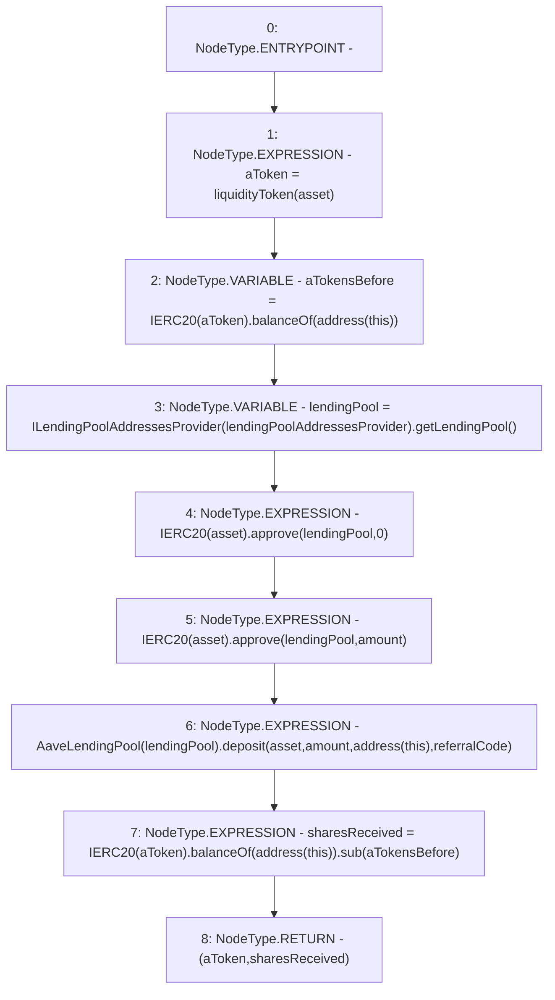

# Context: AaveYield._depositERC20

**Contract:** `AaveYield` (Inherits: ReentrancyGuard, OwnableUpgradeable, ContextUpgradeable, Initializable, IYield)
**Signature:** `_depositERC20(address,uint256) returns (address, uint256)`
**Method Selector ID:** `Internal (No Method ID)`
**Visibility:** `internal`
**Environment-Free:** `Yes`
**Modifiers:** None

### State Variables Interaction
- **Reads:** lendingPoolAddressesProvider, referralCode
- **Writes:** None

### Environment & Verification Flags
- **Uses Foundry Cheatcodes:** No
- **Has Echidna Properties:** No

### Internal Calls Tree
- None

### External Calls / Value Transfers
- `IERC20.TMP_3550(uint256) = HIGH_LEVEL_CALL, dest:TMP_3548(IERC20), function:balanceOf, arguments:['TMP_3549']  `
- `SafeMath.TMP_3563(uint256) = LIBRARY_CALL, dest:SafeMath, function:SafeMath.sub(uint256,uint256), arguments:['TMP_3562', 'aTokensBefore'] `
- `AaveLendingPool.HIGH_LEVEL_CALL, dest:TMP_3557(AaveLendingPool), function:deposit, arguments:['asset', 'amount', 'TMP_3558', 'referralCode']  `
- `ILendingPoolAddressesProvider.TMP_3552(address) = HIGH_LEVEL_CALL, dest:TMP_3551(ILendingPoolAddressesProvider), function:getLendingPool, arguments:[]  `
- `IERC20.TMP_3562(uint256) = HIGH_LEVEL_CALL, dest:TMP_3560(IERC20), function:balanceOf, arguments:['TMP_3561']  `
- `IERC20.TMP_3554(bool) = HIGH_LEVEL_CALL, dest:TMP_3553(IERC20), function:approve, arguments:['lendingPool', '0']  `
- `IERC20.TMP_3556(bool) = HIGH_LEVEL_CALL, dest:TMP_3555(IERC20), function:approve, arguments:['lendingPool', 'amount']  `

### Control Flow Graph (CFG)


### Source Mapping
Declared in: `contracts/yield/AaveYield.sol` on lines **290** to **304**

```solidity
    function _depositERC20(address asset, uint256 amount) internal returns (address aToken, uint256 sharesReceived) {
        aToken = liquidityToken(asset);
        uint256 aTokensBefore = IERC20(aToken).balanceOf(address(this));

        address lendingPool = ILendingPoolAddressesProvider(lendingPoolAddressesProvider).getLendingPool();

        //approve collateral to vault
        IERC20(asset).approve(lendingPool, 0);
        IERC20(asset).approve(lendingPool, amount);

        //lock collateral in vault
        AaveLendingPool(lendingPool).deposit(asset, amount, address(this), referralCode);

        sharesReceived = IERC20(aToken).balanceOf(address(this)).sub(aTokensBefore);
    }

```
