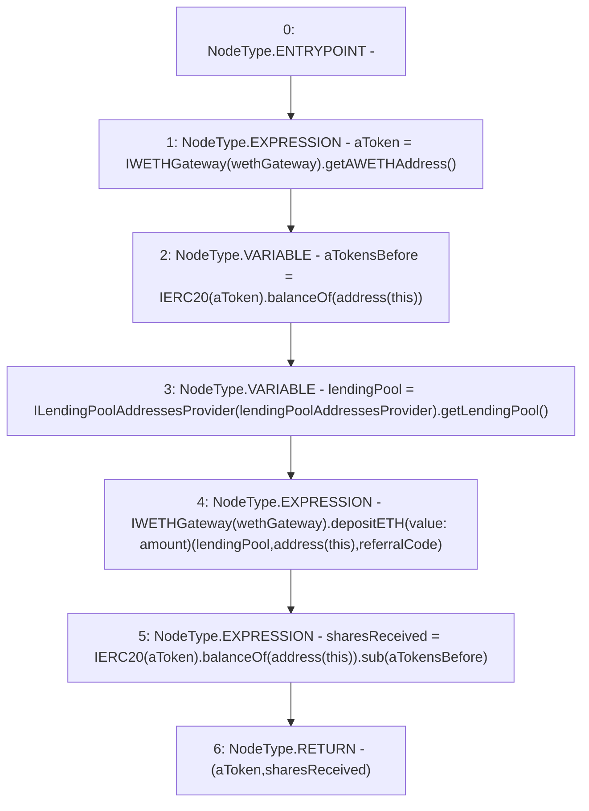

# Context: AaveYield._depositETH

**Contract:** `AaveYield` (Inherits: ReentrancyGuard, OwnableUpgradeable, ContextUpgradeable, Initializable, IYield)
**Signature:** `_depositETH(uint256) returns (address, uint256)`
**Method Selector ID:** `Internal (No Method ID)`
**Visibility:** `internal`
**Environment-Free:** `Yes`
**Modifiers:** None

### State Variables Interaction
- **Reads:** lendingPoolAddressesProvider, referralCode, wethGateway
- **Writes:** None

### Environment & Verification Flags
- **Uses Foundry Cheatcodes:** No
- **Has Echidna Properties:** No

### Internal Calls Tree
- None

### External Calls / Value Transfers
- `ILendingPoolAddressesProvider.TMP_3539(address) = HIGH_LEVEL_CALL, dest:TMP_3538(ILendingPoolAddressesProvider), function:getLendingPool, arguments:[]  `
- `IWETHGateway.TMP_3534(address) = HIGH_LEVEL_CALL, dest:TMP_3533(IWETHGateway), function:getAWETHAddress, arguments:[]  `
- `IERC20.TMP_3545(uint256) = HIGH_LEVEL_CALL, dest:TMP_3543(IERC20), function:balanceOf, arguments:['TMP_3544']  `
- `SafeMath.TMP_3546(uint256) = LIBRARY_CALL, dest:SafeMath, function:SafeMath.sub(uint256,uint256), arguments:['TMP_3545', 'aTokensBefore'] `
- `IWETHGateway.HIGH_LEVEL_CALL, dest:TMP_3540(IWETHGateway), function:depositETH, arguments:['lendingPool', 'TMP_3541', 'referralCode'] value:amount `
- `IERC20.TMP_3537(uint256) = HIGH_LEVEL_CALL, dest:TMP_3535(IERC20), function:balanceOf, arguments:['TMP_3536']  `

### Control Flow Graph (CFG)


### Source Mapping
Declared in: `contracts/yield/AaveYield.sol` on lines **277** to **288**

```solidity
    function _depositETH(uint256 amount) internal returns (address aToken, uint256 sharesReceived) {
        aToken = IWETHGateway(wethGateway).getAWETHAddress();

        uint256 aTokensBefore = IERC20(aToken).balanceOf(address(this));

        address lendingPool = ILendingPoolAddressesProvider(lendingPoolAddressesProvider).getLendingPool();

        //lock collateral
        IWETHGateway(wethGateway).depositETH{value: amount}(lendingPool, address(this), referralCode);

        sharesReceived = IERC20(aToken).balanceOf(address(this)).sub(aTokensBefore);
    }

```
