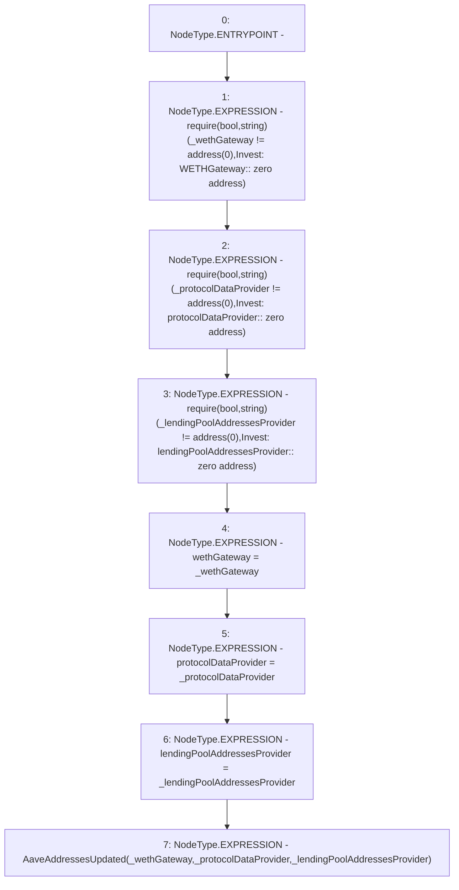

# Context: AaveYield._updateAaveAddresses

**Contract:** `AaveYield` (Inherits: ReentrancyGuard, OwnableUpgradeable, ContextUpgradeable, Initializable, IYield)
**Signature:** `_updateAaveAddresses(address,address,address)`
**Method Selector ID:** `Internal (No Method ID)`
**Visibility:** `internal`
**Environment-Free:** `Yes`
**Modifiers:** None

### State Variables Interaction
- **Reads:** None
- **Writes:** lendingPoolAddressesProvider, protocolDataProvider, wethGateway

### Assertion Checks & Business Requirements
- require/assert: `require(bool,string)(_wethGateway != address(0),Invest: WETHGateway:: zero address)`
- require/assert: `require(bool,string)(_protocolDataProvider != address(0),Invest: protocolDataProvider:: zero address)`
- require/assert: `require(bool,string)(_lendingPoolAddressesProvider != address(0),Invest: lendingPoolAddressesProvider:: zero address)`

### Environment & Verification Flags
- **Uses Foundry Cheatcodes:** No
- **Has Echidna Properties:** No

### Internal Calls Tree
- None

### External Calls / Value Transfers
- None

### Control Flow Graph (CFG)


### Source Mapping
Declared in: `contracts/yield/AaveYield.sol` on lines **141** to **153**

```solidity
    function _updateAaveAddresses(
        address _wethGateway,
        address _protocolDataProvider,
        address _lendingPoolAddressesProvider
    ) internal {
        require(_wethGateway != address(0), 'Invest: WETHGateway:: zero address');
        require(_protocolDataProvider != address(0), 'Invest: protocolDataProvider:: zero address');
        require(_lendingPoolAddressesProvider != address(0), 'Invest: lendingPoolAddressesProvider:: zero address');
        wethGateway = _wethGateway;
        protocolDataProvider = _protocolDataProvider;
        lendingPoolAddressesProvider = _lendingPoolAddressesProvider;
        emit AaveAddressesUpdated(_wethGateway, _protocolDataProvider, _lendingPoolAddressesProvider);
    }

```
