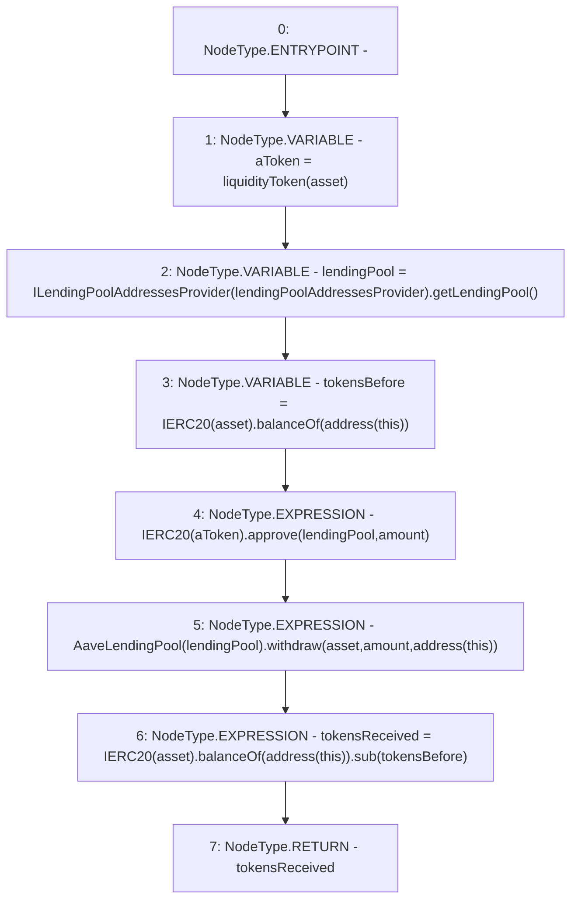

# Context: AaveYield._withdrawERC

**Contract:** `AaveYield` (Inherits: ReentrancyGuard, OwnableUpgradeable, ContextUpgradeable, Initializable, IYield)
**Signature:** `_withdrawERC(address,uint256) returns (uint256)`
**Method Selector ID:** `Internal (No Method ID)`
**Visibility:** `internal`
**Environment-Free:** `Yes`
**Modifiers:** None

### State Variables Interaction
- **Reads:** lendingPoolAddressesProvider
- **Writes:** None

### Environment & Verification Flags
- **Uses Foundry Cheatcodes:** No
- **Has Echidna Properties:** No

### Internal Calls Tree
- None

### External Calls / Value Transfers
- `IERC20.TMP_3583(bool) = HIGH_LEVEL_CALL, dest:TMP_3582(IERC20), function:approve, arguments:['lendingPool', 'amount']  `
- `SafeMath.TMP_3590(uint256) = LIBRARY_CALL, dest:SafeMath, function:SafeMath.sub(uint256,uint256), arguments:['TMP_3589', 'tokensBefore'] `
- `ILendingPoolAddressesProvider.TMP_3578(address) = HIGH_LEVEL_CALL, dest:TMP_3577(ILendingPoolAddressesProvider), function:getLendingPool, arguments:[]  `
- `IERC20.TMP_3581(uint256) = HIGH_LEVEL_CALL, dest:TMP_3579(IERC20), function:balanceOf, arguments:['TMP_3580']  `
- `IERC20.TMP_3589(uint256) = HIGH_LEVEL_CALL, dest:TMP_3587(IERC20), function:balanceOf, arguments:['TMP_3588']  `
- `AaveLendingPool.TMP_3586(uint256) = HIGH_LEVEL_CALL, dest:TMP_3584(AaveLendingPool), function:withdraw, arguments:['asset', 'amount', 'TMP_3585']  `

### Control Flow Graph (CFG)


### Source Mapping
Declared in: `contracts/yield/AaveYield.sol` on lines **317** to **330**

```solidity
    function _withdrawERC(address asset, uint256 amount) internal returns (uint256 tokensReceived) {
        address aToken = liquidityToken(asset);

        address lendingPool = ILendingPoolAddressesProvider(lendingPoolAddressesProvider).getLendingPool();

        uint256 tokensBefore = IERC20(asset).balanceOf(address(this));

        IERC20(aToken).approve(lendingPool, amount);

        //withdraw collateral from vault
        AaveLendingPool(lendingPool).withdraw(asset, amount, address(this));

        tokensReceived = IERC20(asset).balanceOf(address(this)).sub(tokensBefore);
    }

```
