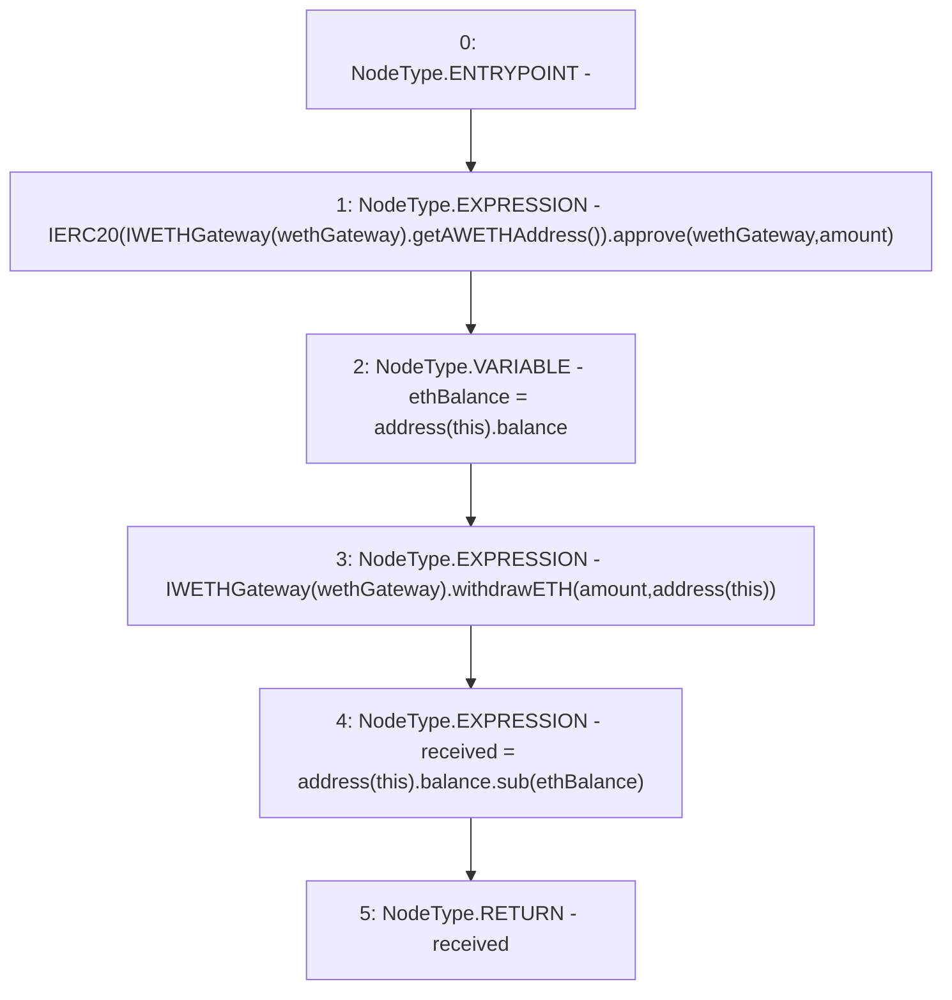

# Context: AaveYield._withdrawETH

**Contract:** `AaveYield` (Inherits: ReentrancyGuard, OwnableUpgradeable, ContextUpgradeable, Initializable, IYield)
**Signature:** `_withdrawETH(uint256) returns (uint256)`
**Method Selector ID:** `Internal (No Method ID)`
**Visibility:** `internal`
**Environment-Free:** `Yes`
**Modifiers:** None

### State Variables Interaction
- **Reads:** wethGateway
- **Writes:** None

### Environment & Verification Flags
- **Uses Foundry Cheatcodes:** No
- **Has Echidna Properties:** No

### Internal Calls Tree
- None

### External Calls / Value Transfers
- `IERC20.TMP_3567(bool) = HIGH_LEVEL_CALL, dest:TMP_3566(IERC20), function:approve, arguments:['wethGateway', 'amount']  `
- `SafeMath.TMP_3575(uint256) = LIBRARY_CALL, dest:SafeMath, function:SafeMath.sub(uint256,uint256), arguments:['TMP_3574', 'ethBalance'] `
- `IWETHGateway.TMP_3565(address) = HIGH_LEVEL_CALL, dest:TMP_3564(IWETHGateway), function:getAWETHAddress, arguments:[]  `
- `IWETHGateway.HIGH_LEVEL_CALL, dest:TMP_3570(IWETHGateway), function:withdrawETH, arguments:['amount', 'TMP_3571']  `

### Control Flow Graph (CFG)


### Source Mapping
Declared in: `contracts/yield/AaveYield.sol` on lines **306** to **315**

```solidity
    function _withdrawETH(uint256 amount) internal returns (uint256 received) {
        IERC20(IWETHGateway(wethGateway).getAWETHAddress()).approve(wethGateway, amount);

        uint256 ethBalance = address(this).balance;

        //lock collateral
        IWETHGateway(wethGateway).withdrawETH(amount, address(this));

        received = address(this).balance.sub(ethBalance);
    }

```
