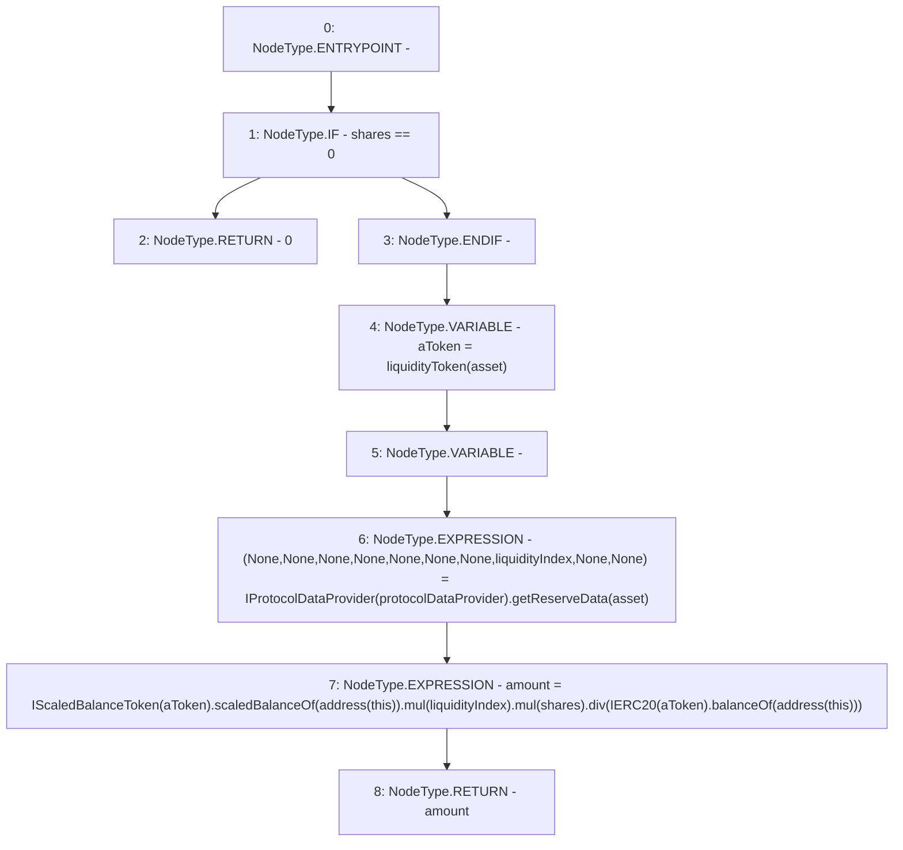

# Context: AaveYield.getTokensForShares

**Contract:** `AaveYield` (Inherits: ReentrancyGuard, OwnableUpgradeable, ContextUpgradeable, Initializable, IYield)
**Signature:** `getTokensForShares(uint256,address) returns (uint256)`
**Method Selector ID:** `0x59846d29`
**Visibility:** `public`
**Environment-Free:** `Yes`
**Modifiers:** None

### State Variables Interaction
- **Reads:** protocolDataProvider
- **Writes:** None

### Environment & Verification Flags
- **Uses Foundry Cheatcodes:** No
- **Has Echidna Properties:** No

### Internal Calls Tree
- None

### External Calls / Value Transfers
- `SafeMath.TMP_3524(uint256) = LIBRARY_CALL, dest:SafeMath, function:SafeMath.mul(uint256,uint256), arguments:['TMP_3523', 'liquidityIndex'] `
- `IProtocolDataProvider.TUPLE_40(uint256,uint256,uint256,uint256,uint256,uint256,uint256,uint256,uint256,uint40) = HIGH_LEVEL_CALL, dest:TMP_3520(IProtocolDataProvider), function:getReserveData, arguments:['asset']  `
- `IERC20.TMP_3528(uint256) = HIGH_LEVEL_CALL, dest:TMP_3526(IERC20), function:balanceOf, arguments:['TMP_3527']  `
- `SafeMath.TMP_3525(uint256) = LIBRARY_CALL, dest:SafeMath, function:SafeMath.mul(uint256,uint256), arguments:['TMP_3524', 'shares'] `
- `IScaledBalanceToken.TMP_3523(uint256) = HIGH_LEVEL_CALL, dest:TMP_3521(IScaledBalanceToken), function:scaledBalanceOf, arguments:['TMP_3522']  `
- `SafeMath.TMP_3529(uint256) = LIBRARY_CALL, dest:SafeMath, function:SafeMath.div(uint256,uint256), arguments:['TMP_3525', 'TMP_3528'] `

### Control Flow Graph (CFG)


### Source Mapping
Declared in: `contracts/yield/AaveYield.sol` on lines **256** to **265**

```solidity
    function getTokensForShares(uint256 shares, address asset) public view override returns (uint256 amount) {
        if (shares == 0) return 0;
        address aToken = liquidityToken(asset);

        (, , , , , , , uint256 liquidityIndex, , ) = IProtocolDataProvider(protocolDataProvider).getReserveData(asset);

        amount = IScaledBalanceToken(aToken).scaledBalanceOf(address(this)).mul(liquidityIndex).mul(shares).div(
            IERC20(aToken).balanceOf(address(this))
        );
    }

```
