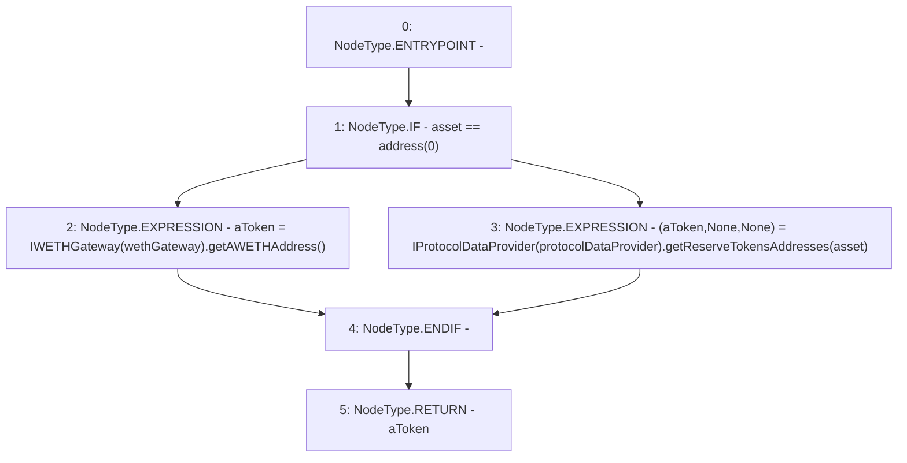

# Context: AaveYield.liquidityToken

**Contract:** `AaveYield` (Inherits: ReentrancyGuard, OwnableUpgradeable, ContextUpgradeable, Initializable, IYield)
**Signature:** `liquidityToken(address) returns (address)`
**Method Selector ID:** `0x1391abc7`
**Visibility:** `public`
**Environment-Free:** `Yes`
**Modifiers:** None

### State Variables Interaction
- **Reads:** protocolDataProvider, wethGateway
- **Writes:** None

### Environment & Verification Flags
- **Uses Foundry Cheatcodes:** No
- **Has Echidna Properties:** No

### Internal Calls Tree
- None

### External Calls / Value Transfers
- `IWETHGateway.TMP_3448(address) = HIGH_LEVEL_CALL, dest:TMP_3447(IWETHGateway), function:getAWETHAddress, arguments:[]  `
- `IProtocolDataProvider.TUPLE_35(address,address,address) = HIGH_LEVEL_CALL, dest:TMP_3449(IProtocolDataProvider), function:getReserveTokensAddresses, arguments:['asset']  `

### Control Flow Graph (CFG)


### Source Mapping
Declared in: `contracts/yield/AaveYield.sol` on lines **103** to **109**

```solidity
    function liquidityToken(address asset) public view override returns (address aToken) {
        if (asset == address(0)) {
            aToken = IWETHGateway(wethGateway).getAWETHAddress();
        } else {
            (aToken, , ) = IProtocolDataProvider(protocolDataProvider).getReserveTokensAddresses(asset);
        }
    }

```
