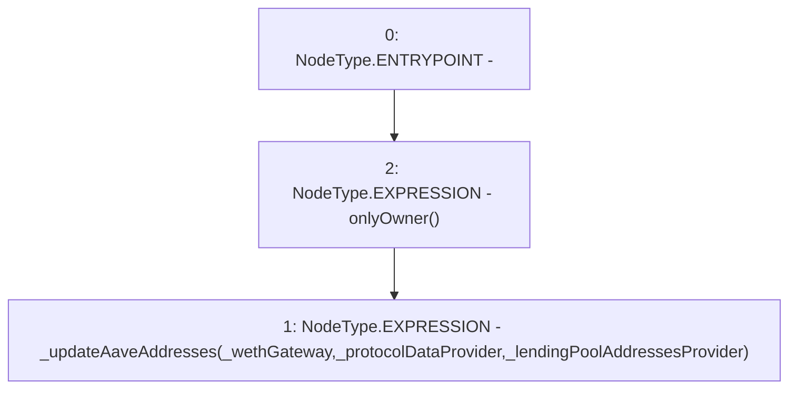

# Context: AaveYield.updateAaveAddresses

**Contract:** `AaveYield` (Inherits: ReentrancyGuard, OwnableUpgradeable, ContextUpgradeable, Initializable, IYield)
**Signature:** `updateAaveAddresses(address,address,address)`
**Method Selector ID:** `0xfdca23c1`
**Visibility:** `external`
**Environment-Free:** `No (reads EVM state context)`
**Modifiers:**
- `onlyOwner`
  ```solidity
  modifier onlyOwner() {
          require(owner() == _msgSender(), "Ownable: caller is not the owner");
          _;
      }
  ```

### State Variables Interaction
- **Reads:** None
- **Writes:** None

### Environment & Verification Flags
- **Uses Foundry Cheatcodes:** No
- **Has Echidna Properties:** No

### Internal Calls Tree
- None

### External Calls / Value Transfers
- None

### Control Flow Graph (CFG)


### Source Mapping
Declared in: `contracts/yield/AaveYield.sol` on lines **133** to **139**

```solidity
    function updateAaveAddresses(
        address _wethGateway,
        address _protocolDataProvider,
        address _lendingPoolAddressesProvider
    ) external onlyOwner {
        _updateAaveAddresses(_wethGateway, _protocolDataProvider, _lendingPoolAddressesProvider);
    }

```
