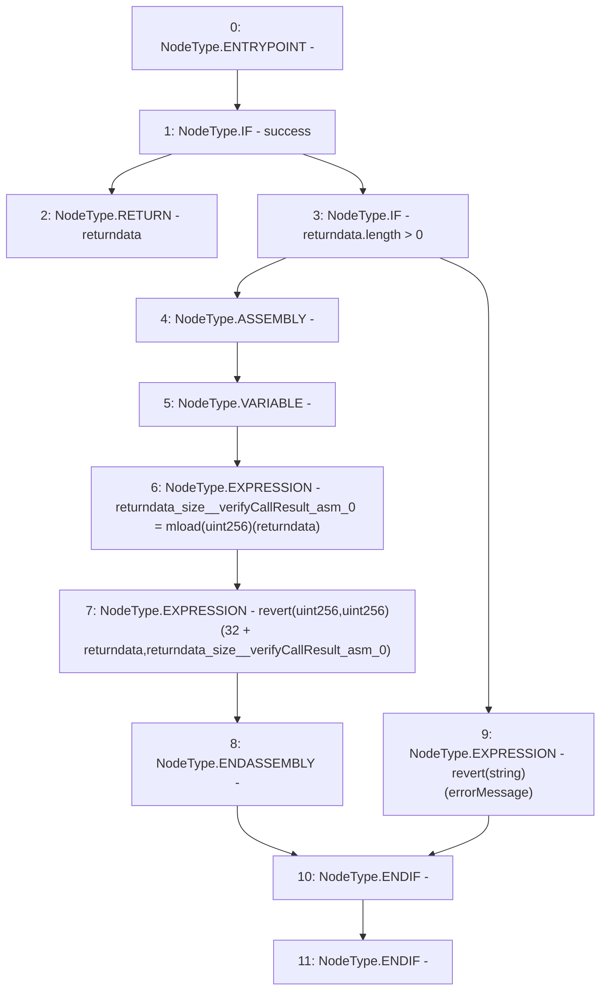

# Context: AddressUpgradeable._verifyCallResult

**Contract:** `AddressUpgradeable` (Inherits: None)
**Signature:** `_verifyCallResult(bool,bytes,string) returns (bytes)`
**Method Selector ID:** `Internal (No Method ID)`
**Visibility:** `private`
**Environment-Free:** `Yes`
**Modifiers:** None

### State Variables Interaction
- **Reads:** None
- **Writes:** None

### Assertion Checks & Business Requirements
- revert: `revert(uint256,uint256)(32 + returndata,returndata_size__verifyCallResult_asm_0)`
- revert: `revert(string)(errorMessage)`

### Environment & Verification Flags
- **Uses Foundry Cheatcodes:** No
- **Has Echidna Properties:** No

### Internal Calls Tree
- None

### External Calls / Value Transfers
- None

### Control Flow Graph (CFG)


### Source Mapping
Declared in: `node_modules/@openzeppelin/contracts-upgradeable/utils/AddressUpgradeable.sol` on lines **147** to **164**

```solidity
    function _verifyCallResult(bool success, bytes memory returndata, string memory errorMessage) private pure returns(bytes memory) {
        if (success) {
            return returndata;
        } else {
            // Look for revert reason and bubble it up if present
            if (returndata.length > 0) {
                // The easiest way to bubble the revert reason is using memory via assembly

                // solhint-disable-next-line no-inline-assembly
                assembly {
                    let returndata_size := mload(returndata)
                    revert(add(32, returndata), returndata_size)
                }
            } else {
                revert(errorMessage);
            }
        }
    }

```
