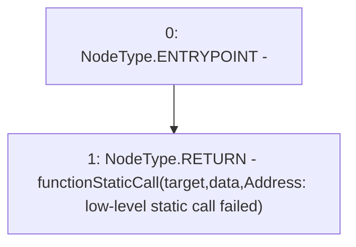

# Context: AddressUpgradeable.functionStaticCall

**Contract:** `AddressUpgradeable` (Inherits: None)
**Signature:** `functionStaticCall(address,bytes) returns (bytes)`
**Method Selector ID:** `Internal (No Method ID)`
**Visibility:** `internal`
**Environment-Free:** `Yes`
**Modifiers:** None

### State Variables Interaction
- **Reads:** None
- **Writes:** None

### Environment & Verification Flags
- **Uses Foundry Cheatcodes:** No
- **Has Echidna Properties:** No

### Internal Calls Tree
- None

### External Calls / Value Transfers
- None

### Control Flow Graph (CFG)


### Source Mapping
Declared in: `node_modules/@openzeppelin/contracts-upgradeable/utils/AddressUpgradeable.sol` on lines **129** to **131**

```solidity
    function functionStaticCall(address target, bytes memory data) internal view returns (bytes memory) {
        return functionStaticCall(target, data, "Address: low-level static call failed");
    }

```
