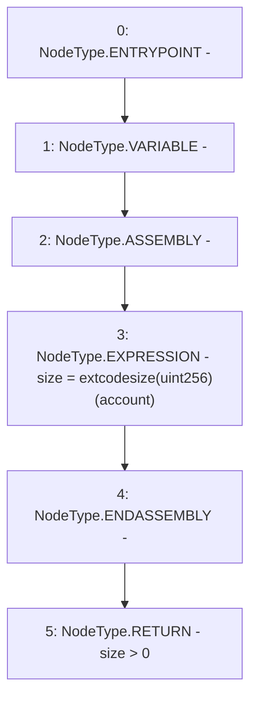

# Context: AddressUpgradeable.isContract

**Contract:** `AddressUpgradeable` (Inherits: None)
**Signature:** `isContract(address) returns (bool)`
**Method Selector ID:** `Internal (No Method ID)`
**Visibility:** `internal`
**Environment-Free:** `Yes`
**Modifiers:** None

### State Variables Interaction
- **Reads:** None
- **Writes:** None

### Environment & Verification Flags
- **Uses Foundry Cheatcodes:** No
- **Has Echidna Properties:** No

### Internal Calls Tree
- None

### External Calls / Value Transfers
- None

### Control Flow Graph (CFG)


### Source Mapping
Declared in: `node_modules/@openzeppelin/contracts-upgradeable/utils/AddressUpgradeable.sol` on lines **26** to **35**

```solidity
    function isContract(address account) internal view returns (bool) {
        // This method relies on extcodesize, which returns 0 for contracts in
        // construction, since the code is only stored at the end of the
        // constructor execution.

        uint256 size;
        // solhint-disable-next-line no-inline-assembly
        assembly { size := extcodesize(account) }
        return size > 0;
    }

```
