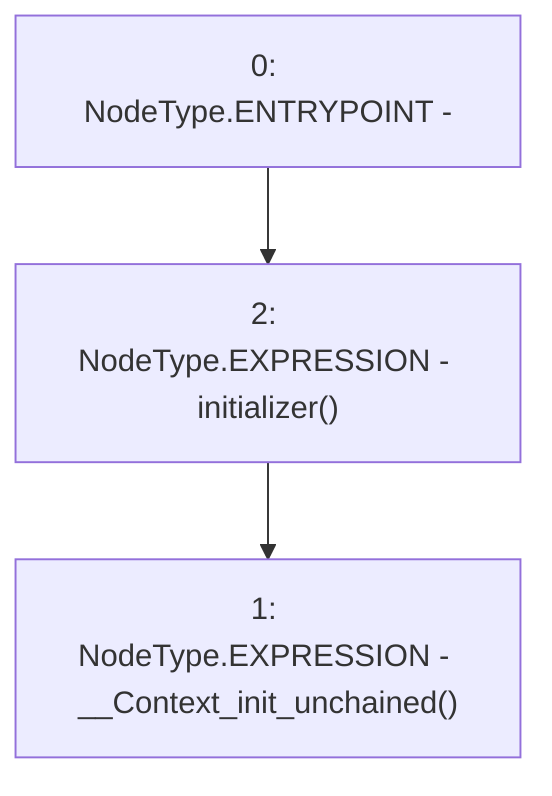

# Context: AdminVerifier.__Context_init

**Contract:** `AdminVerifier` (Inherits: OwnableUpgradeable, ContextUpgradeable, IVerifier, Initializable)
**Signature:** `__Context_init()`
**Method Selector ID:** `Internal (No Method ID)`
**Visibility:** `internal`
**Environment-Free:** `Yes`
**Modifiers:**
- `initializer`
  ```solidity
  modifier initializer() {
          require(_initializing || _isConstructor() || !_initialized, "Initializable: contract is already initialized");
  
          bool isTopLevelCall = !_initializing;
          if (isTopLevelCall) {
              _initializing = true;
              _initialized = true;
          }
  
          _;
  
          if (isTopLevelCall) {
              _initializing = false;
          }
      }
  ```

### State Variables Interaction
- **Reads:** None
- **Writes:** None

### Environment & Verification Flags
- **Uses Foundry Cheatcodes:** No
- **Has Echidna Properties:** No

### Internal Calls Tree
- None

### External Calls / Value Transfers
- None

### Control Flow Graph (CFG)


### Source Mapping
Declared in: `node_modules/@openzeppelin/contracts-upgradeable/utils/ContextUpgradeable.sol` on lines **17** to **19**

```solidity
    function __Context_init() internal initializer {
        __Context_init_unchained();
    }

```
