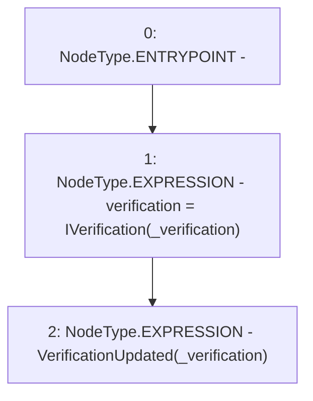

# Context: AdminVerifier._updateVerification

**Contract:** `AdminVerifier` (Inherits: OwnableUpgradeable, ContextUpgradeable, IVerifier, Initializable)
**Signature:** `_updateVerification(address)`
**Method Selector ID:** `Internal (No Method ID)`
**Visibility:** `internal`
**Environment-Free:** `Yes`
**Modifiers:** None

### State Variables Interaction
- **Reads:** None
- **Writes:** verification

### Environment & Verification Flags
- **Uses Foundry Cheatcodes:** No
- **Has Echidna Properties:** No

### Internal Calls Tree
- None

### External Calls / Value Transfers
- None

### Control Flow Graph (CFG)


### Source Mapping
Declared in: `contracts/Verification/adminVerifier.sol` on lines **73** to **76**

```solidity
    function _updateVerification(address _verification) internal {
        verification = IVerification(_verification);
        emit VerificationUpdated(_verification);
    }

```
