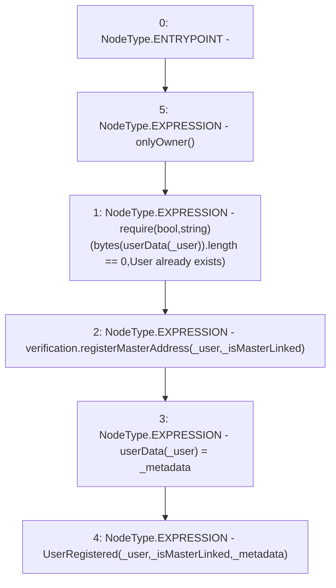

# Context: AdminVerifier.registerUser

**Contract:** `AdminVerifier` (Inherits: OwnableUpgradeable, ContextUpgradeable, IVerifier, Initializable)
**Signature:** `registerUser(address,string,bool)`
**Method Selector ID:** `0x16596d7f`
**Visibility:** `external`
**Environment-Free:** `No (reads EVM state context)`
**Modifiers:**
- `onlyOwner`
  ```solidity
  modifier onlyOwner() {
          require(owner() == _msgSender(), "Ownable: caller is not the owner");
          _;
      }
  ```

### State Variables Interaction
- **Reads:** userData, verification
- **Writes:** userData

### Assertion Checks & Business Requirements
- require/assert: `require(bool,string)(bytes(userData[_user]).length == 0,User already exists)`

### Environment & Verification Flags
- **Uses Foundry Cheatcodes:** No
- **Has Echidna Properties:** No

### Internal Calls Tree
- None

### External Calls / Value Transfers
- `IVerification.HIGH_LEVEL_CALL, dest:verification(IVerification), function:registerMasterAddress, arguments:['_user', '_isMasterLinked']  `

### Control Flow Graph (CFG)


### Source Mapping
Declared in: `contracts/Verification/adminVerifier.sol` on lines **41** to **50**

```solidity
    function registerUser(
        address _user,
        string memory _metadata,
        bool _isMasterLinked
    ) external onlyOwner {
        require(bytes(userData[_user]).length == 0, 'User already exists');
        verification.registerMasterAddress(_user, _isMasterLinked);
        userData[_user] = _metadata;
        emit UserRegistered(_user, _isMasterLinked, _metadata);
    }

```
