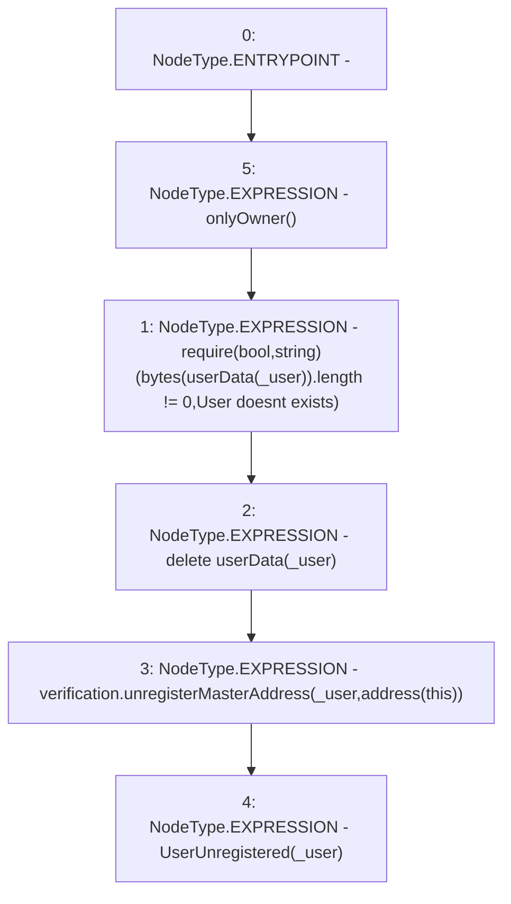

# Context: AdminVerifier.unregisterUser

**Contract:** `AdminVerifier` (Inherits: OwnableUpgradeable, ContextUpgradeable, IVerifier, Initializable)
**Signature:** `unregisterUser(address)`
**Method Selector ID:** `0x21f2ca3b`
**Visibility:** `external`
**Environment-Free:** `No (reads EVM state context)`
**Modifiers:**
- `onlyOwner`
  ```solidity
  modifier onlyOwner() {
          require(owner() == _msgSender(), "Ownable: caller is not the owner");
          _;
      }
  ```

### State Variables Interaction
- **Reads:** userData, verification
- **Writes:** userData

### Assertion Checks & Business Requirements
- require/assert: `require(bool,string)(bytes(userData[_user]).length != 0,User doesnt exists)`

### Environment & Verification Flags
- **Uses Foundry Cheatcodes:** No
- **Has Echidna Properties:** No

### Internal Calls Tree
- None

### External Calls / Value Transfers
- `IVerification.HIGH_LEVEL_CALL, dest:verification(IVerification), function:unregisterMasterAddress, arguments:['_user', 'TMP_2869']  `

### Control Flow Graph (CFG)


### Source Mapping
Declared in: `contracts/Verification/adminVerifier.sol` on lines **57** to **62**

```solidity
    function unregisterUser(address _user) external onlyOwner {
        require(bytes(userData[_user]).length != 0, 'User doesnt exists');
        delete userData[_user];
        verification.unregisterMasterAddress(_user, address(this));
        emit UserUnregistered(_user);
    }

```
