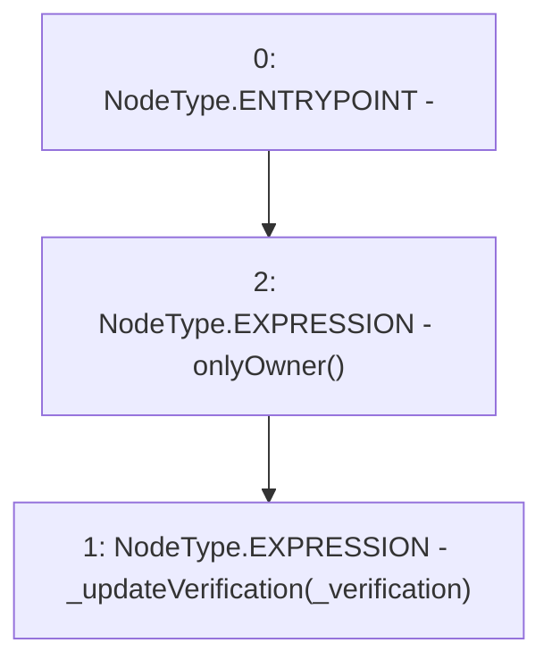

# Context: AdminVerifier.updateVerification

**Contract:** `AdminVerifier` (Inherits: OwnableUpgradeable, ContextUpgradeable, IVerifier, Initializable)
**Signature:** `updateVerification(address)`
**Method Selector ID:** `0x4714a411`
**Visibility:** `external`
**Environment-Free:** `No (reads EVM state context)`
**Modifiers:**
- `onlyOwner`
  ```solidity
  modifier onlyOwner() {
          require(owner() == _msgSender(), "Ownable: caller is not the owner");
          _;
      }
  ```

### State Variables Interaction
- **Reads:** None
- **Writes:** None

### Environment & Verification Flags
- **Uses Foundry Cheatcodes:** No
- **Has Echidna Properties:** No

### Internal Calls Tree
- None

### External Calls / Value Transfers
- None

### Control Flow Graph (CFG)


### Source Mapping
Declared in: `contracts/Verification/adminVerifier.sol` on lines **69** to **71**

```solidity
    function updateVerification(address _verification) external onlyOwner {
        _updateVerification(_verification);
    }

```
