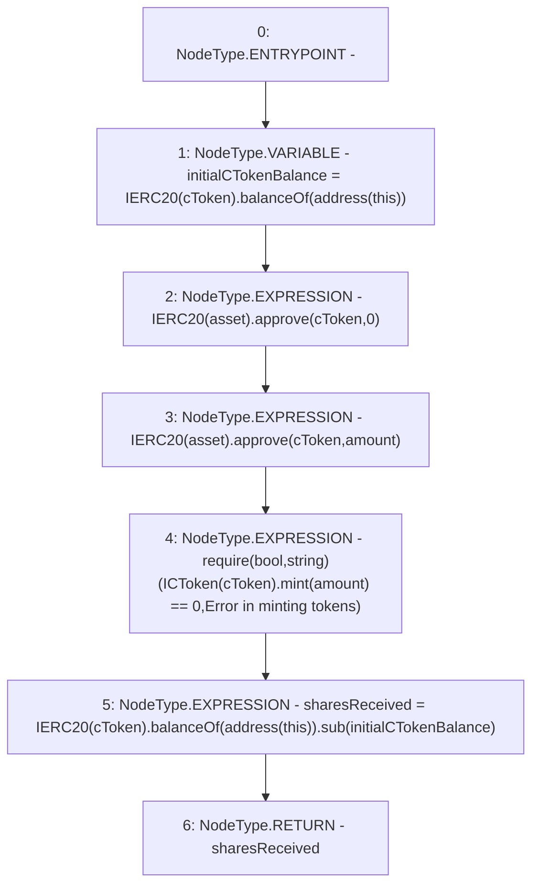

# Context: CompoundYield._depositERC20

**Contract:** `CompoundYield` (Inherits: ReentrancyGuard, OwnableUpgradeable, ContextUpgradeable, Initializable, IYield)
**Signature:** `_depositERC20(address,address,uint256) returns (uint256)`
**Method Selector ID:** `Internal (No Method ID)`
**Visibility:** `internal`
**Environment-Free:** `Yes`
**Modifiers:** None

### State Variables Interaction
- **Reads:** None
- **Writes:** None

### Assertion Checks & Business Requirements
- require/assert: `require(bool,string)(ICToken(cToken).mint(amount) == 0,Error in minting tokens)`

### Environment & Verification Flags
- **Uses Foundry Cheatcodes:** No
- **Has Echidna Properties:** No

### Internal Calls Tree
- None

### External Calls / Value Transfers
- `ICToken.TMP_3718(uint256) = HIGH_LEVEL_CALL, dest:TMP_3717(ICToken), function:mint, arguments:['amount']  `
- `IERC20.TMP_3714(bool) = HIGH_LEVEL_CALL, dest:TMP_3713(IERC20), function:approve, arguments:['cToken', '0']  `
- `IERC20.TMP_3716(bool) = HIGH_LEVEL_CALL, dest:TMP_3715(IERC20), function:approve, arguments:['cToken', 'amount']  `
- `IERC20.TMP_3712(uint256) = HIGH_LEVEL_CALL, dest:TMP_3710(IERC20), function:balanceOf, arguments:['TMP_3711']  `
- `SafeMath.TMP_3724(uint256) = LIBRARY_CALL, dest:SafeMath, function:SafeMath.sub(uint256,uint256), arguments:['TMP_3723', 'initialCTokenBalance'] `
- `IERC20.TMP_3723(uint256) = HIGH_LEVEL_CALL, dest:TMP_3721(IERC20), function:balanceOf, arguments:['TMP_3722']  `

### Control Flow Graph (CFG)


### Source Mapping
Declared in: `contracts/yield/CompoundYield.sol` on lines **204** to **215**

```solidity
    function _depositERC20(
        address asset,
        address cToken,
        uint256 amount
    ) internal returns (uint256 sharesReceived) {
        uint256 initialCTokenBalance = IERC20(cToken).balanceOf(address(this));
        //mint cToken
        IERC20(asset).approve(cToken, 0);
        IERC20(asset).approve(cToken, amount);
        require(ICToken(cToken).mint(amount) == 0, 'Error in minting tokens');
        sharesReceived = IERC20(cToken).balanceOf(address(this)).sub(initialCTokenBalance);
    }

```
