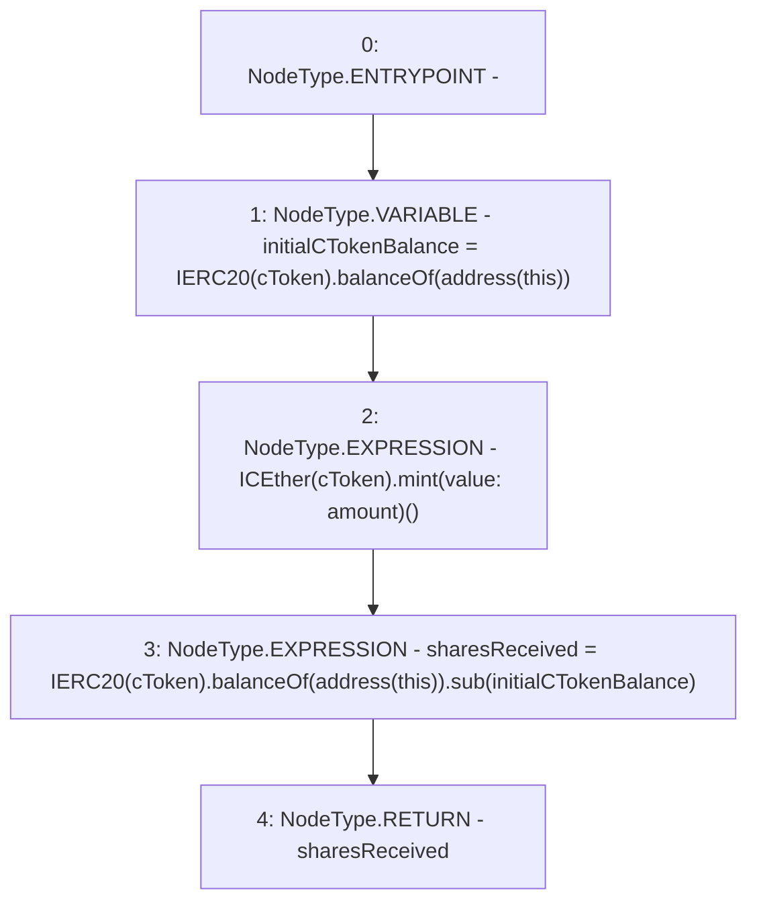

# Context: CompoundYield._depositETH

**Contract:** `CompoundYield` (Inherits: ReentrancyGuard, OwnableUpgradeable, ContextUpgradeable, Initializable, IYield)
**Signature:** `_depositETH(address,uint256) returns (uint256)`
**Method Selector ID:** `Internal (No Method ID)`
**Visibility:** `internal`
**Environment-Free:** `Yes`
**Modifiers:** None

### State Variables Interaction
- **Reads:** None
- **Writes:** None

### Environment & Verification Flags
- **Uses Foundry Cheatcodes:** No
- **Has Echidna Properties:** No

### Internal Calls Tree
- None

### External Calls / Value Transfers
- `ICEther.HIGH_LEVEL_CALL, dest:TMP_3704(ICEther), function:mint, arguments:[] value:amount `
- `IERC20.TMP_3708(uint256) = HIGH_LEVEL_CALL, dest:TMP_3706(IERC20), function:balanceOf, arguments:['TMP_3707']  `
- `SafeMath.TMP_3709(uint256) = LIBRARY_CALL, dest:SafeMath, function:SafeMath.sub(uint256,uint256), arguments:['TMP_3708', 'initialCTokenBalance'] `
- `IERC20.TMP_3703(uint256) = HIGH_LEVEL_CALL, dest:TMP_3701(IERC20), function:balanceOf, arguments:['TMP_3702']  `

### Control Flow Graph (CFG)


### Source Mapping
Declared in: `contracts/yield/CompoundYield.sol` on lines **195** to **202**

```solidity
    function _depositETH(address cToken, uint256 amount) internal returns (uint256 sharesReceived) {
        uint256 initialCTokenBalance = IERC20(cToken).balanceOf(address(this));

        //mint cToken
        ICEther(cToken).mint{value: amount}();

        sharesReceived = IERC20(cToken).balanceOf(address(this)).sub(initialCTokenBalance);
    }

```
