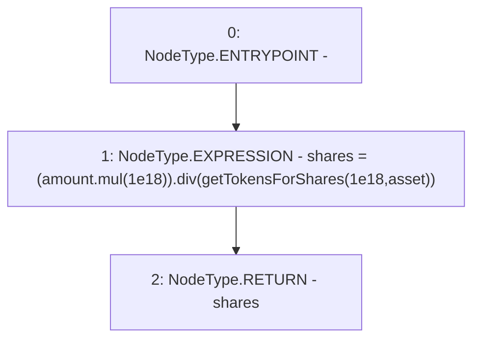

# Context: CompoundYield.getSharesForTokens

**Contract:** `CompoundYield` (Inherits: ReentrancyGuard, OwnableUpgradeable, ContextUpgradeable, Initializable, IYield)
**Signature:** `getSharesForTokens(uint256,address) returns (uint256)`
**Method Selector ID:** `0x934a5252`
**Visibility:** `external`
**Environment-Free:** `Yes`
**Modifiers:** None

### State Variables Interaction
- **Reads:** None
- **Writes:** None

### Environment & Verification Flags
- **Uses Foundry Cheatcodes:** No
- **Has Echidna Properties:** No

### Internal Calls Tree
- None

### External Calls / Value Transfers
- `SafeMath.TMP_3698(uint256) = LIBRARY_CALL, dest:SafeMath, function:SafeMath.mul(uint256,uint256), arguments:['amount', '1000000000000000000'] `
- `SafeMath.TMP_3700(uint256) = LIBRARY_CALL, dest:SafeMath, function:SafeMath.div(uint256,uint256), arguments:['TMP_3698', 'TMP_3699'] `

### Control Flow Graph (CFG)


### Source Mapping
Declared in: `contracts/yield/CompoundYield.sol` on lines **191** to **193**

```solidity
    function getSharesForTokens(uint256 amount, address asset) external override returns (uint256 shares) {
        shares = (amount.mul(1e18)).div(getTokensForShares(1e18, asset));
    }

```
