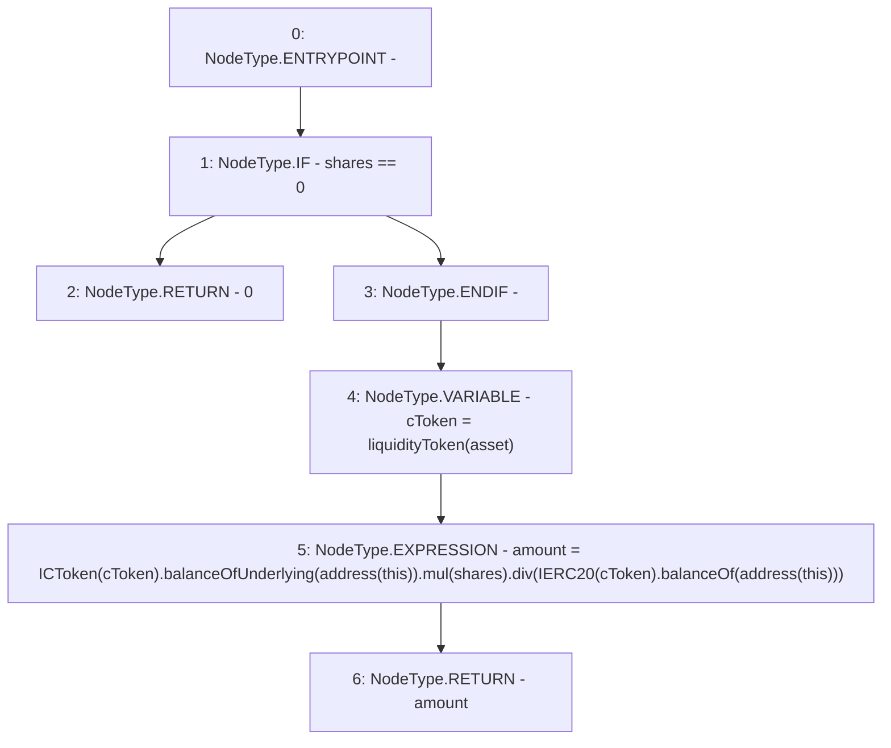

# Context: CompoundYield.getTokensForShares

**Contract:** `CompoundYield` (Inherits: ReentrancyGuard, OwnableUpgradeable, ContextUpgradeable, Initializable, IYield)
**Signature:** `getTokensForShares(uint256,address) returns (uint256)`
**Method Selector ID:** `0x59846d29`
**Visibility:** `public`
**Environment-Free:** `Yes`
**Modifiers:** None

### State Variables Interaction
- **Reads:** liquidityToken
- **Writes:** None

### Environment & Verification Flags
- **Uses Foundry Cheatcodes:** No
- **Has Echidna Properties:** No

### Internal Calls Tree
- None

### External Calls / Value Transfers
- `IERC20.TMP_3696(uint256) = HIGH_LEVEL_CALL, dest:TMP_3694(IERC20), function:balanceOf, arguments:['TMP_3695']  `
- `SafeMath.TMP_3697(uint256) = LIBRARY_CALL, dest:SafeMath, function:SafeMath.div(uint256,uint256), arguments:['TMP_3693', 'TMP_3696'] `
- `SafeMath.TMP_3693(uint256) = LIBRARY_CALL, dest:SafeMath, function:SafeMath.mul(uint256,uint256), arguments:['TMP_3692', 'shares'] `
- `ICToken.TMP_3692(uint256) = HIGH_LEVEL_CALL, dest:TMP_3690(ICToken), function:balanceOfUnderlying, arguments:['TMP_3691']  `

### Control Flow Graph (CFG)


### Source Mapping
Declared in: `contracts/yield/CompoundYield.sol` on lines **178** to **183**

```solidity
    function getTokensForShares(uint256 shares, address asset) public override returns (uint256 amount) {
        //balanceOfUnderlying returns underlying balance for total shares
        if (shares == 0) return 0;
        address cToken = liquidityToken[asset];
        amount = ICToken(cToken).balanceOfUnderlying(address(this)).mul(shares).div(IERC20(cToken).balanceOf(address(this)));
    }

```
