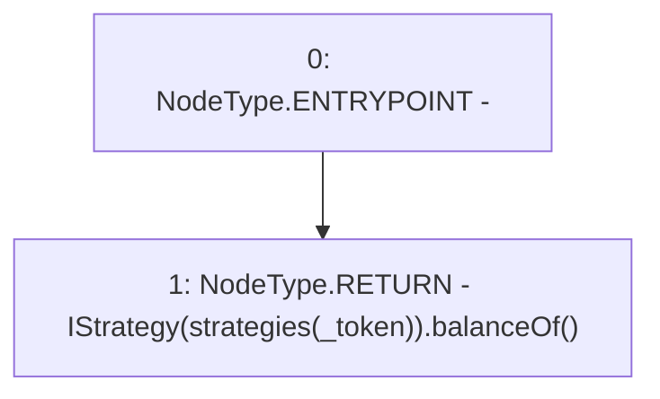

# Context: Controller.balanceOf

**Contract:** `Controller` (Inherits: None)
**Signature:** `balanceOf(address) returns (uint256)`
**Method Selector ID:** `0x70a08231`
**Visibility:** `external`
**Environment-Free:** `Yes`
**Modifiers:** None

### State Variables Interaction
- **Reads:** strategies
- **Writes:** None

### Environment & Verification Flags
- **Uses Foundry Cheatcodes:** No
- **Has Echidna Properties:** No

### Internal Calls Tree
- None

### External Calls / Value Transfers
- `IStrategy.TMP_3010(uint256) = HIGH_LEVEL_CALL, dest:TMP_3009(IStrategy), function:balanceOf, arguments:[]  `

### Control Flow Graph (CFG)


### Source Mapping
Declared in: `contracts/mocks/yVault/Controller.sol` on lines **150** to **152**

```solidity
    function balanceOf(address _token) external view returns (uint256) {
        return IStrategy(strategies[_token]).balanceOf();
    }

```
