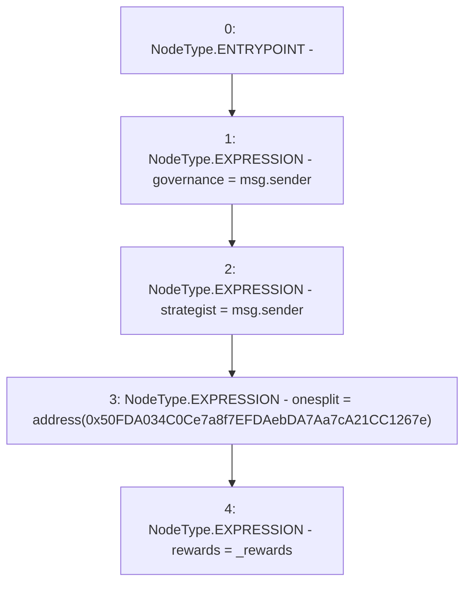

# Context: Controller.constructor

**Contract:** `Controller` (Inherits: None)
**Signature:** `constructor(address)`
**Method Selector ID:** `0xf8a6c595`
**Visibility:** `public`
**Environment-Free:** `No (reads EVM state context)`
**Modifiers:** None

### State Variables Interaction
- **Reads:** None
- **Writes:** governance, onesplit, rewards, strategist

### Environment & Verification Flags
- **Uses Foundry Cheatcodes:** No
- **Has Echidna Properties:** No

### Internal Calls Tree
- None

### External Calls / Value Transfers
- None

### Control Flow Graph (CFG)


### Source Mapping
Declared in: `contracts/mocks/yVault/Controller.sol` on lines **68** to **73**

```solidity
    constructor(address _rewards) {
        governance = msg.sender;
        strategist = msg.sender;
        onesplit = address(0x50FDA034C0Ce7a8f7EFDAebDA7Aa7cA21CC1267e);
        rewards = _rewards;
    }

```
