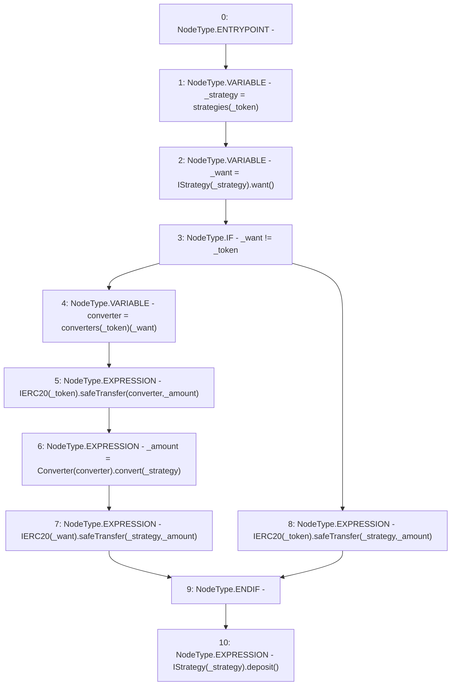

# Context: Controller.earn

**Contract:** `Controller` (Inherits: None)
**Signature:** `earn(address,uint256)`
**Method Selector ID:** `0xb02bf4b9`
**Visibility:** `public`
**Environment-Free:** `Yes`
**Modifiers:** None

### State Variables Interaction
- **Reads:** converters, strategies
- **Writes:** None

### Environment & Verification Flags
- **Uses Foundry Cheatcodes:** No
- **Has Echidna Properties:** No

### Internal Calls Tree
- None

### External Calls / Value Transfers
- `SafeERC20.LIBRARY_CALL, dest:SafeERC20, function:SafeERC20.safeTransfer(IERC20,address,uint256), arguments:['TMP_3005', '_strategy', '_amount'] `
- `IStrategy.HIGH_LEVEL_CALL, dest:TMP_3007(IStrategy), function:deposit, arguments:[]  `
- `Converter.TMP_3002(uint256) = HIGH_LEVEL_CALL, dest:TMP_3001(Converter), function:convert, arguments:['_strategy']  `
- `SafeERC20.LIBRARY_CALL, dest:SafeERC20, function:SafeERC20.safeTransfer(IERC20,address,uint256), arguments:['TMP_3003', '_strategy', '_amount'] `
- `IStrategy.TMP_2997(address) = HIGH_LEVEL_CALL, dest:TMP_2996(IStrategy), function:want, arguments:[]  `
- `SafeERC20.LIBRARY_CALL, dest:SafeERC20, function:SafeERC20.safeTransfer(IERC20,address,uint256), arguments:['TMP_2999', 'converter', '_amount'] `

### Control Flow Graph (CFG)


### Source Mapping
Declared in: `contracts/mocks/yVault/Controller.sol` on lines **136** to **148**

```solidity
    function earn(address _token, uint256 _amount) public {
        address _strategy = strategies[_token];
        address _want = IStrategy(_strategy).want();
        if (_want != _token) {
            address converter = converters[_token][_want];
            IERC20(_token).safeTransfer(converter, _amount);
            _amount = Converter(converter).convert(_strategy);
            IERC20(_want).safeTransfer(_strategy, _amount);
        } else {
            IERC20(_token).safeTransfer(_strategy, _amount);
        }
        IStrategy(_strategy).deposit();
    }

```
