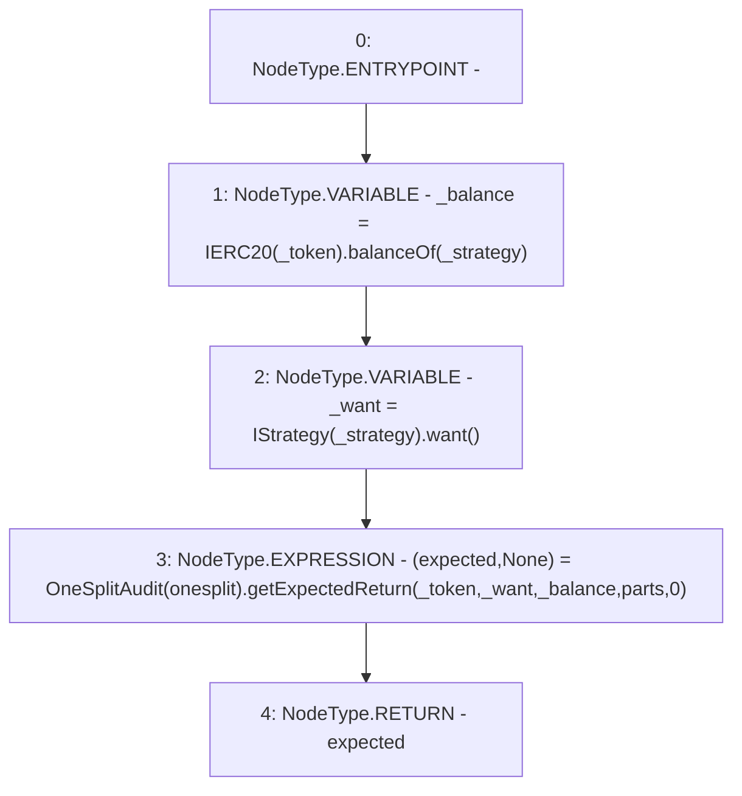

# Context: Controller.getExpectedReturn

**Contract:** `Controller` (Inherits: None)
**Signature:** `getExpectedReturn(address,address,uint256) returns (uint256)`
**Method Selector ID:** `0x6dcd64e5`
**Visibility:** `public`
**Environment-Free:** `Yes`
**Modifiers:** None

### State Variables Interaction
- **Reads:** onesplit
- **Writes:** None

### Environment & Verification Flags
- **Uses Foundry Cheatcodes:** No
- **Has Echidna Properties:** No

### Internal Calls Tree
- None

### External Calls / Value Transfers
- `OneSplitAudit.TUPLE_32(uint256,uint256[]) = HIGH_LEVEL_CALL, dest:TMP_3033(OneSplitAudit), function:getExpectedReturn, arguments:['_token', '_want', '_balance', 'parts', '0']  `
- `IStrategy.TMP_3032(address) = HIGH_LEVEL_CALL, dest:TMP_3031(IStrategy), function:want, arguments:[]  `
- `IERC20.TMP_3030(uint256) = HIGH_LEVEL_CALL, dest:TMP_3029(IERC20), function:balanceOf, arguments:['_strategy']  `

### Control Flow Graph (CFG)


### Source Mapping
Declared in: `contracts/mocks/yVault/Controller.sol` on lines **169** to **177**

```solidity
    function getExpectedReturn(
        address _strategy,
        address _token,
        uint256 parts
    ) public view returns (uint256 expected) {
        uint256 _balance = IERC20(_token).balanceOf(_strategy);
        address _want = IStrategy(_strategy).want();
        (expected, ) = OneSplitAudit(onesplit).getExpectedReturn(_token, _want, _balance, parts, 0);
    }

```
