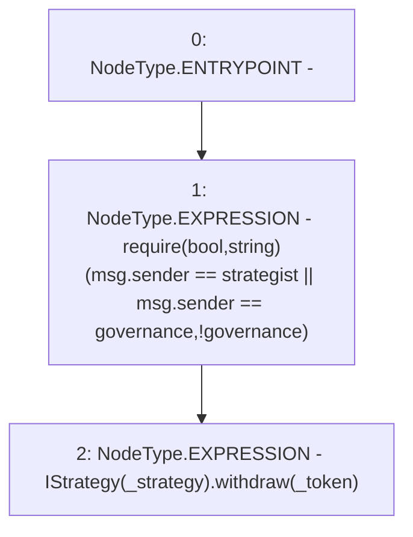

# Context: Controller.inCaseStrategyTokenGetStuck

**Contract:** `Controller` (Inherits: None)
**Signature:** `inCaseStrategyTokenGetStuck(address,address)`
**Method Selector ID:** `0x197baa6d`
**Visibility:** `public`
**Environment-Free:** `No (reads EVM state context)`
**Modifiers:** None

### State Variables Interaction
- **Reads:** governance, strategist
- **Writes:** None

### Assertion Checks & Business Requirements
- require/assert: `require(bool,string)(msg.sender == strategist || msg.sender == governance,!governance)`

### Environment & Verification Flags
- **Uses Foundry Cheatcodes:** No
- **Has Echidna Properties:** No

### Internal Calls Tree
- None

### External Calls / Value Transfers
- `IStrategy.HIGH_LEVEL_CALL, dest:TMP_3027(IStrategy), function:withdraw, arguments:['_token']  `

### Control Flow Graph (CFG)


### Source Mapping
Declared in: `contracts/mocks/yVault/Controller.sol` on lines **164** to **167**

```solidity
    function inCaseStrategyTokenGetStuck(address _strategy, address _token) public {
        require(msg.sender == strategist || msg.sender == governance, '!governance');
        IStrategy(_strategy).withdraw(_token);
    }

```
