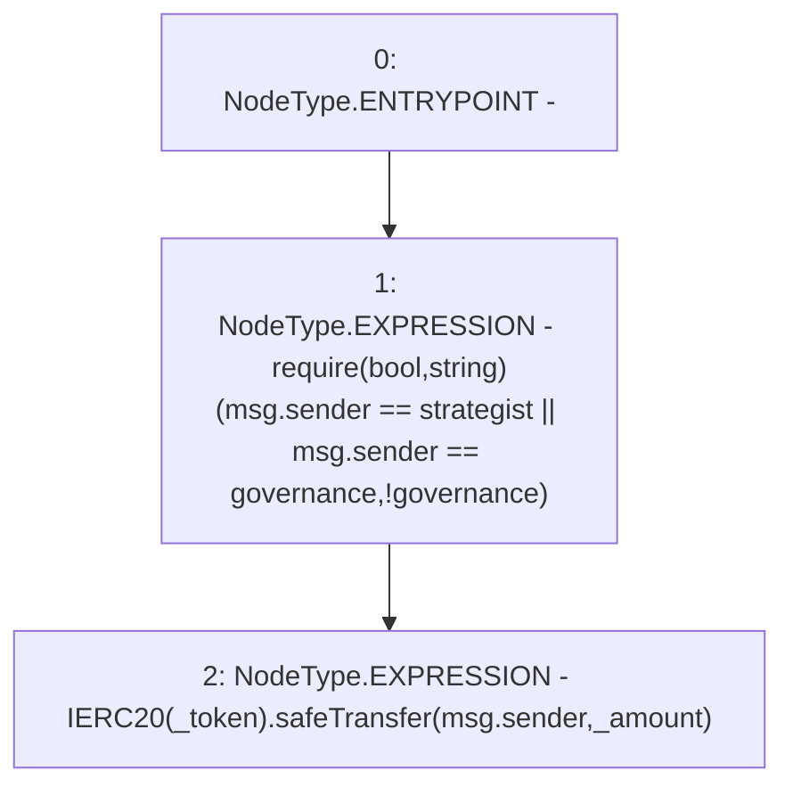

# Context: Controller.inCaseTokensGetStuck

**Contract:** `Controller` (Inherits: None)
**Signature:** `inCaseTokensGetStuck(address,uint256)`
**Method Selector ID:** `0xc6d758cb`
**Visibility:** `public`
**Environment-Free:** `No (reads EVM state context)`
**Modifiers:** None

### State Variables Interaction
- **Reads:** governance, strategist
- **Writes:** None

### Assertion Checks & Business Requirements
- require/assert: `require(bool,string)(msg.sender == strategist || msg.sender == governance,!governance)`

### Environment & Verification Flags
- **Uses Foundry Cheatcodes:** No
- **Has Echidna Properties:** No

### Internal Calls Tree
- None

### External Calls / Value Transfers
- `SafeERC20.LIBRARY_CALL, dest:SafeERC20, function:SafeERC20.safeTransfer(IERC20,address,uint256), arguments:['TMP_3021', 'msg.sender', '_amount'] `

### Control Flow Graph (CFG)


### Source Mapping
Declared in: `contracts/mocks/yVault/Controller.sol` on lines **159** to **162**

```solidity
    function inCaseTokensGetStuck(address _token, uint256 _amount) public {
        require(msg.sender == strategist || msg.sender == governance, '!governance');
        IERC20(_token).safeTransfer(msg.sender, _amount);
    }

```
