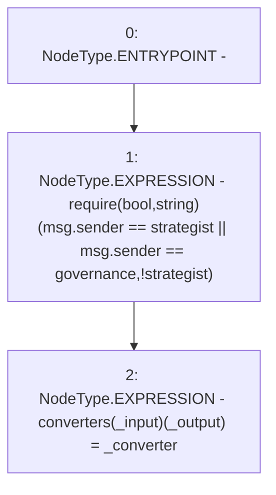

# Context: Controller.setConverter

**Contract:** `Controller` (Inherits: None)
**Signature:** `setConverter(address,address,address)`
**Method Selector ID:** `0xccd06318`
**Visibility:** `public`
**Environment-Free:** `No (reads EVM state context)`
**Modifiers:** None

### State Variables Interaction
- **Reads:** governance, strategist
- **Writes:** converters

### Assertion Checks & Business Requirements
- require/assert: `require(bool,string)(msg.sender == strategist || msg.sender == governance,!strategist)`

### Environment & Verification Flags
- **Uses Foundry Cheatcodes:** No
- **Has Echidna Properties:** No

### Internal Calls Tree
- None

### External Calls / Value Transfers
- None

### Control Flow Graph (CFG)


### Source Mapping
Declared in: `contracts/mocks/yVault/Controller.sol` on lines **116** to **123**

```solidity
    function setConverter(
        address _input,
        address _output,
        address _converter
    ) public {
        require(msg.sender == strategist || msg.sender == governance, '!strategist');
        converters[_input][_output] = _converter;
    }

```
