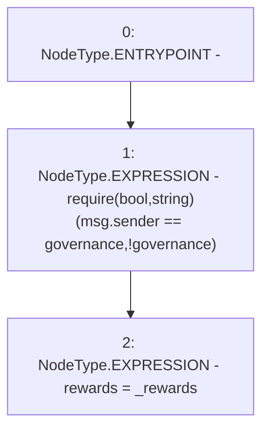

# Context: Controller.setRewards

**Contract:** `Controller` (Inherits: None)
**Signature:** `setRewards(address)`
**Method Selector ID:** `0xec38a862`
**Visibility:** `public`
**Environment-Free:** `No (reads EVM state context)`
**Modifiers:** None

### State Variables Interaction
- **Reads:** governance
- **Writes:** rewards

### Assertion Checks & Business Requirements
- require/assert: `require(bool,string)(msg.sender == governance,!governance)`

### Environment & Verification Flags
- **Uses Foundry Cheatcodes:** No
- **Has Echidna Properties:** No

### Internal Calls Tree
- None

### External Calls / Value Transfers
- None

### Control Flow Graph (CFG)


### Source Mapping
Declared in: `contracts/mocks/yVault/Controller.sol` on lines **75** to **78**

```solidity
    function setRewards(address _rewards) public {
        require(msg.sender == governance, '!governance');
        rewards = _rewards;
    }

```
