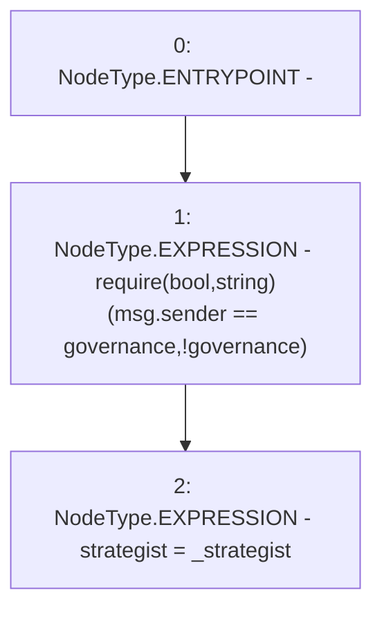

# Context: Controller.setStrategist

**Contract:** `Controller` (Inherits: None)
**Signature:** `setStrategist(address)`
**Method Selector ID:** `0xc7b9d530`
**Visibility:** `public`
**Environment-Free:** `No (reads EVM state context)`
**Modifiers:** None

### State Variables Interaction
- **Reads:** governance
- **Writes:** strategist

### Assertion Checks & Business Requirements
- require/assert: `require(bool,string)(msg.sender == governance,!governance)`

### Environment & Verification Flags
- **Uses Foundry Cheatcodes:** No
- **Has Echidna Properties:** No

### Internal Calls Tree
- None

### External Calls / Value Transfers
- None

### Control Flow Graph (CFG)


### Source Mapping
Declared in: `contracts/mocks/yVault/Controller.sol` on lines **80** to **83**

```solidity
    function setStrategist(address _strategist) public {
        require(msg.sender == governance, '!governance');
        strategist = _strategist;
    }

```
