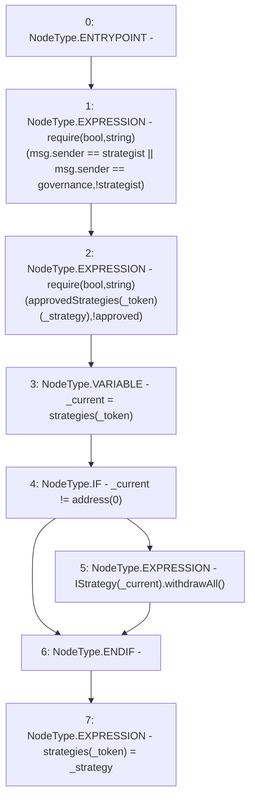

# Context: Controller.setStrategy

**Contract:** `Controller` (Inherits: None)
**Signature:** `setStrategy(address,address)`
**Method Selector ID:** `0x72cb5d97`
**Visibility:** `public`
**Environment-Free:** `No (reads EVM state context)`
**Modifiers:** None

### State Variables Interaction
- **Reads:** approvedStrategies, governance, strategies, strategist
- **Writes:** strategies

### Assertion Checks & Business Requirements
- require/assert: `require(bool,string)(msg.sender == strategist || msg.sender == governance,!strategist)`
- require/assert: `require(bool,string)(approvedStrategies[_token][_strategy],!approved)`

### Environment & Verification Flags
- **Uses Foundry Cheatcodes:** No
- **Has Echidna Properties:** No

### Internal Calls Tree
- None

### External Calls / Value Transfers
- `IStrategy.TMP_2995(uint256) = HIGH_LEVEL_CALL, dest:TMP_2994(IStrategy), function:withdrawAll, arguments:[]  `

### Control Flow Graph (CFG)


### Source Mapping
Declared in: `contracts/mocks/yVault/Controller.sol` on lines **125** to **134**

```solidity
    function setStrategy(address _token, address _strategy) public {
        require(msg.sender == strategist || msg.sender == governance, '!strategist');
        require(approvedStrategies[_token][_strategy], '!approved');

        address _current = strategies[_token];
        if (_current != address(0)) {
            IStrategy(_current).withdrawAll();
        }
        strategies[_token] = _strategy;
    }

```
