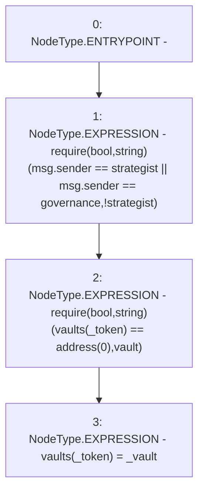

# Context: Controller.setVault

**Contract:** `Controller` (Inherits: None)
**Signature:** `setVault(address,address)`
**Method Selector ID:** `0x714ccf7b`
**Visibility:** `public`
**Environment-Free:** `No (reads EVM state context)`
**Modifiers:** None

### State Variables Interaction
- **Reads:** governance, strategist, vaults
- **Writes:** vaults

### Assertion Checks & Business Requirements
- require/assert: `require(bool,string)(msg.sender == strategist || msg.sender == governance,!strategist)`
- require/assert: `require(bool,string)(vaults[_token] == address(0),vault)`

### Environment & Verification Flags
- **Uses Foundry Cheatcodes:** No
- **Has Echidna Properties:** No

### Internal Calls Tree
- None

### External Calls / Value Transfers
- None

### Control Flow Graph (CFG)


### Source Mapping
Declared in: `contracts/mocks/yVault/Controller.sol` on lines **100** to **104**

```solidity
    function setVault(address _token, address _vault) public {
        require(msg.sender == strategist || msg.sender == governance, '!strategist');
        require(vaults[_token] == address(0), 'vault');
        vaults[_token] = _vault;
    }

```
