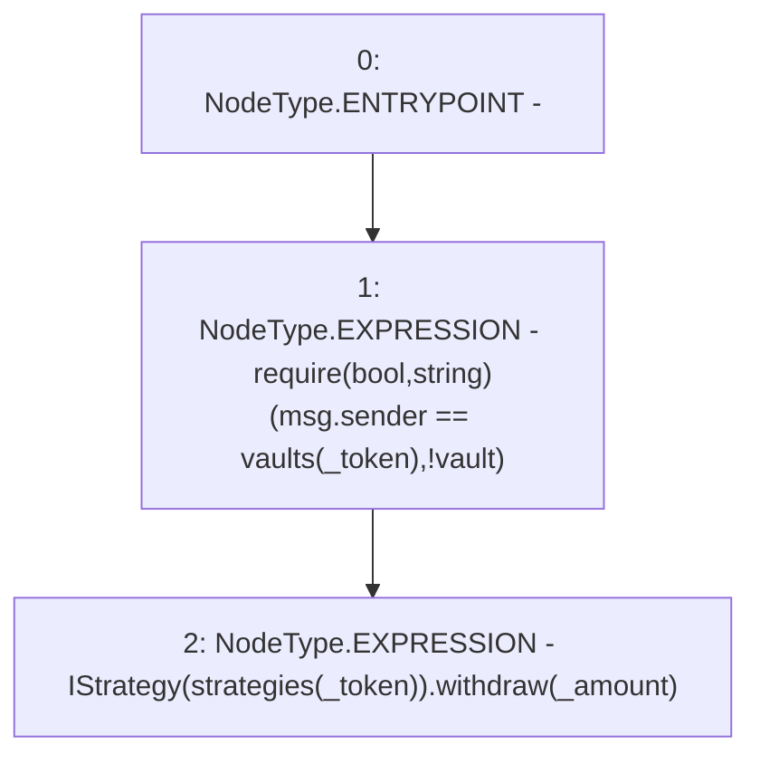

# Context: Controller.withdraw

**Contract:** `Controller` (Inherits: None)
**Signature:** `withdraw(address,uint256)`
**Method Selector ID:** `0xf3fef3a3`
**Visibility:** `public`
**Environment-Free:** `No (reads EVM state context)`
**Modifiers:** None

### State Variables Interaction
- **Reads:** strategies, vaults
- **Writes:** None

### Assertion Checks & Business Requirements
- require/assert: `require(bool,string)(msg.sender == vaults[_token],!vault)`

### Environment & Verification Flags
- **Uses Foundry Cheatcodes:** No
- **Has Echidna Properties:** No

### Internal Calls Tree
- None

### External Calls / Value Transfers
- `IStrategy.HIGH_LEVEL_CALL, dest:TMP_3073(IStrategy), function:withdraw, arguments:['_amount']  `

### Control Flow Graph (CFG)


### Source Mapping
Declared in: `contracts/mocks/yVault/Controller.sol` on lines **210** to **213**

```solidity
    function withdraw(address _token, uint256 _amount) public {
        require(msg.sender == vaults[_token], '!vault');
        IStrategy(strategies[_token]).withdraw(_amount);
    }

```
