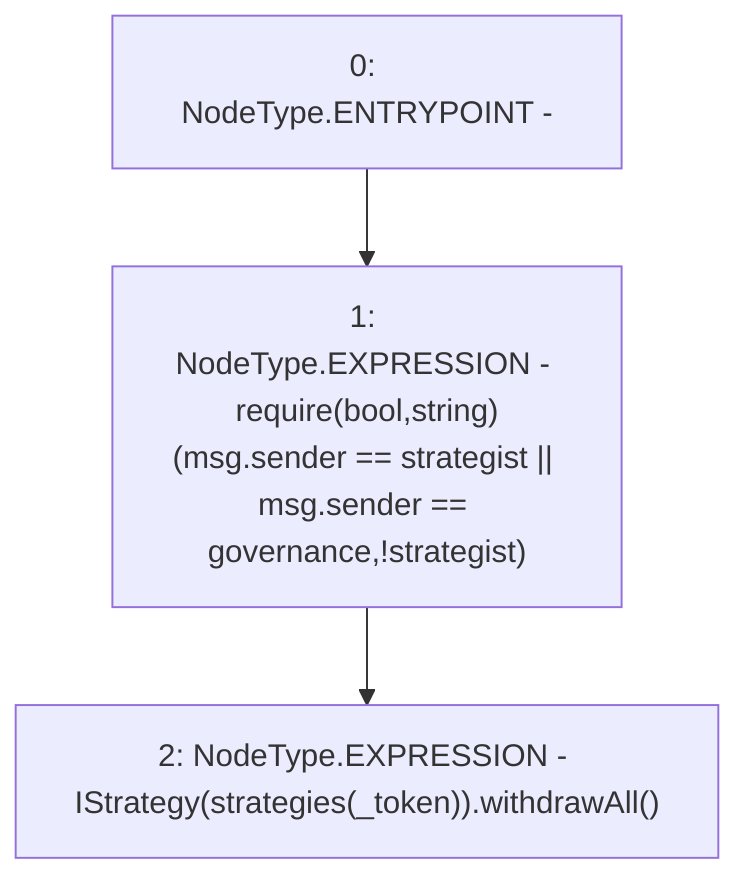

# Context: Controller.withdrawAll

**Contract:** `Controller` (Inherits: None)
**Signature:** `withdrawAll(address)`
**Method Selector ID:** `0xfa09e630`
**Visibility:** `public`
**Environment-Free:** `No (reads EVM state context)`
**Modifiers:** None

### State Variables Interaction
- **Reads:** governance, strategies, strategist
- **Writes:** None

### Assertion Checks & Business Requirements
- require/assert: `require(bool,string)(msg.sender == strategist || msg.sender == governance,!strategist)`

### Environment & Verification Flags
- **Uses Foundry Cheatcodes:** No
- **Has Echidna Properties:** No

### Internal Calls Tree
- None

### External Calls / Value Transfers
- `IStrategy.TMP_3016(uint256) = HIGH_LEVEL_CALL, dest:TMP_3015(IStrategy), function:withdrawAll, arguments:[]  `

### Control Flow Graph (CFG)


### Source Mapping
Declared in: `contracts/mocks/yVault/Controller.sol` on lines **154** to **157**

```solidity
    function withdrawAll(address _token) public {
        require(msg.sender == strategist || msg.sender == governance, '!strategist');
        IStrategy(strategies[_token]).withdrawAll();
    }

```
