# Context: Controller.yearn

**Contract:** `Controller` (Inherits: None)
**Signature:** `yearn(address,address,uint256)`
**Method Selector ID:** `0x04209f48`
**Visibility:** `public`
**Environment-Free:** `No (reads EVM state context)`
**Modifiers:** None

### State Variables Interaction
- **Reads:** governance, max, onesplit, rewards, split, strategist
- **Writes:** None

### Assertion Checks & Business Requirements
- require/assert: `require(bool,string)(msg.sender == strategist || msg.sender == governance,!governance)`

### Environment & Verification Flags
- **Uses Foundry Cheatcodes:** No
- **Has Echidna Properties:** No

### Internal Calls Tree
- None

### External Calls / Value Transfers
- `SafeERC20.LIBRARY_CALL, dest:SafeERC20, function:SafeERC20.safeApprove(IERC20,address,uint256), arguments:['TMP_3053', 'onesplit', '0'] `
- `SafeMath.TMP_3065(uint256) = LIBRARY_CALL, dest:SafeMath, function:SafeMath.mul(uint256,uint256), arguments:['_amount', 'split'] `
- `OneSplitAudit.TMP_3059(uint256) = HIGH_LEVEL_CALL, dest:TMP_3058(OneSplitAudit), function:swap, arguments:['_token', '_want', '_amount', '_expected', '_distribution', '0']  `
- `SafeMath.TMP_3047(uint256) = LIBRARY_CALL, dest:SafeMath, function:SafeMath.sub(uint256,uint256), arguments:['_after', '_before'] `
- `SafeMath.TMP_3064(uint256) = LIBRARY_CALL, dest:SafeMath, function:SafeMath.sub(uint256,uint256), arguments:['_after', '_before'] `
- `SafeMath.TMP_3067(uint256) = LIBRARY_CALL, dest:SafeMath, function:SafeMath.sub(uint256,uint256), arguments:['_amount', '_reward'] `
- `IStrategy.TMP_3049(address) = HIGH_LEVEL_CALL, dest:TMP_3048(IStrategy), function:want, arguments:[]  `
- `IERC20.TMP_3045(uint256) = HIGH_LEVEL_CALL, dest:TMP_3043(IERC20), function:balanceOf, arguments:['TMP_3044']  `
- `IERC20.TMP_3062(uint256) = HIGH_LEVEL_CALL, dest:TMP_3060(IERC20), function:balanceOf, arguments:['TMP_3061']  `
- `IStrategy.HIGH_LEVEL_CALL, dest:TMP_3041(IStrategy), function:withdraw, arguments:['_token']  `
- `OneSplitAudit.TUPLE_33(uint256,uint256[]) = HIGH_LEVEL_CALL, dest:TMP_3057(OneSplitAudit), function:getExpectedReturn, arguments:['_token', '_want', '_amount', 'parts', '0']  `
- `SafeMath.TMP_3066(uint256) = LIBRARY_CALL, dest:SafeMath, function:SafeMath.div(uint256,uint256), arguments:['TMP_3065', 'max'] `
- `IERC20.TMP_3052(uint256) = HIGH_LEVEL_CALL, dest:TMP_3050(IERC20), function:balanceOf, arguments:['TMP_3051']  `
- `IERC20.TMP_3040(uint256) = HIGH_LEVEL_CALL, dest:TMP_3038(IERC20), function:balanceOf, arguments:['TMP_3039']  `
- `SafeERC20.LIBRARY_CALL, dest:SafeERC20, function:SafeERC20.safeApprove(IERC20,address,uint256), arguments:['TMP_3055', 'onesplit', '_amount'] `
- `SafeERC20.LIBRARY_CALL, dest:SafeERC20, function:SafeERC20.safeTransfer(IERC20,address,uint256), arguments:['TMP_3069', 'rewards', '_reward'] `

### Control Flow Graph (CFG)

```mermaid
flowchart TD
    Node_0["0: NodeType.ENTRYPOINT - "]
    Node_0 --> Node_1
    Node_1["1: NodeType.EXPRESSION - require(bool,string)(msg.sender == strategist || msg.sender == governance,!governance)"]
    Node_1 --> Node_2
    Node_2["2: NodeType.VARIABLE - _before = IERC20(_token).balanceOf(address(this))"]
    Node_2 --> Node_3
    Node_3["3: NodeType.EXPRESSION - IStrategy(_strategy).withdraw(_token)"]
    Node_3 --> Node_4
    Node_4["4: NodeType.VARIABLE - _after = IERC20(_token).balanceOf(address(this))"]
    Node_4 --> Node_5
    Node_5["5: NodeType.IF - _after > _before"]
    Node_5 --> Node_6
    Node_5 --> Node_22
    Node_6["6: NodeType.VARIABLE - _amount = _after.sub(_before)"]
    Node_6 --> Node_7
    Node_7["7: NodeType.VARIABLE - _want = IStrategy(_strategy).want()"]
    Node_7 --> Node_8
    Node_8["8: NodeType.VARIABLE - "]
    Node_8 --> Node_9
    Node_9["9: NodeType.VARIABLE - "]
    Node_9 --> Node_10
    Node_10["10: NodeType.EXPRESSION - _before = IERC20(_want).balanceOf(address(this))"]
    Node_10 --> Node_11
    Node_11["11: NodeType.EXPRESSION - IERC20(_token).safeApprove(onesplit,0)"]
    Node_11 --> Node_12
    Node_12["12: NodeType.EXPRESSION - IERC20(_token).safeApprove(onesplit,_amount)"]
    Node_12 --> Node_13
    Node_13["13: NodeType.EXPRESSION - (_expected,_distribution) = OneSplitAudit(onesplit).getExpectedReturn(_token,_want,_amount,parts,0)"]
    Node_13 --> Node_14
    Node_14["14: NodeType.EXPRESSION - OneSplitAudit(onesplit).swap(_token,_want,_amount,_expected,_distribution,0)"]
    Node_14 --> Node_15
    Node_15["15: NodeType.EXPRESSION - _after = IERC20(_want).balanceOf(address(this))"]
    Node_15 --> Node_16
    Node_16["16: NodeType.IF - _after > _before"]
    Node_16 --> Node_17
    Node_16 --> Node_21
    Node_17["17: NodeType.EXPRESSION - _amount = _after.sub(_before)"]
    Node_17 --> Node_18
    Node_18["18: NodeType.VARIABLE - _reward = _amount.mul(split).div(max)"]
    Node_18 --> Node_19
    Node_19["19: NodeType.EXPRESSION - earn(_want,_amount.sub(_reward))"]
    Node_19 --> Node_20
    Node_20["20: NodeType.EXPRESSION - IERC20(_want).safeTransfer(rewards,_reward)"]
    Node_20 --> Node_21
    Node_21["21: NodeType.ENDIF - "]
    Node_21 --> Node_22
    Node_22["22: NodeType.ENDIF - "]
```


### Source Mapping
Declared in: `contracts/mocks/yVault/Controller.sol` on lines **180** to **208**

```solidity
    function yearn(
        address _strategy,
        address _token,
        uint256 parts
    ) public {
        require(msg.sender == strategist || msg.sender == governance, '!governance');
        // This contract should never have value in it, but just incase since this is a public call
        uint256 _before = IERC20(_token).balanceOf(address(this));
        IStrategy(_strategy).withdraw(_token);
        uint256 _after = IERC20(_token).balanceOf(address(this));
        if (_after > _before) {
            uint256 _amount = _after.sub(_before);
            address _want = IStrategy(_strategy).want();
            uint256[] memory _distribution;
            uint256 _expected;
            _before = IERC20(_want).balanceOf(address(this));
            IERC20(_token).safeApprove(onesplit, 0);
            IERC20(_token).safeApprove(onesplit, _amount);
            (_expected, _distribution) = OneSplitAudit(onesplit).getExpectedReturn(_token, _want, _amount, parts, 0);
            OneSplitAudit(onesplit).swap(_token, _want, _amount, _expected, _distribution, 0);
            _after = IERC20(_want).balanceOf(address(this));
            if (_after > _before) {
                _amount = _after.sub(_before);
                uint256 _reward = _amount.mul(split).div(max);
                earn(_want, _amount.sub(_reward));
                IERC20(_want).safeTransfer(rewards, _reward);
            }
        }
    }

```
