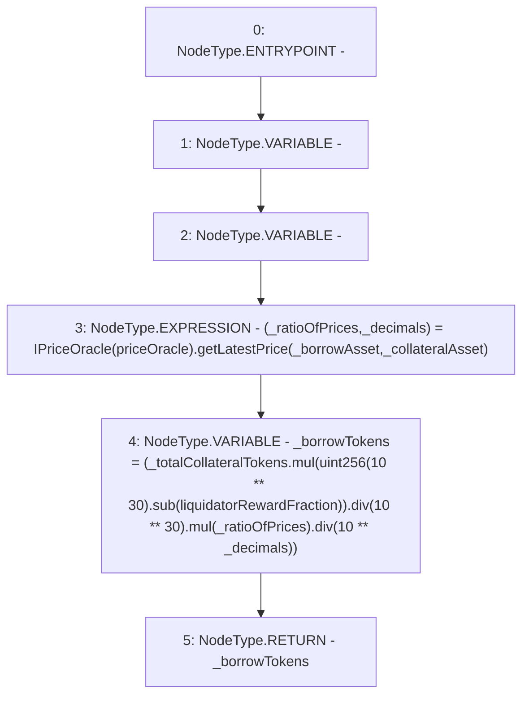

# Context: CreditLine._borrowTokensToLiquidate

**Contract:** `CreditLine` (Inherits: OwnableUpgradeable, ContextUpgradeable, Initializable, ReentrancyGuard)
**Signature:** `_borrowTokensToLiquidate(address,address,uint256) returns (uint256)`
**Method Selector ID:** `Internal (No Method ID)`
**Visibility:** `internal`
**Environment-Free:** `Yes`
**Modifiers:** None

### State Variables Interaction
- **Reads:** liquidatorRewardFraction, priceOracle
- **Writes:** None

### Environment & Verification Flags
- **Uses Foundry Cheatcodes:** No
- **Has Echidna Properties:** No

### Internal Calls Tree
- None

### External Calls / Value Transfers
- `SafeMath.TMP_1326(uint256) = LIBRARY_CALL, dest:SafeMath, function:SafeMath.mul(uint256,uint256), arguments:['TMP_1325', '_ratioOfPrices'] `
- `SafeMath.TMP_1322(uint256) = LIBRARY_CALL, dest:SafeMath, function:SafeMath.sub(uint256,uint256), arguments:['TMP_1321', 'liquidatorRewardFraction'] `
- `IPriceOracle.TUPLE_14(uint256,uint256) = HIGH_LEVEL_CALL, dest:TMP_1319(IPriceOracle), function:getLatestPrice, arguments:['_borrowAsset', '_collateralAsset']  `
- `SafeMath.TMP_1325(uint256) = LIBRARY_CALL, dest:SafeMath, function:SafeMath.div(uint256,uint256), arguments:['TMP_1323', 'TMP_1324'] `
- `SafeMath.TMP_1323(uint256) = LIBRARY_CALL, dest:SafeMath, function:SafeMath.mul(uint256,uint256), arguments:['_totalCollateralTokens', 'TMP_1322'] `
- `SafeMath.TMP_1328(uint256) = LIBRARY_CALL, dest:SafeMath, function:SafeMath.div(uint256,uint256), arguments:['TMP_1326', 'TMP_1327'] `

### Control Flow Graph (CFG)


### Source Mapping
Declared in: `contracts/CreditLine/CreditLine.sol` on lines **1045** to **1056**

```solidity
    function _borrowTokensToLiquidate(
        address _borrowAsset,
        address _collateralAsset,
        uint256 _totalCollateralTokens
    ) internal view returns (uint256) {
        (uint256 _ratioOfPrices, uint256 _decimals) = IPriceOracle(priceOracle).getLatestPrice(_borrowAsset, _collateralAsset);
        uint256 _borrowTokens = (
            _totalCollateralTokens.mul(uint256(10**30).sub(liquidatorRewardFraction)).div(10**30).mul(_ratioOfPrices).div(10**_decimals)
        );

        return _borrowTokens;
    }

```
